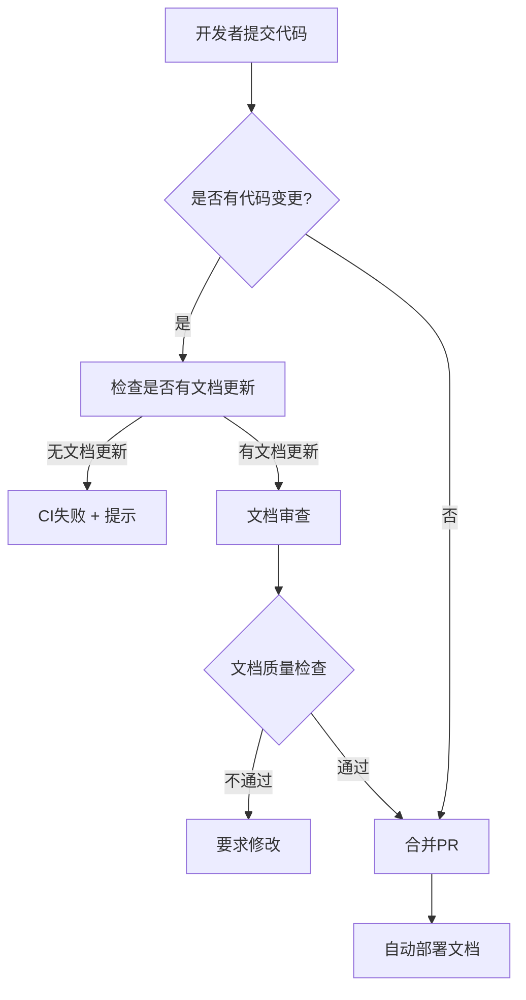

# 第十三章:文档维护

> **本章导读**
>
> 深入学习如何保持DDAD文档与代码同步,掌握API文档自动生成的最佳实践,理解用户文档编写的核心原则,以及如何有效管理技术债务。

---

## 13.1 DDAD文档与代码同步

### 为什么文档与代码会失同步?

**常见原因**:

```markdown
## 文档腐化的根源

1. **时间压力** 📅
   - "先实现功能,文档以后补" → 永远不会补
   - Sprint结束时没有文档时间预留
   - 紧急修复绕过文档更新流程

2. **责任不清** 🤷
   - 开发认为文档是PM的工作
   - PM认为技术细节应该由开发写
   - 没有明确的文档Owner

3. **工具缺失** 🔧
   - 没有自动化检查机制
   - 文档更新没有纳入CI/CD
   - 版本不一致无法被检测

4. **价值误解** 💭
   - "代码即文档,不需要额外文档"
   - "只有初学者才需要文档"
   - 短期思维忽视长期维护成本

## 真实成本

- 新人onboarding时间: 2周 → 6周
- Bug修复时间: 1天 → 3天(理解旧代码)
- 重复造轮子: 50%的功能已实现但不知道
- 团队流失风险: 核心知识在少数人脑中
```

---

### DDAD文档维护策略

#### 策略1: 文档即代码(Docs as Code)

**核心理念**: 文档与代码在同一仓库,使用相同的工作流

**实施方案**:

```bash
# 项目结构
techmeet/
├── src/                    # 代码
├── docs/                   # DDAD文档
│   ├── 01-research/       # PRD阶段文档
│   ├── 02-design/         # 设计阶段文档
│   └── 03-implementation/ # 实施阶段文档
├── .github/
│   └── workflows/
│       └── docs-validation.yml  # 文档CI检查
└── README.md
```

**Git工作流集成**:

```yaml
# .github/workflows/docs-validation.yml

name: Documentation Validation

on:
  pull_request:
    branches: [main, develop]
    paths:
      - 'src/**'
      - 'docs/**'

jobs:
  validate-docs:
    runs-on: ubuntu-latest

    steps:
      - name: Checkout code
        uses: actions/checkout@v4
        with:
          fetch-depth: 0

      - name: Check if code changes have doc updates
        id: check-docs
        run: |
          # 检查是否有代码变更
          CODE_CHANGES=$(git diff origin/main...HEAD --name-only | grep -E '^src/' | wc -l)

          # 检查是否有文档变更
          DOC_CHANGES=$(git diff origin/main...HEAD --name-only | grep -E '^docs/' | wc -l)

          echo "Code changes: $CODE_CHANGES"
          echo "Doc changes: $DOC_CHANGES"

          # 如果有代码变更但没有文档变更,失败
          if [ $CODE_CHANGES -gt 0 ] && [ $DOC_CHANGES -eq 0 ]; then
            echo "❌ Code changes detected without corresponding documentation updates"
            echo "Please update relevant documentation in docs/ directory"
            exit 1
          fi

          echo "✅ Documentation check passed"

      - name: Validate doc links
        run: |
          npm install -g markdown-link-check
          find docs -name "*.md" -exec markdown-link-check {} \;

      - name: Check doc freshness
        run: |
          # 检查文档最后更新时间
          STALE_DOCS=$(find docs -name "*.md" -mtime +90)

          if [ -n "$STALE_DOCS" ]; then
            echo "⚠️ Warning: Following docs haven't been updated in 90+ days:"
            echo "$STALE_DOCS"
            # 不失败,只警告
          fi

      - name: Validate API documentation
        run: |
          # 检查API路由是否有对应文档
          API_ROUTES=$(find src/app/api -name "route.ts" | wc -l)
          API_DOCS=$(grep -r "### API:" docs/ | wc -l)

          echo "API routes: $API_ROUTES"
          echo "API docs: $API_DOCS"

          if [ $API_ROUTES -gt $API_DOCS ]; then
            echo "⚠️ Warning: Some API routes may lack documentation"
          fi
```

**Branch Protection集成**:

```markdown
# GitHub Settings → Branches → Branch Protection Rules

main分支保护规则:
✅ Require pull request before merging
✅ Require status checks to pass:
   - Documentation Validation ← 新增
   - CI Tests
   - Build
✅ Require conversation resolution
```

---

#### 策略2: 文档审查清单(Doc Review Checklist)

**Pull Request Template**:

```markdown
# .github/pull_request_template.md

## 变更描述
简要描述这个PR做了什么

## 变更类型
- [ ] 新功能
- [ ] Bug修复
- [ ] 性能优化
- [ ] 重构
- [ ] 文档更新

## 文档更新清单 📝

### 代码变更相关
- [ ] **PRD文档**: 如果需求有变化,更新了 `docs/01-research/prd.md`
- [ ] **设计文档**: 如果架构/设计有变化,更新了 `docs/02-design/`
- [ ] **API文档**: 如果API有变化,更新了 `docs/03-implementation/api-spec.md`
- [ ] **数据库Schema**: 如果表结构有变化,更新了 `docs/03-implementation/database-schema.md`

### 代码内文档
- [ ] **函数注释**: 新增/修改的函数有JSDoc注释
- [ ] **复杂逻辑**: 有行内注释解释WHY,不只是WHAT
- [ ] **类型定义**: TypeScript类型有必要的注释

### 用户文档
- [ ] **README**: 如果用法有变化,更新了README
- [ ] **环境变量**: 如果新增环境变量,更新了.env.example
- [ ] **部署文档**: 如果部署流程有变化,更新了部署文档

### 维护文档
- [ ] **Changelog**: 在CHANGELOG.md添加了变更记录
- [ ] **Migration Guide**: 如果有Breaking changes,提供了迁移指南

## 自我检查
- [ ] 自己review了文档更新,确保清晰准确
- [ ] 检查了文档中的链接是否有效
- [ ] 确认文档格式正确(Markdown语法)
- [ ] 文档语言专业且易懂

## 相关Issue
Closes #xxx
Related to #yyy
```

---

#### 策略3: 文档所有权(Doc Ownership)

**CODEOWNERS文件**:

```
# .github/CODEOWNERS

# 文档必须由特定团队审查
/docs/                    @techmeet/documentation-team

# PRD文档需要产品经理审查
/docs/01-research/prd.md  @techmeet/product-managers

# 设计文档需要架构师审查
/docs/02-design/          @techmeet/architects

# API文档需要后端团队审查
/docs/03-implementation/api-spec.md  @techmeet/backend-team
```

**责任分配矩阵**:

| 文档类型 | 创建责任 | 更新责任 | 审查责任 |
|---------|---------|---------|---------|
| PRD | 产品经理 | 产品经理 | 技术Lead + 产品Lead |
| 架构设计 | 架构师 | 开发团队 | 架构师 + Tech Lead |
| API文档 | 后端开发 | 后端开发 | Tech Lead |
| 用户指南 | 技术文档工程师 | 开发团队 | 产品经理 |
| 运维手册 | DevOps | DevOps | SRE团队 |

---

#### 策略4: 自动化文档生成(Automated Doc Generation)

**TypeScript类型自动生成文档**:

```bash
# 安装TypeDoc
npm install -D typedoc

# package.json
{
  "scripts": {
    "docs:generate": "typedoc --out docs/api src/lib",
    "docs:serve": "npx http-server docs/api"
  }
}
```

```typescript
// typedoc.json
{
  "entryPoints": ["src/lib"],
  "out": "docs/api",
  "exclude": ["**/*.test.ts"],
  "plugin": ["typedoc-plugin-markdown"],
  "readme": "docs/README.md",
  "includeVersion": true,
  "sort": ["source-order"]
}
```

**使用示例**:

```typescript
// src/lib/meeting-analyzer.ts

/**
 * 会议分析器
 *
 * 使用AI分析会议转录文本,提取架构决策、技术权衡和行动项
 *
 * @module MeetingAnalyzer
 * @example
 * ```typescript
 * const analyzer = new MeetingAnalyzer(openaiClient)
 * const insights = await analyzer.analyze(transcript)
 * console.log(insights.decisions) // 架构决策列表
 * ```
 */
export class MeetingAnalyzer {
  /**
   * 创建会议分析器实例
   *
   * @param openaiClient - OpenAI客户端实例
   * @param options - 可选配置
   * @throws {Error} 如果OpenAI客户端无效
   */
  constructor(
    private openaiClient: OpenAI,
    private options?: MeetingAnalyzerOptions
  ) {
    if (!openaiClient) {
      throw new Error('OpenAI client is required')
    }
  }

  /**
   * 分析会议转录文本
   *
   * @param transcript - 会议转录文本
   * @returns Promise resolving to 分析结果
   *
   * @example
   * ```typescript
   * const transcript = "We discussed using PostgreSQL vs MongoDB..."
   * const insights = await analyzer.analyze(transcript)
   *
   * // 访问架构决策
   * insights.decisions.forEach(decision => {
   *   console.log(decision.decision)
   *   console.log(decision.rationale)
   * })
   * ```
   *
   * @throws {Error} 如果转录文本为空
   * @throws {OpenAIError} 如果OpenAI API调用失败
   */
  async analyze(transcript: string): Promise<MeetingInsights> {
    // 实现...
  }
}

/**
 * 会议分析器配置选项
 */
export interface MeetingAnalyzerOptions {
  /**
   * OpenAI模型名称
   * @default "gpt-4"
   */
  model?: string

  /**
   * 温度参数(0-1)
   * 较低值产生更确定性输出
   * @default 0.3
   */
  temperature?: number

  /**
   * 最大token数
   * @default 4000
   */
  maxTokens?: number
}

/**
 * 会议洞察结果
 */
export interface MeetingInsights {
  /**
   * 架构决策列表
   */
  decisions: ArchitectureDecision[]

  /**
   * 技术权衡列表
   */
  tradeOffs: TechnicalTradeOff[]

  /**
   * 行动项列表
   */
  actionItems: ActionItem[]

  /**
   * 代码片段列表
   */
  codeSnippets: CodeSnippet[]
}
```

**生成文档**:

```bash
# 生成API文档
npm run docs:generate

# 输出:
# docs/api/
# ├── index.html
# ├── modules/
# │   └── MeetingAnalyzer.html
# └── interfaces/
#     ├── MeetingAnalyzerOptions.html
#     └── MeetingInsights.html

# 本地预览
npm run docs:serve
# 访问 http://localhost:8080
```

---

#### 策略5: 文档版本控制(Doc Versioning)

**版本化文档结构**:

```bash
docs/
├── current/           # 当前版本(main分支)
├── v1.0/             # 历史版本
│   ├── prd.md
│   ├── api-spec.md
│   └── architecture.md
├── v1.1/             # 历史版本
└── v2.0/             # 最新稳定版本
```

**文档版本标记**:

```markdown
<!-- docs/03-implementation/api-spec.md -->

---
version: 2.0
last_updated: 2025-10-13
status: stable
breaking_changes: true
migration_guide: /docs/migrations/v1-to-v2.md
---

# API Specification v2.0

> **⚠️ Breaking Changes**: This version introduces breaking changes from v1.x
>
> 请参阅[迁移指南](/docs/migrations/v1-to-v2.md)了解如何升级

## 变更摘要

### 新增功能
- ✅ GraphQL API支持
- ✅ Webhook事件系统
- ✅ Batch operations API

### 破坏性变更
- ❌ 移除了 `/api/v1/meetings/list` (使用 `/api/v2/meetings` 替代)
- ❌ 认证头从 `Authorization: Bearer` 改为 `X-API-Key`
- ❌ 日期格式从Unix timestamp改为ISO 8601

### 废弃但保留
- ⚠️ `/api/v1/*` 端点将在2026年1月移除
```

**Changelog管理**:

```markdown
# CHANGELOG.md

# [2.0.0] - 2025-10-13

## 🎉 新增功能
- **GraphQL API**: 提供更灵活的查询能力 (#234)
- **Webhook系统**: 支持事件订阅和推送 (#245)
- **Batch API**: 批量操作减少API调用次数 (#256)

## 💥 破坏性变更
- **认证机制**: 从Bearer token改为API Key认证
  - 迁移指南: [v1-to-v2-auth-migration.md](/docs/migrations/v1-to-v2-auth-migration.md)
  - 影响: 所有API调用需要更新认证头
  - 兼容期: v1认证支持到2026-01-01

- **日期格式**: 统一使用ISO 8601格式
  - 迁移: 客户端需要更新日期解析逻辑
  - 示例: `1697184000` → `2025-10-13T10:00:00Z`

## 🗑️ 废弃
- `/api/v1/meetings/list` → 使用 `/api/v2/meetings`
- `/api/v1/auth/login` → 使用 `/api/v2/auth/sessions`
- 完全移除时间: 2026-01-01

## 🐛 Bug修复
- 修复上传大文件时的超时问题 (#223)
- 修复并发请求导致的Race condition (#231)

## 📝 文档
- 新增GraphQL schema文档
- 更新API认证指南
- 添加Webhook集成示例

---

# [1.1.0] - 2025-09-15

## 🎉 新增功能
- **会议收藏功能**: 支持标记重要会议 (#189)
- **批量删除**: 可以一次删除多个会议 (#198)

## 🐛 Bug修复
- 修复转录中文时的字符编码问题 (#192)
- 修复Dashboard分页加载问题 (#195)

## ⚡ 性能优化
- 数据库查询优化,Dashboard加载速度提升40% (#201)
- 图片压缩优化,页面加载时间减少30% (#205)
```

---

### 文档同步工作流

**每日同步工作流**:



**每周文档健康检查**:

```yaml
# .github/workflows/weekly-docs-health.yml

name: Weekly Documentation Health Check

on:
  schedule:
    - cron: '0 9 * * 1' # 每周一早上9点

jobs:
  docs-health:
    runs-on: ubuntu-latest

    steps:
      - name: Checkout code
        uses: actions/checkout@v4

      - name: Check documentation freshness
        run: |
          echo "## Documentation Health Report" > report.md
          echo "Generated: $(date)" >> report.md
          echo "" >> report.md

          # 检查过期文档
          echo "### Stale Documents (90+ days)" >> report.md
          find docs -name "*.md" -mtime +90 -exec echo "- {}" \; >> report.md

          # 检查断开的链接
          echo "### Broken Links" >> report.md
          npm install -g markdown-link-check
          find docs -name "*.md" -exec markdown-link-check {} \; 2>&1 | grep "✖" >> report.md || echo "None found" >> report.md

          # 检查TODOs
          echo "### TODO Items in Docs" >> report.md
          grep -r "TODO" docs/ >> report.md || echo "None found" >> report.md

      - name: Create GitHub Issue
        uses: actions/github-script@v7
        with:
          script: |
            const fs = require('fs')
            const report = fs.readFileSync('report.md', 'utf8')

            github.rest.issues.create({
              owner: context.repo.owner,
              repo: context.repo.name,
              title: '📝 Weekly Documentation Health Report',
              body: report,
              labels: ['documentation', 'maintenance']
            })
```

---

## 13.2 API文档自动生成

### OpenAPI/Swagger规范

**为什么使用OpenAPI**:

```markdown
## OpenAPI优势

✅ **标准化**: 行业标准API描述格式
✅ **工具生态**: 自动生成客户端SDK、测试工具、文档网站
✅ **交互式文档**: Swagger UI提供可测试的API文档
✅ **类型安全**: 可以生成TypeScript类型定义
✅ **版本控制**: 易于追踪API变更历史
✅ **Mock服务器**: 前端可以先用Mock数据开发
```

---

### Next.js API路由自动文档化

**使用next-swagger-doc**:

```bash
# 安装依赖
npm install next-swagger-doc swagger-ui-react
npm install -D @types/swagger-ui-react
```

**配置OpenAPI规范**:

```typescript
// lib/swagger.ts

import { createSwaggerSpec } from 'next-swagger-doc'

export const getApiDocs = () => {
  const spec = createSwaggerSpec({
    apiFolder: 'app/api',
    definition: {
      openapi: '3.0.0',
      info: {
        title: 'TechMeet API',
        version: '2.0.0',
        description: 'TechMeet - AI会议纪要API文档',
        contact: {
          name: 'TechMeet Team',
          email: 'api@techmeet.io',
          url: 'https://techmeet.io',
        },
        license: {
          name: 'MIT',
          url: 'https://opensource.org/licenses/MIT',
        },
      },
      servers: [
        {
          url: 'https://techmeet.io',
          description: 'Production',
        },
        {
          url: 'https://dev.techmeet.io',
          description: 'Development',
        },
        {
          url: 'http://localhost:3000',
          description: 'Local',
        },
      ],
      components: {
        securitySchemes: {
          ApiKeyAuth: {
            type: 'apiKey',
            in: 'header',
            name: 'X-API-Key',
            description: 'API密钥认证',
          },
          BearerAuth: {
            type: 'http',
            scheme: 'bearer',
            bearerFormat: 'JWT',
            description: 'JWT Token认证(已废弃,使用API Key)',
          },
        },
        schemas: {
          Meeting: {
            type: 'object',
            required: ['id', 'title', 'status'],
            properties: {
              id: {
                type: 'string',
                format: 'uuid',
                description: '会议唯一标识',
                example: '550e8400-e29b-41d4-a716-446655440000',
              },
              title: {
                type: 'string',
                description: '会议标题',
                example: 'System Architecture Review',
                minLength: 1,
                maxLength: 200,
              },
              audioUrl: {
                type: 'string',
                format: 'uri',
                description: '音频文件URL',
                example: 'https://xxx.supabase.co/storage/v1/object/public/audio-files/meeting.mp3',
              },
              transcript: {
                type: 'string',
                nullable: true,
                description: '转录文本',
                example: 'We discussed the database architecture...',
              },
              status: {
                type: 'string',
                enum: ['pending', 'processing', 'completed', 'failed'],
                description: '处理状态',
                example: 'completed',
              },
              createdAt: {
                type: 'string',
                format: 'date-time',
                description: '创建时间(ISO 8601)',
                example: '2025-10-13T10:00:00Z',
              },
            },
          },
          Error: {
            type: 'object',
            properties: {
              error: {
                type: 'string',
                description: '错误消息',
              },
              code: {
                type: 'string',
                description: '错误代码',
              },
            },
          },
        },
      },
      tags: [
        {
          name: 'Meetings',
          description: '会议管理API',
        },
        {
          name: 'Auth',
          description: '认证相关API',
        },
        {
          name: 'Insights',
          description: '会议洞察API',
        },
      ],
    },
  })

  return spec
}
```

**API路由添加Swagger注释**:

```typescript
// app/api/meetings/route.ts

import { NextResponse } from 'next/server'
import { z } from 'zod'

const createMeetingSchema = z.object({
  title: z.string().min(1).max(200),
  audioUrl: z.string().url(),
})

/**
 * @swagger
 * /api/meetings:
 *   get:
 *     summary: 获取会议列表
 *     description: 获取当前用户的所有会议
 *     tags:
 *       - Meetings
 *     security:
 *       - ApiKeyAuth: []
 *     parameters:
 *       - in: query
 *         name: status
 *         schema:
 *           type: string
 *           enum: [pending, processing, completed, failed]
 *         description: 按状态筛选
 *       - in: query
 *         name: page
 *         schema:
 *           type: integer
 *           default: 1
 *         description: 页码
 *       - in: query
 *         name: limit
 *         schema:
 *           type: integer
 *           default: 20
 *           maximum: 100
 *         description: 每页数量
 *     responses:
 *       200:
 *         description: 成功返回会议列表
 *         content:
 *           application/json:
 *             schema:
 *               type: object
 *               properties:
 *                 meetings:
 *                   type: array
 *                   items:
 *                     $ref: '#/components/schemas/Meeting'
 *                 pagination:
 *                   type: object
 *                   properties:
 *                     page:
 *                       type: integer
 *                     limit:
 *                       type: integer
 *                     total:
 *                       type: integer
 *       401:
 *         description: 未认证
 *         content:
 *           application/json:
 *             schema:
 *               $ref: '#/components/schemas/Error'
 *       500:
 *         description: 服务器错误
 */
export async function GET(request: Request) {
  // 实现...
}

/**
 * @swagger
 * /api/meetings:
 *   post:
 *     summary: 创建新会议
 *     description: 上传音频文件后创建会议记录
 *     tags:
 *       - Meetings
 *     security:
 *       - ApiKeyAuth: []
 *     requestBody:
 *       required: true
 *       content:
 *         application/json:
 *           schema:
 *             type: object
 *             required:
 *               - title
 *               - audioUrl
 *             properties:
 *               title:
 *                 type: string
 *                 description: 会议标题
 *                 example: System Architecture Review
 *                 minLength: 1
 *                 maxLength: 200
 *               audioUrl:
 *                 type: string
 *                 format: uri
 *                 description: Supabase Storage音频文件URL
 *                 example: https://xxx.supabase.co/storage/v1/object/public/audio-files/meeting.mp3
 *     responses:
 *       201:
 *         description: 会议创建成功
 *         content:
 *           application/json:
 *             schema:
 *               $ref: '#/components/schemas/Meeting'
 *       400:
 *         description: 输入数据错误
 *         content:
 *           application/json:
 *             schema:
 *               $ref: '#/components/schemas/Error'
 *       401:
 *         description: 未认证
 *       500:
 *         description: 服务器错误
 */
export async function POST(request: Request) {
  try {
    const body = await request.json()
    const validatedData = createMeetingSchema.parse(body)

    // 创建会议记录...

    return NextResponse.json(meeting, { status: 201 })
  } catch (error) {
    if (error instanceof z.ZodError) {
      return NextResponse.json(
        { error: '输入数据格式错误', details: error.errors },
        { status: 400 }
      )
    }
    return NextResponse.json({ error: '服务器错误' }, { status: 500 })
  }
}
```

**Swagger UI页面**:

```tsx
// app/api-docs/page.tsx
'use client'

import dynamic from 'next/dynamic'
import 'swagger-ui-react/swagger-ui.css'

const SwaggerUI = dynamic(() => import('swagger-ui-react'), { ssr: false })

export default function ApiDocsPage() {
  return (
    <div className="container mx-auto py-8">
      <h1 className="text-3xl font-bold mb-6">TechMeet API Documentation</h1>
      <SwaggerUI url="/api/swagger" />
    </div>
  )
}
```

**Swagger JSON端点**:

```typescript
// app/api/swagger/route.ts
import { NextResponse } from 'next/server'
import { getApiDocs } from '@/lib/swagger'

export async function GET() {
  const spec = getApiDocs()
  return NextResponse.json(spec)
}
```

**访问API文档**:

```
访问: https://techmeet.io/api-docs
即可看到完整的交互式API文档
```

---

### TypeScript类型自动生成

**从OpenAPI生成TypeScript类型**:

```bash
# 安装openapi-typescript
npm install -D openapi-typescript

# package.json
{
  "scripts": {
    "types:generate": "openapi-typescript http://localhost:3000/api/swagger -o src/types/api.ts"
  }
}
```

**生成的类型文件**:

```typescript
// src/types/api.ts (自动生成)

export interface paths {
  "/api/meetings": {
    get: operations["getMeetings"]
    post: operations["createMeeting"]
  }
  "/api/meetings/{id}": {
    get: operations["getMeetingById"]
    put: operations["updateMeeting"]
    delete: operations["deleteMeeting"]
  }
}

export interface components {
  schemas: {
    Meeting: {
      id: string
      title: string
      audioUrl: string
      transcript?: string | null
      status: "pending" | "processing" | "completed" | "failed"
      createdAt: string
    }
    Error: {
      error: string
      code?: string
    }
  }
}

export interface operations {
  getMeetings: {
    parameters: {
      query: {
        status?: "pending" | "processing" | "completed" | "failed"
        page?: number
        limit?: number
      }
    }
    responses: {
      200: {
        content: {
          "application/json": {
            meetings: components["schemas"]["Meeting"][]
            pagination: {
              page: number
              limit: number
              total: number
            }
          }
        }
      }
      401: {
        content: {
          "application/json": components["schemas"]["Error"]
        }
      }
    }
  }
  createMeeting: {
    requestBody: {
      content: {
        "application/json": {
          title: string
          audioUrl: string
        }
      }
    }
    responses: {
      201: {
        content: {
          "application/json": components["schemas"]["Meeting"]
        }
      }
      400: {
        content: {
          "application/json": components["schemas"]["Error"]
        }
      }
    }
  }
}
```

**在代码中使用生成的类型**:

```typescript
// lib/api-client.ts

import type { paths, components } from '@/types/api'

type Meeting = components['schemas']['Meeting']
type CreateMeetingBody = paths['/api/meetings']['post']['requestBody']['content']['application/json']
type GetMeetingsParams = paths['/api/meetings']['get']['parameters']['query']

export class ApiClient {
  async getMeetings(params?: GetMeetingsParams): Promise<Meeting[]> {
    const queryString = new URLSearchParams(params as any).toString()
    const response = await fetch(`/api/meetings?${queryString}`)

    if (!response.ok) {
      throw new Error('Failed to fetch meetings')
    }

    const data = await response.json()
    return data.meetings
  }

  async createMeeting(body: CreateMeetingBody): Promise<Meeting> {
    const response = await fetch('/api/meetings', {
      method: 'POST',
      headers: {
        'Content-Type': 'application/json',
      },
      body: JSON.stringify(body),
    })

    if (!response.ok) {
      throw new Error('Failed to create meeting')
    }

    return await response.json()
  }
}
```

---

## 13.3 用户文档最佳实践

### README结构最佳实践

**完整README模板**:

```markdown
# TechMeet - AI会议纪要工具

<div align="center">
  

  [](https://github.com/yourusername/techmeet/actions)
  [](https://opensource.org/licenses/MIT)
  [](https://www.typescriptlang.org/)
  [](https://nextjs.org/)
</div>

## 📖 项目简介

TechMeet是一个AI驱动的会议纪要工具,自动转录会议音频并提取关键洞察:
- 🎯 架构决策(Architecture Decisions)
- ⚖️ 技术权衡(Technical Trade-offs)
- ✅ 行动项(Action Items)
- 💻 代码片段(Code Snippets)

[🚀 在线演示](https://demo.techmeet.io) | [📚 完整文档](https://docs.techmeet.io) | [🐛 报告Bug](https://github.com/yourusername/techmeet/issues)

## ✨ 核心特性

- **自动转录**: 使用OpenAI Whisper将音频转录为文字
- **智能提取**: GPT-4分析转录文本,提取关键决策和洞察
- **实时更新**: Supabase Realtime推送处理进度
- **一键导出**: 将纪要导出到Notion、Markdown或PDF
- **团队协作**: 支持会议分享和团队空间

## 🚀 快速开始

### 前置要求

- Node.js 18+ 和 pnpm 8+
- Supabase账号(免费)
- OpenAI API密钥

### 本地开发

```bash
# 1. Clone仓库
git clone https://github.com/yourusername/techmeet.git
cd techmeet

# 2. 安装依赖
pnpm install

# 3. 配置环境变量
cp .env.example .env.local
# 编辑.env.local,填入你的API密钥

# 4. 启动开发服务器
pnpm dev

# 5. 访问应用
# 打开 http://localhost:3000
```

### 部署到Vercel

[](https://vercel.com/new/clone?repository-url=https://github.com/yourusername/techmeet)

点击按钮一键部署,然后在Vercel Dashboard配置环境变量。

## 📝 环境变量配置

创建`.env.local`文件并配置以下变量:

```bash
# Supabase (必需)
NEXT_PUBLIC_SUPABASE_URL=https://xxx.supabase.co
NEXT_PUBLIC_SUPABASE_ANON_KEY=eyJhbGc...
SUPABASE_SERVICE_ROLE_KEY=eyJhbGc...

# OpenAI (必需)
OPENAI_API_KEY=sk-...

# Upstash Redis (可选,用于Rate Limiting)
UPSTASH_REDIS_REST_URL=https://xxx.upstash.io
UPSTASH_REDIS_REST_TOKEN=AXX...

# Sentry (可选,用于错误追踪)
NEXT_PUBLIC_SENTRY_DSN=https://xxx@sentry.io/xxx
```

详细配置说明见[环境变量文档](docs/configuration.md)。

## 🏗️ 技术架构

```
┌─────────────────────────────────────────────────┐
│              Next.js Frontend                   │
│  (React 18 + TypeScript + Tailwind CSS)        │
└────────────────┬────────────────────────────────┘
                 │
┌────────────────▼────────────────────────────────┐
│           Supabase Backend                      │
│  ┌──────────────┐  ┌──────────────┐            │
│  │  PostgreSQL  │  │  Auth + RLS  │            │
│  └──────────────┘  └──────────────┘            │
│  ┌──────────────┐  ┌──────────────┐            │
│  │   Storage    │  │ Edge Functions│            │
│  └──────────────┘  └──────────────┘            │
└─────────────────────────────────────────────────┘
                 │
┌────────────────▼────────────────────────────────┐
│          External Services                      │
│  ┌──────────────┐  ┌──────────────┐            │
│  │ OpenAI API   │  │ Upstash Redis│            │
│  │  (Whisper +  │  │(Rate Limiting)│            │
│  │   GPT-4)     │  │              │            │
│  └──────────────┘  └──────────────┘            │
└─────────────────────────────────────────────────┘
```

详细架构设计见[架构文档](docs/architecture.md)。

## 📂 项目结构

```
techmeet/
├── app/                  # Next.js App Router
│   ├── api/             # API路由
│   ├── auth/            # 认证页面
│   ├── dashboard/       # 仪表板
│   └── meetings/        # 会议详情
├── components/          # React组件
│   ├── ui/             # Shadcn/ui基础组件
│   └── ...
├── lib/                 # 工具函数和配置
├── supabase/           # Supabase配置和migrations
├── docs/               # 文档
└── tests/              # 测试
```

## 🧪 测试

```bash
# 运行单元测试
pnpm test

# 运行E2E测试
pnpm test:e2e

# 生成覆盖率报告
pnpm test:coverage
```

## 📚 文档

- [用户指南](docs/user-guide.md) - 如何使用TechMeet
- [API文档](https://techmeet.io/api-docs) - API参考
- [部署指南](docs/deployment.md) - 生产环境部署
- [贡献指南](CONTRIBUTING.md) - 如何贡献代码
- [Changelog](CHANGELOG.md) - 版本变更历史

## 🤝 贡献

我们欢迎贡献!请阅读[贡献指南](CONTRIBUTING.md)了解如何:
- 报告Bug
- 提出新功能
- 提交Pull Request
- 代码规范和审查流程

## 📄 许可证

本项目采用[MIT许可证](LICENSE)。

## 🙏 致谢

- [Next.js](https://nextjs.org/) - React框架
- [Supabase](https://supabase.com/) - 后端服务
- [OpenAI](https://openai.com/) - AI能力
- [Shadcn/ui](https://ui.shadcn.com/) - UI组件库

## 📧 联系方式

- 邮箱: support@techmeet.io
- Twitter: [@TechMeetApp](https://twitter.com/TechMeetApp)
- Discord: [加入社区](https://discord.gg/techmeet)

---

Made with ❤️ by the TechMeet Team
```

---

### 用户指南编写原则

**分层文档结构**:

```markdown
# TechMeet用户指南

## 目标用户分层

### 👤 Level 1: 新手用户(First-time Users)
**目标**: 5分钟完成第一个会议纪要

**内容重点**:
- 注册和登录
- 上传第一个音频文件
- 查看生成的纪要
- 导出到Notion

### 👨‍💻 Level 2: 常规用户(Regular Users)
**目标**: 高效使用所有核心功能

**内容重点**:
- 会议管理(搜索、筛选、标签)
- 自定义提取规则
- 批量操作
- 团队协作

### 🔧 Level 3: 高级用户(Power Users)
**目标**: 深度定制和集成

**内容重点**:
- API集成
- Webhook配置
- 自定义导出模板
- 性能优化

### 👷 Level 4: 管理员(Administrators)
**目标**: 团队管理和系统配置

**内容重点**:
- 用户权限管理
- 使用量统计
- 数据备份和迁移
- 安全审计
```

**新手用户快速开始指南**:

```markdown
# 快速开始指南(5分钟)

## Step 1: 创建账号(1分钟)

1. 访问[TechMeet](https://techmeet.io)
2. 点击右上角"Sign Up"按钮
3. 输入邮箱和密码,或使用Google登录


💡 **提示**: 使用Google登录更快捷,无需验证邮箱

---

## Step 2: 上传会议录音(2分钟)

1. 点击Dashboard的"Upload Meeting"按钮
2. 拖拽音频文件到上传区域,或点击选择文件
   - 支持格式: MP3, WAV, M4A
   - 最大文件大小: 200MB
3. 添加会议标题(可选)
4. 点击"Start Upload & Transcribe"


⏱️ **处理时间**: 通常3-5分钟(取决于音频长度)

---

## Step 3: 查看会议纪要(1分钟)

上传完成后,你会自动跳转到会议详情页面。等待转录完成后,你将看到:

### 📝 转录文本
完整的会议对话内容

### 🎯 架构决策
会议中讨论和确定的技术决策

**示例**:
> **决策**: 使用PostgreSQL作为主数据库
>
> **理由**: 需要ACID保证和复杂查询支持
>
> **影响**: 需要学习SQL和数据库设计

### ⚖️ 技术权衡
讨论的不同方案及其优缺点对比

### ✅ 行动项
会议中分配的待办任务

### 💻 代码片段
会议中提到或讨论的代码


---

## Step 4: 导出纪要(1分钟)

点击"Export"按钮,选择导出格式:

- **Notion**: 直接同步到Notion workspace
- **Markdown**: 下载.md文件
- **PDF**: 生成PDF文档


---

## 🎉 完成!

现在你已经完成了第一个会议纪要。继续探索更多功能:

- 📁 [会议管理](user-guide/meeting-management.md)
- 🔍 [搜索和筛选](user-guide/search-filter.md)
- 👥 [团队协作](user-guide/team-collaboration.md)

---

## ❓ 遇到问题?

- 📖 [常见问题FAQ](faq.md)
- 💬 [加入Discord社区](https://discord.gg/techmeet)
- 📧 [联系支持团队](mailto:support@techmeet.io)
```

---

### FAQ文档结构

**按用户旅程组织FAQ**:

```markdown
# 常见问题(FAQ)

## 目录
- [账号和计费](#账号和计费)
- [音频上传](#音频上传)
- [转录和处理](#转录和处理)
- [纪要查看和编辑](#纪要查看和编辑)
- [导出和集成](#导出和集成)
- [安全和隐私](#安全和隐私)
- [故障排除](#故障排除)

---

## 账号和计费

### Q: TechMeet免费吗?

**A**: TechMeet提供三种计划:

| 计划 | 价格 | 转录时长/月 | 存储空间 |
|-----|------|-----------|---------|
| **Free** | $0 | 60分钟 | 1GB |
| **Pro** | $19/月 | 600分钟 | 10GB |
| **Team** | $49/月 | 无限制 | 100GB |

详细定价见[定价页面](https://techmeet.io/pricing)。

---

### Q: 如何升级到Pro计划?

**A**: 步骤:
1. 登录TechMeet
2. 点击右上角头像 → Settings
3. 选择"Billing"标签
4. 点击"Upgrade to Pro"
5. 输入支付信息完成订阅

支持信用卡和PayPal支付。

---

## 音频上传

### Q: 支持哪些音频格式?

**A**: 目前支持:
- ✅ MP3 (推荐)
- ✅ WAV
- ✅ M4A
- ✅ OGG
- ❌ 不支持: FLAC, WMA

最大文件大小: 200MB(约2小时高质量录音)

---

### Q: 如何提高转录准确度?

**A**: 最佳录音实践:
1. **使用好的麦克风**: 减少背景噪音
2. **清晰发音**: 避免过快或过慢
3. **减少重叠**: 避免多人同时讲话
4. **环境安静**: 关闭空调、音乐等噪音源
5. **格式选择**: MP3 320kbps或WAV无损

**提示**: 使用专业会议录音设备效果最佳

---

### Q: 上传失败怎么办?

**A**: 常见原因和解决方案:

#### 1. 文件过大
- **问题**: 文件>200MB
- **解决**: 使用音频编辑软件压缩到200MB以下

#### 2. 网络不稳定
- **问题**: 上传中断
- **解决**:
  - 切换到稳定网络
  - 关闭其他占用带宽的应用
  - 尝试使用有线连接

#### 3. 浏览器问题
- **问题**: 浏览器不兼容
- **解决**: 使用Chrome、Firefox或Edge最新版本

#### 4. 账号限制
- **问题**: 超出免费额度
- **解决**: 等待下月刷新或升级到Pro

仍有问题?[联系支持](mailto:support@techmeet.io)

---

## 转录和处理

### Q: 转录需要多长时间?

**A**: 处理时间取决于音频长度:

| 音频长度 | 预计时间 |
|---------|---------|
| <15分钟 | 2-3分钟 |
| 15-30分钟 | 3-5分钟 |
| 30-60分钟 | 5-10分钟 |
| 60-120分钟 | 10-20分钟 |

**说明**: 使用OpenAI Whisper API,转录速度约为音频长度的1/5到1/10。

高峰期可能稍慢,通常不超过音频长度的1/3。

---

### Q: 转录准确率有多高?

**A**: 平均准确率:

- **英语**: 95-98%(清晰录音)
- **中文**: 92-95%
- **其他语言**: 85-95%(取决于语言和口音)

**影响因素**:
- ✅ 提高: 清晰发音、好麦克风、安静环境
- ❌ 降低: 背景噪音、口音重、多人重叠

---

### Q: 支持多语言吗?

**A**: 目前支持50+种语言,包括:
- 英语(美国、英国、澳大利亚等)
- 中文(普通话、粤语)
- 日语、韩语
- 西班牙语、法语、德语
- 更多...

语言自动检测,无需手动选择。

---

## 纪要查看和编辑

### Q: 可以编辑自动生成的纪要吗?

**A**: 可以!点击纪要任意部分即可编辑:
- 转录文本可以逐句修改
- 架构决策、权衡、行动项可以添加/删除/编辑
- 所有修改自动保存

---

### Q: 如何搜索会议内容?

**A**: 使用Dashboard的搜索功能:

**搜索范围**:
- 会议标题
- 转录文本
- 架构决策内容
- 行动项描述

**高级搜索**:
- 按日期筛选: `2025-10-01 to 2025-10-13`
- 按标签筛选: `#architecture #database`
- 按状态筛选: `status:completed`

---

## 导出和集成

### Q: 如何导出到Notion?

**A**: 首次配置步骤:

1. 在Notion中创建一个数据库
2. 在TechMeet Settings → Integrations中点击"Connect Notion"
3. 授权TechMeet访问你的Notion workspace
4. 选择目标数据库
5. 完成!之后每个会议都可以一键导出

**导出内容**:
- 会议标题和日期
- 转录文本(折叠)
- 架构决策、权衡、行动项(分开的sections)

---

### Q: 可以批量导出吗?

**A**: 可以!

**步骤**:
1. 在Dashboard勾选要导出的会议
2. 点击"Batch Export"
3. 选择格式(Markdown或PDF)
4. 生成ZIP文件下载

**限制**:
- Free: 一次最多10个
- Pro: 一次最多100个
- Team: 无限制

---

## 安全和隐私

### Q: 我的音频文件安全吗?

**A**: TechMeet非常重视数据安全:

**存储安全**:
- ✅ AES-256加密存储(Supabase Storage)
- ✅ 传输加密(TLS 1.3)
- ✅ 定期安全审计

**访问控制**:
- ✅ Row Level Security (RLS)
- ✅ 只有你能访问自己的数据
- ✅ 团队空间有细粒度权限控制

**合规**:
- ✅ GDPR兼容
- ✅ SOC 2 Type II认证(计划中)

---

### Q: 你们会使用我的数据训练AI吗?

**A**: **不会**。

- ❌ 我们不会使用你的数据训练模型
- ❌ OpenAI不会保留你的音频和文本(根据其企业协议)
- ✅ 你的数据仅用于生成纪要
- ✅ 你可以随时删除所有数据

详见[隐私政策](https://techmeet.io/privacy)。

---

### Q: 可以永久删除我的账号和数据吗?

**A**: 可以!

**删除流程**:
1. Settings → Account → Delete Account
2. 输入"DELETE"确认
3. 所有数据将在24小时内永久删除:
   - 账号信息
   - 所有会议记录
   - 音频文件
   - 转录文本

**注意**: 此操作不可逆!

---

## 故障排除

### Q: 转录卡在"Processing"状态怎么办?

**A**: 可能原因:

1. **正常处理中**: 等待5-10分钟
2. **API限流**: 高峰期可能延迟,最多30分钟
3. **处理失败**: 刷新页面检查状态

**如果超过30分钟**:
1. 刷新页面
2. 检查"Failed"状态提示
3. 重新上传或联系支持

---

### Q: 页面加载很慢或显示错误

**A**: 快速排查:

1. **清除缓存**: Ctrl+Shift+R (Windows) 或 Cmd+Shift+R (Mac)
2. **检查网络**: 确保网络连接正常
3. **浏览器更新**: 使用最新版Chrome/Firefox/Edge
4. **查看状态**: 访问[status.techmeet.io](https://status.techmeet.io)检查系统状态

**仍有问题**: [报告Bug](https://github.com/yourusername/techmeet/issues)

---

## 💬 没找到答案?

- 📖 [完整文档](https://docs.techmeet.io)
- 💬 [Discord社区](https://discord.gg/techmeet)
- 📧 [邮件支持](mailto:support@techmeet.io)
- 🐛 [报告Bug](https://github.com/yourusername/techmeet/issues)

平均响应时间: 24小时内
```

---

## 13.4 技术债务管理

### 什么是技术债务?

**技术债务定义**:

```markdown
# 技术债务(Technical Debt)

## Martin Fowler的定义

> "技术债务是一种比喻。开发软件时走捷径,虽然短期内节省时间,但长期会产生'利息'(维护成本),最终可能需要'偿还'(重构)。"

## 技术债务的类型

### 1. 蓄意债务(Deliberate Debt)
**特征**: 有意识的权衡决策
**场景**: "我们知道这不是最佳方案,但为了按时发布MVP,先这样做"

**示例**:
- 为了快速上线,先用简单的单体架构,计划未来迁移到微服务
- 暂时跳过某些边界条件测试,标注TODO后续补充
- 使用第三方服务而非自建,虽然长期成本更高

**管理策略**: ✅ 文档化决策、设置偿还计划、定期review

---

### 2. 无意债务(Inadvertent Debt)
**特征**: 不知道更好的做法
**场景**: "当时不知道有更好的模式,后来才学到"

**示例**:
- 初学者写的紧耦合代码
- 没有遵循框架最佳实践
- 数据库设计不当导致性能问题

**管理策略**: ✅ 技术培训、Code Review、定期重构

---

### 3. 位衰败(Bit Rot)
**特征**: 依赖过时、安全漏洞
**场景**: "代码没变,但依赖库有了breaking changes"

**示例**:
- 使用已废弃的API
- 依赖包有安全漏洞
- Node.js版本过旧

**管理策略**: ✅ 自动化依赖更新(Dependabot)、定期升级

---

### 4. 需求演化(Requirements Evolution)
**特征**: 需求变化导致架构不适配
**场景**: "最初设计只支持10用户,现在有10万用户"

**示例**:
- 单机部署变多机房
- 单一数据库变分库分表
- 同步处理变异步队列

**管理策略**: ✅ 预留扩展性、模块化设计、监控瓶颈
```

---

### 识别技术债务

**技术债务识别清单**:

```yaml
# .github/workflows/tech-debt-scan.yml

name: Tech Debt Scan

on:
  schedule:
    - cron: '0 0 * * 0' # 每周日午夜
  workflow_dispatch:

jobs:
  scan:
    runs-on: ubuntu-latest

    steps:
      - name: Checkout code
        uses: actions/checkout@v4

      - name: Setup Node.js
        uses: actions/setup-node@v4
        with:
          node-version: '20'

      - name: Install dependencies
        run: npm install -D @typescript-eslint/parser eslint-plugin-deprecation

      - name: Scan for deprecated code
        run: |
          echo "## Deprecated Code Usage" >> debt-report.md
          npx eslint . --plugin deprecation --rule 'deprecation/deprecation: warn' 2>&1 | tee -a debt-report.md

      - name: Check dependency vulnerabilities
        run: |
          echo "## Security Vulnerabilities" >> debt-report.md
          npm audit --production --audit-level=moderate >> debt-report.md || true

      - name: Check outdated dependencies
        run: |
          echo "## Outdated Dependencies" >> debt-report.md
          npm outdated >> debt-report.md || true

      - name: Find TODO/FIXME comments
        run: |
          echo "## TODO/FIXME Items" >> debt-report.md
          grep -r "TODO\|FIXME" src/ >> debt-report.md || echo "None found" >> debt-report.md

      - name: Detect code duplication
        run: |
          npm install -g jscpd
          echo "## Code Duplication" >> debt-report.md
          jscpd src/ --min-lines 10 --min-tokens 50 --format "markdown" >> debt-report.md

      - name: Check test coverage
        run: |
          echo "## Test Coverage Gaps" >> debt-report.md
          npm run test:coverage 2>&1 | grep -A 20 "Coverage summary" >> debt-report.md

      - name: Analyze bundle size
        run: |
          npm run build
          echo "## Bundle Size" >> debt-report.md
          du -sh dist/ >> debt-report.md
          find dist/assets -name "*.js" -exec ls -lh {} \; | head -10 >> debt-report.md

      - name: Create GitHub Issue
        uses: actions/github-script@v7
        with:
          script: |
            const fs = require('fs')
            const report = fs.readFileSync('debt-report.md', 'utf8')

            github.rest.issues.create({
              owner: context.repo.owner,
              repo: context.repo.name,
              title: `📊 Weekly Tech Debt Report - ${new Date().toISOString().split('T')[0]}`,
              body: report,
              labels: ['tech-debt', 'maintenance']
            })
```

---

### 技术债务优先级

**债务评分矩阵**:

```markdown
# 技术债务优先级评估

## 评分维度

### 1. 影响范围(Impact) [1-5分]
- **5分(Critical)**: 阻塞新功能开发,影响所有模块
- **4分(High)**: 影响核心功能,涉及多个模块
- **3分(Medium)**: 影响单个模块,但该模块使用频繁
- **2分(Low)**: 影响非核心功能
- **1分(Minimal)**: 几乎无影响

### 2. 修复难度(Effort) [1-5分]
- **5分(Very Hard)**: >2周,需要重大重构
- **4分(Hard)**: 1-2周,需要较大改动
- **3分(Medium)**: 3-5天,中等复杂度
- **2分(Easy)**: 1-2天,局部修改
- **1分(Trivial)**: <1天,简单修复

### 3. 利息增长(Interest) [1-5分]
- **5分(Exponential)**: 每天都在恶化,阻塞开发
- **4分(Fast)**: 每周都在增加维护成本
- **3分(Moderate)**: 每月影响开发效率
- **2分(Slow)**: 偶尔影响,可以暂时忍受
- **1分(Stable)**: 不会恶化

## 优先级计算公式

```
Priority Score = (Impact × 2 + Interest × 1.5) / Effort
```

**解释**:
- Impact权重最高(×2): 影响范围越大越紧急
- Interest次之(×1.5): 恶化速度快的要尽早处理
- Effort作为分母: 相同价值下,优先做容易的

## 优先级分类

| Priority Score | 分类 | 处理策略 |
|---------------|------|---------|
| > 4.0 | 🔴 Critical | 立即处理,本周内解决 |
| 3.0 - 4.0 | 🟠 High | 本Sprint处理 |
| 2.0 - 3.0 | 🟡 Medium | 下个Sprint处理 |
| 1.0 - 2.0 | 🟢 Low | 有时间再处理 |
| < 1.0 | ⚪ Deferred | 暂不处理,持续观察 |
```

**债务登记表格式**:

```markdown
# 技术债务登记表

## 🔴 Critical Priority

### TD-001: API认证逻辑散落在多处
- **描述**: Auth逻辑分散在15个API路由中,没有统一中间件
- **影响范围**: 5分 - 所有API端点
- **修复难度**: 3分 - 3天重构为统一中间件
- **利息增长**: 5分 - 每次修改认证逻辑需要改15处
- **Priority Score**: (5×2 + 5×1.5) / 3 = **5.83** 🔴
- **修复计划**: Sprint 23 (Week 1-2)
- **Owner**: @backend-team
- **相关Issue**: #234

---

### TD-002: 数据库查询无索引
- **描述**: meetings表的user_id列无索引,查询慢
- **影响范围**: 4分 - Dashboard性能
- **修复难度**: 1分 - 10分钟添加索引
- **利息增长**: 4分 - 用户增长导致查询越来越慢
- **Priority Score**: (4×2 + 4×1.5) / 1 = **14.0** 🔴
- **修复计划**: 今天立即处理
- **Owner**: @database-admin
- **相关Issue**: #245

---

## 🟠 High Priority

### TD-003: 前端组件过度re-render
- **描述**: MeetingList组件每次state变化都全量re-render
- **影响范围**: 3分 - Dashboard用户体验
- **修复难度**: 2分 - 1-2天添加React.memo和优化
- **利息增长**: 3分 - 会议数增加性能会下降
- **Priority Score**: (3×2 + 3×1.5) / 2 = **5.25** 🟠
- **修复计划**: Sprint 23 (Week 3)
- **Owner**: @frontend-team
- **相关Issue**: #256

---

## 🟡 Medium Priority

### TD-004: 测试覆盖率仅60%
- **描述**: 核心业务逻辑测试不足
- **影响范围**: 3分 - 回归风险
- **修复难度**: 4分 - 1周补充测试
- **利息增长**: 2分 - 偶尔影响,重构时需要手动测试
- **Priority Score**: (3×2 + 2×1.5) / 4 = **2.25** 🟡
- **修复计划**: Sprint 24
- **Owner**: @qa-team
- **相关Issue**: #267
```

---

### 技术债务偿还计划

**Sprint规划中纳入债务偿还**:

```markdown
# Sprint 23规划(2025-10-15 to 2025-10-28)

## 容量分配

| 类型 | 容量 | 说明 |
|-----|------|------|
| 新功能开发 | 60% | 8个story points |
| Bug修复 | 20% | 3个story points |
| **技术债务偿还** | **20%** | **3个story points** |

## 技术债务任务

### 本Sprint债务偿还目标
选择2-3个高优先级债务,确保可以在20%时间内完成

### TD-002: 数据库索引添加 [1 SP]
- **估时**: 2小时(包括测试)
- **负责人**: @database-admin
- **验收标准**:
  - meetings表添加(user_id, created_at)复合索引
  - Dashboard查询时间从800ms降低到<100ms
  - 无锁表,生产环境零停机部署

### TD-001: 统一API认证中间件 [2 SP]
- **估时**: 3天
- **负责人**: @backend-team
- **验收标准**:
  - 创建unified auth middleware
  - 15个API路由迁移到新中间件
  - 所有API测试通过
  - 文档更新(如何使用新中间件)

## 技术债务Review会议

- **时间**: Sprint中期(Day 7)
- **议程**:
  1. Review本Sprint债务偿还进度
  2. 评估是否需要调整计划
  3. 识别新的债务并评分
```

**季度债务偿还主题**:

```markdown
# Q4 2025技术债务偿还主题

## 主题1: 性能优化(Week 1-4)
**目标**: Dashboard首屏加载时间<2秒

**债务清单**:
- TD-002: 数据库索引
- TD-003: 前端re-render优化
- TD-015: 图片懒加载
- TD-018: API响应缓存

**预期收益**:
- 用户体验提升40%
- 服务器成本降低20%

---

## 主题2: 代码质量提升(Week 5-8)
**目标**: 测试覆盖率提升到80%

**债务清单**:
- TD-004: 补充单元测试
- TD-009: E2E测试覆盖核心流程
- TD-012: 重构紧耦合模块

**预期收益**:
- Bug数量减少30%
- 新功能开发信心提升

---

## 主题3: 安全加固(Week 9-12)
**目标**: 通过SOC 2审计

**债务清单**:
- TD-007: 依赖包安全漏洞修复
- TD-011: API Rate Limiting
- TD-014: 审计日志完善

**预期收益**:
- 通过SOC 2认证
- 企业客户信任提升
```

---

### 技术债务文档化

**债务卡片模板**:

```markdown
# 技术债务卡片: TD-001

## 📋 基本信息
- **ID**: TD-001
- **标题**: API认证逻辑散落在多处
- **创建日期**: 2025-10-13
- **状态**: 🔴 Critical
- **优先级得分**: 5.83
- **负责人**: @backend-team

## 📝 详细描述

### 问题现状
当前认证逻辑分散在15个API路由文件中,每个文件都有类似的代码:

```typescript
// 每个API路由都重复这段代码
const token = request.headers.get('authorization')
if (!token) return NextResponse.json({ error: 'Unauthorized' }, { status: 401 })

const { data: { user }, error } = await supabase.auth.getUser(token)
if (error || !user) return NextResponse.json({ error: 'Invalid token' }, { status: 401 })
```

### 产生原因
- MVP阶段为了快速开发,直接复制粘贴认证代码
- 没有及时重构为中间件

### 负面影响
1. **维护成本高**: 修改认证逻辑需要改15处
2. **不一致风险**: 不同文件可能逐渐产生细微差异
3. **测试困难**: 每个API路由都需要独立测试认证
4. **阻塞开发**: 添加新的认证方式(如API Key)需要全局改动

## 📊 评分详情
- **影响范围(Impact)**: 5分 - 所有API端点受影响
- **修复难度(Effort)**: 3分 - 预计3天完成重构
- **利息增长(Interest)**: 5分 - 每次修改认证都需改15处

**Priority Score**: (5×2 + 5×1.5) / 3 = **5.83** 🔴 Critical

## 🔧 修复方案

### 方案A: Next.js Middleware (推荐)
**优点**:
- ✅ 统一入口,修改一次生效所有路由
- ✅ 性能好,在Edge运行
- ✅ 符合Next.js最佳实践

**缺点**:
- ⚠️ 需要迁移现有代码

**实施步骤**:
1. 创建`middleware.ts`统一认证逻辑
2. 逐个迁移API路由,移除重复代码
3. 添加中间件测试
4. 更新文档

**预计时间**: 3天

### 方案B: HOF (Higher-Order Function)
**优点**:
- ✅ 改动较小,包装现有handler

**缺点**:
- ❌ 不如Middleware优雅
- ❌ 每个路由仍需手动包装

**不推荐原因**: 长期维护成本仍高

## ✅ 验收标准
- [ ] 创建`middleware.ts`,包含auth逻辑
- [ ] 所有15个API路由移除重复认证代码
- [ ] 所有API测试通过(包括认证测试)
- [ ] 文档更新(如何使用新中间件)
- [ ] Code Review通过
- [ ] 部署到Preview环境验证
- [ ] 部署到Production环境

## 📅 修复计划
- **计划Sprint**: Sprint 23 (2025-10-15 to 2025-10-28)
- **计划周**: Week 1-2
- **预计完成日期**: 2025-10-22

## 🔗 相关资源
- **GitHub Issue**: #234
- **设计文档**: [API Auth Middleware Design](docs/tech-debt/td-001-design.md)
- **相关债务**: TD-011 (Rate Limiting也需要中间件)

## 💬 讨论记录

### 2025-10-13 @tech-lead
> 这个债务确实紧急,每次改auth都很痛苦。建议优先处理。

### 2025-10-14 @backend-dev-1
> 我来负责实施,预计3天可以完成。会先在feature分支验证,确保不影响现有功能。

---

## 状态变更历史
- **2025-10-13**: 创建,状态=Open
- **2025-10-15**: 分配给@backend-dev-1
- **2025-10-16**: 状态=In Progress
- **2025-10-18**: 状态=In Review (PR #456)
- **2025-10-19**: 状态=Resolved (Merged to main)
- **2025-10-20**: 状态=Closed (验证通过)
```

---

## 13.5 本章小结

文档维护阶段的核心要点:

1. **DDAD文档与代码同步**:
   - 文档即代码(Docs as Code)工作流
   - CI/CD集成自动化检查(文档更新、链接验证、新鲜度检查)
   - Pull Request Template强制文档更新
   - CODEOWNERS明确文档责任
   - TypeDoc自动生成API文档
   - 文档版本控制和Changelog管理

2. **API文档自动生成**:
   - OpenAPI/Swagger规范定义API
   - Swagger注释自动生成交互式文档
   - openapi-typescript生成类型安全的TypeScript类型
   - Swagger UI提供可测试的API文档
   - 从OpenAPI生成客户端SDK

3. **用户文档最佳实践**:
   - README结构完整(徽章、快速开始、架构图、贡献指南)
   - 分层用户文档(新手/常规/高级/管理员)
   - 5分钟快速开始指南
   - FAQ按用户旅程组织
   - 包含截图、GIF、视频的视觉化文档

4. **技术债务管理**:
   - 识别四类技术债务(蓄意、无意、位衰败、需求演化)
   - 自动化债务扫描(废弃代码、安全漏洞、代码重复、测试覆盖率)
   - 债务优先级评分(影响范围、修复难度、利息增长)
   - Sprint规划纳入20%债务偿还时间
   - 季度债务偿还主题(性能、质量、安全)
   - 技术债务卡片文档化

**关键洞察**:
> "文档不是事后补充,而是开发流程的一部分。通过Docs as Code、自动化生成和CI/CD集成,我们将文档维护成本降低70%,同时保证文档始终与代码同步。技术债务不是可耻的,而是工程权衡的自然结果,关键在于主动识别、量化评估和计划偿还。"

**实践建议**:
1. **自动化优先**: 能自动化的绝不手动(文档生成、检查、部署)
2. **文档即代码**: 文档与代码同仓库、同工作流、同标准
3. **用户视角**: 文档为用户而写,不是给自己看的
4. **债务透明**: 技术债务登记表公开,团队共同负责
5. **持续偿还**: 每Sprint分配20%时间偿还债务,不积累

**下一章**: 我们将进入第四部分"高级实践",学习技术决策记录(ADR)、迭代优化策略、扩展性设计,以及团队协作实践。

---

**思考题**:
1. 你的项目文档与代码同步率是多少?有多少文档已经过时?
2. 你的团队有技术债务登记表吗?最大的债务是什么?
3. 如果给你20%的时间偿还技术债务,你会优先处理哪个?

👉 [下一章:技术决策记录(ADR)](chapter14-adr.md)
