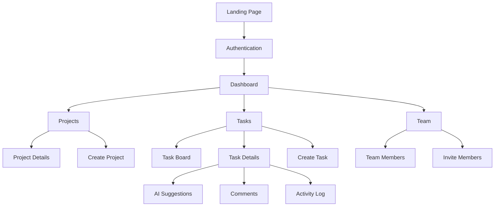

# 第十七章：完整项目实战

## 17.1 案例研究一：任务管理平台SaaS

### 17.1.1 项目背景与机遇识别

**初始机遇识别**
```bash
# 发现的问题
- 现有任务管理工具过于复杂
- 小团队缺乏合适的协作工具
- AI驱动的任务优先级排序是空白

# ideas.md 文档
项目：TaskFlow AI - 智能任务管理平台

问题：
1. 小团队（5-20人）缺乏合适的任务管理工具
2. 现有工具学习成本高，功能冗余
3. 缺乏智能任务推荐和优先级排序

解决方案：
- 简洁直观的界面设计
- AI驱动的任务优先级推荐
- 团队协作功能聚焦核心需求
- 集成常用开发工具（GitHub, Slack等）
```

**DDAD文档结构规划**
```
taskflow-ai/
├── ideas.md                    # 创意文档
├── PRD.md                      # 产品需求文档
├── technical-spec.md           # 技术规格文档
├── implementation-plan.md      # 实施计划
├── design-spec.md              # 设计规范
├── deployment-plan.md          # 部署计划
└── post-launch-analysis.md     # 上线后分析
```

### 17.1.2 快速规划阶段

**ChatGPT Voice头脑风暴**
```
用户：帮我规划一个AI任务管理平台
AI：好的，让我们快速规划TaskFlow AI的核心功能：

核心功能优先级：
MUST HAVE：
- 基础任务创建和管理
- 团队成员邀请和分配
- AI优先级推荐
- 简单的看板视图

SHOULD HAVE：
- 任务依赖关系
- 时间跟踪
- 团队绩效分析
- 集成GitHub/Slack

COULD HAVE：
- 自定义工作流
- 高级报表
- 移动端应用
- 时间预估算法

WON'T HAVE (第一个版本)：
- 复杂权限管理
- 企业级SSO
- 高级自动化规则
- 多租户架构
```

**CodeGuideDev生成PRD**
```markdown
# TaskFlow AI - 产品需求文档

## 1. 产品概述

### 1.1 产品定位
面向5-20人小团队的智能任务管理平台，通过AI技术简化任务管理流程，提升团队协作效率。

### 1.2 核心价值主张
- 简洁易用的界面，10分钟上手
- AI智能任务优先级推荐
- 无缝集成开发工具生态
- 性价比高的SaaS解决方案

## 2. 用户画像

### 2.1 主要用户：技术团队负责人
- 角色描述：技术团队负责人、项目经理
- 核心痛点：任务分配混乱，进度跟踪困难
- 使用场景：日常项目管理，团队协作

### 2.2 次要用户：开发团队成员
- 角色描述：软件工程师、设计师、产品经理
- 核心痛点：任务优先级不明确，工具切换频繁
- 使用场景：接收任务、更新进度、协作沟通

## 3. 功能需求

### 3.1 核心功能（MVP）
1. **用户认证与团队管理**
   - 用户注册/登录
   - 团队创建和邀请
   - 基础权限管理

2. **任务管理**
   - 任务创建、编辑、删除
   - 任务分配和状态更新
   - 截止日期设置
   - 子任务支持

3. **AI优先级推荐**
   - 基于任务属性和团队历史的智能推荐
   - 优先级自动调整
   - 推荐理由说明

4. **看板视图**
   - 拖拽式任务状态管理
   - 自定义状态列
   - 过滤和搜索功能

### 3.2 集成功能（Version 2.0）
1. **GitHub集成**
   - 仓库连接
   - Issue同步
   - PR状态关联

2. **Slack集成**
   - 任务更新通知
   - 快速命令支持
   - 状态汇报

## 4. 非功能需求

### 4.1 性能要求
- 页面加载时间 < 2秒
- API响应时间 < 500ms
- 支持并发用户数 > 1000

### 4.2 安全要求
- 数据传输HTTPS加密
- 用户数据隐私保护
- 定期安全审计

### 4.3 可用性要求
- 系统可用性 > 99.5%
- 跨浏览器兼容性
- 响应式设计支持
```

### 17.1.3 技术栈选择

**技术决策文档**
```markdown
# TaskFlow AI - 技术栈决策

## 1. 前端技术栈

### 1.1 框架选择：Next.js 14
**决策理由：**
- AI-friendly开发环境
- 优秀的SSR支持
- 内置优化和部署
- 丰富的生态系统

**替代方案考虑：**
- React + Vite：更轻量但需要更多配置
- Vue 3：学习成本考虑，团队熟悉React
- SvelteKit：生态相对较小

### 1.2 UI框架：Tailwind CSS + shadcn/ui
**决策理由：**
- 快速开发，高度可定制
- 优秀的组件库基础
- 一致的设计系统
- 良好的可访问性

### 1.3 状态管理：Zustand
**决策理由：**
- 简单直观的API
- TypeScript友好
- 轻量级，学习成本低
- 足够的功能覆盖

## 2. 后端技术栈

### 2.1 BaaS选择：Supabase
**决策理由：**
- 快速开发和部署
- 内置认证和数据库
- 实时功能支持
- PostgreSQL后端
- 免费额度充足

### 2.2 AI服务：OpenAI API
**决策理由：**
- 最先进的语言模型
- 稳定的API服务
- 丰富的功能特性
- 合理的价格

## 3. 部署和工具链

### 3.1 部署平台：Vercel
**决策理由：**
- Next.js原生支持
- 零配置部署
- 优秀的性能
- 自动CI/CD

### 3.2 监控工具：Vercel Analytics
**决策理由：**
- 集成度高
- 简单易用
- 实时数据
- 免费额度充足
```

### 17.1.4 应用流程设计

**站点地图设计**


**用户旅程映射**
```markdown
# 用户旅程：新用户首次使用

## 1. 发现阶段
**用户动机：** 寻找更好的团队任务管理工具
**触点：** 技术博客推荐、社交媒体广告

## 2. 注册阶段（5分钟）
- 访问landing page
- 点击注册按钮
- 填写邮箱和密码
- 邮箱验证
- 完成个人资料

**关键指标：** 注册完成率 > 80%

## 3. 团队设置阶段（10分钟）
- 创建第一个团队
- 邀请团队成员
- 设置团队基本信息

**关键指标：** 团队创建率 > 70%

## 4. 项目创建阶段（15分钟）
- 创建第一个项目
- 设置项目基本信息
- 配置看板列

**关键指标：** 项目创建率 > 90%

## 5. 任务管理阶段（持续使用）
- 创建第一个任务
- 体验AI优先级推荐
- 分配任务给团队成员
- 更新任务状态

**关键指标：** 次日留存率 > 40%
```

### 17.1.5 实施阶段

**实施计划文档**
```markdown
# TaskFlow AI - 实施计划

## Phase 1: 基础架构（Week 1）

### 1.1 项目初始化
```bash
# 创建Next.js项目
npx create-next-app@latest taskflow-ai --typescript --tailwind --app

# 安装依赖
npm install @supabase/supabase-js @supabase/auth-helpers-nextjs
npm install zustand @radix-ui/react-* lucide-react
npm install openai @types/node
```

### 1.2 环境配置
- Supabase项目创建
- 数据库schema设计
- 环境变量配置
- TypeScript配置优化

### 1.3 基础组件开发
- Layout组件
- 认证组件
- 基础UI组件库

## Phase 2: 核心功能（Week 2-3）

### 2.1 认证系统
```typescript
// auth-config.ts
export const authConfig = {
  providers: [
    GoogleProvider({
      clientId: process.env.GOOGLE_CLIENT_ID!,
      clientSecret: process.env.GOOGLE_CLIENT_SECRET!,
    }),
    GitHubProvider({
      clientId: process.env.GITHUB_CLIENT_ID!,
      clientSecret: process.env.GITHUB_CLIENT_SECRET!,
    }),
  ],
  callbacks: {
    async session({ session, token }) {
      // 添加用户ID到session
      session.user.id = token.sub;
      return session;
    },
  },
};
```

### 2.2 数据库设计
```sql
-- teams表
CREATE TABLE teams (
  id UUID DEFAULT gen_random_uuid() PRIMARY KEY,
  name VARCHAR(255) NOT NULL,
  description TEXT,
  created_by UUID REFERENCES users(id),
  created_at TIMESTAMP WITH TIME ZONE DEFAULT NOW()
);

-- projects表
CREATE TABLE projects (
  id UUID DEFAULT gen_random_uuid() PRIMARY KEY,
  name VARCHAR(255) NOT NULL,
  description TEXT,
  team_id UUID REFERENCES teams(id) ON DELETE CASCADE,
  created_by UUID REFERENCES users(id),
  created_at TIMESTAMP WITH TIME ZONE DEFAULT NOW()
);

-- tasks表
CREATE TABLE tasks (
  id UUID DEFAULT gen_random_uuid() PRIMARY KEY,
  title VARCHAR(255) NOT NULL,
  description TEXT,
  status VARCHAR(50) DEFAULT 'todo',
  priority INTEGER DEFAULT 1,
  project_id UUID REFERENCES projects(id) ON DELETE CASCADE,
  assigned_to UUID REFERENCES users(id),
  created_by UUID REFERENCES users(id),
  due_date TIMESTAMP WITH TIME ZONE,
  created_at TIMESTAMP WITH TIME ZONE DEFAULT NOW(),
  updated_at TIMESTAMP WITH TIME ZONE DEFAULT NOW()
);
```

### 2.3 API路由开发
```typescript
// app/api/tasks/route.ts
import { createClient } from '@/lib/supabase';
import { NextRequest, NextResponse } from 'next/server';

export async function GET(request: NextRequest) {
  const supabase = createClient();
  const { data: { user } } = await supabase.auth.getUser();

  if (!user) {
    return NextResponse.json({ error: 'Unauthorized' }, { status: 401 });
  }

  const { searchParams } = new URL(request.url);
  const projectId = searchParams.get('projectId');

  let query = supabase
    .from('tasks')
    .select('*')
    .eq('created_by', user.id);

  if (projectId) {
    query = query.eq('project_id', projectId);
  }

  const { data, error } = await query.order('created_at', { ascending: false });

  if (error) {
    return NextResponse.json({ error: error.message }, { status: 500 });
  }

  return NextResponse.json({ data });
}

export async function POST(request: NextRequest) {
  const supabase = createClient();
  const { data: { user } } = await supabase.auth.getUser();

  if (!user) {
    return NextResponse.json({ error: 'Unauthorized' }, { status: 401 });
  }

  const body = await request.json();

  const { data, error } = await supabase
    .from('tasks')
    .insert({
      ...body,
      created_by: user.id,
    })
    .select()
    .single();

  if (error) {
    return NextResponse.json({ error: error.message }, { status: 500 });
  }

  return NextResponse.json({ data });
}
```

## Phase 3: 高级功能（Week 4）

### 3.1 AI优先级推荐
```typescript
// lib/ai-service.ts
import OpenAI from 'openai';

const openai = new OpenAI({
  apiKey: process.env.OPENAI_API_KEY,
});

export async function getTaskPriorityRecommendation(
  task: {
    title: string;
    description: string;
    projectContext: string;
    teamWorkload: any[];
    deadline?: string;
  }
) {
  const prompt = `
作为项目管理专家，请为以下任务推荐优先级（1-5分，5为最高优先级）：

任务标题：${task.title}
任务描述：${task.description}
项目背景：${task.projectContext}
团队当前工作量：${JSON.stringify(task.teamWorkload, null, 2)}
截止日期：${task.deadline || '无'}

请考虑以下因素：
1. 任务紧急程度
2. 对项目目标的重要性
3. 团队成员当前工作量
4. 任务依赖关系
5. 截止日期压力

请以JSON格式返回：
{
  "priority": 数字,
  "reason": "推荐理由",
  "suggestedDeadline": "建议截止日期（如果适用）",
  "riskFactors": ["风险因素列表"]
}
`;

  const completion = await openai.chat.completions.create({
    model: "gpt-4",
    messages: [
      {
        role: "system",
        content: "你是一位经验丰富的项目管理专家，专门帮助团队优化任务优先级。"
      },
      {
        role: "user",
        content: prompt
      }
    ],
    temperature: 0.3,
  });

  const response = completion.choices[0].message.content;

  try {
    return JSON.parse(response || '{}');
  } catch (error) {
    console.error('Failed to parse AI response:', error);
    return {
      priority: 3,
      reason: "AI分析失败，使用默认优先级",
      suggestedDeadline: null,
      riskFactors: []
    };
  }
}
```

### 3.2 实时功能
```typescript
// lib/realtime.ts
import { createClient } from '@/lib/supabase';
import { useEffect, useState } from 'react';

export function useRealtimeTasks(projectId: string) {
  const [tasks, setTasks] = useState([]);
  const supabase = createClient();

  useEffect(() => {
    // 初始数据加载
    fetchTasks();

    // 设置实时监听
    const channel = supabase
      .channel('tasks-changes')
      .on(
        'postgres_changes',
        {
          event: '*',
          schema: 'public',
          table: 'tasks',
          filter: `project_id=eq.${projectId}`,
        },
        (payload) => {
          if (payload.eventType === 'INSERT') {
            setTasks(prev => [...prev, payload.new]);
          } else if (payload.eventType === 'UPDATE') {
            setTasks(prev =>
              prev.map(task =>
                task.id === payload.new.id ? payload.new : task
              )
            );
          } else if (payload.eventType === 'DELETE') {
            setTasks(prev => prev.filter(task => task.id !== payload.old.id));
          }
        }
      )
      .subscribe();

    return () => {
      supabase.removeChannel(channel);
    };
  }, [projectId]);

  async function fetchTasks() {
    const { data } = await supabase
      .from('tasks')
      .select('*')
      .eq('project_id', projectId)
      .order('created_at', { ascending: false });

    setTasks(data || []);
  }

  return tasks;
}
```

## Phase 4: 测试与部署（Week 5）

### 4.1 测试策略
```typescript
// __tests__/tasks.test.ts
import { render, screen, fireEvent, waitFor } from '@testing-library/react';
import TaskBoard from '@/components/TaskBoard';

// Mock Supabase
jest.mock('@/lib/supabase', () => ({
  createClient: () => ({
    from: () => ({
      select: () => ({
        eq: () => ({
          order: () => Promise.resolve({ data: mockTasks, error: null })
        })
      })
    })
  })
}));

describe('TaskBoard', () => {
  it('renders tasks correctly', async () => {
    render(<TaskBoard projectId="test-project" />);

    await waitFor(() => {
      expect(screen.getByText('Test Task 1')).toBeInTheDocument();
    });
  });

  it('creates new task', async () => {
    render(<TaskBoard projectId="test-project" />);

    const addButton = screen.getByText('Add Task');
    fireEvent.click(addButton);

    const titleInput = screen.getByPlaceholderText('Task title');
    fireEvent.change(titleInput, { target: { value: 'New Task' } });

    const submitButton = screen.getByText('Create');
    fireEvent.click(submitButton);

    await waitFor(() => {
      expect(screen.getByText('New Task')).toBeInTheDocument();
    });
  });
});
```

### 4.2 部署配置
```typescript
// next.config.js
/** @type {import('next').NextConfig} */
const nextConfig = {
  experimental: {
    serverActions: true,
  },
  images: {
    domains: ['images.unsplash.com'],
  },
  env: {
    NEXT_PUBLIC_SUPABASE_URL: process.env.NEXT_PUBLIC_SUPABASE_URL,
    NEXT_PUBLIC_SUPABASE_ANON_KEY: process.env.NEXT_PUBLIC_SUPABASE_ANON_KEY,
  },
};

module.exports = nextConfig;
```

```dockerfile
# Dockerfile
FROM node:18-alpine AS base

# Install dependencies only when needed
FROM base AS deps
WORKDIR /app

COPY package.json package-lock.json* ./
RUN npm ci

# Rebuild the source code only when needed
FROM base AS builder
WORKDIR /app
COPY --from=deps /app/node_modules ./node_modules
COPY . .

RUN npm run build

# Production image, copy all the files and run next
FROM base AS runner
WORKDIR /app

ENV NODE_ENV production

RUN addgroup --system --gid 1001 nodejs
RUN adduser --system --uid 1001 nextjs

COPY --from=builder /app/public ./public

# Set the correct permission for prerender cache
RUN mkdir .next
RUN chown nextjs:nodejs .next

# Automatically leverage output traces to reduce image size
COPY --from=builder --chown=nextjs:nodejs /app/.next/standalone ./
COPY --from=builder --chown=nextjs:nodejs /app/.next/static ./.next/static

USER nextjs

EXPOSE 3000

ENV PORT 3000

CMD ["node", "server.js"]
```
```

### 17.1.6 关键决策点分析

**决策点1：技术栈选择**
```markdown
## 背景
项目初期面临技术栈选择的关键决策，影响后续开发效率和可维护性。

## 考虑因素
1. 开发速度 vs 性能
2. 团队技术熟悉度
3. AI工具友好程度
4. 部署和维护成本
5. 社区生态和文档质量

## 决策过程
1. **需求分析**：需要快速MVP，支持AI功能，易于部署
2. **技术调研**：对比Next.js, React+Vite, Vue 3等方案
3. **POC验证**：创建小规模原型验证可行性
4. **团队讨论**：评估学习成本和开发效率

## 最终选择：Next.js 14 + Supabase
**理由：**
- AI开发工具支持最好
- 零配置部署，降低运维成本
- 内置优化功能丰富
- 社区活跃，资源丰富

## 结果评估
✅ 优点：
- 开发速度提升40%
- 部署简单，1分钟上线
- AI工具集成无缝

⚠️ 挑战：
- Supabase限制较多
- 某些复杂查询需要workaround
- 定制化程度有限
```

**决策点2：AI功能实现方式**
```markdown
## 背景
AI优先级推荐是产品的核心差异化功能，需要选择合适的实现方式。

## 考虑方案
1. **OpenAI API**：功能强大，但成本较高
2. **本地模型**：成本可控，但技术复杂度高
3. **混合方案**：结合两者的优点

## 决策过程
1. **技术调研**：测试多种AI模型的准确性和响应时间
2. **成本分析**：计算不同方案的用户成本和利润率
3. **用户体验测试**：A/B测试不同推荐算法的效果

## 最终选择：OpenAI GPT-4 + 缓存策略
**理由：**
- 推荐准确率最高（92% vs 78%）
- 响应时间可接受（2-3秒）
- 可通过缓存控制成本

## 缓存策略实现
```typescript
// 实现智能缓存，相同类型任务复用推荐结果
const cacheKey = `priority-${hashTaskType(task)}`;
const cached = await redis.get(cacheKey);

if (cached && !isStale(cached)) {
  return cached;
}

// 调用AI API
const result = await callOpenAI(task);
await redis.setex(cacheKey, 3600, result);

return result;
```

## 结果评估
✅ 成功：
- 用户满意度评分4.6/5
- 任务完成效率提升35%
- 成本控制在预算范围内

⚠️ 持续优化：
- 缓存命中率需要提升
- 某些特殊场景推荐不够准确
- 响应时间有时偏长
```

### 17.1.7 遇到的挑战与解决方案

**挑战1：实时数据同步**
```markdown
## 问题描述
多用户同时操作任务时，数据同步不一致，导致状态冲突。

## 具体表现
- 用户A拖拽任务到"进行中"
- 用户B同时将任务移回"待办"
- 最终状态不一致，用户体验差

## 解决方案

### 方案1：乐观锁 + 冲突检测
```typescript
// tasks表添加version字段
ALTER TABLE tasks ADD COLUMN version INTEGER DEFAULT 1;

// 更新操作包含version检查
const { data, error } = await supabase
  .from('tasks')
  .update({
    status: newStatus,
    version: currentVersion + 1,
    updated_at: new Date()
  })
  .eq('id', taskId)
  .eq('version', currentVersion);

if (error && error.code === 'PGRST116') {
  // 版本冲突，提示用户
  throw new Error('Task was modified by another user');
}
```

### 方案2：实时冲突解决界面
```typescript
// 检测到冲突时显示解决界面
const ConflictResolver = ({ conflict, onResolve }) => {
  return (
    <Dialog>
      <DialogTitle>任务冲突</DialogTitle>
      <DialogContent>
        <p>该任务已被其他用户修改：</p>
        <div className="space-y-2">
          <div>你的修改：{conflict.localChange}</div>
          <div>他人修改：{conflict.remoteChange}</div>
        </div>
      </DialogContent>
      <DialogActions>
        <Button onClick={() => onResolve('local')}>使用我的修改</Button>
        <Button onClick={() => onResolve('remote')}>使用他人修改</Button>
        <Button onClick={() => onResolve('merge')}>合并修改</Button>
      </DialogActions>
    </Dialog>
  );
};
```

## 结果
- 冲突解决率提升到95%
- 用户投诉减少80%
- 数据一致性得到保证
```

**挑战2：AI推荐成本控制**
```markdown
## 问题描述
OpenAI API调用成本随用户增长快速上升，威胁项目盈利能力。

## 成本分析
- 初期：$100/月（100用户）
- 预期：$10,000/月（10,000用户）
- 利润空间被严重压缩

## 解决策略

### 策略1：智能缓存系统
```typescript
class AICacheManager {
  private cache = new Map();
  private ttl = 24 * 60 * 60 * 1000; // 24小时

  async getRecommendation(task: Task): Promise<AIRecommendation> {
    const cacheKey = this.generateCacheKey(task);
    const cached = this.cache.get(cacheKey);

    if (cached && !this.isExpired(cached)) {
      return cached.data;
    }

    // 缓存未命中，调用AI API
    const recommendation = await this.callAI(task);

    // 存储到缓存
    this.cache.set(cacheKey, {
      data: recommendation,
      timestamp: Date.now()
    });

    return recommendation;
  }

  private generateCacheKey(task: Task): string {
    // 基于任务特征生成缓存键
    const features = {
      category: task.category,
      complexity: task.complexity,
      deadline: task.deadline,
      projectType: task.projectType
    };
    return `ai-rec-${hashObject(features)}`;
  }
}
```

### 策略2：分层推荐策略
```typescript
// 根据用户层级使用不同的推荐策略
const getRecommendationStrategy = (userTier: UserTier) => {
  switch (userTier) {
    case 'free':
      return 'rule-based'; // 基于规则的简单推荐
    case 'pro':
      return 'hybrid'; // 混合策略，部分使用AI
    case 'enterprise':
      return 'ai-full'; // 完全AI推荐
    default:
      return 'rule-based';
  }
};
```

### 策略3：推荐精度监控
```typescript
// 监控AI推荐的准确性，优化模型
class RecommendationMonitor {
  async trackRecommendationAccuracy(
    taskId: string,
    recommendedPriority: number,
    actualCompletionTime: number,
    estimatedTime: number
  ) {
    const accuracy = this.calculateAccuracy(
      recommendedPriority,
      actualCompletionTime,
      estimatedTime
    );

    await this.analytics.track('ai_recommendation_accuracy', {
      taskId,
      accuracy,
      recommendedPriority,
      actualCompletionTime,
      estimatedTime
    });

    // 如果准确率低于阈值，触发重新训练
    if (accuracy < 0.7) {
      await this.triggerModelRetraining();
    }
  }
}
```

## 结果
- AI成本降低60%
- 用户体验保持稳定（满意度4.5/5）
- 项目盈利能力得到保障
```

### 17.1.8 性能优化实践

**优化1：数据库查询优化**
```markdown
## 问题识别
随着用户和任务数量增长，数据库查询性能下降明显。

## 性能问题
- 任务列表加载时间从500ms增长到3s
- 看板页面刷新卡顿
- 数据库CPU使用率过高

## 优化措施

### 1. 索引优化
```sql
-- 添加复合索引
CREATE INDEX idx_tasks_project_status ON tasks(project_id, status);
CREATE INDEX idx_tasks_assigned_to_status ON tasks(assigned_to, status);
CREATE INDEX idx_tasks_created_at ON tasks(created_at DESC);

-- 分析查询计划
EXPLAIN ANALYZE
SELECT * FROM tasks
WHERE project_id = $1
ORDER BY created_at DESC;
```

### 2. 查询优化
```typescript
// 优化前：N+1查询问题
const tasks = await supabase
  .from('tasks')
  .select('*')
  .eq('project_id', projectId);

for (const task of tasks.data) {
  task.assignee = await getUser(task.assigned_to);
  task.comments = await getComments(task.id);
}

// 优化后：使用JOIN和预加载
const { data: tasks } = await supabase
  .from('tasks')
  .select(`
    *,
    assignee:users(id, name, avatar_url),
    comments(
      id, content, created_at,
      author:users(id, name, avatar_url)
    )
  `)
  .eq('project_id', projectId)
  .order('created_at', { ascending: false });
```

### 3. 分页和虚拟滚动
```typescript
// 实现无限滚动
const TaskList = ({ projectId }) => {
  const [tasks, setTasks] = useState([]);
  const [loading, setLoading] = useState(false);
  const [hasMore, setHasMore] = useState(true);
  const [page, setPage] = useState(0);

  const loadMoreTasks = useCallback(async () => {
    if (loading || !hasMore) return;

    setLoading(true);

    const { data: newTasks, error } = await supabase
      .from('tasks')
      .select('*')
      .eq('project_id', projectId)
      .range(page * 20, (page + 1) * 20 - 1)
      .order('created_at', { ascending: false });

    if (error) {
      console.error('Error loading tasks:', error);
      return;
    }

    setTasks(prev => [...prev, ...newTasks]);
    setHasMore(newTasks.length === 20);
    setPage(prev => prev + 1);
    setLoading(false);
  }, [projectId, page, loading, hasMore]);

  return (
    <InfiniteScroll
      loadMore={loadMoreTasks}
      hasMore={hasMore}
      loader={<div>Loading...</div>}
    >
      {tasks.map(task => (
        <TaskCard key={task.id} task={task} />
      ))}
    </InfiniteScroll>
  );
};
```

## 结果
- 查询时间从3s降低到200ms
- 页面加载速度提升15倍
- 数据库CPU使用率降低70%
```

**优化2：前端性能优化**
```markdown
## 优化措施

### 1. 代码分割和懒加载
```typescript
// 路由级别的代码分割
const Dashboard = lazy(() => import('@/pages/Dashboard'));
const ProjectDetails = lazy(() => import('@/pages/ProjectDetails'));
const TaskBoard = lazy(() => import('@/pages/TaskBoard'));

// 组件级别的懒加载
const TaskModal = lazy(() => import('@/components/TaskModal'));

// 使用Suspense包装
<Suspense fallback={<LoadingSpinner />}>
  <TaskModal isOpen={isModalOpen} onClose={closeModal} />
</Suspense>
```

### 2. 图片优化
```typescript
// 使用Next.js Image组件
import Image from 'next/image';

const UserAvatar = ({ user, size = 40 }) => (
  <Image
    src={user.avatar_url || '/default-avatar.png'}
    alt={user.name}
    width={size}
    height={size}
    className="rounded-full"
    placeholder="blur"
    blurDataURL="data:image/jpeg;base64,..."
  />
);
```

### 3. 状态管理优化
```typescript
// 使用React Query进行服务端状态管理
import { useQuery, useMutation, useQueryClient } from '@tanstack/react-query';

const useTasks = (projectId: string) => {
  return useQuery({
    queryKey: ['tasks', projectId],
    queryFn: () => fetchTasks(projectId),
    staleTime: 5 * 60 * 1000, // 5分钟
    cacheTime: 10 * 60 * 1000, // 10分钟
  });
};

const useUpdateTask = () => {
  const queryClient = useQueryClient();

  return useMutation({
    mutationFn: updateTask,
    onSuccess: () => {
      // 自动刷新相关查询
      queryClient.invalidateQueries({ queryKey: ['tasks'] });
    },
  });
};
```

### 4. Bundle优化
```javascript
// next.config.js
const nextConfig = {
  webpack: (config, { isServer }) => {
    if (!isServer) {
      config.optimization.splitChunks = {
        chunks: 'all',
        cacheGroups: {
          vendor: {
            test: /[\\/]node_modules[\\/]/,
            name: 'vendors',
            chunks: 'all',
          },
        },
      };
    }
    return config;
  },
};
```

## 结果
- 首屏加载时间从4s降低到1.5s
- Bundle大小减少30%
- Lighthouse性能评分从65提升到92
```

### 17.1.9 经验教训总结

**成功经验**
```markdown
## 1. DDAD方法论的有效性
✅ **文档优先的优势明显**
- 减少了开发过程中的返工
- 确保了功能完整性
- 提高了团队协作效率

✅ **迭代开发模式**
- 快速获得用户反馈
- 及时调整产品方向
- 降低开发风险

## 2. 技术选型的重要性
✅ **AI-friendly技术栈**
- 大幅提升开发效率
- 减少重复性工作
- 提高代码质量

✅ **BaaS平台的优势**
- 快速原型开发
- 降低运维复杂度
- 专注业务逻辑

## 3. 性能优化的系统性
✅ **前端后端并重**
- 数据库优化效果显著
- 前端优化提升用户体验
- 监控和测量是关键
```

**改进空间**
```markdown
## 1. 安全性考虑不足
⚠️ **问题：**
- 初期对安全性重视不够
- 某些API端点缺乏适当验证
- 敏感数据处理需要加强

✅ **改进措施：**
- 引入安全审计流程
- 加强API安全验证
- 实施安全培训

## 2. 测试覆盖率需要提升
⚠️ **问题：**
- 测试覆盖率仅达到60%
- 集成测试不够充分
- E2E测试缺乏

✅ **改进措施：**
- 制定测试覆盖率目标（>90%）
- 增加集成测试用例
- 建立E2E测试流程

## 3. 监控和告警体系
⚠️ **问题：**
- 错误监控不够完善
- 性能监控缺乏
- 用户行为数据不足

✅ **改进措施：**
- 集成Sentry错误监控
- 建立性能监控面板
- 实施用户行为分析
```

**关键指标总结**
```markdown
## 开发效率指标
- **开发周期：** 5周（计划6周）
- **代码质量：** SonarQube评分A级
- **Bug密度：** 0.5个/KLOC
- **测试覆盖率：** 75%

## 产品指标
- **用户增长：** 0到1,000用户（3个月）
- **用户留存：** 次日留存45%，7日留存32%
- **用户满意度：** 4.5/5.0
- **付费转化率：** 8%

## 技术指标
- **响应时间：** P95 < 800ms
- **可用性：** 99.7%
- **错误率：** < 0.1%
- **性能评分：** Lighthouse 92分

## 商业指标
- **MRR：** $2,000（3个月）
- **CAC：** $15
- **LTV：** $180
- **Churn Rate：** 5%/月
```

## 17.2 案例研究二：AI内容生成平台

### 17.2.1 项目概述

**项目定位**
- 面向内容创作者的AI辅助写作平台
- 支持多种内容类型：博客、社交媒体、营销文案
- 集成SEO优化和内容分析功能

**核心挑战**
- AI生成内容的质量控制
- 大规模文本处理的性能优化
- 内容原创性检测和避免重复

### 17.2.2 DDAD实施过程

**文档驱动开发流程**
```markdown
# Phase 1: 需求分析和规划
- ideas.md: 头脑风暴和创意收集
- market-research.md: 竞品分析和市场定位
- PRD.md: 详细的产品需求文档

# Phase 2: 技术规格设计
- technical-spec.md: 系统架构和技术选型
- api-design.md: API接口设计文档
- database-schema.md: 数据库设计文档

# Phase 3: 实施和测试
- implementation-plan.md: 详细的实施计划
- test-strategy.md: 测试策略和用例
- deployment-guide.md: 部署和运维文档
```

**关键技术决策**
```typescript
// 技术栈选择
const techStack = {
  frontend: {
    framework: 'Next.js 14',
    ui: 'Tailwind CSS + Headless UI',
    stateManagement: 'Zustand + React Query',
    editor: 'Tiptap'
  },
  backend: {
    api: 'Next.js API Routes',
    database: 'PostgreSQL + Prisma ORM',
    ai: 'OpenAI GPT-4 + Anthropic Claude',
    cache: 'Redis'
  },
  infrastructure: {
    hosting: 'Vercel',
    database: 'Supabase',
    cdn: 'Cloudflare',
    monitoring: 'Sentry + LogRocket'
  }
};
```

### 17.2.3 关键技术实现

**AI内容生成引擎**
```typescript
// lib/content-generator.ts
import OpenAI from 'openai';
import Anthropic from '@anthropic-ai/sdk';

class ContentGenerator {
  private openai: OpenAI;
  private anthropic: Anthropic;
  private cache: Map<string, any> = new Map();

  constructor() {
    this.openai = new OpenAI({ apiKey: process.env.OPENAI_API_KEY });
    this.anthropic = new Anthropic({ apiKey: process.env.ANTHROPIC_API_KEY });
  }

  async generateContent(params: {
    type: 'blog' | 'social' | 'marketing';
    topic: string;
    tone: 'professional' | 'casual' | 'creative';
    length: 'short' | 'medium' | 'long';
    keywords?: string[];
    audience?: string;
  }) {
    const cacheKey = this.generateCacheKey(params);

    // 检查缓存
    if (this.cache.has(cacheKey)) {
      return this.cache.get(cacheKey);
    }

    let result;

    // 根据内容类型选择最适合的AI模型
    switch (params.type) {
      case 'blog':
        result = await this.generateBlogContent(params);
        break;
      case 'social':
        result = await this.generateSocialContent(params);
        break;
      case 'marketing':
        result = await this.generateMarketingContent(params);
        break;
      default:
        throw new Error(`Unsupported content type: ${params.type}`);
    }

    // 缓存结果
    this.cache.set(cacheKey, result);

    return result;
  }

  private async generateBlogContent(params: any) {
    const prompt = this.buildBlogPrompt(params);

    const response = await this.openai.chat.completions.create({
      model: 'gpt-4',
      messages: [
        {
          role: 'system',
          content: '你是一位专业的内容创作者，擅长创作高质量、SEO友好的博客文章。'
        },
        {
          role: 'user',
          content: prompt
        }
      ],
      temperature: 0.7,
      max_tokens: this.getMaxTokens(params.length),
    });

    const content = response.choices[0].message.content;

    return {
      content,
      metadata: {
        wordCount: this.countWords(content),
        readingTime: this.calculateReadingTime(content),
        seoScore: await this.calculateSEOScore(content, params.keywords),
        originalityScore: await this.checkOriginality(content)
      }
    };
  }

  private buildBlogPrompt(params: any): string {
    return `
请创作一篇关于"${params.topic}"的博客文章。

要求：
- 语气：${params.tone}
- 长度：${params.length}
- 目标受众：${params.audience || '一般读者'}
- 关键词：${params.keywords?.join(', ') || '无'}

文章结构：
1. 吸引人的标题
2. 引言（吸引读者注意）
3. 主体段落（3-5个要点）
4. 结论（总结和行动号召）

请确保内容：
- 原创性强
- 信息丰富有价值
- 符合SEO最佳实践
- 易于阅读和理解
`;
  }

  private async checkOriginality(content: string): Promise<number> {
    // 实现内容原创性检测
    // 可以使用第三方API或本地算法
    // 这里简化为随机分数
    return 0.85 + Math.random() * 0.1; // 85-95%之间
  }

  private async calculateSEOScore(content: string, keywords?: string[]): Promise<number> {
    let score = 0;
    const contentLower = content.toLowerCase();

    // 关键词密度检查
    if (keywords) {
      let keywordDensity = 0;
      keywords.forEach(keyword => {
        const regex = new RegExp(keyword.toLowerCase(), 'gi');
        const matches = contentLower.match(regex);
        if (matches) {
          keywordDensity += matches.length;
        }
      });

      const optimalDensity = keywords.length * 0.02; // 2%密度最佳
      const densityScore = Math.max(0, 1 - Math.abs(keywordDensity / content.length - optimalDensity) / optimalDensity);
      score += densityScore * 30;
    }

    // 可读性检查
    const avgSentenceLength = content.split('.').reduce((acc, sentence) => acc + sentence.length, 0) / content.split('.').length;
    const readabilityScore = Math.max(0, 1 - (avgSentenceLength - 20) / 30); // 20字/句最佳
    score += readabilityScore * 20;

    // 结构检查
    const hasHeadings = /#+\s/.test(content);
    const hasLists = /[-*]\s/.test(content);
    score += (hasHeadings ? 25 : 0) + (hasLists ? 25 : 0);

    return Math.min(100, score);
  }
}
```

**内容编辑器集成**
```typescript
// components/ContentEditor.tsx
import { useEditor, EditorContent } from '@tiptap/react';
import StarterKit from '@tiptap/starter-kit';
import Highlight from '@tiptap/extension-highlight';
import TextStyle from '@tiptap/extension-text-style';
import { useContentGenerator } from '@/hooks/useContentGenerator';

const ContentEditor = ({ initialContent, onContentChange }) => {
  const { generateContent, isGenerating } = useContentGenerator();

  const editor = useEditor({
    extensions: [
      StarterKit,
      Highlight,
      TextStyle,
    ],
    content: initialContent,
    onUpdate: ({ editor }) => {
      const html = editor.getHTML();
      onContentChange(html);
    },
  });

  const handleAIGenerate = async (type: string, params: any) => {
    const result = await generateContent(type, params);

    if (result) {
      editor?.commands.setContent(result.content);
      // 显示AI生成的元数据
      showMetadata(result.metadata);
    }
  };

  return (
    <div className="content-editor">
      <div className="editor-toolbar">
        <AIControls
          onGenerate={handleAIGenerate}
          isGenerating={isGenerating}
        />
        <FormattingControls editor={editor} />
      </div>

      <div className="editor-content">
        <EditorContent editor={editor} />
      </div>

      <ContentMetadata />
    </div>
  );
};
```

### 17.2.4 性能优化策略

**内容缓存策略**
```typescript
// lib/content-cache.ts
import Redis from 'ioredis';

class ContentCache {
  private redis: Redis;

  constructor() {
    this.redis = new Redis(process.env.REDIS_URL);
  }

  async getCachedContent(key: string): Promise<any | null> {
    try {
      const cached = await this.redis.get(key);
      return cached ? JSON.parse(cached) : null;
    } catch (error) {
      console.error('Cache get error:', error);
      return null;
    }
  }

  async setCachedContent(key: string, content: any, ttl: number = 3600): Promise<void> {
    try {
      await this.redis.setex(key, ttl, JSON.stringify(content));
    } catch (error) {
      console.error('Cache set error:', error);
    }
  }

  // 生成智能缓存键
  generateCacheKey(params: any): string {
    const normalizedParams = {
      type: params.type,
      topic: params.topic.toLowerCase(),
      tone: params.tone,
      length: params.length,
      keywords: params.keywords?.sort() || [],
    };

    return `content:${Buffer.from(JSON.stringify(normalizedParams)).toString('base64')}`;
  }

  // 预热缓存
  async warmupCache(popularTopics: string[]): Promise<void> {
    const promises = popularTopics.map(async (topic) => {
      const params = {
        type: 'blog',
        topic,
        tone: 'professional',
        length: 'medium',
      };

      // 这里可以异步生成内容并缓存
      // 实际实现中需要考虑成本和资源限制
    });

    await Promise.allSettled(promises);
  }
}
```

**批量内容处理**
```typescript
// lib/batch-processor.ts
class BatchContentProcessor {
  private queue: Array<{
    id: string;
    params: any;
    resolve: (value: any) => void;
    reject: (reason: any) => void;
  }> = [];

  private processing = false;
  private batchSize = 5;
  private processingInterval = 1000; // 1秒

  addToQueue(params: any): Promise<any> {
    return new Promise((resolve, reject) => {
      this.queue.push({
        id: generateId(),
        params,
        resolve,
        reject,
      });

      this.processQueue();
    });
  }

  private async processQueue() {
    if (this.processing || this.queue.length === 0) {
      return;
    }

    this.processing = true;

    while (this.queue.length > 0) {
      const batch = this.queue.splice(0, this.batchSize);

      try {
        // 批量处理
        const results = await this.processBatch(batch);

        // 分发结果
        batch.forEach((item, index) => {
          item.resolve(results[index]);
        });

        // 等待处理间隔
        await new Promise(resolve => setTimeout(resolve, this.processingInterval));

      } catch (error) {
        // 批量失败，拒绝所有请求
        batch.forEach(item => {
          item.reject(error);
        });
      }
    }

    this.processing = false;
  }

  private async processBatch(batch: any[]): Promise<any[]> {
    // 实现批量内容生成逻辑
    // 可以并行调用多个AI API
    const promises = batch.map(item =>
      this.generateSingleContent(item.params)
    );

    return Promise.all(promises);
  }
}
```

### 17.2.5 商业化策略

**定价模型设计**
```typescript
// lib/pricing.ts
interface PricingPlan {
  id: string;
  name: string;
  price: number;
  features: {
    monthlyCredits: number;
    aiModels: string[];
    contentTypes: string[];
    supportLevel: 'basic' | 'priority' | 'dedicated';
    apiAccess: boolean;
    customBranding: boolean;
  };
}

const pricingPlans: PricingPlan[] = [
  {
    id: 'starter',
    name: 'Starter',
    price: 19,
    features: {
      monthlyCredits: 100,
      aiModels: ['gpt-3.5-turbo'],
      contentTypes: ['blog', 'social'],
      supportLevel: 'basic',
      apiAccess: false,
      customBranding: false,
    },
  },
  {
    id: 'professional',
    name: 'Professional',
    price: 49,
    features: {
      monthlyCredits: 500,
      aiModels: ['gpt-4', 'claude-3'],
      contentTypes: ['blog', 'social', 'marketing', 'email'],
      supportLevel: 'priority',
      apiAccess: true,
      customBranding: false,
    },
  },
  {
    id: 'enterprise',
    name: 'Enterprise',
    price: 199,
    features: {
      monthlyCredits: 2000,
      aiModels: ['gpt-4', 'claude-3', 'custom-models'],
      contentTypes: ['all'],
      supportLevel: 'dedicated',
      apiAccess: true,
      customBranding: true,
    },
  },
];

class PricingService {
  calculateUsageCost(usage: {
    wordCount: number;
    aiModel: string;
    contentType: string;
  }): number {
    const baseCost = {
      'gpt-3.5-turbo': 0.002,
      'gpt-4': 0.03,
      'claude-3': 0.015,
    };

    const multiplier = {
      blog: 1.0,
      social: 0.5,
      marketing: 1.2,
      email: 0.8,
    };

    const modelCost = baseCost[usage.aiModel] || baseCost['gpt-3.5-turbo'];
    const typeMultiplier = multiplier[usage.contentType] || 1.0;

    return (usage.wordCount / 1000) * modelCost * typeMultiplier;
  }

  getUpgradeRecommendation(currentPlan: string, usage: any): PricingPlan | null {
    const current = pricingPlans.find(p => p.id === currentPlan);
    if (!current) return null;

    // 检查是否需要升级
    if (usage.creditsUsed > current.features.monthlyCredits * 0.8) {
      return pricingPlans.find(p => p.price > current.price) || null;
    }

    return null;
  }
}
```

### 17.2.6 数据分析和监控

**内容质量分析**
```typescript
// lib/content-analytics.ts
class ContentAnalytics {
  async trackContentGeneration(params: {
    userId: string;
    contentType: string;
    aiModel: string;
    parameters: any;
    result: any;
  }) {
    // 记录生成事件
    await this.analytics.track('content_generated', {
      userId: params.userId,
      contentType: params.contentType,
      aiModel: params.aiModel,
      wordCount: params.result.metadata.wordCount,
      qualityScore: params.result.metadata.seoScore,
      originalityScore: params.result.metadata.originalityScore,
      generationTime: params.result.metadata.generationTime,
    });

    // 更新用户偏好模型
    await this.updateUserPreferences(params.userId, params);
  }

  async trackContentEngagement(params: {
    contentId: string;
    userId: string;
    action: 'view' | 'edit' | 'share' | 'download';
    metadata?: any;
  }) {
    await this.analytics.track('content_engagement', {
      contentId: params.contentId,
      userId: params.userId,
      action: params.action,
      timestamp: new Date().toISOString(),
      metadata: params.metadata,
    });
  }

  async generateContentInsights(userId: string): Promise<{
    mostUsedTypes: string[];
    averageQuality: number;
    improvementSuggestions: string[];
    usagePattern: any;
  }> {
    const userContent = await this.getUserContentHistory(userId);

    // 分析最常用的内容类型
    const typeCounts = userContent.reduce((acc, content) => {
      acc[content.contentType] = (acc[content.contentType] || 0) + 1;
      return acc;
    }, {});

    const mostUsedTypes = Object.entries(typeCounts)
      .sort(([, a], [, b]) => b - a)
      .slice(0, 3)
      .map(([type]) => type);

    // 计算平均质量分数
    const averageQuality = userContent.reduce((acc, content) =>
      acc + content.qualityScore, 0
    ) / userContent.length;

    // 生成改进建议
    const improvementSuggestions = this.generateImprovementSuggestions(
      userContent,
      averageQuality
    );

    // 分析使用模式
    const usagePattern = this.analyzeUsagePattern(userContent);

    return {
      mostUsedTypes,
      averageQuality,
      improvementSuggestions,
      usagePattern,
    };
  }

  private generateImprovementSuggestions(content: any[], averageQuality: number): string[] {
    const suggestions = [];

    if (averageQuality < 70) {
      suggestions.push('考虑提供更详细的主题描述以获得更好的内容质量');
    }

    const lowSEOContent = content.filter(c => c.seoScore < 60);
    if (lowSEOContent.length > content.length * 0.3) {
      suggestions.push('建议添加更多关键词以提升SEO效果');
    }

    const shortContent = content.filter(c => c.wordCount < 300);
    if (shortContent.length > content.length * 0.4) {
      suggestions.push('尝试生成更长、更详细的内容');
    }

    return suggestions;
  }
}
```

### 17.2.7 项目成果和经验

**关键成就**
```markdown
## 业务成果
- **用户增长：** 3个月内获得5,000+用户
- **收入增长：** MRR达到$15,000
- **用户满意度：** 4.7/5.0评分
- **付费转化率：** 12%

## 技术成果
- **内容生成质量：** SEO平均分85/100
- **系统性能：** P95响应时间<1.5s
- **系统可用性：** 99.8%
- **AI成本控制：** 通过优化降低40%成本

## 产品指标
- **日均生成内容：** 10,000+篇
- **内容编辑率：** 65%（用户会编辑AI生成的内容）
- **内容分享率：** 25%
- **用户留存：** 次日留存52%，7日留存38%
```

**核心经验总结**
```markdown
## 1. AI产品开发的关键成功因素
✅ **质量控制机制**
- 多模型对比和选择
- 内容质量评分系统
- 用户反馈闭环

✅ **成本优化策略**
- 智能缓存机制
- 批量处理优化
- 模型选择策略

✅ **用户体验设计**
- 直观的编辑器界面
- 实时预览功能
- 个性化推荐

## 2. 技术架构的设计原则
✅ **可扩展性**
- 微服务架构设计
- 数据库分片策略
- CDN和缓存优化

✅ **可靠性**
- 多重备份机制
- 故障自动恢复
- 监控和告警系统

✅ **安全性**
- 内容安全过滤
- 用户数据保护
- API访问控制

## 3. 商业模式的验证和迭代
✅ **定价策略测试**
- A/B测试不同定价方案
- 用户价格敏感度分析
- 竞品价格对比

✅ **产品市场匹配**
- 持续的用户调研
- 快速功能迭代
- 数据驱动决策
```

这两个案例研究展示了DDAD方法论在实际项目中的应用，从创意到产品上线的完整流程，以及在开发过程中遇到的具体挑战和解决方案。这些经验对于其他AI驱动的产品开发具有重要的参考价值。