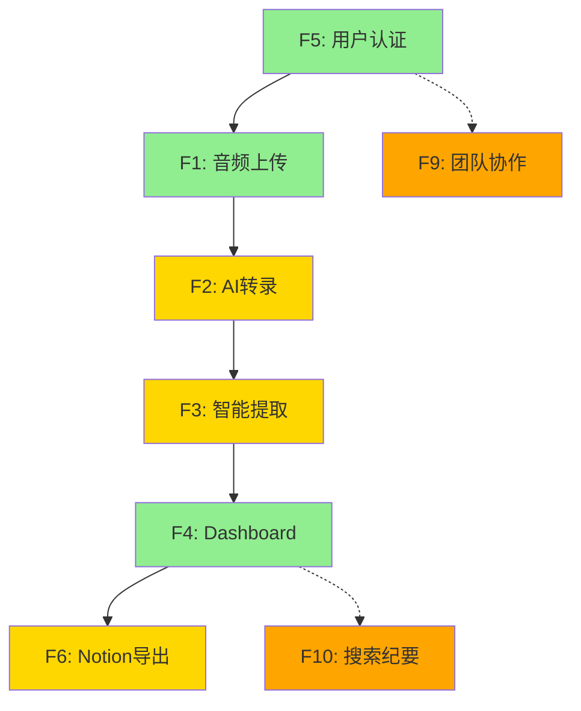

# 第五章:快速规划

> **本章导读**
>
> 学习如何使用ChatGPT Voice进行快速头脑风暴,掌握CodeGuideDev自动生成PRD的技巧,理解特性优先级规划方法,以及如何科学界定MVP范围。

---

## 5.1 ChatGPT Voice快速头脑风暴

### 为什么用语音而非文字?

**传统文字brainstorm的问题**:
- ⌨️ 打字速度慢,思维受限于输入速度
- 🧠 边想边写,打断思维流畅性
- 📝 过度关注措辞,而非核心想法
- ⏱️ 效率低:30分钟讨论需要1小时记录

**ChatGPT Voice的优势**:
- 🎤 **自然交流**: 像与真人对话,思维流畅
- ⚡ **快速迭代**: 语音输入比打字快3-5倍
- 🤔 **动态追问**: AI实时追问,帮助深度思考
- 📋 **自动记录**: 对话自动转文字,后续整理

---

### ChatGPT Voice Brainstorm工作流

#### 准备阶段(2分钟)

**工具准备**:
```
1. 打开ChatGPT移动应用或Web版(需Plus订阅)
2. 点击耳机图标启动Voice模式
3. 准备ideas.md草稿(可选,作为参考)
```

**心态准备**:
- ✅ **发散思维**: 不要自我审查,尽量表达
- ✅ **接受不完美**: 初期想法可以粗糙
- ✅ **让AI引导**: 当卡壳时,让AI提问

---

#### 阶段1: 问题探索(10-15分钟)

**目标**: 清晰定义要解决的问题

**对话脚本示例**:

```
👤 你: "我想做一个帮助开发者管理会议纪要的工具,但不确定具体方向"

🤖 ChatGPT: "很好的方向!让我帮你深入探索。首先,为什么专注于开发者这个群体?他们在会议纪要方面有什么特殊痛点吗?"

👤 你: "嗯,开发者开会很多,技术讨论、站会、评审...但记录很麻烦,事后经常忘记讨论的细节"

🤖 ChatGPT: "明白了。那么现在他们怎么处理会议记录?为什么现有方法不够好?"

👤 你: "有些人手动记Notion,但跟不上讨论节奏。也有Otter.ai这样的工具,但不够智能,只是简单转录,没有提取技术要点"

🤖 ChatGPT: "太好了!我听到了一个明确的差异化点:'智能提取技术要点',而不是简单转录。那让我们深入一下:开发者最需要从会议中提取什么样的技术信息?比如代码片段?架构决策?行动项?"

👤 你: "对!主要是架构决策、技术权衡(为什么选A不选B)、行动项(谁负责做什么)、还有关键的代码片段或API设计"

🤖 ChatGPT: "完美!这就给了我们一个清晰的价值主张:专为技术会议设计的智能纪要工具,自动识别并结构化提取架构决策、技术权衡、行动项和代码片段。现在让我们聊聊目标用户..."
```

**关键技巧**:
- ✅ **从模糊开始**: 不要试图一开始就讲清楚,让AI帮你澄清
- ✅ **回答AI的追问**: AI的问题通常很关键,认真思考回答
- ✅ **举例说明**: 用具体场景解释抽象概念

---

#### 阶段2: 用户画像(10分钟)

**目标**: 精准定义目标用户

**对话脚本示例**:

```
🤖 ChatGPT: "让我们明确目标用户。你说的'开发者'覆盖面很广,我们需要更具体。你认为最痛的用户是哪类开发者?"

👤 你: "我觉得是Tech Lead和架构师,因为他们经常主持技术评审会议,需要记录决策,还要同步给团队"

🤖 ChatGPT: "Tech Lead和架构师确实是好目标。他们通常在什么规模的团队?创业公司还是大企业?"

👤 你: "我想主要是创业公司和中型团队,10-50人的技术团队。大企业可能有专门的会议管理流程"

🤖 ChatGPT: "很好的判断。那么这些Tech Lead:
1. 每周开多少次技术会议?
2. 他们愿意为解决方案付费吗?大概什么价位?
3. 他们用什么工具管理文档?Notion?Confluence?"

👤 你: "通常每周2-3次技术会议,每次30分钟到1小时。付费的话...我觉得$15-20/月是合理的,类似Otter.ai的价格。文档工具,创业公司大多用Notion"

🤖 ChatGPT: "完美!我们现在有了清晰的用户画像:
- **角色**: Tech Lead / 架构师
- **团队规模**: 10-50人的创业公司/中型团队
- **使用频率**: 每周2-3次技术会议
- **支付意愿**: $15-20/月
- **工具生态**: Notion用户

这是一个可量化的细分市场。让我们继续探讨核心功能..."
```

**关键技巧**:
- ✅ **越具体越好**: "开发者"太宽泛,"Tech Lead in 10-50人团队"更精准
- ✅ **量化细节**: 频率、价格、团队规模都要数字
- ✅ **工具生态**: 了解用户现有工具,找到集成机会

---

#### 阶段3: 功能定义(15分钟)

**目标**: 列出MVP核心功能

**对话脚本示例**:

```
🤖 ChatGPT: "现在让我们定义MVP核心功能。我建议用5W1H方法:Who(谁), What(什么), When(何时), Where(哪里), Why(为何), How(如何)。从Who开始:Tech Lead录制了一个技术评审会议..."

👤 你: "对,他用手机或电脑录音,然后上传到我们的平台"

🤖 ChatGPT: "好的。What happens next? 系统做什么处理?"

👤 你: "系统用AI转录成文字,然后分析内容,提取架构决策、技术权衡、行动项这些结构化信息"

🤖 ChatGPT: "很好。那Where和When?结果在哪里查看?什么时候可以看到结果?"

👤 你: "结果在Web Dashboard查看,处理时间应该在1-2分钟内,这样用户可以会后立即查看"

🤖 ChatGPT: "完美。最后Why和How的差异化:为什么用户选你而不是Otter.ai? How你做得更好?"

👤 你: "因为我们专注技术会议,能识别代码、架构模式、技术术语。而且可以一键导出到Notion,格式已经结构化好了"

🤖 ChatGPT: "太棒了!我总结一下MVP核心功能:

**Must Have**:
1. 音频上传(支持MP3/WAV/M4A)
2. AI转录(使用Whisper API)
3. 智能分析:
   - 架构决策提取
   - 技术权衡分析(Pros/Cons)
   - 行动项识别(Who/What/When)
   - 代码片段提取
4. Web Dashboard展示结果
5. 导出到Notion(格式化)

**Should Have** (v1.1):
- 实时录音(浏览器内)
- 与Notion/Slack集成
- 团队协作(共享纪要)

**Won't Have** (MVP):
- 移动应用
- 视频会议实时转录
- 多语言支持(MVP只支持英文)

这个范围4周可以完成吗?"

👤 你: "Must Have功能应该可以,用Supabase + Vercel应该2-3周就能做出来"
```

**关键技巧**:
- ✅ **用5W1H**: 强制思考完整用户旅程
- ✅ **AI辅助分类**: 让AI帮忙区分Must/Should/Won't
- ✅ **立即评估可行性**: 讨论每个功能的实现难度

---

#### 阶段4: 商业模式(10分钟)

**对话脚本示例**:

```
🤖 ChatGPT: "功能清晰了,现在聊聊如何赚钱。你提到$15-20/月,这是订阅制对吧?"

👤 你: "对,月订阅。我在想要不要有免费层"

🤖 ChatGPT: "好问题。Freemium的优缺点:
- ✅ 优点: 降低试用门槛,病毒传播
- ❌ 缺点: 免费用户占用资源,转化率通常只有2-5%

你的边际成本高吗?每个用户的API调用成本是多少?"

👤 你: "用Whisper API转录,大概$0.006/分钟。GPT-4分析大概$0.02/次会议。一个月如果3次会议,成本约$0.10"

🤖 ChatGPT: "成本很低!那么Freemium是可行的。建议:
- **免费层**: 每月1次会议(验证价值)
- **基础版**: $15/月 - 10次会议
- **专业版**: $30/月 - 无限次会议 + Notion集成 + 团队协作

毛利率: ($15 - $0.30边际成本) / $15 = 98%,非常健康的SaaS模型。

盈亏平衡点:假设固定成本$100/月(Supabase + Vercel),只需7个付费用户。

目标第3个月:50个付费用户 → $750 MRR。可行吗?"

👤 你: "听起来合理!我觉得通过开发者社区(Reddit, Hacker News, Twitter)推广,3个月50个用户是realistic的"
```

**关键技巧**:
- ✅ **计算边际成本**: API调用费用要精确计算
- ✅ **定义盈亏平衡**: 知道需要多少用户才能cover成本
- ✅ **设定realistic目标**: 第3个月的用户数和MRR目标

---

#### 阶段5: 风险识别(5分钟)

**对话脚本示例**:

```
🤖 ChatGPT: "最后,让我们聊聊潜在风险。作为Devil's Advocate,我提几个问题:

1. 如果OpenAI大幅提价或限制API,怎么办?
2. 如果Zoom或Teams内置AI纪要功能,你的差异化在哪?
3. 技术会议的隐私和安全问题,企业客户会担心吗?"

👤 你: "这些都是真实风险...
1. OpenAI提价:我可以用Anthropic或本地模型做backup
2. 大公司竞争:我们更专注技术会议,理解开发者工作流,集成Notion等工具
3. 隐私:MVP先做个人用户,企业版本再考虑私有部署"

🤖 ChatGPT: "很好的应对思路!我建议在PRD中明确记录这些风险和缓解策略,避免后期被surprise。

现在你已经有了完整的brainstorm素材:
✅ 清晰的问题定义
✅ 精准的用户画像
✅ MVP功能范围(Must/Should/Won't)
✅ 商业模式和财务预测
✅ 风险识别和缓解

下一步,我建议用这些信息生成正式的PRD文档。你可以用CodeGuideDev或者让我帮你起草PRD框架?"

👤 你: "太好了!帮我起草PRD框架吧"
```

---

### Voice Brainstorm最佳实践

#### ✅ 做什么 (Do's)

1. **保持对话流畅**:
   - 像与朋友聊天,不要过度正式
   - 思考时说"让我想想...",AI会等待
   - 可以说"等等,我改一下刚才的想法"

2. **利用AI的结构化能力**:
   - 让AI帮你总结:"你能总结一下我们刚才讨论的核心要点吗?"
   - 让AI帮你分类:"把这些功能按MoSCoW分一下类"
   - 让AI挑战你:"你觉得这个想法有什么潜在问题?"

3. **记录关键决策**:
   - 在对话最后:"请把我们讨论的内容整理成Markdown格式的ideas.md"
   - 或者:"生成一个PRD大纲,包含我们讨论的所有要点"

4. **多轮迭代**:
   - 第一次通话:问题和用户(15分钟)
   - 第二次通话:功能和技术(15分钟)
   - 第三次通话:商业和风险(10分钟)

#### ❌ 不要做什么 (Don'ts)

1. **不要追求完美**:
   - ❌ "等我整理好想法再说"(永远不会开始)
   - ✅ "我有个粗略的想法,帮我一起完善"

2. **不要跳过细节**:
   - ❌ "就是一个任务管理工具"(太宽泛)
   - ✅ "帮助10-50人创业团队的Tech Lead管理技术会议纪要"

3. **不要忽视商业**:
   - ❌ 只讨论功能,不讨论商业模式
   - ✅ 同时讨论"用户会为此付费吗?多少钱?"

4. **不要独自脑暴**:
   - ❌ "我自己想清楚所有细节"(容易陷入思维盲区)
   - ✅ "让AI作为brainstorm partner,帮我发现盲点"

---

## 5.2 CodeGuideDev自动生成PRD

### 什么是CodeGuideDev?

**CodeGuideDev** (https://codeguide.dev) 是一个AI驱动的PRD生成工具,专为10xDevelopers工作流设计。

**核心能力**:
- 📝 自动生成完整的PRD文档
- 🎯 包含用户故事、验收标准、技术规范
- 🏗️ 生成项目结构和实施计划
- 🔄 与Lovable.dev无缝集成

---

### CodeGuideDev使用流程

#### 步骤1: 输入创意(5分钟)

**方式A: 从ideas.md导入**

```markdown
# 在CodeGuideDev界面

**Project Type**: SaaS Web Application

**Project Description**:
[粘贴你的ideas.md核心内容,或者总结为2-3段话]

例如:
"TechMeet是一个专为技术会议设计的AI纪要工具。目标用户是10-50人创业团队的Tech Lead和架构师,他们每周有2-3次技术评审、设计讨论等会议,需要高效记录架构决策、技术权衡和行动项。

核心功能:上传会议录音 → AI转录 → 智能提取技术要点(架构决策、技术权衡、行动项、代码片段) → 结构化展示 → 一键导出到Notion。

差异化:相比Otter.ai的简单转录,我们深度理解技术内容,能识别代码、架构模式、技术术语,并结构化输出。"

**Target Users**:
Tech Leads and Software Architects in 10-50 person startup teams

**Core Features** (MVP):
- Audio file upload (MP3/WAV/M4A)
- AI transcription with Whisper API
- Intelligent extraction: Architecture decisions, Technical trade-offs, Action items, Code snippets
- Web dashboard for viewing results
- Export to Notion with structured format

**Tech Stack Preferences**:
- Frontend: React + TypeScript + Tailwind CSS
- Backend: Supabase (Auth + Database + Storage)
- Deployment: Vercel
- AI: OpenAI Whisper + GPT-4
```

**方式B: 对话式输入**

CodeGuideDev也支持对话模式,类似ChatGPT Voice的体验:

```
CodeGuideDev: "Tell me about your project idea"

You: "It's an AI meeting notes tool for tech leads..."

CodeGuideDev: "Great! Who is the target user?"

You: "Tech leads in 10-50 person startups..."

[多轮对话后]

CodeGuideDev: "Based on our conversation, I'll generate a comprehensive PRD"
```

---

#### 步骤2: 配置PRD选项(2分钟)

**选择PRD模板**:
```
□ Minimal PRD (轻量级,适合solo developer)
☑ Standard PRD (推荐,包含所有核心章节)
□ Comprehensive PRD (详尽,适合团队协作)
```

**选择生成内容**:
```
☑ Product Requirements Document (PRD.md)
☑ User Stories (user-stories.md)
☑ Acceptance Criteria (acceptance-criteria.md)
☑ Feature Priorities (feature-priorities.md - MoSCoW)
☑ Tech Stack Recommendations (tech-stack.md)
☑ Implementation Plan (implementation-plan.md)
□ API Specification (api-spec.md) - 可选,后续生成
□ Database Schema (data-models.md) - 可选,后续生成
```

**额外配置**:
```
MVP Timeline: 4 weeks
Team Size: 1-2 developers
Budget: < $100/month (for MVP infrastructure)
```

---

#### 步骤3: 生成PRD(1-2分钟)

点击"Generate PRD"按钮,CodeGuideDev会:

1. **分析输入**: 理解项目背景和需求
2. **生成结构**: 创建完整的DDAD文档结构
3. **填充内容**: 基于最佳实践生成详细内容
4. **验证一致性**: 确保各文档之间的一致性

**输出示例** (PRD.md主要章节):

```markdown
# TechMeet - 产品需求文档 (PRD)

## 1. 产品概述

### 1.1 产品愿景
TechMeet是一个专为技术会议设计的AI纪要工具,帮助Tech Lead和架构师将会议记录时间从30分钟减少到2分钟,同时提取结构化的技术要点。

### 1.2 目标用户
**主要用户**: Tech Lead / 软件架构师
- 团队规模: 10-50人的创业公司或中型团队
- 使用频率: 每周2-3次技术会议
- 技术栈: 通常使用Notion/Confluence管理文档
- 支付能力: 愿意为生产力工具付费$15-20/月

### 1.3 核心价值主张
"帮助Tech Lead通过AI自动生成技术会议纪要,将记录时间从30分钟减少到2分钟,并智能提取架构决策、技术权衡和行动项"

---

## 2. 市场分析

### 2.1 市场规模
- **TAM**: 全球~270万开发者使用Notion (2024估算)
- **SAM**: 英语市场Tech Lead ~50万人
- **SOM**: 第一年目标 1000人 → $15K MRR

### 2.2 竞品分析
| 竞品 | 优势 | 劣势 | 我们的差异化 |
|------|-----|------|-------------|
| Otter.ai | 品牌知名,功能完善 | 通用工具,不理解技术内容 | 专注技术会议,识别代码和架构模式 |
| Fireflies.ai | CRM集成好 | 面向销售会议 | 面向技术会议,Notion深度集成 |
| 手动记录 | 免费,可控 | 耗时,容易遗漏 | AI自动化,结构化输出 |

---

## 3. 功能需求

### 3.1 核心功能 (Must Have - MVP)

#### F1: 音频文件上传
**描述**: 用户可以上传会议录音文件
**验收标准**:
- [ ] 支持MP3, WAV, M4A格式
- [ ] 文件大小限制: 最大200MB(~2小时会议)
- [ ] 上传进度显示
- [ ] 上传失败有错误提示和重试机制
**优先级**: P0 (Critical)
**估时**: 0.5天

#### F2: AI转录
**描述**: 使用Whisper API将音频转录为文字
**验收标准**:
- [ ] 转录准确率 > 90%
- [ ] 处理时间 < 音频时长(例:30分钟音频在30分钟内完成)
- [ ] 支持英文(MVP阶段)
- [ ] 自动断句和标点
- [ ] 转录失败有错误处理
**技术实现**: OpenAI Whisper API (whisper-1模型)
**优先级**: P0
**估时**: 1天

#### F3: 智能内容提取
**描述**: 从转录文本中提取技术要点
**验收标准**:
- [ ] 识别并提取架构决策(Architecture Decisions)
- [ ] 识别技术权衡(Technical Trade-offs: Pros vs Cons)
- [ ] 识别行动项(Action Items: Who, What, When)
- [ ] 识别代码片段和API讨论
- [ ] 提取关键技术术语
**技术实现**: GPT-4 with custom prompt engineering
**优先级**: P0
**估时**: 2天

[... 更多功能详细描述]

---

## 4. 用户故事

### US-001: 上传并转录会议录音
**作为** Tech Lead
**我想要** 上传会议录音并自动转录
**以便于** 我不用手动记录会议内容

**验收标准**:
- 我可以拖拽上传音频文件
- 系统显示上传进度
- 转录完成后我收到通知(邮件或页面提示)
- 我可以看到完整的转录文本

### US-002: 查看结构化纪要
**作为** Tech Lead
**我想要** 看到结构化的会议纪要
**以便于** 快速了解会议的关键决策和行动项

**验收标准**:
- 纪要分为明确的章节:架构决策、技术权衡、行动项
- 每个行动项标注负责人和截止日期(如果会议中提到)
- 代码片段高亮显示
- 技术术语可点击查看定义(可选,v1.1)

[... 更多用户故事]

---

## 5. 非功能需求

### 5.1 性能需求
- 转录速度: < 音频时长(30分钟音频在30分钟内完成)
- 页面加载: < 2秒
- API响应时间: < 500ms (查询纪要)

### 5.2 安全需求
- 用户认证: 邮箱+密码,密码bcrypt加密
- 数据加密: HTTPS传输,数据库存储加密
- 文件隔离: RLS确保用户只能访问自己的文件
- API速率限制: 每用户每小时最多10次转录请求

### 5.3 可扩展性
- 支持0-1000用户无需架构调整
- Supabase + Vercel自动扩展

### 5.4 可用性
- 系统可用性: > 99.5% (依赖Supabase和Vercel SLA)
- 错误率: < 0.1%

---

## 6. 技术架构

### 6.1 推荐技术栈
**前端**:
- React 18 + TypeScript
- Tailwind CSS + Shadcn/ui
- React Query (数据获取)
- Zustand (状态管理)

**后端**:
- Supabase (PostgreSQL + Auth + Storage)
- Supabase Edge Functions (如需要)

**第三方API**:
- OpenAI Whisper API (转录)
- OpenAI GPT-4 (内容提取)

**部署**:
- Vercel (前端 + Edge Functions)
- Supabase (数据库和认证)

### 6.2 数据模型(概要)
```
users (Supabase Auth)
  ↓
meetings
  - id (uuid)
  - user_id (fk)
  - audio_file_url (text)
  - transcript (text)
  - created_at (timestamp)
  ↓
meeting_insights
  - id (uuid)
  - meeting_id (fk)
  - type (enum: decision, tradeoff, action_item, code_snippet)
  - content (jsonb)
  - created_at (timestamp)
```

---

## 7. 实施计划

### 7.1 MVP时间线 (4周)

**Week 1: 基础设施和UI原型**
- Day 1-2: Supabase项目设置,数据库schema
- Day 3-5: Lovable.dev构建UI原型(上传页面、Dashboard)
- Day 6-7: 用户认证实现(Supabase Auth)

**Week 2: 核心功能开发**
- Day 8-10: 音频上传和Supabase Storage集成
- Day 11-14: Whisper API集成,转录功能

**Week 3: AI智能提取**
- Day 15-18: GPT-4 prompt engineering,内容提取
- Day 19-21: Dashboard展示结构化纪要

**Week 4: 测试和部署**
- Day 22-24: E2E测试,bug修复
- Day 25-26: Notion导出功能
- Day 27-28: Vercel部署,生产环境配置

---

## 8. 成功指标 (KPIs)

### 8.1 MVP阶段目标(前3个月)
- **注册用户**: 100人
- **活跃用户**: 30人 (WAU > 30%)
- **付费用户**: 10人
- **MRR**: $150
- **转录次数**: 100+ times
- **用户留存(M2)**: > 40%

### 8.2 核心指标定义
- **激活**: 用户完成第一次会议转录
- **活跃**: 每周至少转录1次会议
- **付费转化**: 从注册到付费 < 7天

---

## 9. 风险评估

### 9.1 技术风险
| 风险 | 影响 | 概率 | 缓解策略 |
|------|-----|------|---------|
| OpenAI API不稳定 | 高 | 中 | 实现重试机制,考虑Anthropic备选 |
| 转录准确率不达标 | 高 | 低 | Whisper准确率已验证>90%,可接受 |
| 成本超预期 | 中 | 低 | 严格监控API调用,设置用量上限 |

### 9.2 市场风险
| 风险 | 影响 | 概率 | 缓解策略 |
|------|-----|------|---------|
| 市场需求不足 | 高 | 中 | MVP阶段与10个潜在用户深度访谈验证 |
| 大公司推出类似功能 | 高 | 中 | 专注细分市场,强化技术会议特性和Notion集成 |
| 获客成本过高 | 中 | 中 | 利用开发者社区(Reddit, HN)有机增长 |

---

## 10. 后续路线图

### V1.1 (第5-6周)
- 实时录音功能(浏览器内)
- 与Slack集成(会议纪要自动发送到Slack)
- 团队协作(共享纪要)

### V1.2 (第7-8周)
- 多语言支持(中文、日文)
- 搜索历史纪要
- 会议模板(快速创建常见会议类型)

### V2.0 (第3-6个月)
- 视频会议集成(Zoom, Google Meet)
- 企业功能(SSO, 审计日志)
- 高级分析(会议效率报告)
```

---

#### 步骤4: Review和调整(10-15分钟)

CodeGuideDev生成PRD后,你需要:

**检查清单**:
```markdown
□ 产品概述和价值主张清晰吗?
□ 目标用户描述够具体吗?
□ 核心功能的验收标准完整吗?
□ 技术栈选择合理吗?
□ 实施计划的时间估算realistic吗?
□ 风险识别全面吗?
□ KPI目标可量化和可达成吗?
```

**常见调整**:

1. **功能范围太大**:
   - 问题: Must Have功能超过10个
   - 调整: 让AI重新评估,将部分功能降级到Should Have

2. **技术栈不匹配**:
   - 问题: 推荐的技术栈你不熟悉
   - 调整: 在"Tech Stack Preferences"中明确你的偏好

3. **时间估算过于乐观**:
   - 问题: 4周MVP包含太多功能
   - 调整: 砍掉部分Should Have,确保MVP可在4周完成

**调整方法**:
```
# 在CodeGuideDev界面

"Please revise the PRD based on the following feedback:
1. Move 'Real-time recording' from Must Have to Should Have
2. Change tech stack from Node.js to Supabase Edge Functions
3. Extend MVP timeline from 4 weeks to 5 weeks
4. Add more detail to the 'Intelligent Content Extraction' feature"

[CodeGuideDev重新生成调整后的PRD]
```

---

#### 步骤5: 导出和整理(5分钟)

**导出选项**:
```
1. Download as Markdown files (推荐)
   - 得到docs/目录结构的所有文件
   - 直接复制到项目中

2. Export to Notion
   - 一键导入到Notion workspace

3. Generate GitHub repo
   - 创建完整的GitHub仓库,包含PRD和项目结构

4. Send to Lovable.dev
   - 直接将PRD发送到Lovable开始UI开发
```

**推荐工作流**:
```bash
# 1. 下载生成的文件到本地
# 得到的文件结构:
docs/
├── 01-requirements/
│   ├── PRD.md
│   ├── user-stories.md
│   ├── acceptance-criteria.md
│   └── feature-priorities.md
├── 02-design/
│   └── tech-stack.md
└── 03-implementation/
    └── implementation-plan.md

# 2. 复制到你的项目
cp -r docs/ /path/to/your-project/docs/

# 3. 初始化Git仓库(如果还没有)
cd /path/to/your-project
git init
git add docs/
git commit -m "docs: add initial PRD and planning documents

Generated with CodeGuideDev based on TechMeet project idea"

# 4. 创建CLAUDE.md(AI协作上下文)
# 将PRD核心内容总结到CLAUDE.md
```

---

## 5.3 特性优先级规划 (feature-priorities.md)

### MoSCoW矩阵详细展开

CodeGuideDev会自动生成`feature-priorities.md`,但你可能需要进一步细化:

**feature-priorities.md模板**:

```markdown
# Feature Priorities (MoSCoW Method)

## MVP Scope: Version 1.0 (Week 1-4)

### Must Have (P0 - Critical)
如果缺少这些功能,产品核心价值无法实现

| ID | Feature | User Story | Effort | Risk | Dependency |
|----|---------|------------|--------|------|-----------|
| F1 | 音频上传 | US-001 | S (0.5d) | Low | None |
| F2 | AI转录 | US-001 | M (1d) | Medium | F1, Whisper API |
| F3 | 智能提取 | US-002 | L (2d) | Medium | F2, GPT-4 API |
| F4 | Web Dashboard | US-002 | M (1.5d) | Low | F3 |
| F5 | 用户认证 | US-003 | S (0.5d) | Low | Supabase Auth |
| F6 | 导出Notion | US-004 | M (1d) | Medium | F4, Notion API |

**Total Effort**: 6.5 developer-days
**Expected Duration**: 2-3 weeks (with buffer)

---

### Should Have (P1 - Important)
重要功能,但v1.0可以没有,v1.1添加

| ID | Feature | User Story | Effort | Why Not MVP | Target Version |
|----|---------|------------|--------|-------------|---------------|
| F7 | 实时录音 | US-005 | M (1.5d) | 需要浏览器权限,可能影响UX | v1.1 (Week 5-6) |
| F8 | Slack集成 | US-006 | S (0.5d) | 非核心,可手动分享 | v1.1 |
| F9 | 团队协作 | US-007 | L (3d) | 增加复杂度,先验证个人需求 | v1.1-v1.2 |
| F10 | 搜索纪要 | US-008 | M (1d) | 前期数据量小,手动查找可行 | v1.2 |

---

### Could Have (P2 - Nice to Have)
锦上添花,资源允许才做

| ID | Feature | Effort | Why Deprioritized | Target Version |
|----|---------|--------|-------------------|---------------|
| F11 | 深色模式 | XS (0.3d) | 非功能性,优先级低 | v1.2+ |
| F12 | 会议分析 | L (2d) | 需要足够数据积累 | v2.0 |
| F13 | 语音播报 | M (1.5d) | 边缘功能,需求不明确 | Future |
| F14 | 自定义模板 | M (1d) | 过早优化 | v2.0+ |

---

### Won't Have (This Version)
明确不做,避免范围蔓延

| ID | Feature | Why Not | Possible Future |
|----|---------|---------|----------------|
| F15 | 移动原生应用 | MVP先做Web,验证需求后再考虑 | v2.0+ if demand |
| F16 | 视频会议实时转录 | 技术复杂度高,API成本高 | v2.0+ with optimization |
| F17 | 多语言支持 | MVP英文足够,国际化v1.1考虑 | v1.2 (中文、日文) |
| F18 | 企业SSO | 面向个人用户,企业功能后期 | v2.0 Enterprise |
| F19 | 白标定制 | 超出MVP范围,SaaS模式优先 | Not planned |
| F20 | 区块链存储 | 过度工程,无实际价值 | Not planned |

---

## Priority Decision Matrix

### Effort vs Impact
```
高影响
  ↑
  │ F3 (智能提取)  │ F6 (Notion导出)
  │ F2 (AI转录)    │ F7 (实时录音)
  ├────────────────┼─────────────────
  │ F9 (团队协作)  │ F1 (音频上传)
  │ F12 (会议分析) │ F4 (Dashboard)
  │ F16 (实时转录) │ F5 (用户认证)
  └────────────────┴─────────────────→
 低工作量                        高工作量

优先级排序:
1. 高影响 + 低/中工作量 (F1, F2, F4, F5, F6) → Must Have
2. 高影响 + 高工作量 (F3) → Must Have (核心价值)
3. 中影响 + 低/中工作量 (F7, F8) → Should Have
4. 其他 → Could Have or Won't Have
```

---

## Implementation Sequencing

### Week-by-Week Breakdown

**Week 1: Foundation**
- Day 1-2: F5 (用户认证) + F1 (音频上传UI)
- Day 3-5: F1 (完整上传功能,含Supabase Storage)
- Day 6-7: F4 (Dashboard基础结构)

**Week 2: Core AI**
- Day 8-10: F2 (Whisper API集成,转录)
- Day 11-14: F3 (GPT-4智能提取 - 最关键最复杂)

**Week 3: Polish & Export**
- Day 15-17: F4 (Dashboard完善,展示结构化纪要)
- Day 18-21: F6 (Notion导出功能)

**Week 4: Testing & Launch**
- Day 22-24: E2E测试,bug修复
- Day 25-26: 性能优化
- Day 27-28: 部署和上线准备

---

## Risk-Based Prioritization

### Technical Risks
| Feature | Technical Risk | Mitigation | Priority Adjustment |
|---------|---------------|-----------|---------------------|
| F2 (AI转录) | Medium (API稳定性) | 实现重试和fallback | 保持Must Have,早期验证 |
| F3 (智能提取) | Medium (Prompt质量) | 多轮测试和优化 | Must Have,预留充足时间 |
| F6 (Notion导出) | Medium (API文档) | 提前研究Notion API | Must Have,但可简化 |
| F7 (实时录音) | High (浏览器兼容) | 延后到v1.1,充分测试 | Should Have → v1.1 |

---

## Feature Dependencies



Legend:
- 绿色 (Must Have, Low Risk)
- 黄色 (Must Have, Medium Risk)
- 橙色 (Should Have)

---

## Change Management

### How to Add/Remove Features

**Adding a Feature**:
1. 评估与现有功能的依赖关系
2. 估算开发工作量(XS/S/M/L)
3. 确定优先级(Must/Should/Could/Won't)
4. 更新Implementation Plan和Timeline
5. 通知团队(如有)并更新CLAUDE.md

**Removing a Feature**:
1. 确认没有其他功能依赖它
2. 记录移除原因(在Won't Have章节)
3. 评估对Timeline的影响
4. 更新所有相关文档

---

## Decision Log

### 2025-10-12: Initial Prioritization
- 确定F1-F6为Must Have
- F7-F10延后到v1.1
- F16(视频实时转录)从Should Have降级到Won't Have (原因:技术复杂度和成本过高)

### [Date]: [Decision]
[记录优先级变更和原因]
```

---

## 5.4 MVP范围界定

### MVP范围的黄金法则

#### 法则1: 80/20原则

**帕累托法则**: 80%的用户价值来自20%的功能

**应用方法**:
```markdown
## 识别核心20%功能

1. 列出所有想到的功能(brainstorm阶段)
2. 为每个功能评分:
   - 用户价值(1-5分): 这个功能对用户有多重要?
   - 实现成本(1-5分): 开发难度和时间
   - 差异化(1-5分): 是否是你的独特价值?

3. 计算优先级分数: (用户价值 × 2 + 差异化) / 实现成本

4. 选择分数最高的20%功能作为Must Have
```

**示例: TechMeet功能评分**

| 功能 | 用户价值 | 实现成本 | 差异化 | 优先级分数 | 入选MVP? |
|------|---------|---------|--------|-----------|---------|
| 音频上传 | 5 | 2 | 3 | (10+3)/2 = 6.5 | ✅ Must |
| AI转录 | 5 | 3 | 4 | (10+4)/3 = 4.7 | ✅ Must |
| 智能提取 | 5 | 4 | 5 | (10+5)/4 = 3.75 | ✅ Must (差异化关键) |
| Notion导出 | 4 | 2 | 4 | (8+4)/2 = 6.0 | ✅ Must |
| 实时录音 | 3 | 4 | 2 | (6+2)/4 = 2.0 | ❌ Should (v1.1) |
| 团队协作 | 3 | 5 | 2 | (6+2)/5 = 1.6 | ❌ Should (v1.1) |
| 深色模式 | 2 | 1 | 1 | (4+1)/1 = 5.0 | ❌ Could (虽然分数高,但非功能性) |

---

#### 法则2: Single User Journey

**定义**: MVP必须支持**一个完整的用户旅程**,从开始到结束

**TechMeet的核心用户旅程**:
```
1. 用户注册/登录
   ↓
2. 上传会议录音
   ↓
3. AI自动转录和分析
   ↓
4. 查看结构化纪要
   ↓
5. 导出到Notion
   ↓
[完成! 用户获得价值]
```

**反例 - 不完整的用户旅程**:
```
❌ 错误的MVP:
- 只有上传和转录,没有智能提取 → 用户无法获得差异化价值
- 有智能提取,但无法导出 → 用户无法在实际工作流中使用
```

**检验方法**:
```markdown
## User Journey Completeness Check

- [ ] 用户可以独立完成整个流程(无需手动workaround)
- [ ] 每一步都有明确的下一步行动
- [ ] 流程结束时,用户获得了承诺的核心价值
- [ ] 没有"TODO:后续实现"的关键步骤
```

---

#### 法则3: Time Box (时间盒)

**定义**: 固定时间(通常4周),倒逼功能削减

**时间盒方法**:
```markdown
## 4周时间盒分配

Week 1 (基础):
- 可用时间: 5天 × 8小时 = 40小时
- 预留buffer: 20% = 8小时
- 实际开发: 32小时
- 分配: 认证(4h) + 上传UI(12h) + 存储集成(16h)

Week 2 (核心AI):
- 实际开发: 32小时
- 分配: Whisper集成(16h) + GPT-4提取(16h)

Week 3 (展示和导出):
- 实际开发: 32小时
- 分配: Dashboard(16h) + Notion导出(16h)

Week 4 (测试和部署):
- 实际开发: 32小时
- 分配: E2E测试(16h) + 部署和优化(16h)

Total: 128 developer-hours for MVP
```

**如果超时怎么办?**
```
Week 2结束时评估:
- 如果进度落后 > 20%:
  1. 削减功能(例:将Notion导出简化为Markdown下载)
  2. 或延长1周(但要有明确理由)
  3. 不要降低质量标准(测试覆盖率等)
```

---

#### 法则4: Feature Creep Prevention (防止功能蔓延)

**功能蔓延的常见来源**:
1. **内部想法**: "这个功能很简单,顺便加上吧"
2. **早期用户反馈**: "能不能加个XX功能?"
3. **竞品对比**: "竞争对手有XX,我们也要有"

**防御策略**:

**策略1: Feature Freeze Date**
```markdown
## Feature Freeze Policy

MVP Feature Freeze: Week 1结束时

规则:
- Week 1后,任何新功能都自动归入v1.1
- 已有功能可以优化,但不能添加新的大功能
- 例外: 严重阻碍核心用户旅程的bug fix
```

**策略2: New Feature Request Template**
```markdown
## 新功能请求评估

**功能描述**: [简短描述]

**请求来源**:
□ 内部团队想法
□ 用户直接反馈
□ 竞品对比
□ 数据洞察

**评估问题**:
1. 这个功能是否是核心用户旅程的必需部分? 是/否
2. 没有这个功能,用户能完成核心任务吗? 是/否
3. 这个功能的实现成本(天)? ___
4. 是否可以通过workaround临时解决? 是/否

**决策**:
- 如果Q1=是 AND Q2=否 → 考虑加入MVP
- 如果Q4=是 → 推迟到v1.1
- 其他情况 → 默认v1.1或更晚

**最终决定**: MVP / v1.1 / v1.2 / Won't Have
**决策人**: [姓名]
**决策日期**: [日期]
```

**策略3: Minimal Viable Implementation**
```
即使是Must Have功能,也要追求最小可行实现

示例:
功能: 导出到Notion
❌ 完整实现:
  - OAuth授权
  - 选择workspace和page
  - 自定义格式和模板
  - 双向同步

✅ MVP实现:
  - 生成Notion-friendly Markdown
  - 用户手动复制粘贴到Notion
  - (OAuth集成v1.1再做)

节省时间: 从3天减少到0.5天
```

---

## 5.5 本章小结

快速规划阶段的核心要点:

1. **ChatGPT Voice头脑风暴**:
   - 语音比文字快3-5倍,思维更流畅
   - 分阶段brainstorm:问题探索→用户画像→功能定义→商业模式→风险
   - 让AI作为partner,帮助发现盲点和深度思考
   - 总时长40-60分钟,可分多次进行

2. **CodeGuideDev自动生成PRD**:
   - 输入创意 → 配置选项 → 生成PRD → Review调整 → 导出
   - 自动生成完整DDAD文档体系(PRD, user-stories, acceptance-criteria等)
   - 2-5分钟生成初稿,10-15分钟review和调整
   - 支持导出到Markdown/Notion/GitHub/Lovable

3. **特性优先级规划(MoSCoW)**:
   - Must Have: 核心用户旅程必需(通常5-8个功能)
   - Should Have: 重要但v1.0可以没有
   - Could Have: 锦上添花
   - Won't Have: 明确不做,记录原因
   - 使用Effort vs Impact矩阵辅助决策

4. **MVP范围界定四大法则**:
   - 80/20原则: 20%功能提供80%价值
   - Single User Journey: 支持一个完整用户旅程
   - Time Box: 4周固定时间,倒逼功能削减
   - Feature Creep Prevention: Feature Freeze + Request Template

**关键洞察**:
> "规划阶段的目标不是想清楚所有细节,而是快速建立一个'足够好'的方向,然后立即开始验证。用ChatGPT Voice快速brainstorm,用CodeGuideDev快速生成PRD,省下的时间用于实际构建和用户验证。"

**实践建议**:
1. **今天就开始**: 打开ChatGPT Voice,花30分钟brainstorm你的想法
2. **生成初稿PRD**: 用CodeGuideDev或ChatGPT生成第一版PRD
3. **严格MoSCoW**: 强制只保留Must Have功能,其他全部Should/Could/Won't
4. **Feature Freeze**: Week 1结束时冻结功能列表,专注实现

**下一章**: 我们将学习如何将PRD进一步细化为详细的需求文档,包括用户故事编写、验收标准定义,以及非功能需求识别。

---

**思考题**:
1. 如果用ChatGPT Voice为你的项目brainstorm,你会先从哪个阶段开始?(问题/用户/功能/商业?)
2. 你的MVP功能列表有多少个Must Have?能否用80/20原则再削减一半?
3. 你的MVP范围是否支持一个完整的用户旅程?还是有"TODO:后续实现"的关键步骤?

👉 [下一章:需求细化](chapter6-requirements.md)
