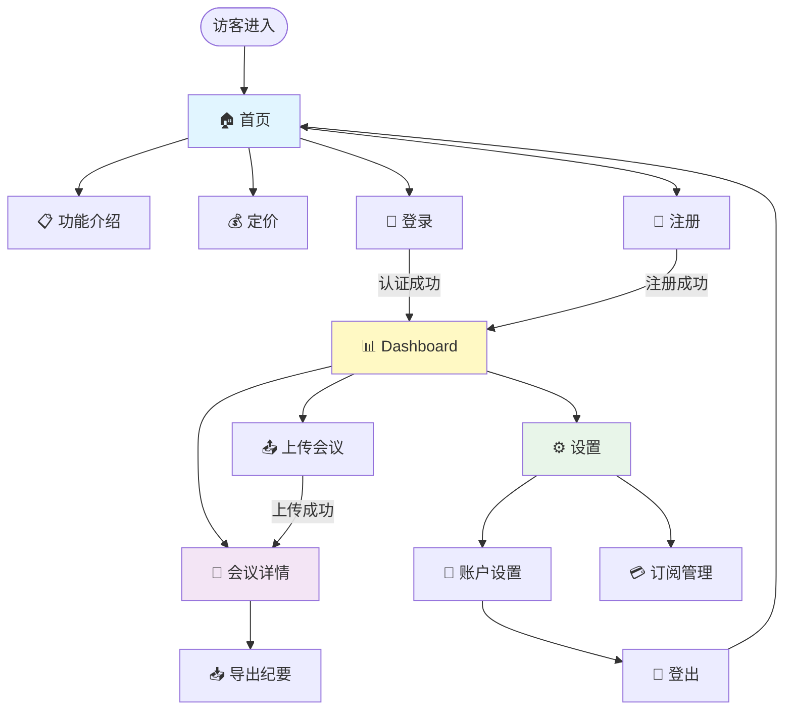

# 第八章:应用流程设计

> **本章导读**
>
> 深入学习站点地图设计的系统方法,掌握Lovable.dev快速UI原型技术,理解用户旅程映射的实践应用,以及响应式设计规划的最佳实践。

---

## 8.1 站点地图设计 (app-sitemap.md)

### 什么是站点地图?

**站点地图(Sitemap)**是应用的信息架构蓝图,定义了所有页面、它们的层级关系和导航路径。

**为什么重要?**
- 🎯 **清晰导航**: 用户和AI都能理解应用结构
- 🔄 **避免迷路**: 每个页面都有明确的位置和路径
- 📊 **范围控制**: 可视化所有页面,防止功能膨胀
- 🤖 **AI友好**: AI可以根据sitemap生成完整的路由和导航代码

---

### 站点地图设计三个层次

#### 层次1: 信息架构(Information Architecture)

**目标**: 组织内容和功能的逻辑结构

**设计原则**:
```
用户心智模型 > 技术实现便利
深度 ≤ 3层 (首页 → 分类 → 详情)
每层选项 ≤ 7个 (认知负荷限制)
关键功能 ≤ 3次点击可达
```

**信息架构模式**:

| 模式 | 适用场景 | 示例 |
|------|---------|------|
| **层级结构** (Hierarchy) | 清晰分类,自上而下 | 电商网站: 首页 → 分类 → 商品 |
| **序列结构** (Sequential) | 线性流程,步骤固定 | 注册流程: 信息 → 验证 → 完成 |
| **矩阵结构** (Matrix) | 多维度筛选 | 旅游网站: 按目的地/日期/类型筛选 |
| **数据库结构** (Database) | 自由搜索,动态导航 | 搜索引擎,知识库 |
| **Hub-Spoke** | 中心页面辐射 | Dashboard → 各功能模块 |

**案例: TechMeet会议纪要应用的信息架构**:

```
TechMeet应用
├── 公开区域 (Unauthenticated)
│   ├── 首页 (Landing Page) - 价值主张展示
│   ├── 功能介绍 (Features) - 核心功能说明
│   ├── 定价 (Pricing) - 订阅计划
│   └── 登录/注册 (Auth) - 用户入口
│
└── 应用区域 (Authenticated)
    ├── Dashboard - 会议纪要列表
    │   ├── 最近会议 (Recent)
    │   ├── 收藏会议 (Starred)
    │   └── 存档会议 (Archived)
    │
    ├── 上传会议 (Upload)
    │   ├── 文件上传
    │   └── 实时录音 (v1.1)
    │
    ├── 会议详情 (Meeting Detail)
    │   ├── 转录文本 (Transcript)
    │   ├── 架构决策 (Architecture Decisions)
    │   ├── 技术权衡 (Trade-offs)
    │   ├── 行动项 (Action Items)
    │   └── 导出选项 (Export to Notion/Markdown)
    │
    └── 设置 (Settings)
        ├── 账户设置 (Account)
        ├── 订阅管理 (Subscription)
        └── API密钥 (API Keys)
```

**信息架构验证清单**:
```markdown
- [ ] 每个页面都有明确的用户目标
- [ ] 导航路径符合用户心智模型
- [ ] 深度不超过3层
- [ ] 每层选项不超过7个
- [ ] 关键功能3次点击可达
- [ ] 有明确的"首页"和"后退"路径
- [ ] 没有孤岛页面(无法导航到)
```

---

#### 层次2: 页面层级(Page Hierarchy)

**目标**: 定义页面之间的父子关系和导航规则

**Next.js文件系统路由映射**:

```
app/
├── (marketing)/              # 公开页面路由组
│   ├── page.tsx              # / (首页)
│   ├── features/
│   │   └── page.tsx          # /features
│   ├── pricing/
│   │   └── page.tsx          # /pricing
│   └── layout.tsx            # 公开页面布局
│
├── (auth)/                   # 认证页面路由组
│   ├── login/
│   │   └── page.tsx          # /login
│   ├── register/
│   │   └── page.tsx          # /register
│   └── layout.tsx            # 认证页面布局
│
└── (app)/                    # 应用页面路由组(需认证)
    ├── dashboard/
    │   └── page.tsx          # /dashboard
    ├── upload/
    │   └── page.tsx          # /upload
    ├── meetings/
    │   └── [id]/
    │       └── page.tsx      # /meetings/[id]
    ├── settings/
    │   ├── account/
    │   │   └── page.tsx      # /settings/account
    │   └── subscription/
    │       └── page.tsx      # /settings/subscription
    └── layout.tsx            # 应用页面布局(含导航栏)
```

**页面元数据定义**:

```markdown
## 页面清单

### P1: 首页 (Landing Page)
- **路由**: `/`
- **权限**: 公开
- **目标**: 吸引用户注册
- **关键元素**: Hero section, 功能展示, CTA按钮
- **导航**:
  - 主导航: Features, Pricing, Login
  - CTA: "开始免费试用" → /register

### P2: Dashboard
- **路由**: `/dashboard`
- **权限**: 需认证
- **目标**: 查看和管理会议纪要
- **关键元素**: 会议列表, 搜索, 筛选, 上传按钮
- **导航**:
  - 顶部导航: Dashboard, Upload, Settings
  - 面包屑: Dashboard
  - 列表项: 点击 → /meetings/[id]

### P3: 会议详情 (Meeting Detail)
- **路由**: `/meetings/[id]`
- **权限**: 需认证,且为自己的会议
- **目标**: 查看完整纪要和导出
- **关键元素**: 转录文本, 结构化纪要, 导出按钮
- **导航**:
  - 面包屑: Dashboard → [会议标题]
  - 后退按钮: → /dashboard
  - 相关会议: → /meetings/[other-id]

[... 继续定义所有页面]
```

---

#### 层次3: 导航系统(Navigation System)

**目标**: 定义全局和局部导航组件

**导航类型**:

| 导航类型 | 用途 | 位置 | 示例 |
|---------|-----|------|------|
| **全局导航** (Global Nav) | 主要功能入口 | 顶部/侧边 | Dashboard, Upload, Settings |
| **面包屑** (Breadcrumbs) | 当前位置和上级路径 | 页面顶部 | Dashboard > 会议详情 |
| **本地导航** (Local Nav) | 页面内部导航 | 页面左侧/标签 | 转录 / 架构决策 / 行动项 |
| **分页导航** (Pagination) | 大量数据浏览 | 内容底部 | 上一页 / 下一页 |
| **相关导航** (Related Nav) | 推荐内容 | 侧边栏 | 相关会议 |
| **步骤导航** (Stepper) | 多步骤流程 | 顶部 | 步骤1 → 步骤2 → 步骤3 |

**导航组件设计**:

```typescript
// components/Navigation/GlobalNav.tsx
interface NavItem {
  label: string;
  href: string;
  icon: React.ComponentType;
  badge?: number; // 通知数量
  requiresAuth: boolean;
}

const navItems: NavItem[] = [
  { label: 'Dashboard', href: '/dashboard', icon: HomeIcon, requiresAuth: true },
  { label: 'Upload', href: '/upload', icon: UploadIcon, requiresAuth: true },
  { label: 'Settings', href: '/settings', icon: SettingsIcon, requiresAuth: true },
];

// 面包屑自动生成
// /meetings/abc123 → Dashboard > 会议详情
function generateBreadcrumbs(pathname: string) {
  const segments = pathname.split('/').filter(Boolean);
  return segments.map((segment, index) => ({
    label: getBreadcrumbLabel(segment), // "meetings" → "会议管理"
    href: '/' + segments.slice(0, index + 1).join('/'),
  }));
}
```

---

### app-sitemap.md标准模板

**文件位置**: `docs/02-design/app-sitemap.md`

```markdown
# 应用站点地图 (App Sitemap)

## 1. 信息架构概览

**应用类型**: SaaS Web应用
**目标用户**: Tech Lead和开发者
**核心流程**: 上传 → 转录 → 分析 → 查看 → 导出

### 高层结构

```
TechMeet
├── 🌐 公开区域 (Marketing Site)
│   ├── 首页 (/)
│   ├── 功能 (/features)
│   ├── 定价 (/pricing)
│   ├── 登录 (/login)
│   └── 注册 (/register)
│
└── 🔒 应用区域 (Authenticated App)
    ├── Dashboard (/dashboard)
    ├── 上传 (/upload)
    ├── 会议详情 (/meetings/[id])
    └── 设置 (/settings)
```

---

## 2. 详细页面清单

### 公开区域 (无需认证)

#### P1: 首页 (Landing Page)
- **路由**: `/`
- **文件**: `app/(marketing)/page.tsx`
- **目标**: 吸引用户注册
- **关键元素**:
  - Hero section: 价值主张 + CTA
  - Features section: 核心功能展示(3-4个)
  - Social proof: 用户评价或案例
  - Pricing teaser: 定价简介
  - Final CTA: "开始免费试用"
- **导航**:
  - 顶部: Logo, Features, Pricing, Login, Sign Up
  - Footer: 关于, 支持, 隐私政策, 条款
- **SEO**:
  - Title: "TechMeet - AI驱动的技术会议纪要工具"
  - Description: "自动转录和分析技术会议,提取架构决策、技术权衡和行动项"
  - Keywords: AI meeting notes, tech meetings, architecture decisions

#### P2: 功能介绍 (Features)
- **路由**: `/features`
- **文件**: `app/(marketing)/features/page.tsx`
- **目标**: 详细展示功能价值
- **内容**:
  - F1: AI转录 - Whisper API,准确率>90%
  - F2: 智能提取 - 架构决策、技术权衡、行动项
  - F3: Notion导出 - 一键导出结构化纪要
  - F4: 搜索历史 - 快速找到过去的讨论
- **导航**: 每个功能卡片可跳转到相关定价计划

#### P3: 定价 (Pricing)
- **路由**: `/pricing`
- **文件**: `app/(marketing)/pricing/page.tsx`
- **目标**: 引导用户选择订阅计划
- **计划**:
  - 免费: 1次会议/月
  - 基础: $15/月,10次会议
  - 专业: $30/月,无限会议
- **CTA**: "开始免费试用" → /register

#### P4: 登录 (Login)
- **路由**: `/login`
- **文件**: `app/(auth)/login/page.tsx`
- **目标**: 用户登录到应用
- **表单**:
  - 邮箱输入
  - 密码输入
  - "忘记密码?"链接
  - "登录"按钮
  - "还没有账号?注册"链接
- **成功后**: 跳转到 /dashboard

#### P5: 注册 (Register)
- **路由**: `/register`
- **文件**: `app/(auth)/register/page.tsx`
- **目标**: 新用户注册
- **表单**:
  - 邮箱输入
  - 密码输入(强度验证)
  - 确认密码输入
  - 同意条款复选框
  - "注册"按钮
- **成功后**: 发送验证邮件 + 跳转到 /dashboard

---

### 应用区域 (需认证)

#### P6: Dashboard
- **路由**: `/dashboard`
- **文件**: `app/(app)/dashboard/page.tsx`
- **目标**: 查看和管理所有会议纪要
- **布局**:
  ```
  ┌─────────────────────────────────────┐
  │ 🏠 Dashboard | 📤 Upload | ⚙️ Settings │ [User Avatar]
  ├─────────────────────────────────────┤
  │ 🔍 Search meetings...               │
  │ Filters: [All] [Recent] [Starred]   │
  ├─────────────────────────────────────┤
  │ 📋 会议列表                          │
  │ ┌───────────────────────────────┐   │
  │ │ 🎤 系统架构讨论                │   │
  │ │ 📅 2025-10-12  ⏱️ 45min       │   │
  │ │ 📊 4 decisions, 2 action items │   │
  │ └───────────────────────────────┘   │
  │ [更多会议...]                        │
  └─────────────────────────────────────┘
  ```
- **功能**:
  - 会议列表(最近10个,分页)
  - 搜索框(实时搜索)
  - 筛选: 全部/最近/收藏/存档
  - "上传新会议"按钮
- **交互**:
  - 点击会议卡片 → /meetings/[id]
  - 点击收藏 → 切换starred状态
  - 点击删除 → 确认弹窗 → 删除
- **API**:
  - GET /api/meetings?filter=recent&limit=10
  - PATCH /api/meetings/[id]/star
  - DELETE /api/meetings/[id]

#### P7: 上传会议 (Upload)
- **路由**: `/upload`
- **文件**: `app/(app)/upload/page.tsx`
- **目标**: 上传音频文件并开始转录
- **布局**:
  ```
  ┌─────────────────────────────────────┐
  │ 📤 上传会议录音                      │
  ├─────────────────────────────────────┤
  │ [拖拽区域]                           │
  │   拖拽音频文件到这里                 │
  │   或点击选择文件                     │
  │                                     │
  │ 支持格式: MP3, WAV, M4A              │
  │ 最大大小: 200MB                      │
  ├─────────────────────────────────────┤
  │ [上传进度条] 35% (17.5MB / 50MB)    │
  ├─────────────────────────────────────┤
  │ [转录状态]                           │
  │ ⏳ 正在转录... (预计还需2分钟)       │
  └─────────────────────────────────────┘
  ```
- **流程**:
  1. 用户拖拽或选择音频文件
  2. 客户端验证格式和大小
  3. 上传到Supabase Storage(显示进度)
  4. 触发后台转录任务(Whisper API)
  5. 实时显示转录状态(Supabase Realtime)
  6. 转录完成 → 自动跳转到 /meetings/[id]
- **错误处理**:
  - 文件格式错误 → 红色提示
  - 文件太大 → 提示压缩
  - 上传失败 → 重试按钮
  - 转录失败 → 显示错误信息 + 支持联系方式

#### P8: 会议详情 (Meeting Detail)
- **路由**: `/meetings/[id]`
- **文件**: `app/(app)/meetings/[id]/page.tsx`
- **目标**: 查看完整纪要和导出
- **布局**:
  ```
  ┌─────────────────────────────────────┐
  │ ← Back to Dashboard                  │
  │ 🎤 系统架构讨论                      │
  │ 📅 2025-10-12  ⏱️ 45min  ⭐ Star    │
  ├─────────────────────────────────────┤
  │ [标签导航]                           │
  │ Transcript | Decisions | Trade-offs | Action Items
  ├─────────────────────────────────────┤
  │ [内容区域 - 根据标签显示]            │
  │                                     │
  │ 📋 架构决策 (3项)                    │
  │ ┌───────────────────────────────┐   │
  │ │ ✓ 采用微服务架构                │   │
  │ │   理由: 提高可扩展性             │   │
  │ │   影响: 需要API Gateway          │   │
  │ │   🕐 00:15:32                   │   │
  │ └───────────────────────────────┘   │
  │ [更多决策...]                        │
  ├─────────────────────────────────────┤
  │ [导出按钮]                           │
  │ 📤 Export to Notion | 📥 Download MD │
  └─────────────────────────────────────┘
  ```
- **标签页内容**:
  - **Transcript**: 完整转录文本(可滚动,可搜索)
  - **Decisions**: 架构决策列表(决策/理由/影响/时间戳)
  - **Trade-offs**: 技术权衡(方案A vs B,优缺点,最终选择)
  - **Action Items**: 行动项(任务/负责人/截止日期)
- **导出功能**:
  - "Export to Notion": 复制Markdown到剪贴板,提示粘贴到Notion
  - "Download Markdown": 下载.md文件
  - (v1.1) 直接创建Notion page via OAuth
- **权限**:
  - 只能查看自己的会议(Supabase RLS)
  - 无权限访问 → 404或403页面

#### P9: 设置 - 账户 (Settings - Account)
- **路由**: `/settings/account`
- **文件**: `app/(app)/settings/account/page.tsx`
- **目标**: 管理账户信息
- **内容**:
  - 邮箱地址(显示,不可编辑)
  - 修改密码表单
  - 删除账户按钮(需确认)

#### P10: 设置 - 订阅 (Settings - Subscription)
- **路由**: `/settings/subscription`
- **文件**: `app/(app)/settings/subscription/page.tsx`
- **目标**: 管理订阅计划
- **内容**:
  - 当前计划: 免费/基础/专业
  - 使用量: 本月已转录X次,剩余Y次
  - 升级/降级按钮
  - 取消订阅按钮
  - 账单历史

---

## 3. 导航系统

### 全局导航(顶部)

**公开页面**:
```
[Logo] Features | Pricing | Login | [Sign Up按钮]
```

**应用页面**:
```
[Logo] Dashboard | Upload | Settings | [User Avatar Dropdown]
                                        ↓
                                      Account
                                      Subscription
                                      Logout
```

### 面包屑导航

```
Dashboard → 会议详情: 系统架构讨论
Settings → Account
Settings → Subscription
```

### 移动端导航

**< 768px**:
- 顶部: [Hamburger Menu] [Logo] [User Avatar]
- 展开菜单:
  - Dashboard
  - Upload
  - Settings
  - Logout

---

## 4. 路由配置(Next.js App Router)

### 文件结构
```
app/
├── (marketing)/
│   ├── page.tsx                    # /
│   ├── features/
│   │   └── page.tsx                # /features
│   ├── pricing/
│   │   └── page.tsx                # /pricing
│   └── layout.tsx                  # 公开页面布局(顶部导航+Footer)
│
├── (auth)/
│   ├── login/
│   │   └── page.tsx                # /login
│   ├── register/
│   │   └── page.tsx                # /register
│   └── layout.tsx                  # 认证页面布局(居中卡片)
│
├── (app)/
│   ├── dashboard/
│   │   └── page.tsx                # /dashboard
│   ├── upload/
│   │   └── page.tsx                # /upload
│   ├── meetings/
│   │   └── [id]/
│   │       └── page.tsx            # /meetings/[id]
│   ├── settings/
│   │   ├── account/
│   │   │   └── page.tsx            # /settings/account
│   │   └── subscription/
│   │       └── page.tsx            # /settings/subscription
│   └── layout.tsx                  # 应用布局(顶部导航+侧边栏)
│
├── api/                            # API Routes
│   ├── meetings/
│   │   ├── route.ts                # GET/POST /api/meetings
│   │   └── [id]/
│   │       └── route.ts            # GET/PATCH/DELETE /api/meetings/[id]
│   └── auth/
│       └── [...nextauth]/
│           └── route.ts            # NextAuth endpoints
│
└── layout.tsx                      # Root布局(全局样式)
```

### 中间件(认证保护)

```typescript
// middleware.ts
import { createMiddlewareClient } from '@supabase/auth-helpers-nextjs'
import { NextResponse } from 'next/server'
import type { NextRequest } from 'next/server'

export async function middleware(req: NextRequest) {
  const res = NextResponse.next()
  const supabase = createMiddlewareClient({ req, res })
  const { data: { session } } = await supabase.auth.getSession()

  // 保护应用页面
  if (req.nextUrl.pathname.startsWith('/dashboard') ||
      req.nextUrl.pathname.startsWith('/upload') ||
      req.nextUrl.pathname.startsWith('/meetings') ||
      req.nextUrl.pathname.startsWith('/settings')) {
    if (!session) {
      // 未登录,重定向到登录页
      return NextResponse.redirect(new URL('/login', req.url))
    }
  }

  // 已登录用户访问登录/注册页,重定向到Dashboard
  if (session && (req.nextUrl.pathname === '/login' || req.nextUrl.pathname === '/register')) {
    return NextResponse.redirect(new URL('/dashboard', req.url))
  }

  return res
}

export const config = {
  matcher: ['/((?!api|_next/static|_next/image|favicon.ico).*)'],
}
```

---

## 5. Mermaid站点地图



---

## 6. 页面优先级和实施顺序

**Week 1 (MVP核心)**:
1. ✅ P1: 首页 (Landing Page)
2. ✅ P4: 登录 (Login)
3. ✅ P5: 注册 (Register)
4. ✅ P6: Dashboard
5. ✅ P7: 上传会议 (Upload)
6. ✅ P8: 会议详情 (Meeting Detail)

**Week 2-3 (功能完善)**:
7. ✅ P2: 功能介绍 (Features)
8. ✅ P3: 定价 (Pricing)
9. ✅ P9: 设置 - 账户 (Settings - Account)
10. ⏳ P10: 设置 - 订阅 (Settings - Subscription)

**Week 4 (优化和v1.1准备)**:
- 优化UI/UX
- 移动端适配
- SEO优化
- 准备v1.1功能(实时录音,Notion OAuth)

---

## 7. 站点地图验证清单

**信息架构**:
- [ ] 所有页面都有明确的用户目标
- [ ] 导航路径符合用户心智模型
- [ ] 深度不超过3层
- [ ] 每层选项不超过7个
- [ ] 关键功能3次点击可达

**导航系统**:
- [ ] 全局导航清晰可见
- [ ] 面包屑正确显示当前位置
- [ ] 有明确的"返回"和"首页"路径
- [ ] 移动端导航可用

**权限控制**:
- [ ] 公开页面无需认证
- [ ] 应用页面需要认证
- [ ] 未认证访问应用页面 → 重定向到登录
- [ ] 已认证访问登录/注册 → 重定向到Dashboard

**SEO和可访问性**:
- [ ] 所有页面有唯一的title和description
- [ ] URL结构清晰,有语义(no `/page1`, `/page2`)
- [ ] 404页面存在并友好
- [ ] 支持键盘导航

**技术实现**:
- [ ] Next.js App Router文件结构正确
- [ ] 中间件正确保护应用页面
- [ ] API路由正确定义
- [ ] 布局组件正确嵌套

---

## 8. 更新日志

### 2025-10-12
- 初始站点地图创建
- 定义10个核心页面
- 完成Next.js路由结构设计
```

---

## 8.2 Lovable.dev快速UI原型

### 什么是Lovable.dev?

**Lovable.dev**是AI原生的全栈开发平台,通过自然语言描述直接生成可用的React应用。

**核心能力**:
- 🎨 **自然语言 → UI**: 描述应用,10分钟生成原型
- 🏗️ **全栈生成**: 前端(React+Tailwind) + 后端(Supabase)
- 🔄 **实时迭代**: 对话式修改,立即看到结果
- 📤 **一键导出**: 导出到GitHub,继续在Cursor中开发

**与传统开发对比**:

| 维度 | 传统开发 | Lovable.dev |
|------|---------|-------------|
| UI原型时间 | 2-3天(Figma + 实现) | 10-30分钟 |
| 代码质量 | 依赖开发者水平 | 高质量,TypeScript+Tailwind |
| 后端集成 | 手动配置Supabase | 自动生成表结构+RLS |
| 响应式设计 | 手动实现 | 自动生成mobile/tablet/desktop |
| 组件库 | 手动选择和集成 | 自动使用Shadcn/ui |

---

### Lovable.dev工作流完整示例

#### 阶段1: 初始描述(5分钟)

**在Lovable中输入**:

```
创建一个AI会议纪要应用,名为TechMeet:

核心功能:
1. 用户可以注册和登录(邮箱+密码)
2. 登录后看到Dashboard,显示所有会议纪要列表
3. 用户可以上传音频文件(MP3/WAV)
4. 上传后显示处理进度,完成后显示会议详情
5. 会议详情页显示:
   - 转录文本
   - AI提取的架构决策
   - 技术权衡
   - 行动项
6. 用户可以导出纪要为Markdown格式

设计风格:
- 现代简洁的设计
- 主色调: 蓝色(专业感)
- 使用Shadcn/ui组件
- 响应式设计,支持移动端

技术栈:
- 前端: React + TypeScript + Tailwind CSS
- 后端: Supabase (认证 + 数据库)
- 部署: Vercel
```

**Lovable自动生成**:
```
生成中... ⏳

✅ 完成! (约5分钟)

生成内容:
- 8个页面组件
- Supabase数据库schema(3个表)
- 认证流程(注册/登录)
- 文件上传UI
- Dashboard列表组件
- 会议详情页面
- 导出功能

立即预览: [点击查看实时应用]
```

**生成的数据库Schema**:
```sql
-- Lovable自动生成的Supabase表

CREATE TABLE profiles (
  id UUID PRIMARY KEY REFERENCES auth.users(id),
  email TEXT NOT NULL,
  full_name TEXT,
  avatar_url TEXT,
  created_at TIMESTAMP DEFAULT NOW()
);

CREATE TABLE meetings (
  id UUID PRIMARY KEY DEFAULT uuid_generate_v4(),
  user_id UUID REFERENCES profiles(id) NOT NULL,
  title TEXT NOT NULL,
  audio_url TEXT NOT NULL,
  transcript TEXT,
  status TEXT DEFAULT 'processing', -- 'processing' | 'completed' | 'failed'
  created_at TIMESTAMP DEFAULT NOW(),
  updated_at TIMESTAMP DEFAULT NOW()
);

CREATE TABLE insights (
  id UUID PRIMARY KEY DEFAULT uuid_generate_v4(),
  meeting_id UUID REFERENCES meetings(id) NOT NULL,
  type TEXT NOT NULL, -- 'decision' | 'trade_off' | 'action_item'
  content JSONB NOT NULL,
  created_at TIMESTAMP DEFAULT NOW()
);

-- RLS (Row Level Security)策略
ALTER TABLE profiles ENABLE ROW LEVEL SECURITY;
ALTER TABLE meetings ENABLE ROW LEVEL SECURITY;
ALTER TABLE insights ENABLE ROW LEVEL SECURITY;

CREATE POLICY "Users can view own profile" ON profiles
  FOR SELECT USING (auth.uid() = id);

CREATE POLICY "Users can view own meetings" ON meetings
  FOR SELECT USING (auth.uid() = user_id);

CREATE POLICY "Users can insert own meetings" ON meetings
  FOR INSERT WITH CHECK (auth.uid() = user_id);

CREATE POLICY "Users can view insights of own meetings" ON insights
  FOR SELECT USING (
    meeting_id IN (
      SELECT id FROM meetings WHERE user_id = auth.uid()
    )
  );
```

---

#### 阶段2: 迭代优化(10-20分钟)

**对话式修改示例**:

```
👤 用户: "Dashboard的会议列表太简单了,我想要更丰富的卡片设计"

🤖 Lovable: "明白!我会优化会议卡片,添加以下元素:
- 会议标题(可编辑)
- 日期和时长
- 状态标签(处理中/已完成)
- 快速预览(前100字转录)
- 行动项数量徽章
- 收藏按钮

正在修改... ✅ 完成!"

[实时预览更新]
```

```
👤 用户: "上传页面的进度条不够明显,能改成大的进度环吗?"

🤖 Lovable: "好的!我会:
1. 将进度条改为圆形进度环(使用radix-ui)
2. 中间显示百分比数字
3. 添加上传速度和预计剩余时间
4. 添加取消上传按钮

正在修改... ✅ 完成!"
```

```
👤 用户: "会议详情页的标签导航不够清晰,能改成左侧垂直导航吗?"

🤖 Lovable: "明白!我会重构布局:
- 左侧垂直导航(Transcript, Decisions, Trade-offs, Action Items)
- 右侧内容区域
- 移动端自动切换到顶部标签

正在修改... ✅ 完成!"
```

**Lovable擅长的迭代类型**:
- ✅ UI布局调整(网格→列表,横向→竖向)
- ✅ 组件替换(Button → IconButton,Input → Select)
- ✅ 颜色和样式修改(主题色,字体大小,间距)
- ✅ 添加/删除UI元素(按钮,图标,标签)
- ✅ 简单的交互逻辑(展开/收起,显示/隐藏)

**Lovable不擅长的**:
- ❌ 复杂业务逻辑(多步骤状态机,复杂计算)
- ❌ 高级API集成(第三方OAuth,Webhook)
- ❌ 性能优化(虚拟滚动,代码分割)
- ❌ 复杂的状态管理(Zustand/Redux配置)

**最佳实践**: Lovable生成70-80%核心UI → 导出到Cursor增强剩余20-30%

---

#### 阶段3: 导出到GitHub(2分钟)

**在Lovable中**:

```
1. 点击"Export to GitHub"按钮
2. 选择GitHub账号(OAuth授权)
3. 输入仓库名称: "techmeet-app"
4. 选择可见性: Private
5. 点击"Create Repository"

✅ 导出完成!

生成的仓库结构:
techmeet-app/
├── src/
│   ├── components/      # 所有React组件
│   ├── pages/           # 页面组件
│   ├── lib/
│   │   └── supabase.ts  # Supabase客户端
│   ├── hooks/           # 自定义Hooks
│   └── types/           # TypeScript类型
├── supabase/
│   ├── migrations/      # 数据库迁移文件
│   └── config.toml      # Supabase配置
├── public/              # 静态资源
├── package.json
├── tsconfig.json
├── tailwind.config.js
└── README.md
```

**自动配置的依赖**:
```json
{
  "dependencies": {
    "react": "^18.2.0",
    "react-dom": "^18.2.0",
    "@supabase/supabase-js": "^2.38.0",
    "@radix-ui/react-*": "latest", // Shadcn/ui依赖
    "tailwindcss": "^3.3.0",
    "typescript": "^5.2.0",
    "vite": "^4.5.0"
  }
}
```

---

### 从Lovable到Cursor的完整工作流

#### Step 1: Clone到本地(1分钟)

```bash
# 克隆从Lovable导出的仓库
git clone https://github.com/yourusername/techmeet-app.git
cd techmeet-app

# 安装依赖
pnpm install

# 配置环境变量
cp .env.example .env.local
# 编辑.env.local,填入Supabase凭据
```

#### Step 2: 在Cursor中打开项目(5分钟)

```bash
# 在Cursor中打开
cursor .

# 项目结构预览
```

**初始评估**:
```
👁️ Cursor分析项目:
- ✅ TypeScript配置正确
- ✅ ESLint和Prettier已配置
- ✅ Supabase客户端已初始化
- ⚠️ 缺少错误边界组件
- ⚠️ 缺少loading状态
- ⚠️ 部分组件缺少类型定义
```

#### Step 3: Cursor增强 - 添加复杂逻辑(1-2天)

**使用Cursor Composer添加功能**:

**示例1: 添加音频上传到Supabase Storage**

```typescript
// Lovable生成的基础上传UI
// src/components/Upload.tsx (Lovable生成)

export function UploadPage() {
  const [file, setFile] = useState<File | null>(null);

  return (
    <div className="flex flex-col items-center">
      <input type="file" accept="audio/*" onChange={(e) => setFile(e.target.files?.[0] || null)} />
      <Button onClick={handleUpload}>Upload</Button>
    </div>
  );
}
```

**在Cursor中增强**:

```
👤 Cursor Prompt:
"增强src/components/Upload.tsx:
1. 集成Supabase Storage上传
2. 显示上传进度(0-100%)
3. 上传完成后触发Whisper API转录
4. 添加错误处理和重试逻辑
5. 参考docs/02-design/design-spec.md中的上传流程"
```

**Cursor自动生成增强代码**:

```typescript
// src/components/Upload.tsx (Cursor增强版)

import { useState } from 'react';
import { supabase } from '@/lib/supabase';
import { useToast } from '@/hooks/use-toast';

export function UploadPage() {
  const [file, setFile] = useState<File | null>(null);
  const [uploading, setUploading] = useState(false);
  const [progress, setProgress] = useState(0);
  const { toast } = useToast();

  const handleUpload = async () => {
    if (!file) {
      toast({ title: 'Error', description: 'Please select a file' });
      return;
    }

    // 验证文件格式和大小
    const validFormats = ['audio/mpeg', 'audio/wav', 'audio/m4a'];
    if (!validFormats.includes(file.type)) {
      toast({ title: 'Invalid Format', description: 'Please upload MP3, WAV, or M4A' });
      return;
    }

    if (file.size > 200 * 1024 * 1024) {
      toast({ title: 'File Too Large', description: 'Max size is 200MB' });
      return;
    }

    setUploading(true);
    setProgress(0);

    try {
      // 1. 上传到Supabase Storage
      const fileName = `${Date.now()}-${file.name}`;
      const { data: uploadData, error: uploadError } = await supabase.storage
        .from('audio-files')
        .upload(fileName, file, {
          cacheControl: '3600',
          upsert: false,
          onUploadProgress: (progress) => {
            const percent = (progress.loaded / progress.total) * 100;
            setProgress(percent);
          },
        });

      if (uploadError) throw uploadError;

      // 2. 创建会议记录
      const { data: { user } } = await supabase.auth.getUser();
      const { data: meeting, error: dbError } = await supabase
        .from('meetings')
        .insert({
          user_id: user!.id,
          title: file.name.replace(/\.[^/.]+$/, ''), // 移除扩展名
          audio_url: uploadData.path,
          status: 'processing',
        })
        .select()
        .single();

      if (dbError) throw dbError;

      // 3. 触发转录任务(Edge Function)
      const { error: transcribeError } = await supabase.functions.invoke('transcribe-audio', {
        body: { meetingId: meeting.id, audioPath: uploadData.path },
      });

      if (transcribeError) throw transcribeError;

      toast({ title: 'Success', description: 'Upload complete! Transcription started.' });

      // 跳转到会议详情页
      window.location.href = `/meetings/${meeting.id}`;

    } catch (error) {
      console.error('Upload error:', error);
      toast({
        title: 'Upload Failed',
        description: error.message,
        variant: 'destructive'
      });
    } finally {
      setUploading(false);
    }
  };

  return (
    <div className="flex flex-col items-center space-y-4">
      <input
        type="file"
        accept="audio/*"
        onChange={(e) => setFile(e.target.files?.[0] || null)}
        disabled={uploading}
      />

      {uploading && (
        <div className="w-full max-w-md">
          <Progress value={progress} className="h-2" />
          <p className="text-sm text-gray-500 mt-2">{Math.round(progress)}% uploaded</p>
        </div>
      )}

      <Button onClick={handleUpload} disabled={!file || uploading}>
        {uploading ? 'Uploading...' : 'Upload'}
      </Button>
    </div>
  );
}
```

**示例2: 添加实时转录状态更新**

```
👤 Cursor Prompt:
"在src/pages/MeetingDetail.tsx中添加:
1. 使用Supabase Realtime监听meetings表的status变化
2. 当status从'processing'变为'completed'时,自动刷新页面数据
3. 显示实时处理进度(如果API提供)
4. 参考docs/03-implementation/realtime-updates.md"
```

**Cursor生成**:

```typescript
// src/pages/MeetingDetail.tsx

import { useEffect, useState } from 'react';
import { supabase } from '@/lib/supabase';
import { RealtimeChannel } from '@supabase/supabase-js';

export function MeetingDetailPage({ meetingId }: { meetingId: string }) {
  const [meeting, setMeeting] = useState(null);
  const [loading, setLoading] = useState(true);

  useEffect(() => {
    // 初始加载
    loadMeeting();

    // Realtime订阅
    const channel: RealtimeChannel = supabase
      .channel(`meeting-${meetingId}`)
      .on(
        'postgres_changes',
        {
          event: 'UPDATE',
          schema: 'public',
          table: 'meetings',
          filter: `id=eq.${meetingId}`,
        },
        (payload) => {
          console.log('Meeting updated:', payload.new);
          setMeeting(payload.new);

          // 如果状态变为completed,重新加载insights
          if (payload.new.status === 'completed') {
            loadInsights();
          }
        }
      )
      .subscribe();

    return () => {
      supabase.removeChannel(channel);
    };
  }, [meetingId]);

  const loadMeeting = async () => {
    const { data, error } = await supabase
      .from('meetings')
      .select('*')
      .eq('id', meetingId)
      .single();

    if (!error) setMeeting(data);
    setLoading(false);
  };

  const loadInsights = async () => {
    const { data } = await supabase
      .from('insights')
      .select('*')
      .eq('meeting_id', meetingId);

    // 更新insights状态
  };

  if (loading) return <LoadingSpinner />;
  if (!meeting) return <NotFound />;

  return (
    <div>
      {meeting.status === 'processing' && (
        <Alert>
          <AlertTitle>Processing...</AlertTitle>
          <AlertDescription>
            We're transcribing your meeting. This usually takes a few minutes.
          </AlertDescription>
        </Alert>
      )}

      {meeting.status === 'completed' && (
        <MeetingContent meeting={meeting} />
      )}
    </div>
  );
}
```

---

### Lovable最佳实践总结

#### ✅ Lovable适合做什么

1. **快速UI原型**:
   - 登录/注册页面
   - Dashboard布局
   - 列表和卡片组件
   - 表单和输入组件
   - 模态框和对话框

2. **标准CRUD界面**:
   - 创建记录表单
   - 列表展示和筛选
   - 详情页查看
   - 编辑和删除操作

3. **基础数据流**:
   - Supabase查询和插入
   - 简单的表单验证
   - 基础的权限控制(RLS)

4. **响应式布局**:
   - Mobile/Tablet/Desktop自动适配
   - Flexbox和Grid布局
   - Shadcn/ui组件集成

#### ❌ Lovable不适合做什么

1. **复杂业务逻辑**:
   - 多步骤状态机
   - 复杂的数据计算和转换
   - 高级缓存策略

2. **第三方深度集成**:
   - OAuth完整流程
   - Webhook处理
   - 支付集成(Stripe详细配置)

3. **性能优化**:
   - 虚拟滚动(大量数据)
   - 代码分割和懒加载
   - Service Worker和PWA

4. **高级功能**:
   - WebSocket实时通信细节
   - 复杂的拖拽排序
   - Canvas/WebGL图形处理

#### 🎯 最佳工作流

```
Lovable (70%) → Cursor (30%)
  ↓               ↓
快速原型        复杂逻辑
基础CRUD        性能优化
UI组件          第三方集成
数据库Schema    高级功能
```

**时间对比**:
```
传统方式: 2周(UI设计) + 2周(前端开发) + 1周(后端集成) = 5周
10x方式: 30分钟(Lovable原型) + 3天(Cursor增强) = 3.5天

效率提升: 10x
```

---

## 8.3 用户旅程映射

### 什么是用户旅程?

**用户旅程(User Journey)**是用户为完成目标而经历的所有接触点和交互的完整路径。

**组成部分**:
- 🎯 **目标**: 用户想要达成什么
- 👣 **步骤**: 为达成目标执行的操作序列
- 😊/😞 **情绪**: 每个步骤中的用户感受
- 💡 **痛点**: 遇到的问题和阻碍
- ⚡ **触点**: 与系统交互的界面和组件

---

### 核心用户旅程识别

**TechMeet应用的三大核心旅程**:

#### 旅程1: 首次使用 - 从发现到首个纪要

**目标**: 新用户注册并成功创建第一个会议纪要

**步骤分解**:

```markdown
## Journey 1: First-Time User - Discovery to First Summary

### Phase 1: Discovery (发现阶段)
**Touchpoint**: Landing Page

**User Actions**:
1. 通过Google搜索"AI meeting notes"进入首页
2. 阅读Hero section的价值主张
3. 浏览功能展示(3个核心功能)
4. 查看定价(关注免费层)

**User Emotions**:
- 😐 中立,略带怀疑("又一个AI工具?")
- 🤔 好奇("能识别技术讨论?")

**Pain Points**:
- 不确定是否真的适合技术会议
- 想看真实案例或Demo

**Improvement Opportunities**:
- ✅ 添加Demo视频展示真实效果
- ✅ 添加用户评价或案例研究

---

### Phase 2: Sign Up (注册阶段)
**Touchpoint**: Register Page

**User Actions**:
1. 点击"Start Free Trial"
2. 输入邮箱和密码
3. 同意服务条款
4. 点击"Sign Up"
5. 查看邮箱验证邮件(如果需要)

**User Emotions**:
- 😊 轻松("注册很简单")
- ⏳ 期待("能马上试用吗?")

**Pain Points**:
- 邮箱验证步骤可能被遗忘
- 密码强度要求不够清晰

**Improvement Opportunities**:
- ✅ 实时显示密码强度
- ✅ 邮箱验证链接1小时内有效,超时重发
- ✅ 注册成功后自动登录,跳过验证(后台发送欢迎邮件)

---

### Phase 3: First Upload (首次上传)
**Touchpoint**: Dashboard (Empty State) → Upload Page

**User Actions**:
1. 进入Dashboard,看到空状态提示
   - "👋 Welcome! Upload your first meeting to get started"
2. 点击"Upload First Meeting"按钮
3. 拖拽或选择音频文件(假设30分钟会议录音)
4. 观察上传进度条
5. 看到"Upload complete! Transcribing..."消息

**User Emotions**:
- 😊 兴奋("开始试用了!")
- ⏳ 期待("转录需要多久?")
- 🤔 不确定("我应该等待还是关闭页面?")

**Pain Points**:
- 不清楚转录需要多长时间
- 不确定是否可以关闭页面
- 担心上传失败怎么办

**Improvement Opportunities**:
- ✅ 显示预计转录时间: "预计需要5-10分钟"
- ✅ 明确说明: "您可以关闭页面,转录完成后会发送邮件通知"
- ✅ 提供进度查询: Dashboard显示"Processing..."状态

---

### Phase 4: First Summary Review (首次查看纪要)
**Touchpoint**: Meeting Detail Page

**User Actions**:
1. 收到邮件通知"Your meeting summary is ready!"
2. 点击邮件中的链接,回到Dashboard
3. 看到会议卡片状态变为"Completed"
4. 点击查看会议详情
5. 浏览转录文本(快速扫描)
6. 查看"架构决策"标签(重点关注)
7. 查看"行动项"标签(确认准确性)

**User Emotions**:
- 🎉 惊喜("真的提取出来了!")
- 🤨 审视("准确率如何?")
- 😊 满意("比我手动记录快太多!")
- 💡 想法("可以分享给团队")

**Pain Points**:
- 部分识别不准确(专有名词,技术术语)
- 想要编辑或添加笔记
- 不确定如何导出

**Improvement Opportunities**:
- ✅ 允许手动编辑转录文本和纪要
- ✅ 添加"添加笔记"功能
- ✅ 明显的"Export to Notion"按钮

---

### Phase 5: Export and Share (导出和分享)
**Touchpoint**: Meeting Detail Page → Export Modal

**User Actions**:
1. 点击"Export to Notion"按钮
2. 看到弹窗: "Markdown已复制到剪贴板"
3. 打开Notion,粘贴内容
4. 查看格式化效果
5. 分享Notion页面给团队

**User Emotions**:
- 😊 满意("集成到我的工作流了")
- 🎯 达成目标("团队可以看到纪要了")
- ✅ 完成感("第一次使用体验很好")

**Pain Points**:
- 需要手动粘贴到Notion(不是自动创建)
- 格式可能需要微调

**Improvement Opportunities**:
- ✅ v1.1添加Notion OAuth,直接创建page
- ✅ 提供多种导出格式(Markdown, PDF, Google Docs)

---

## Journey 1 Summary

**Total Time**: 约1小时(包含30分钟等待转录)
**User Satisfaction**: 4/5 ⭐(基于假设)
**Conversion Goal**: 注册用户 → 激活用户(完成首次上传)

**Key Success Factors**:
- ✅ 注册流程简单(< 2分钟)
- ✅ 上传体验流畅
- ✅ 转录准确率高(> 85%)
- ✅ 导出功能可用

**Critical Improvements**:
1. 添加Demo视频(Landing Page)
2. 实时密码强度指示(Register)
3. 预计转录时间提示(Upload)
4. 允许编辑纪要(Meeting Detail)
5. Notion OAuth集成(v1.1)
```

---

#### 旅程2: 日常使用 - 快速上传和查看

**目标**: 已激活用户日常使用,快速创建纪要

```markdown
## Journey 2: Daily User - Quick Upload and Review

**User Profile**: 已使用5次以上,熟悉流程

### Optimized Flow (优化流程)

**Step 1**: 登录 → 直接进入Dashboard (记住登录状态)
**Step 2**: 点击"Upload"导航按钮(快捷键: Cmd+U)
**Step 3**: 拖拽文件 → 自动上传(无需点击按钮)
**Step 4**: 返回Dashboard,继续其他工作
**Step 5**: 收到通知 → 快速查看纪要(预览模式)
**Step 6**: 需要时才打开详情页

**Total Time**: 2分钟(上传) + 异步等待

**Efficiency Improvements**:
- ✅ 快捷键支持(Cmd+U上传, Cmd+D返回Dashboard)
- ✅ 快速预览模式(无需打开详情页)
- ✅ 批量上传(v1.1)
- ✅ 桌面应用拖拽上传(v2.0)
```

---

#### 旅程3: 搜索历史会议

**目标**: 用户需要找到几个月前的某次会议讨论

```markdown
## Journey 3: Power User - Search Historical Meetings

**Scenario**: "我记得3个月前讨论过微服务架构,决策理由是什么来着?"

**User Actions**:
1. Dashboard → 搜索框输入"微服务架构"
2. 看到3个相关会议结果
3. 快速预览每个会议的架构决策
4. 点击最相关的会议
5. 定位到"架构决策"标签
6. 找到决策理由和权衡分析

**User Emotions**:
- 🤔 思考("当时为什么这么决定的?")
- 😊 高效("2分钟就找到了")
- 💡 洞察("原来当时考虑了扩展性")

**Search Requirements**:
- ✅ 全文搜索(转录文本 + 纪要内容)
- ✅ 筛选条件(日期范围, 会议类型)
- ✅ 搜索结果高亮关键词
- ✅ 快速预览(无需打开详情)
```

---

### 用户故事地图(User Story Mapping)

**User Story Mapping**是一种可视化技术,将用户旅程按时间顺序横向展开,功能按优先级纵向排列。

**TechMeet的Story Map**:

```
═══════════════════════════════════════════════════════════════════
         Discovery  →  Sign Up  →  Upload  →  Review  →  Export
═══════════════════════════════════════════════════════════════════

Must Have  │ Landing     Register   File      View      Copy to
(MVP)      │ Page        Form       Upload    Summary   Clipboard
           │ ────────────────────────────────────────────────────
           │ Hero        Email      Progress  Transcript Markdown
           │ Features    Password   Bar       Decisions  Format
           │ Pricing     Submit     Status    Actions
           │ CTA                    Notify    Export
           │
─────────────────────────────────────────────────────────────────
Should     │ Demo        OAuth      Drag &    Edit      Notion
Have       │ Video       (Google)   Drop      Notes     OAuth
(v1.1)     │ Testimonials Magic     Multiple  Search    PDF
           │ Case        Link       Files     Filter    Export
           │ Studies                Queue
           │
─────────────────────────────────────────────────────────────────
Could      │ Live        Profile    Record    AI        Calendar
Have       │ Chat        Pic        Audio     Suggest   Sync
(v1.2+)    │ Support     Settings   Browser   Tags      Auto
           │ Pricing                          Related   Upload
           │ Calc                              Meetings
═══════════════════════════════════════════════════════════════════
```

**Story Map用途**:
1. **全景视图**: 一眼看到用户完整旅程
2. **优先级排序**: 纵向排列决定MVP范围
3. **发布规划**: 横向切割决定迭代版本
4. **团队对齐**: 共同理解和讨论功能

---

### 痛点和触点分析

**痛点(Pain Points)**是用户在旅程中遇到的障碍和不满。

**触点(Touchpoints)**是用户与系统交互的界面、组件或时刻。

**痛点-触点矩阵**:

| 旅程阶段 | 触点 | 痛点 | 解决方案 | 优先级 |
|---------|------|------|---------|--------|
| Discovery | Landing Page | 不确定是否适合技术会议 | 添加Demo视频展示真实效果 | P0 |
| Sign Up | Register Form | 密码强度要求不清晰 | 实时密码强度指示 | P1 |
| Upload | Upload Page | 不知道转录需要多久 | 显示预计时间: "5-10分钟" | P0 |
| Upload | Email Notification | 错过通知,不知道转录完成 | Dashboard显示明显状态 | P0 |
| Review | Meeting Detail | 部分识别不准确 | 允许手动编辑纪要 | P1 |
| Review | Meeting Detail | 想要添加个人笔记 | 添加"Notes"功能 | P1 |
| Export | Export Modal | 需要手动粘贴到Notion | v1.1 Notion OAuth集成 | P1 |
| Daily Use | Dashboard | 每次都要点击多次才能上传 | 快捷键: Cmd+U | P2 |
| Search | Dashboard | 找不到历史会议 | 全文搜索 + 筛选 | P1 |

**痛点优先级判断**:
- **P0 (Critical)**: 阻碍核心流程,必须MVP解决
- **P1 (Important)**: 显著影响体验,v1.1解决
- **P2 (Nice to Have)**: 锦上添花,v1.2+考虑

---

## 8.4 响应式设计规划

### Mobile-First设计原则

**Mobile-First**是指优先设计移动端体验,然后渐进增强到桌面端。

**为什么Mobile-First?**
- 📱 **移动端约束**: 小屏幕、触摸操作强制简化设计
- 🎯 **核心功能优先**: 移动端必须只保留最重要功能
- 📈 **渐进增强**: 从简单到复杂,而非从复杂到简化
- 🌐 **移动流量**: 50%+用户来自移动设备(2024数据)

**Mobile-First vs Desktop-First对比**:

```
Desktop-First (传统方式):
桌面设计(1920px) → 适配平板(768px) → 缩减到手机(375px)
问题: 功能太多塞不下,体验差

Mobile-First (推荐方式):
手机设计(375px) → 扩展到平板(768px) → 增强到桌面(1920px)
优势: 核心功能清晰,体验一致
```

---

### 断点定义(Breakpoints)

**Tailwind CSS默认断点**:

```javascript
// tailwind.config.js
module.exports = {
  theme: {
    screens: {
      'sm': '640px',   // 手机横屏和小平板
      'md': '768px',   // 平板竖屏
      'lg': '1024px',  // 平板横屏和小笔记本
      'xl': '1280px',  // 桌面显示器
      '2xl': '1536px', // 大屏显示器
    },
  },
}
```

**TechMeet应用的断点策略**:

```markdown
## Breakpoint Strategy

### Mobile (< 640px)
**Target Devices**: iPhone SE, iPhone 14, Android phones
**Screen Size**: 375px - 640px (竖屏)

**Layout**:
- 单列布局
- 全宽组件
- 底部导航栏(固定)
- 汉堡菜单(隐藏次要功能)

**Typography**:
- 标题: text-2xl (1.5rem / 24px)
- 正文: text-base (1rem / 16px)
- 最小触摸目标: 44px × 44px (Apple HIG)

---

### Tablet (640px - 1024px)
**Target Devices**: iPad, Android tablets
**Screen Size**: 768px - 1024px

**Layout**:
- 两列布局(Dashboard列表)
- 侧边栏导航(可折叠)
- 更多信息密度

**Typography**:
- 标题: text-3xl (1.875rem / 30px)
- 正文: text-base (1rem / 16px)

---

### Desktop (> 1024px)
**Target Devices**: Laptops, desktop monitors
**Screen Size**: 1280px - 1920px+

**Layout**:
- 三列布局(可选)
- 固定侧边栏导航
- 最大内容宽度: 1280px (居中)

**Typography**:
- 标题: text-4xl (2.25rem / 36px)
- 正文: text-lg (1.125rem / 18px)
```

---

### Tailwind响应式类使用

**核心概念**: 在Tailwind中,断点前缀应用于更大屏幕,默认样式应用于最小屏幕(Mobile-First)。

**语法**:
```
<div class="[mobile默认] md:[平板样式] lg:[桌面样式]">
```

**示例1: Dashboard布局**

```tsx
// components/Dashboard.tsx

export function Dashboard() {
  return (
    <div className="min-h-screen bg-gray-50">
      {/* 导航栏 */}
      <nav className="
        bg-white
        border-b
        fixed
        w-full
        top-0
        z-10
        /* 移动端: 小padding */
        px-4 py-3
        /* 桌面端: 大padding */
        md:px-6 md:py-4
      ">
        <div className="
          flex
          items-center
          justify-between
          /* 最大宽度限制(桌面端) */
          max-w-7xl
          mx-auto
        ">
          <h1 className="
            /* 移动端: 小字体 */
            text-xl
            font-bold
            /* 桌面端: 大字体 */
            md:text-2xl
          ">TechMeet</h1>

          {/* 移动端: 汉堡菜单 | 桌面端: 完整导航 */}
          <div className="md:hidden">
            <HamburgerMenu />
          </div>
          <div className="
            /* 移动端: 隐藏 */
            hidden
            /* 桌面端: 显示 */
            md:flex
            md:items-center
            md:space-x-6
          ">
            <NavLink href="/dashboard">Dashboard</NavLink>
            <NavLink href="/upload">Upload</NavLink>
            <NavLink href="/settings">Settings</NavLink>
          </div>
        </div>
      </nav>

      {/* 主内容区域 */}
      <main className="
        /* 移动端: 小padding, 顶部留出navbar空间 */
        pt-20 px-4 pb-20
        /* 桌面端: 大padding */
        md:pt-24 md:px-6 md:pb-6
      ">
        <div className="max-w-7xl mx-auto">
          {/* 会议列表 */}
          <div className="
            /* 移动端: 单列 */
            grid
            grid-cols-1
            gap-4
            /* 平板端: 两列 */
            md:grid-cols-2
            md:gap-6
            /* 桌面端: 三列 */
            lg:grid-cols-3
          ">
            {meetings.map(meeting => (
              <MeetingCard key={meeting.id} meeting={meeting} />
            ))}
          </div>
        </div>
      </main>

      {/* 底部导航(仅移动端) */}
      <nav className="
        /* 移动端: 显示 */
        md:hidden
        fixed
        bottom-0
        w-full
        bg-white
        border-t
        pb-safe
      ">
        <div className="flex justify-around py-2">
          <NavIcon href="/dashboard" icon={HomeIcon} label="Home" />
          <NavIcon href="/upload" icon={UploadIcon} label="Upload" />
          <NavIcon href="/settings" icon={SettingsIcon} label="Settings" />
        </div>
      </nav>
    </div>
  );
}
```

**示例2: 会议详情页布局**

```tsx
// components/MeetingDetail.tsx

export function MeetingDetail({ meeting }: { meeting: Meeting }) {
  return (
    <div className="min-h-screen bg-gray-50">
      {/* Header */}
      <header className="
        bg-white
        border-b
        px-4 py-4
        md:px-6 md:py-6
      ">
        <div className="max-w-7xl mx-auto">
          {/* 返回按钮 + 标题 */}
          <div className="
            flex
            /* 移动端: 竖直排列 */
            flex-col
            space-y-2
            /* 桌面端: 水平排列 */
            md:flex-row
            md:items-center
            md:justify-between
            md:space-y-0
          ">
            <div className="flex items-center space-x-2">
              <BackButton />
              <h1 className="
                text-xl
                font-bold
                md:text-3xl
                /* 移动端: 截断长标题 */
                truncate
                /* 桌面端: 不截断 */
                md:overflow-visible
              ">{meeting.title}</h1>
            </div>

            {/* 操作按钮 */}
            <div className="
              flex
              space-x-2
              /* 移动端: 小按钮 */
              /* 桌面端: 正常大小按钮 */
            ">
              <Button size="sm" className="md:size-default">
                Export
              </Button>
              <Button size="sm" variant="outline" className="md:size-default">
                Share
              </Button>
            </div>
          </div>
        </div>
      </header>

      {/* Content */}
      <div className="
        max-w-7xl
        mx-auto
        px-4 py-6
        md:px-6 md:py-8
      ">
        <div className="
          /* 移动端: 单列布局 */
          flex
          flex-col
          space-y-6
          /* 桌面端: 两列布局(侧边栏 + 内容) */
          lg:flex-row
          lg:space-y-0
          lg:space-x-8
        ">
          {/* 侧边导航 */}
          <aside className="
            /* 移动端: 水平滚动标签 */
            lg:hidden
          ">
            <Tabs defaultValue="transcript" className="w-full">
              <TabsList className="w-full justify-start overflow-x-auto">
                <TabsTrigger value="transcript">Transcript</TabsTrigger>
                <TabsTrigger value="decisions">Decisions</TabsTrigger>
                <TabsTrigger value="tradeoffs">Trade-offs</TabsTrigger>
                <TabsTrigger value="actions">Actions</TabsTrigger>
              </TabsList>
              <TabsContent value="transcript">
                <TranscriptContent meeting={meeting} />
              </TabsContent>
              {/* 其他TabsContent... */}
            </Tabs>
          </aside>

          {/* 桌面端: 垂直侧边栏 */}
          <aside className="
            /* 移动端: 隐藏 */
            hidden
            lg:block
            lg:w-64
            lg:flex-shrink-0
          ">
            <nav className="space-y-2">
              <NavItem active href="#transcript">Transcript</NavItem>
              <NavItem href="#decisions">Decisions</NavItem>
              <NavItem href="#tradeoffs">Trade-offs</NavItem>
              <NavItem href="#actions">Actions</NavItem>
            </nav>
          </aside>

          {/* 主内容区 */}
          <main className="
            /* 移动端: 全宽 */
            flex-1
            /* 桌面端: 垂直布局 */
            lg:block
          ">
            {/* 桌面端: 所有内容可见,滚动查看 */}
            <section id="transcript" className="mb-8">
              <h2 className="text-2xl font-bold mb-4">Transcript</h2>
              <TranscriptContent meeting={meeting} />
            </section>

            <section id="decisions" className="mb-8">
              <h2 className="text-2xl font-bold mb-4">Architecture Decisions</h2>
              <DecisionsContent meeting={meeting} />
            </section>

            {/* 其他sections... */}
          </main>
        </div>
      </div>
    </div>
  );
}
```

**关键响应式模式**:

| 模式 | 移动端 | 桌面端 | Tailwind类 |
|------|-------|--------|-----------|
| **导航** | 底部固定导航栏 | 顶部水平导航 | `md:hidden` / `hidden md:flex` |
| **网格** | 1列 | 2-3列 | `grid-cols-1 md:grid-cols-2 lg:grid-cols-3` |
| **侧边栏** | 隐藏或折叠 | 固定显示 | `hidden lg:block` |
| **字体** | 小 | 大 | `text-xl md:text-2xl lg:text-3xl` |
| **间距** | 小padding | 大padding | `px-4 md:px-6 lg:px-8` |
| **按钮** | 小尺寸 | 正常尺寸 | `size-sm md:size-default` |
| **模态框** | 全屏 | 居中对话框 | `fixed inset-0 md:inset-auto md:max-w-md` |

---

## 8.5 本章小结

应用流程设计阶段的核心要点:

1. **站点地图设计三个层次**:
   - 信息架构: 用户心智模型优先,深度≤3层,每层≤7个选项
   - 页面层级: Next.js文件系统路由映射,清晰的父子关系
   - 导航系统: 全局、面包屑、本地、步骤导航完整配置

2. **Lovable.dev快速UI原型**:
   - 自然语言描述 → 10分钟生成可用原型
   - 70%核心功能自动生成(UI+Supabase+认证)
   - 导出到GitHub → Cursor增强剩余30%
   - 最佳实践: Lovable构建标准CRUD → Cursor添加复杂逻辑

3. **用户旅程映射**:
   - 完整旅程分析: 目标→步骤→情绪→痛点→触点
   - 三大核心旅程: 首次使用、日常使用、搜索历史
   - User Story Mapping: 横向时间轴+纵向优先级矩阵
   - 痛点-触点分析: 识别优化机会和优先级

4. **响应式设计规划**:
   - Mobile-First原则: 从375px设计 → 渐进增强到1920px
   - Tailwind断点: sm(640px), md(768px), lg(1024px), xl(1280px)
   - 响应式模式: 导航、网格、侧边栏、字体、间距适配
   - 最小触摸目标: 44px×44px(移动端)

**关键洞察**:
> "应用流程设计不是画原型图,而是深入理解用户旅程中的每个触点和情绪变化。用Lovable快速验证流程,用Story Map对齐团队理解,用Mobile-First确保核心体验。好的流程设计让70%的UI可以自动生成,剩余30%才需要手动优化。"

**实践建议**:
1. **站点地图先行**: 在Lovable生成UI之前,先用app-sitemap.md规划完整结构
2. **Lovable快速验证**: 10分钟生成原型 → 与用户快速验证流程 → 迭代修改
3. **用户旅程驱动**: 基于真实用户旅程设计每个页面,不要臆想
4. **移动优先思维**: 所有页面先设计375px版本,确保核心功能可用

**下一章**: 我们将学习设计规范(design-spec.md)编写,包括综合技术规格文档、视觉风格指南、组件库设计,以及可访问性标准的完整实施。

---

**思考题**:
1. 你的应用有多少个核心用户旅程?能否绘制出完整的Story Map?
2. 如果用Lovable生成你的应用原型,你会如何描述核心功能?
3. 你的应用在移动端(375px)和桌面端(1920px)的布局差异有多大?

👉 [下一章:设计规范](chapter9-design-spec.md)
