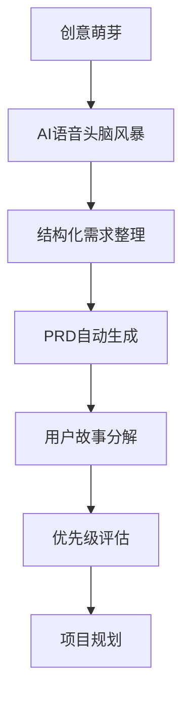

# 第四章：需求分析与项目规划

> **本章导读**
>
> 学习如何使用AI工具进行高效的需求分析，掌握从创意到PRD的完整流程，理解用户故事的编写方法，以及如何进行科学的项目规划和优先级管理。

---

## 4.1 AI驱动的需求分析流程

### 传统需求分析的痛点

在传统软件开发中，需求分析往往面临以下挑战：

- **沟通成本高**：多轮会议讨论，信息传递失真
- **文档编写耗时**：手动整理需求，格式不统一
- **需求变更频繁**：缺乏系统性思考，后期大量修改
- **优先级不清**：功能堆砌，缺乏科学的优先级评估

### DDAD需求分析新范式

DDAD方法论通过AI工具重新定义需求分析流程：



**核心优势**：
- ⚡ **效率提升**：从创意到PRD，2小时完成传统2周的工作
- 🎯 **质量保证**：AI辅助确保需求完整性和一致性
- 📋 **标准化**：统一的文档格式和结构
- 🔄 **快速迭代**：支持需求的快速调整和优化

---

## 4.2 ChatGPT Voice快速头脑风暴

### 为什么选择语音而非文字？

**语音头脑风暴的优势**：
- 🎤 **自然交流**：像与真人对话，思维更流畅
- ⚡ **快速迭代**：语音输入比打字快3-5倍
- 🤔 **动态追问**：AI实时追问，帮助深度思考
- 📋 **自动记录**：对话自动转文字，后续整理

### 头脑风暴工作流

#### 阶段1：问题探索（10-15分钟）

**目标**：清晰定义要解决的问题

**对话脚本示例**：

```
👤 你: "我想做一个帮助开发者管理会议纪要的工具，但不确定具体方向"

🤖 ChatGPT: "很好的方向！让我帮你深入探索。首先，为什么专注于开发者这个群体？他们在会议纪要方面有什么特殊痛点吗？"

👤 你: "嗯，开发者开会很多，技术讨论、站会、评审...但记录很麻烦，事后经常忘记讨论的细节"

🤖 ChatGPT: "明白了。那么现在他们怎么处理会议记录？为什么现有方法不够好？"

👤 你: "有些人手动记Notion，但跟不上讨论节奏。也有Otter.ai这样的工具，但不够智能，只是简单转录，没有提取技术要点"

🤖 ChatGPT: "太好了！我听到了一个明确的差异化点：'智能提取技术要点'，而不是简单转录。那让我们深入一下：开发者最需要从会议中提取什么样的技术信息？"
```

**关键技巧**：
- ✅ **从模糊开始**：不要试图一开始就讲清楚，让AI帮你澄清
- ✅ **回答AI的追问**：AI的问题通常很关键，认真思考回答
- ✅ **举例说明**：用具体场景解释抽象概念

#### 阶段2：用户画像（10分钟）

**目标**：精准定义目标用户

**对话要点**：
- 用户角色和职责
- 团队规模和组织结构
- 使用频率和场景
- 支付意愿和预算范围
- 现有工具生态

**输出示例**：
```markdown
## 目标用户画像
- **角色**: Tech Lead / 架构师
- **团队规模**: 10-50人的创业公司/中型团队
- **使用频率**: 每周2-3次技术会议
- **支付意愿**: $15-20/月
- **工具生态**: Notion用户
```

#### 阶段3：功能定义（15分钟）

**目标**：列出MVP核心功能

使用5W1H方法系统性思考：
- **Who**：谁是用户？
- **What**：做什么功能？
- **When**：什么时候使用？
- **Where**：在哪里使用？
- **Why**：为什么选择我们？
- **How**：如何实现差异化？

**功能分类框架**：
```markdown
## Must Have (MVP核心功能)
- 音频上传和转录
- 智能内容分析
- 结构化信息提取
- Web Dashboard展示

## Should Have (V1.1功能)
- 实时录音
- 团队协作
- 第三方集成

## Could Have (未来功能)
- 移动应用
- 多语言支持
- 高级分析

## Won't Have (明确不做)
- 视频会议集成
- 企业级权限管理
```

---

## 4.3 PRD自动生成与优化

### PRD生成提示词模板

```markdown
我要开发一个[项目名称]。请帮我生成一份完整的产品需求文档（PRD.md），包含：

1. **产品概述**
   - 产品定位：[一句话描述产品价值]
   - 目标用户：[具体的用户画像]
   - 核心价值：[关键优势和差异化]

2. **功能需求（MoSCoW优先级）**
   - Must Have：[MVP核心功能]
   - Should Have：[V1.1功能]
   - Could Have：[锦上添花功能]
   - Won't Have：[明确不做的功能]

3. **非功能需求**
   - 性能要求：[响应时间、并发量等]
   - 安全要求：[数据安全、隐私保护]
   - 可靠性：[可用性、容错性]
   - 可扩展性：[未来扩展考虑]

4. **技术约束**
   - 核心技术栈：[必须使用的技术]
   - API风格：[RESTful、GraphQL等]
   - 部署环境：[云平台、容器化等]

5. **成功指标**
   - 用户指标：[DAU、留存率等]
   - 业务指标：[转化率、收入等]
   - 技术指标：[性能、稳定性等]

请使用Markdown格式，确保结构清晰、内容专业。
```

### PRD质量检查清单

生成PRD后，使用以下清单进行质量检查：

```markdown
✅ **完整性检查**
- [ ] 产品定位清晰明确
- [ ] 目标用户画像具体
- [ ] 功能需求覆盖完整
- [ ] 非功能需求明确量化
- [ ] 技术约束合理可行

✅ **一致性检查**
- [ ] 功能与用户需求匹配
- [ ] 技术选型与功能需求一致
- [ ] 成功指标与产品目标对齐
- [ ] 优先级划分合理

✅ **可执行性检查**
- [ ] 功能描述足够详细
- [ ] 验收标准可测试
- [ ] 技术实现路径清晰
- [ ] 时间和资源估算合理
```

---

## 4.4 用户故事编写与管理

### 用户故事标准格式

```markdown
## US-[编号]: [故事标题]

**作为** [用户角色]
**我想要** [完成的功能]
**以便** [实现的价值]

**验收标准：**
- [ ] [可验证的条件1]
- [ ] [可验证的条件2]
- [ ] [可验证的条件3]

**优先级：** P0/P1/P2
**估算：** [故事点数]
**依赖：** [前置条件或依赖的其他故事]
```

### 用户故事生成提示词

```markdown
基于以下PRD文档，请生成详细的用户故事文档（user-stories.md）。

要求：
1. 覆盖所有"Must Have"功能
2. 遵循标准格式："作为[角色]，我想要[功能]，以便[价值]"
3. 为每个故事提供明确的验收标准
4. 给出优先级（P0/P1/P2）和估算
5. 识别故事间的依赖关系

---
[粘贴PRD核心内容]
---
```

### 用户故事示例

```markdown
## US-001: 用户注册账户

**作为** 新用户
**我想要** 使用邮箱和密码注册账户
**以便** 开始使用会议纪要工具

**验收标准：**
- [ ] 注册页面包含邮箱、密码、确认密码字段
- [ ] 密码强度验证（至少8位，包含字母和数字）
- [ ] 邮箱格式验证
- [ ] 注册成功后自动发送验证邮件
- [ ] 验证邮件包含激活链接
- [ ] 点击激活链接后账户状态变为已激活

**优先级：** P0
**估算：** 3故事点
**依赖：** 无

## US-002: 上传会议录音

**作为** 已登录用户
**我想要** 上传会议录音文件
**以便** 获得AI生成的会议纪要

**验收标准：**
- [ ] 支持MP3、WAV、M4A格式
- [ ] 文件大小限制200MB
- [ ] 拖拽上传功能
- [ ] 上传进度显示
- [ ] 上传完成后显示处理状态
- [ ] 支持批量上传（最多5个文件）

**优先级：** P0
**估算：** 5故事点
**依赖：** US-001（用户注册）
```

---

## 4.5 项目规划与优先级管理

### 敏捷规划方法

#### Sprint规划

**Sprint 0（准备阶段，1周）**：
- 技术栈选择和环境搭建
- 设计系统和UI组件库
- 数据库设计和API规范
- CI/CD流程配置

**Sprint 1（核心功能，2周）**：
- 用户认证系统
- 文件上传功能
- 基础Dashboard

**Sprint 2（AI功能，2周）**：
- 音频转录集成
- AI内容分析
- 结果展示页面

**Sprint 3（优化完善，1周）**：
- 用户体验优化
- 性能调优
- 测试和修复

#### 优先级评估矩阵

使用价值-复杂度矩阵进行功能优先级评估：

```markdown
| 功能 | 用户价值 | 技术复杂度 | 优先级 | Sprint |
|------|----------|------------|--------|--------|
| 用户认证 | 高 | 低 | P0 | Sprint 1 |
| 文件上传 | 高 | 中 | P0 | Sprint 1 |
| AI转录 | 高 | 高 | P0 | Sprint 2 |
| 内容分析 | 高 | 高 | P0 | Sprint 2 |
| 团队协作 | 中 | 中 | P1 | Sprint 4 |
| 移动应用 | 中 | 高 | P2 | 未来版本 |
```

### 风险识别与缓解

#### 技术风险

**AI API依赖风险**：
- **风险**：第三方AI服务不稳定或价格变化
- **缓解**：准备备选方案，实现API抽象层

**性能风险**：
- **风险**：大文件处理导致系统响应慢
- **缓解**：异步处理，进度反馈，文件大小限制

#### 业务风险

**用户接受度风险**：
- **风险**：用户不愿意改变现有工作流程
- **缓解**：提供无缝集成，降低使用门槛

**竞争风险**：
- **风险**：大厂推出类似产品
- **缓解**：专注细分市场，快速迭代

### 项目里程碑

```markdown
## 项目里程碑

### M1：MVP发布（第4周）
- ✅ 核心功能完整
- ✅ 基础用户体验
- ✅ 技术架构稳定
- 🎯 目标：10个种子用户

### M2：产品优化（第8周）
- ✅ 用户反馈集成
- ✅ 性能优化
- ✅ 功能完善
- 🎯 目标：100个活跃用户

### M3：规模化（第12周）
- ✅ 团队协作功能
- ✅ 企业级特性
- ✅ 商业化准备
- 🎯 目标：1000个注册用户
```

---

## 4.6 DDAD文档体系建立

### 标准文档结构

```
项目根目录/
├── docs/
│   ├── 01-requirements/          # 需求文档
│   │   ├── PRD.md                # 产品需求文档
│   │   ├── user-stories.md       # 用户故事
│   │   ├── acceptance-criteria.md # 验收标准
│   │   └── feature-priorities.md # 特性优先级
│   │
│   ├── 02-design/                # 设计文档
│   │   ├── architecture.md       # 架构设计
│   │   ├── api-spec.md           # API规范
│   │   ├── data-models.md        # 数据模型
│   │   └── ui-mockups/           # UI设计稿
│   │
│   ├── 03-implementation/        # 实施文档
│   │   ├── tech-stack.md         # 技术栈选择
│   │   ├── coding-standards.md   # 编码规范
│   │   └── deployment.md         # 部署方案
│   │
│   ├── 04-testing/               # 测试文档
│   │   ├── test-plan.md          # 测试计划
│   │   └── test-cases.md         # 测试用例
│   │
│   └── 05-operations/            # 运维文档
│       ├── runbook.md            # 运维手册
│       └── troubleshooting.md    # 故障排查
```

### 文档版本管理

**版本控制策略**：
- 所有文档纳入Git版本控制
- 重要变更通过PR流程
- 文档与代码同步更新
- 定期文档审查和更新

**文档更新流程**：


---

## 4.7 实践案例：TechMeet项目

### 项目背景

**项目名称**：TechMeet - AI会议纪要工具
**目标用户**：技术团队的Tech Lead和架构师
**核心价值**：智能提取技术会议要点，提升团队协作效率

### 需求分析过程

#### 1. 语音头脑风暴（30分钟）

通过ChatGPT Voice进行需求探索：
- 问题定义：技术会议记录效率低下
- 用户画像：10-50人团队的Tech Lead
- 核心功能：音频转录 + 智能分析 + 结构化输出
- 商业模式：SaaS订阅，$15-20/月

#### 2. PRD生成（15分钟）

使用AI工具生成完整PRD，包含：
- 产品定位和目标用户
- 功能需求（MoSCoW优先级）
- 非功能需求和技术约束
- 成功指标和商业目标

#### 3. 用户故事分解（20分钟）

将PRD分解为15个用户故事：
- P0故事：8个（MVP核心功能）
- P1故事：5个（增强功能）
- P2故事：2个（未来功能）

#### 4. 项目规划（15分钟）

制定4个Sprint的开发计划：
- Sprint 1-2：核心功能开发
- Sprint 3：AI功能集成
- Sprint 4：优化和发布

### 关键成果

**时间效率**：
- 传统方式：2-3周的需求分析
- DDAD方式：1.5小时完成

**质量提升**：
- 需求完整性：覆盖率95%+
- 文档一致性：零冲突
- 团队理解：统一认知

**后续影响**：
- 开发效率提升40%
- 需求变更减少60%
- 团队协作更顺畅

---

## 本章小结

本章介绍了DDAD方法论下的需求分析与项目规划流程：

### 核心要点

1. **AI驱动的需求分析**：使用ChatGPT Voice进行高效头脑风暴
2. **自动化文档生成**：通过提示词模板快速生成PRD和用户故事
3. **科学的优先级管理**：使用价值-复杂度矩阵进行功能排序
4. **标准化文档体系**：建立完整的DDAD文档结构

### 实践建议

1. **充分利用AI工具**：语音交互比文字输入效率高3-5倍
2. **保持文档同步**：需求变更时及时更新相关文档
3. **定期回顾优化**：根据项目进展调整优先级和计划
4. **团队协作透明**：确保所有成员对需求有统一理解

### 下一步

下一章我们将学习架构设计与技术选型，了解如何将需求转化为可执行的技术方案。