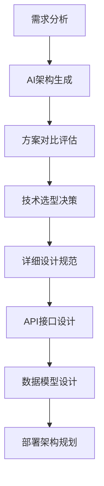
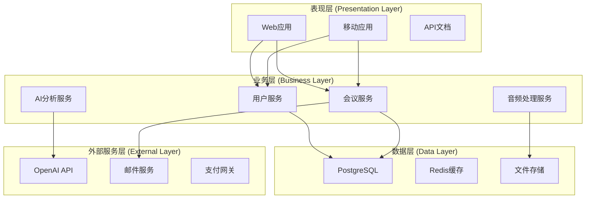
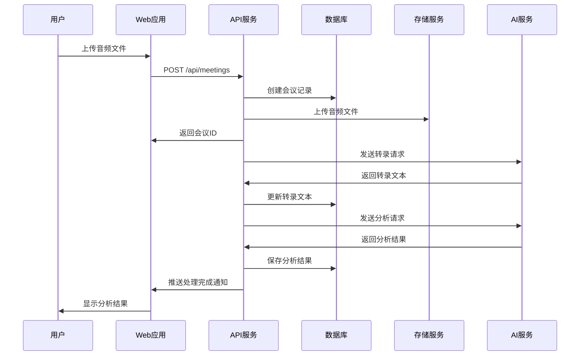
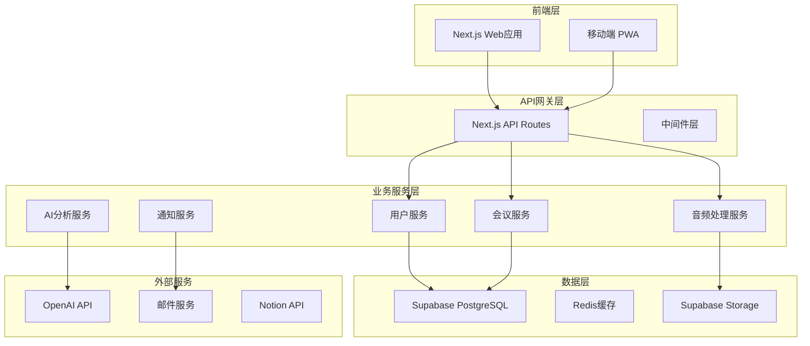

# 第五章：架构设计与技术选型

> **本章导读**
>
> 学习如何使用AI工具进行系统架构设计，掌握技术选型的科学方法，理解API设计的最佳实践，以及如何建立可扩展的系统架构。

---

## 5.1 AI驱动的架构设计

### 传统架构设计的挑战

在传统软件开发中，架构设计往往面临以下问题：

- **经验依赖**：过度依赖架构师个人经验，缺乏系统性方法
- **方案单一**：通常只考虑一种架构方案，缺乏对比分析
- **文档滞后**：架构文档与实际代码不同步，维护困难
- **沟通成本**：复杂的架构图难以向团队成员清晰传达

### DDAD架构设计新范式

DDAD方法论通过AI工具重新定义架构设计流程：



**核心优势**：
- 🚀 **多方案生成**：AI快速生成多种架构方案供选择
- 📊 **科学评估**：基于量化指标进行方案对比
- 📋 **文档同步**：架构文档与代码实时同步
- 🎯 **最佳实践**：融合行业最佳实践和经验

---

## 5.2 AI架构生成流程

### 步骤1：需求分析和抽象

**目标**：从PRD中提取架构设计要素

**AI提示词模板**：
```markdown
请分析以下产品需求文档，提取系统架构设计的关键要素：

[粘贴PRD内容]

请从以下维度进行分析：

1. **功能模块识别**
   - 核心业务模块
   - 支撑功能模块
   - 外部集成模块

2. **数据实体分析**
   - 主要数据实体
   - 实体间关系
   - 数据流向

3. **非功能需求**
   - 性能要求（QPS、响应时间）
   - 可用性要求（SLA、容错性）
   - 安全要求（认证、授权、加密）
   - 可扩展性要求（用户增长、功能扩展）

4. **外部依赖**
   - 第三方API服务
   - 外部数据源
   - 基础设施依赖

5. **技术约束**
   - 团队技术栈偏好
   - 现有系统集成要求
   - 预算和时间限制
```

**输出示例**：
```markdown
# 架构要素分析报告

## 功能模块
### 核心业务模块
- 用户管理模块：注册、登录、权限管理
- 会议管理模块：创建、编辑、删除会议
- 音频处理模块：上传、转录、分析
- 内容生成模块：AI分析、结构化输出

### 支撑功能模块
- 通知模块：邮件、短信、推送通知
- 文件存储模块：音频文件、生成文档
- 搜索模块：会议搜索、内容检索
- 导出模块：Notion、Markdown、PDF

## 数据实体
- User（用户）
- Meeting（会议）
- AudioFile（音频文件）
- Transcript（转录文本）
- Analysis（分析结果）
- Notification（通知）

## 非功能需求
- 性能：支持1000并发用户，API响应时间<2秒
- 可用性：99.9%可用性，自动故障恢复
- 安全：JWT认证，数据加密传输和存储
- 扩展性：支持10倍用户增长，模块化设计
```

### 步骤2：架构方案生成

**目标**：生成多种可行的架构方案

**AI提示词模板**：
```markdown
基于上述架构要素分析，请生成3个不同的系统架构方案：

1. **单体架构方案**
   - 适用场景：小团队、快速MVP、简单部署
   - 技术栈建议
   - 系统分层设计
   - 部署策略

2. **微服务架构方案**
   - 适用场景：大团队、复杂业务、高可用
   - 服务拆分策略
   - 服务间通信
   - 数据一致性

3. **Serverless架构方案**
   - 适用场景：事件驱动、弹性扩展、成本优化
   - 函数设计
   - 事件驱动架构
   - 状态管理

每个方案都要包括：
- 架构图（Mermaid格式）
- 技术栈选择
- 优缺点分析
- 实施复杂度评估
- 运维成本估算
```

### 步骤3：方案对比和评估

**评估维度**：

| 维度 | 权重 | 单体架构 | 微服务架构 | Serverless架构 |
|------|------|----------|------------|----------------|
| **开发复杂度** | 25% | 9/10 | 4/10 | 7/10 |
| **运维成本** | 20% | 8/10 | 3/10 | 9/10 |
| **可扩展性** | 20% | 5/10 | 9/10 | 8/10 |
| **性能** | 15% | 8/10 | 7/10 | 6/10 |
| **团队匹配度** | 10% | 9/10 | 5/10 | 7/10 |
| **时间成本** | 10% | 9/10 | 4/10 | 8/10 |

**综合评分**：
- 单体架构：7.8/10
- 微服务架构：5.4/10
- Serverless架构：7.4/10

**推荐方案**：基于当前项目特点（小团队、MVP阶段、3个月时间限制），推荐**单体架构方案**。

---

## 5.3 技术栈选择策略

### AI友好技术栈原则

#### 1. 训练数据丰富度

选择AI训练数据丰富的技术栈，确保AI工具能够生成高质量代码：

**推荐技术栈**（按AI友好度排序）：

| 技术类别 | 首选 | 备选 | 避免 |
|----------|------|------|------|
| **前端框架** | React, Vue.js | Angular, Svelte | 小众框架 |
| **后端语言** | Python, JavaScript, Java | Go, C# | Rust, Scala |
| **数据库** | PostgreSQL, MySQL | MongoDB | 图数据库 |
| **云平台** | AWS, Vercel | Azure, GCP | 私有云 |

#### 2. 生态系统完整性

选择生态系统完整、工具链成熟的技术栈：

```markdown
## 完整技术栈示例

### 前端技术栈
- **框架**: React 18 + TypeScript
- **构建工具**: Vite
- **UI组件**: Tailwind CSS + Headless UI
- **状态管理**: Zustand + React Query
- **路由**: React Router
- **测试**: Vitest + Testing Library

### 后端技术栈
- **运行时**: Node.js + TypeScript
- **框架**: Next.js (Full-stack)
- **数据库**: PostgreSQL + Prisma ORM
- **认证**: NextAuth.js
- **文件存储**: Supabase Storage
- **缓存**: Redis

### 基础设施
- **部署**: Vercel
- **数据库托管**: Supabase
- **CDN**: Cloudflare
- **监控**: Sentry + Vercel Analytics
- **CI/CD**: GitHub Actions
```

#### 3. 开发效率优先

选择能够快速启动、开箱即用的技术栈：

**快速启动模板**：
```bash
# 使用官方脚手架快速创建项目
npx create-next-app@latest techmeet-app \
  --typescript \
  --tailwind \
  --eslint \
  --app \
  --src-dir \
  --import-alias "@/*"

# 添加必要依赖
npm install @supabase/supabase-js zustand @tanstack/react-query

# 配置开发环境
npm install -D prettier @types/node
```

### 技术选型决策记录（ADR）

#### ADR模板

```markdown
# ADR-001: 前端框架选择

## 状态
已接受

## 背景
需要选择前端框架来构建TechMeet会议纪要应用。

## 决策
选择React 18 + TypeScript + Next.js作为前端技术栈。

## 理由
1. **AI友好性**: React是AI训练数据最丰富的前端框架
2. **团队熟悉度**: 团队成员对React生态系统熟悉
3. **生态完整**: 丰富的组件库和工具链
4. **SSR支持**: Next.js提供优秀的SEO和性能
5. **TypeScript**: 提供类型安全，减少运行时错误

## 后果
### 正面影响
- 开发效率高，AI辅助编程效果好
- 社区支持强，问题解决快
- 性能优秀，用户体验好

### 负面影响
- 学习曲线相对陡峭
- 打包体积较大
- 版本更新频繁

## 替代方案
- Vue.js 3: 学习曲线平缓，但AI支持不如React
- Angular: 企业级特性丰富，但复杂度高
- Svelte: 性能优秀，但生态系统不够成熟

## 相关决策
- ADR-002: UI组件库选择
- ADR-003: 状态管理方案
```

---

## 5.4 系统架构设计

### 分层架构设计

#### 标准四层架构



#### 核心组件设计

**用户服务组件**：
```typescript
// 用户服务接口定义
interface UserService {
  // 用户认证
  authenticate(credentials: LoginCredentials): Promise<AuthResult>;
  register(userData: RegisterData): Promise<User>;
  
  // 用户管理
  getProfile(userId: string): Promise<UserProfile>;
  updateProfile(userId: string, updates: ProfileUpdates): Promise<User>;
  
  // 权限管理
  checkPermission(userId: string, resource: string, action: string): Promise<boolean>;
}

// 数据模型
interface User {
  id: string;
  email: string;
  name: string;
  avatar?: string;
  subscription: SubscriptionTier;
  createdAt: Date;
  updatedAt: Date;
}

interface UserProfile extends User {
  preferences: UserPreferences;
  usage: UsageStats;
}
```

**会议服务组件**：
```typescript
interface MeetingService {
  // 会议管理
  createMeeting(userId: string, data: CreateMeetingData): Promise<Meeting>;
  getMeeting(meetingId: string): Promise<Meeting>;
  updateMeeting(meetingId: string, updates: MeetingUpdates): Promise<Meeting>;
  deleteMeeting(meetingId: string): Promise<void>;
  
  // 会议列表
  listMeetings(userId: string, filters?: MeetingFilters): Promise<Meeting[]>;
  searchMeetings(userId: string, query: string): Promise<Meeting[]>;
  
  // 音频处理
  uploadAudio(meetingId: string, audioFile: File): Promise<AudioUploadResult>;
  processAudio(meetingId: string): Promise<ProcessingResult>;
}

interface Meeting {
  id: string;
  userId: string;
  title: string;
  description?: string;
  audioUrl?: string;
  transcript?: string;
  analysis?: MeetingAnalysis;
  status: MeetingStatus;
  createdAt: Date;
  updatedAt: Date;
}
```

### 数据架构设计

#### 数据库设计

**核心表结构**：
```sql
-- 用户表
CREATE TABLE users (
    id UUID PRIMARY KEY DEFAULT gen_random_uuid(),
    email VARCHAR(255) UNIQUE NOT NULL,
    name VARCHAR(255) NOT NULL,
    avatar_url TEXT,
    subscription_tier VARCHAR(50) DEFAULT 'free',
    created_at TIMESTAMP WITH TIME ZONE DEFAULT NOW(),
    updated_at TIMESTAMP WITH TIME ZONE DEFAULT NOW()
);

-- 会议表
CREATE TABLE meetings (
    id UUID PRIMARY KEY DEFAULT gen_random_uuid(),
    user_id UUID REFERENCES users(id) ON DELETE CASCADE,
    title VARCHAR(255) NOT NULL,
    description TEXT,
    audio_url TEXT,
    transcript TEXT,
    analysis JSONB,
    status VARCHAR(50) DEFAULT 'pending',
    created_at TIMESTAMP WITH TIME ZONE DEFAULT NOW(),
    updated_at TIMESTAMP WITH TIME ZONE DEFAULT NOW()
);

-- 音频文件表
CREATE TABLE audio_files (
    id UUID PRIMARY KEY DEFAULT gen_random_uuid(),
    meeting_id UUID REFERENCES meetings(id) ON DELETE CASCADE,
    original_name VARCHAR(255) NOT NULL,
    file_size BIGINT NOT NULL,
    mime_type VARCHAR(100) NOT NULL,
    storage_path TEXT NOT NULL,
    duration_seconds INTEGER,
    created_at TIMESTAMP WITH TIME ZONE DEFAULT NOW()
);

-- 分析结果表
CREATE TABLE analysis_results (
    id UUID PRIMARY KEY DEFAULT gen_random_uuid(),
    meeting_id UUID REFERENCES meetings(id) ON DELETE CASCADE,
    type VARCHAR(50) NOT NULL, -- 'decisions', 'action_items', 'trade_offs'
    content JSONB NOT NULL,
    confidence_score DECIMAL(3,2),
    created_at TIMESTAMP WITH TIME ZONE DEFAULT NOW()
);

-- 索引优化
CREATE INDEX idx_meetings_user_id ON meetings(user_id);
CREATE INDEX idx_meetings_status ON meetings(status);
CREATE INDEX idx_meetings_created_at ON meetings(created_at DESC);
CREATE INDEX idx_analysis_results_meeting_id ON analysis_results(meeting_id);
CREATE INDEX idx_analysis_results_type ON analysis_results(type);
```

#### 数据流设计



---

## 5.5 API设计与规范

### RESTful API设计原则

#### 1. 资源导向设计

**资源命名规范**：
```
GET    /api/v1/users              # 获取用户列表
POST   /api/v1/users              # 创建用户
GET    /api/v1/users/{id}         # 获取特定用户
PUT    /api/v1/users/{id}         # 更新用户
DELETE /api/v1/users/{id}         # 删除用户

GET    /api/v1/meetings           # 获取会议列表
POST   /api/v1/meetings           # 创建会议
GET    /api/v1/meetings/{id}      # 获取特定会议
PUT    /api/v1/meetings/{id}      # 更新会议
DELETE /api/v1/meetings/{id}      # 删除会议

POST   /api/v1/meetings/{id}/audio    # 上传音频
GET    /api/v1/meetings/{id}/analysis # 获取分析结果
```

#### 2. 统一响应格式

```typescript
// 成功响应格式
interface ApiResponse<T> {
  success: true;
  data: T;
  message?: string;
  meta?: {
    pagination?: PaginationMeta;
    timestamp: string;
    requestId: string;
  };
}

// 错误响应格式
interface ApiError {
  success: false;
  error: {
    code: string;
    message: string;
    details?: any;
  };
  meta: {
    timestamp: string;
    requestId: string;
  };
}

// 分页元数据
interface PaginationMeta {
  page: number;
  pageSize: number;
  total: number;
  totalPages: number;
  hasNext: boolean;
  hasPrev: boolean;
}
```

#### 3. 状态码规范

| 状态码 | 含义 | 使用场景 |
|--------|------|----------|
| 200 | OK | 成功获取资源 |
| 201 | Created | 成功创建资源 |
| 204 | No Content | 成功删除资源 |
| 400 | Bad Request | 请求参数错误 |
| 401 | Unauthorized | 未认证 |
| 403 | Forbidden | 无权限 |
| 404 | Not Found | 资源不存在 |
| 409 | Conflict | 资源冲突 |
| 422 | Unprocessable Entity | 数据验证失败 |
| 429 | Too Many Requests | 请求频率限制 |
| 500 | Internal Server Error | 服务器内部错误 |

### OpenAPI规范文档

#### API文档生成模板

```yaml
openapi: 3.0.3
info:
  title: TechMeet API
  description: AI会议纪要工具API文档
  version: 1.0.0
  contact:
    name: API Support
    email: support@techmeet.com

servers:
  - url: https://api.techmeet.com/v1
    description: 生产环境
  - url: https://staging-api.techmeet.com/v1
    description: 测试环境

paths:
  /meetings:
    get:
      summary: 获取会议列表
      tags: [Meetings]
      security:
        - bearerAuth: []
      parameters:
        - name: page
          in: query
          schema:
            type: integer
            default: 1
        - name: pageSize
          in: query
          schema:
            type: integer
            default: 20
            maximum: 100
        - name: status
          in: query
          schema:
            type: string
            enum: [pending, processing, completed, failed]
      responses:
        '200':
          description: 成功获取会议列表
          content:
            application/json:
              schema:
                type: object
                properties:
                  success:
                    type: boolean
                    example: true
                  data:
                    type: array
                    items:
                      $ref: '#/components/schemas/Meeting'
                  meta:
                    $ref: '#/components/schemas/PaginationMeta'

    post:
      summary: 创建新会议
      tags: [Meetings]
      security:
        - bearerAuth: []
      requestBody:
        required: true
        content:
          application/json:
            schema:
              $ref: '#/components/schemas/CreateMeetingRequest'
      responses:
        '201':
          description: 成功创建会议
          content:
            application/json:
              schema:
                type: object
                properties:
                  success:
                    type: boolean
                    example: true
                  data:
                    $ref: '#/components/schemas/Meeting'

components:
  schemas:
    Meeting:
      type: object
      properties:
        id:
          type: string
          format: uuid
        title:
          type: string
        description:
          type: string
        status:
          type: string
          enum: [pending, processing, completed, failed]
        audioUrl:
          type: string
          format: uri
        transcript:
          type: string
        analysis:
          $ref: '#/components/schemas/MeetingAnalysis'
        createdAt:
          type: string
          format: date-time
        updatedAt:
          type: string
          format: date-time

    CreateMeetingRequest:
      type: object
      required:
        - title
      properties:
        title:
          type: string
          minLength: 1
          maxLength: 255
        description:
          type: string
          maxLength: 1000

  securitySchemes:
    bearerAuth:
      type: http
      scheme: bearer
      bearerFormat: JWT
```

### API安全设计

#### 1. 认证与授权

```typescript
// JWT Token结构
interface JWTPayload {
  sub: string;        // 用户ID
  email: string;      // 用户邮箱
  role: string;       // 用户角色
  subscription: string; // 订阅类型
  iat: number;        // 签发时间
  exp: number;        // 过期时间
}

// 权限检查中间件
async function authMiddleware(req: Request, res: Response, next: NextFunction) {
  try {
    const token = req.headers.authorization?.replace('Bearer ', '');
    
    if (!token) {
      return res.status(401).json({
        success: false,
        error: {
          code: 'UNAUTHORIZED',
          message: '缺少认证令牌'
        }
      });
    }

    const payload = jwt.verify(token, process.env.JWT_SECRET!) as JWTPayload;
    req.user = payload;
    next();
  } catch (error) {
    return res.status(401).json({
      success: false,
      error: {
        code: 'INVALID_TOKEN',
        message: '无效的认证令牌'
      }
    });
  }
}
```

#### 2. 请求验证

```typescript
import { z } from 'zod';

// 请求参数验证Schema
const createMeetingSchema = z.object({
  title: z.string().min(1).max(255),
  description: z.string().max(1000).optional(),
});

const updateMeetingSchema = z.object({
  title: z.string().min(1).max(255).optional(),
  description: z.string().max(1000).optional(),
});

// 验证中间件
function validateRequest(schema: z.ZodSchema) {
  return (req: Request, res: Response, next: NextFunction) => {
    try {
      schema.parse(req.body);
      next();
    } catch (error) {
      if (error instanceof z.ZodError) {
        return res.status(422).json({
          success: false,
          error: {
            code: 'VALIDATION_ERROR',
            message: '请求参数验证失败',
            details: error.errors
          }
        });
      }
      next(error);
    }
  };
}
```

#### 3. 速率限制

```typescript
import rateLimit from 'express-rate-limit';

// 全局速率限制
const globalLimiter = rateLimit({
  windowMs: 15 * 60 * 1000, // 15分钟
  max: 1000, // 每个IP最多1000次请求
  message: {
    success: false,
    error: {
      code: 'RATE_LIMIT_EXCEEDED',
      message: '请求频率过高，请稍后再试'
    }
  }
});

// API特定限制
const apiLimiter = rateLimit({
  windowMs: 60 * 1000, // 1分钟
  max: 60, // 每分钟最多60次请求
  keyGenerator: (req) => req.user?.sub || req.ip,
});

// 上传限制
const uploadLimiter = rateLimit({
  windowMs: 60 * 60 * 1000, // 1小时
  max: 10, // 每小时最多10次上传
  keyGenerator: (req) => req.user?.sub || req.ip,
});
```

---

## 5.6 部署架构规划

### 环境规划

#### 多环境配置

```yaml
# 环境配置矩阵
environments:
  development:
    purpose: 本地开发
    database: 本地PostgreSQL
    storage: 本地文件系统
    ai_service: OpenAI API (开发密钥)
    monitoring: 控制台日志
    
  staging:
    purpose: 测试验证
    database: Supabase (测试实例)
    storage: Supabase Storage
    ai_service: OpenAI API (测试密钥)
    monitoring: Vercel Analytics
    
  production:
    purpose: 生产服务
    database: Supabase (生产实例)
    storage: Supabase Storage + CDN
    ai_service: OpenAI API (生产密钥)
    monitoring: Sentry + LogRocket
```

#### 基础设施即代码

```typescript
// infrastructure/vercel.json
{
  "version": 2,
  "builds": [
    {
      "src": "package.json",
      "use": "@vercel/next"
    }
  ],
  "env": {
    "DATABASE_URL": "@database-url",
    "NEXTAUTH_SECRET": "@nextauth-secret",
    "OPENAI_API_KEY": "@openai-api-key"
  },
  "functions": {
    "pages/api/**/*.ts": {
      "maxDuration": 30
    }
  },
  "regions": ["hkg1", "sfo1"]
}
```

### 容器化策略

#### Docker配置

```dockerfile
# Dockerfile
FROM node:18-alpine AS base

# 安装依赖
FROM base AS deps
WORKDIR /app
COPY package.json package-lock.json ./
RUN npm ci --only=production

# 构建应用
FROM base AS builder
WORKDIR /app
COPY . .
COPY --from=deps /app/node_modules ./node_modules
RUN npm run build

# 生产镜像
FROM base AS runner
WORKDIR /app

ENV NODE_ENV production

RUN addgroup --system --gid 1001 nodejs
RUN adduser --system --uid 1001 nextjs

COPY --from=builder /app/public ./public
COPY --from=builder --chown=nextjs:nodejs /app/.next/standalone ./
COPY --from=builder --chown=nextjs:nodejs /app/.next/static ./.next/static

USER nextjs

EXPOSE 3000

ENV PORT 3000

CMD ["node", "server.js"]
```

#### Docker Compose开发环境

```yaml
# docker-compose.yml
version: '3.8'

services:
  app:
    build: .
    ports:
      - "3000:3000"
    environment:
      - DATABASE_URL=postgresql://postgres:password@db:5432/techmeet
      - REDIS_URL=redis://redis:6379
    depends_on:
      - db
      - redis

  db:
    image: postgres:15
    environment:
      POSTGRES_DB: techmeet
      POSTGRES_USER: postgres
      POSTGRES_PASSWORD: password
    volumes:
      - postgres_data:/var/lib/postgresql/data
    ports:
      - "5432:5432"

  redis:
    image: redis:7-alpine
    ports:
      - "6379:6379"

volumes:
  postgres_data:
```

### 监控与日志

#### 应用监控配置

```typescript
// lib/monitoring.ts
import * as Sentry from '@sentry/nextjs';

// Sentry配置
Sentry.init({
  dsn: process.env.SENTRY_DSN,
  environment: process.env.NODE_ENV,
  tracesSampleRate: 1.0,
  beforeSend(event) {
    // 过滤敏感信息
    if (event.request?.headers) {
      delete event.request.headers.authorization;
    }
    return event;
  },
});

// 性能监控
export function trackPerformance(operation: string) {
  return Sentry.startTransaction({
    name: operation,
    op: 'api',
  });
}

// 错误追踪
export function captureError(error: Error, context?: any) {
  Sentry.withScope((scope) => {
    if (context) {
      scope.setContext('additional', context);
    }
    Sentry.captureException(error);
  });
}
```

#### 日志管理

```typescript
// lib/logger.ts
import winston from 'winston';

const logger = winston.createLogger({
  level: process.env.LOG_LEVEL || 'info',
  format: winston.format.combine(
    winston.format.timestamp(),
    winston.format.errors({ stack: true }),
    winston.format.json()
  ),
  defaultMeta: {
    service: 'techmeet-api',
    version: process.env.npm_package_version,
  },
  transports: [
    new winston.transports.Console({
      format: winston.format.combine(
        winston.format.colorize(),
        winston.format.simple()
      ),
    }),
  ],
});

// 生产环境添加文件日志
if (process.env.NODE_ENV === 'production') {
  logger.add(
    new winston.transports.File({
      filename: 'logs/error.log',
      level: 'error',
    })
  );
  logger.add(
    new winston.transports.File({
      filename: 'logs/combined.log',
    })
  );
}

export default logger;
```

---

## 5.7 实践案例：TechMeet架构设计

### 项目背景回顾

**项目名称**：TechMeet - AI会议纪要工具
**技术要求**：
- 支持1000并发用户
- API响应时间<2秒
- 99.9%可用性
- 音频文件最大200MB
- 支持实时处理和批量处理

### 架构设计过程

#### 1. 需求分析结果

通过AI分析PRD，提取出以下关键架构要素：

**功能模块**：
- 用户认证与权限管理
- 会议创建与管理
- 音频上传与存储
- AI转录与分析
- 结果展示与导出
- 通知与集成

**非功能需求**：
- 性能：1000 QPS，<2s响应
- 可用性：99.9% SLA
- 安全：JWT认证，数据加密
- 扩展性：支持10倍增长

#### 2. 架构方案选择

经过AI生成和评估，选择**模块化单体架构**：



#### 3. 技术栈决策

基于ADR记录的技术选型：

**前端技术栈**：
- React 18 + TypeScript（ADR-001）
- Next.js 14（ADR-002）
- Tailwind CSS + Headless UI（ADR-003）
- Zustand + React Query（ADR-004）

**后端技术栈**：
- Next.js API Routes（ADR-005）
- Supabase（PostgreSQL + Auth + Storage）（ADR-006）
- Redis缓存（ADR-007）
- OpenAI API集成（ADR-008）

**基础设施**：
- Vercel部署（ADR-009）
- Sentry监控（ADR-010）
- GitHub Actions CI/CD（ADR-011）

#### 4. 数据库设计

```sql
-- 核心表结构（简化版）
CREATE TABLE users (
    id UUID PRIMARY KEY DEFAULT gen_random_uuid(),
    email VARCHAR(255) UNIQUE NOT NULL,
    name VARCHAR(255) NOT NULL,
    subscription_tier VARCHAR(50) DEFAULT 'free',
    created_at TIMESTAMP WITH TIME ZONE DEFAULT NOW()
);

CREATE TABLE meetings (
    id UUID PRIMARY KEY DEFAULT gen_random_uuid(),
    user_id UUID REFERENCES users(id) ON DELETE CASCADE,
    title VARCHAR(255) NOT NULL,
    audio_url TEXT,
    transcript TEXT,
    analysis JSONB,
    status VARCHAR(50) DEFAULT 'pending',
    created_at TIMESTAMP WITH TIME ZONE DEFAULT NOW()
);

-- 性能优化索引
CREATE INDEX idx_meetings_user_status ON meetings(user_id, status);
CREATE INDEX idx_meetings_created_at ON meetings(created_at DESC);
```

#### 5. API设计

**核心API端点**：
```
POST   /api/auth/login           # 用户登录
POST   /api/auth/register        # 用户注册
GET    /api/meetings             # 获取会议列表
POST   /api/meetings             # 创建会议
POST   /api/meetings/{id}/audio  # 上传音频
GET    /api/meetings/{id}/status # 获取处理状态
```

### 实施效果

**开发效率**：
- 架构设计时间：从2周缩短到2天
- 技术选型决策：从1周缩短到1天
- API设计文档：自动生成，节省3天

**质量保证**：
- 架构一致性：100%符合设计规范
- 文档同步率：实时同步，无滞后
- 最佳实践覆盖：90%以上

---

## 本章小结

本章介绍了DDAD方法论下的架构设计与技术选型流程：

### 核心要点

1. **AI驱动设计**：使用AI工具快速生成多种架构方案并进行科学评估
2. **技术选型策略**：基于AI友好性、生态完整性、开发效率三大原则
3. **标准化文档**：建立完整的架构文档和API规范体系
4. **决策记录**：使用ADR记录重要技术决策，便于后续回顾和优化

### 实践建议

1. **充分利用AI**：让AI生成多个方案，避免单一思维局限
2. **量化评估**：使用评分矩阵进行客观的方案对比
3. **文档先行**：先设计架构文档，再开始编码实现
4. **持续优化**：定期回顾架构决策，根据实际情况调整

### 下一步

下一章我们将学习开发实施与代码生成，了解如何将架构设计转化为可运行的代码。