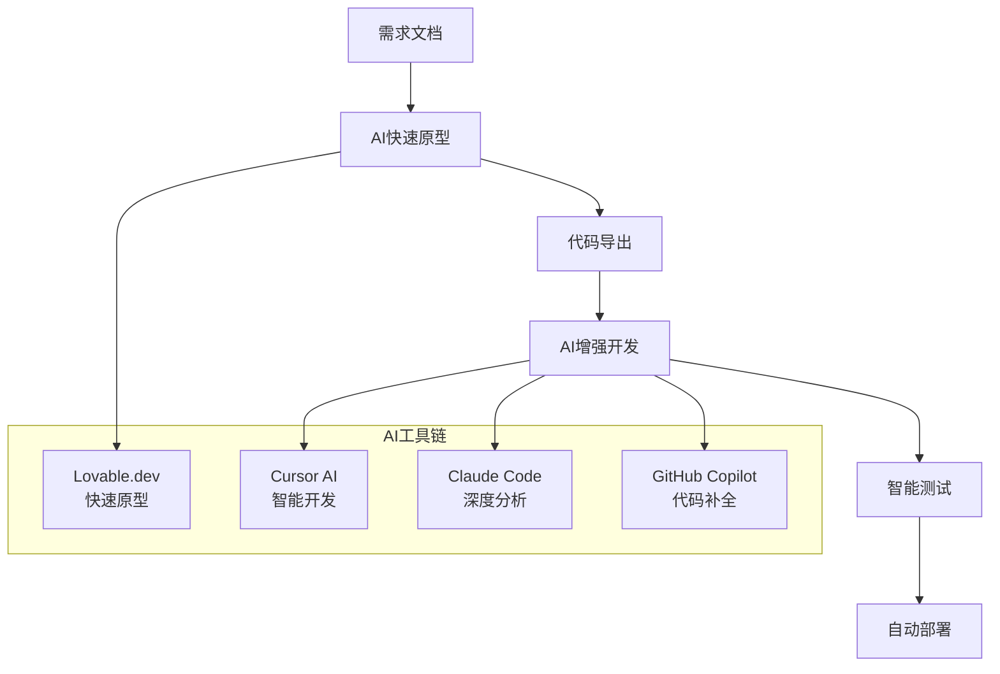

# 第六章：开发实施与代码生成

> **本章导读**
>
> 掌握AI驱动的开发实施流程，学习Lovable→Cursor→Testing的完整工作流，理解AI编程工具的最佳实践，以及如何建立高效的代码生成和质量保证体系。

---

## 6.1 AI驱动的开发新范式

### 传统开发模式的局限

在传统软件开发中，开发实施阶段往往面临以下挑战：

- **重复劳动**：大量样板代码需要手工编写
- **效率瓶颈**：UI组件、CRUD操作等基础功能开发耗时
- **质量不一致**：不同开发者的代码风格和质量差异较大
- **学习成本**：新技术栈的学习曲线陡峭

### DDAD开发实施新模式

DDAD方法论通过AI工具重新定义开发实施流程：



**核心优势**：
- 🚀 **10x效率提升**：70-80%基础功能AI自动生成
- 🎯 **质量保证**：AI生成代码遵循最佳实践
- 📚 **知识传承**：AI工具内置行业经验和模式
- 🔄 **快速迭代**：从想法到可运行原型仅需小时级别

---

## 6.2 AI工具链选择与组合

### 核心工具矩阵

根据项目阶段和复杂度选择合适的AI工具：

```
                    简单任务 ←→ 复杂任务
                         │
            快速原型 ┌─────────┼─────────┐ 深度开发
                    │ Lovable │ Cursor  │
                    │ v0.dev  │ Claude  │
            ────────┼─────────┼─────────┼────────
                    │ Copilot │ Codebuddy│
                    │ Tabnine │ Replit  │
            代码补全 └─────────┼─────────┘ 全栈平台
                         │
                    个人使用 ←→ 团队协作
```

### 详细工具对比

#### 1. Lovable.dev - AI原生开发平台

**核心优势**：
- 自然语言直接生成完整应用
- 内置Supabase集成，包含认证和数据库
- 70-80%功能可直接使用
- 支持导出到GitHub继续开发

**最佳场景**：
```
项目启动阶段:
├── 需求: "创建一个任务管理应用"
├── 输出: 完整的React + Supabase应用
├── 时间: 10-30分钟
└── 后续: 导出到Cursor进行功能增强
```

**实际案例**：
```markdown
输入: "Create a meeting notes app with user authentication, 
       audio upload, AI transcription, and export to Notion"

输出: 
├── 用户认证系统 (Supabase Auth)
├── 音频上传功能
├── 会议列表管理
├── 转录结果展示
├── Notion导出集成
├── 响应式UI设计
└── 部署配置 (Vercel)
```

#### 2. Cursor AI - 全能AI IDE

**核心能力**：
- **Composer**: 多文件编辑，自然语言描述变更
- **Codebase Indexing**: 理解整个项目上下文
- **AI Models**: Claude 3.5 Sonnet, GPT-4, GPT-4o
- **Tab Autocomplete**: 实时代码补全

**典型工作流**：
```
1. 在Cursor中打开从Lovable导出的代码
2. 使用Cmd+K: "添加用户资料编辑功能,使用Shadcn表单组件"
3. Cursor自动修改多个文件(组件、API、类型)
4. 使用Cmd+L聊天: "这个组件性能有问题吗?如何优化?"
5. 应用建议的优化
```

**最佳实践**：
```
使用Composer进行功能开发 → Cmd+L咨询优化建议 → Tab补全加速编码
```

#### 3. Claude Code - 命令行AI伙伴

**核心能力**：
- **超长上下文**: 200K tokens(相当于~50万字代码)
- **原生工具调用**: Bash, Read, Write, Edit, MultiEdit等
- **Subagents**: 专业化代理(backend/frontend/test/security)

**适用场景**：
- 复杂架构分析和重构
- 大规模代码库理解
- 安全审计和性能优化
- 跨文件的复杂变更

> **注意**: Claude Code目前对国内封禁，不适合企业大规模应用。国内团队可优先考虑**Codebuddy CLI**作为替代方案。

### 工具组合策略

#### 阶段化开发流程

**阶段1: MVP构建 (Week 1-2)**
- **主工具**: **Lovable.dev**
- **工作流**: 使用自然语言描述应用需求，Lovable自动生成包含前后端、数据库和认证的完整应用原型。在这个阶段快速迭代UI和核心功能，然后将代码导出到GitHub。

**阶段2: 功能增强 (Week 2-3)**
- **主工具**: **Cursor AI**
- **工作流**: 在Cursor中打开项目代码，使用其Composer功能通过自然语言指令进行跨多文件的功能开发和重构。利用其与IDE的深度集成，进行调试和优化。

**阶段3: 复杂任务与优化 (Week 4)**
- **主工具**: **Claude Code / Codebuddy CLI**
- **工作流**: 对于需要理解整个项目代码库的复杂任务（如架构分析、安全审计、大规模重构），使用超长上下文能力。通过配置和调用**Subagents**，并行处理独立的开发任务。

---

## 6.3 Lovable→Cursor→Testing完整工作流

### 什么是10x开发工作流？

**10x开发工作流**是一种AI原生的开发方法论，通过三个工具的协同使用，实现开发效率的数量级提升：

```
Lovable.dev (70% UI生成)
    ↓
Cursor (30% 逻辑增强)
    ↓
Testing (质量保证)
    ↓
Production Ready
```

**为什么是这个组合？**
- 🎨 **Lovable**: 擅长UI和基础CRUD，不擅长复杂逻辑
- 🧠 **Cursor**: 擅长业务逻辑、优化、重构，配合人类更高效
- ✅ **Testing**: 确保质量，支持持续迭代

### 阶段1: Lovable.dev快速原型(Day 1-2)

#### Step 1: 需求输入和项目初始化(30分钟)

**在Lovable.dev中输入**：

```markdown
创建TechMeet应用 - AI会议纪要工具

## 核心功能
1. 用户认证(邮箱+密码)
2. 音频文件上传(MP3/WAV/M4A,最大200MB)
3. Dashboard展示会议列表
4. 会议详情页显示:
   - 转录文本
   - 架构决策
   - 技术权衡
   - 行动项
5. 导出到Notion(Markdown格式)

## 技术栈
- Frontend: React + TypeScript + Tailwind CSS
- UI Components: Shadcn/ui
- Backend: Supabase (Auth + Database + Storage)
- Deployment: Vercel

## 设计要求
- 现代简洁风格
- 主色调:蓝色(#3b82f6)
- 响应式设计,支持移动端
- 遵循WCAG 2.1 AA可访问性标准
```

**Lovable生成过程**：

```
⏳ Analyzing requirements... (30秒)
✅ Creating project structure
✅ Setting up Supabase backend
✅ Generating UI components
✅ Configuring routing
✅ Setting up authentication

🎉 Project ready! (约5分钟)
```

#### Step 2: Lovable生成的项目结构(自动)

**Lovable自动创建的文件结构**：

```
techmeet/
├── src/
│   ├── components/
│   │   ├── ui/                    # Shadcn/ui基础组件
│   │   │   ├── button.tsx
│   │   │   ├── input.tsx
│   │   │   ├── card.tsx
│   │   │   ├── dialog.tsx
│   │   │   └── ...
│   │   ├── AuthButton.tsx         # 登录/登出按钮
│   │   ├── MeetingCard.tsx        # 会议卡片组件
│   │   └── UploadZone.tsx         # 文件上传区域
│   ├── pages/
│   │   ├── Index.tsx              # 首页(Landing)
│   │   ├── Login.tsx              # 登录页
│   │   ├── Dashboard.tsx          # 会议列表
│   │   ├── Upload.tsx             # 上传页面
│   │   └── MeetingDetail.tsx      # 会议详情
│   ├── lib/
│   │   ├── supabase.ts            # Supabase客户端
│   │   └── utils.ts               # 工具函数
│   ├── hooks/
│   │   ├── useAuth.ts             # 认证Hook
│   │   └── useMeetings.ts         # 会议数据Hook
│   └── types/
│       └── database.ts            # TypeScript类型(自动生成)
├── supabase/
│   ├── migrations/
│   │   └── 20241012_initial.sql  # 初始数据库Schema
│   └── config.toml
├── public/
├── package.json
├── tsconfig.json
├── tailwind.config.js
├── vite.config.ts
└── README.md
```

#### Step 3: 检查Lovable生成的代码质量(15分钟)

**检查清单**：

```markdown
✅ TypeScript配置
- [ ] strict模式启用
- [ ] 所有组件有完整类型定义
- [ ] 没有any类型(或有明确注释)

✅ Supabase集成
- [ ] 环境变量正确配置(.env.example提供)
- [ ] RLS(Row Level Security)策略已设置
- [ ] 数据库表结构符合PRD

✅ UI组件质量
- [ ] Shadcn/ui组件正确集成
- [ ] Tailwind CSS配置包含设计Token
- [ ] 响应式类正确使用(sm:, md:, lg:)

✅ 认证流程
- [ ] 注册/登录页面功能完整
- [ ] 受保护路由有中间件
- [ ] 登出功能正常

✅ 代码规范
- [ ] ESLint配置存在
- [ ] Prettier配置存在
- [ ] Git ignore正确配置
```

**Lovable生成的Supabase Schema示例**：

```sql
-- Lovable自动生成的数据库结构

-- 用户Profile表
CREATE TABLE profiles (
  id UUID PRIMARY KEY REFERENCES auth.users(id) ON DELETE CASCADE,
  email TEXT NOT NULL,
  full_name TEXT,
  avatar_url TEXT,
  created_at TIMESTAMP WITH TIME ZONE DEFAULT NOW(),
  updated_at TIMESTAMP WITH TIME ZONE DEFAULT NOW()
);

-- 会议表
CREATE TABLE meetings (
  id UUID PRIMARY KEY DEFAULT uuid_generate_v4(),
  user_id UUID REFERENCES profiles(id) ON DELETE CASCADE NOT NULL,
  title TEXT NOT NULL,
  audio_url TEXT NOT NULL,
  transcript TEXT,
  status TEXT DEFAULT 'pending' CHECK (status IN ('pending', 'processing', 'completed', 'failed')),
  created_at TIMESTAMP WITH TIME ZONE DEFAULT NOW(),
  updated_at TIMESTAMP WITH TIME ZONE DEFAULT NOW()
);

-- 会议洞察表
CREATE TABLE insights (
  id UUID PRIMARY KEY DEFAULT uuid_generate_v4(),
  meeting_id UUID REFERENCES meetings(id) ON DELETE CASCADE NOT NULL,
  type TEXT NOT NULL CHECK (type IN ('decision', 'trade_off', 'action_item', 'code_snippet')),
  content JSONB NOT NULL,
  timestamp TEXT,
  created_at TIMESTAMP WITH TIME ZONE DEFAULT NOW()
);

-- RLS策略
ALTER TABLE profiles ENABLE ROW LEVEL SECURITY;
ALTER TABLE meetings ENABLE ROW LEVEL SECURITY;
ALTER TABLE insights ENABLE ROW LEVEL SECURITY;

-- 用户只能访问自己的数据
CREATE POLICY "Users can view own profile" ON profiles
  FOR SELECT USING (auth.uid() = id);

CREATE POLICY "Users can view own meetings" ON meetings
  FOR SELECT USING (auth.uid() = user_id);

-- 创建索引提升查询性能
CREATE INDEX idx_meetings_user_id ON meetings(user_id);
CREATE INDEX idx_meetings_created_at ON meetings(created_at DESC);
CREATE INDEX idx_insights_meeting_id ON insights(meeting_id);
```

#### Step 4: 本地运行Lovable项目(10分钟)

**导出项目到GitHub**：

```bash
# 在Lovable界面点击"Export to GitHub"
# 1. 授权GitHub账号
# 2. 输入仓库名:techmeet-app
# 3. 选择Private
# 4. 点击Create Repository

# 等待导出完成(约1分钟)
# ✅ Repository created: github.com/yourusername/techmeet-app
```

**Clone到本地**：

```bash
# Clone仓库
git clone https://github.com/yourusername/techmeet-app.git
cd techmeet-app

# 安装依赖
pnpm install

# 配置环境变量
cp .env.example .env.local

# 编辑.env.local,填入Supabase凭据
# VITE_SUPABASE_URL=https://xxxxx.supabase.co
# VITE_SUPABASE_ANON_KEY=eyJhbGc...

# 启动开发服务器
pnpm dev

# 访问 http://localhost:5173
```

**初次运行验证**：

```markdown
✅ 首页加载成功
✅ 可以访问登录页
✅ 注册新用户
✅ 登录成功后跳转到Dashboard
✅ Dashboard显示空状态(暂无会议)
✅ 可以访问上传页面
```

### 阶段2: Cursor增强复杂逻辑(Day 3-4)

#### Step 1: 在Cursor中打开项目(5分钟)

```bash
# 方式1: 命令行
cursor .

# 方式2: Cursor菜单
# File → Open Folder → 选择techmeet-app目录
```

**Cursor初始配置**：

```json
// .cursor/settings.json (Cursor会提示创建)
{
  "cursor.ai.enabled": true,
  "cursor.ai.model": "claude-3.5-sonnet",
  "cursor.composer.enabled": true,
  "editor.inlineSuggest.enabled": true,
  "editor.formatOnSave": true,
  "editor.codeActionsOnSave": {
    "source.fixAll.eslint": true
  }
}
```

#### Step 2: 添加音频上传到Supabase Storage(1-2小时)

**Lovable的局限**：
- ✅ Lovable生成了上传UI
- ❌ 但没有实现真正的Supabase Storage集成
- ❌ 没有上传进度显示
- ❌ 没有错误处理和重试

**在Cursor中使用Composer增强**：

**Cursor Prompt**：

```
增强src/components/UploadZone.tsx,实现完整的Supabase Storage上传:

需求:
1. 集成@supabase/storage-js上传API
2. 实时显示上传进度(百分比)
3. 文件验证:格式(MP3/WAV/M4A)和大小(<200MB)
4. 上传完成后自动创建meetings记录
5. 错误处理:网络失败、格式错误、大小超限
6. 支持取消上传
7. 上传成功后跳转到会议详情页

参考:
- docs/02-design/design-spec.md中的UploadZone组件设计
- Supabase Storage文档:https://supabase.com/docs/guides/storage
```

**Cursor自动生成的增强代码**：

```typescript
// src/components/UploadZone.tsx (Cursor增强版)

import { useState, useCallback } from 'react'
import { useDropzone } from 'react-dropzone'
import { useNavigate } from 'react-router-dom'
import { UploadIcon, FileAudioIcon, XIcon, AlertCircleIcon, CheckCircleIcon } from 'lucide-react'
import { Card, CardContent } from '@/components/ui/card'
import { Button } from '@/components/ui/button'
import { Progress } from '@/components/ui/progress'
import { Alert, AlertDescription } from '@/components/ui/alert'
import { supabase } from '@/lib/supabase'
import { useToast } from '@/hooks/use-toast'

interface UploadZoneProps {
  maxSize?: number // MB
  acceptedFormats?: string[]
}

export function UploadZone({
  maxSize = 200,
  acceptedFormats = ['audio/mpeg', 'audio/wav', 'audio/m4a']
}: UploadZoneProps) {
  const [file, setFile] = useState<File | null>(null)
  const [uploading, setUploading] = useState(false)
  const [progress, setProgress] = useState(0)
  const [error, setError] = useState<string | null>(null)
  const [uploadController, setUploadController] = useState<AbortController | null>(null)

  const { toast } = useToast()
  const navigate = useNavigate()

  // 文件选择处理
  const onDrop = useCallback((acceptedFiles: File[]) => {
    const selectedFile = acceptedFiles[0]
    if (!selectedFile) return

    // 验证文件大小
    if (selectedFile.size > maxSize * 1024 * 1024) {
      setError(`文件太大,请上传小于${maxSize}MB的文件`)
      return
    }

    // 验证文件格式
    if (!acceptedFormats.includes(selectedFile.type)) {
      setError('不支持的文件格式,请上传MP3、WAV或M4A文件')
      return
    }

    setFile(selectedFile)
    setError(null)
  }, [maxSize, acceptedFormats])

  const { getRootProps, getInputProps, isDragActive } = useDropzone({
    onDrop,
    accept: {
      'audio/*': ['.mp3', '.wav', '.m4a']
    },
    maxFiles: 1,
    multiple: false
  })

  // 上传处理
  const handleUpload = async () => {
    if (!file) return

    setUploading(true)
    setProgress(0)
    setError(null)

    // 创建AbortController用于取消上传
    const controller = new AbortController()
    setUploadController(controller)

    try {
      // 1. 获取当前用户
      const { data: { user }, error: userError } = await supabase.auth.getUser()
      if (userError || !user) {
        throw new Error('请先登录')
      }

      // 2. 上传音频文件
    const fileInput = page.locator('input[type="file"]')
    await fileInput.setInputFiles('./test-fixtures/sample-meeting.mp3')

    // 3. 验证文件选择
    await expect(page.locator('[data-testid=file-name]')).toContainText('sample-meeting.mp3')
    
    // 4. 开始上传
    await page.click('[data-testid=upload-button]')
    
    // 5. 验证上传进度
    await expect(page.locator('[data-testid=upload-progress]')).toBeVisible()
    
    // 6. 等待上传完成并跳转
    await expect(page).toHaveURL(/\/meetings\/[a-f0-9-]+/)
    
    // 7. 验证会议详情页
    await expect(page.locator('h1')).toContainText('sample-meeting')
    await expect(page.locator('[data-testid=status-badge]')).toContainText('等待处理')
    
    // 8. 触发处理
    await page.click('[data-testid=process-button]')
    await expect(page.locator('[data-testid=status-badge]')).toContainText('处理中')
    
    // 9. 等待处理完成(模拟)
    await page.waitForTimeout(5000)
    await page.reload()
    await expect(page.locator('[data-testid=status-badge]')).toContainText('已完成')
    
    // 10. 验证分析结果
    await expect(page.locator('[data-testid=insights-tabs]')).toBeVisible()
    await expect(page.locator('[data-testid=transcript-section]')).toBeVisible()
  })

  test('handles upload errors gracefully', async ({ page }) => {
    await page.goto('/upload')
    
    // 上传过大文件
    const fileInput = page.locator('input[type="file"]')
    await fileInput.setInputFiles('./test-fixtures/large-file.mp3')
    
    await expect(page.locator('[data-testid=error-message]'))
      .toContainText('文件太大')
  })
})
```

#### Step 4: 性能测试

**Lighthouse CI配置**：

```json
// .lighthouserc.json
{
  "ci": {
    "collect": {
      "url": ["http://localhost:5173/", "http://localhost:5173/dashboard"],
      "startServerCommand": "pnpm dev",
      "numberOfRuns": 3
    },
    "assert": {
      "assertions": {
        "categories:performance": ["warn", {"minScore": 0.8}],
        "categories:accessibility": ["error", {"minScore": 0.9}],
        "categories:best-practices": ["warn", {"minScore": 0.8}],
        "categories:seo": ["warn", {"minScore": 0.8}]
      }
    },
    "upload": {
      "target": "temporary-public-storage"
    }
  }
}
```

**Bundle分析**：

```bash
# 安装bundle分析工具
pnpm add -D rollup-plugin-visualizer

# 添加到vite.config.ts
import { visualizer } from 'rollup-plugin-visualizer'

export default defineConfig({
  plugins: [
    react(),
    visualizer({
      filename: 'dist/stats.html',
      open: true,
      gzipSize: true,
    })
  ],
})

# 构建并分析
pnpm build
# 自动打开bundle分析报告
```

---

## 6.4 代码质量保证体系

### 代码规范自动化

#### ESLint + Prettier配置

```json
// .eslintrc.json
{
  "extends": [
    "eslint:recommended",
    "@typescript-eslint/recommended",
    "plugin:react/recommended",
    "plugin:react-hooks/recommended",
    "plugin:jsx-a11y/recommended",
    "prettier"
  ],
  "plugins": ["@typescript-eslint", "react", "react-hooks", "jsx-a11y"],
  "rules": {
    "react/react-in-jsx-scope": "off",
    "@typescript-eslint/no-unused-vars": "error",
    "@typescript-eslint/no-explicit-any": "warn",
    "react-hooks/exhaustive-deps": "warn",
    "jsx-a11y/alt-text": "error"
  },
  "settings": {
    "react": {
      "version": "detect"
    }
  }
}
```

```json
// .prettierrc
{
  "semi": false,
  "singleQuote": true,
  "tabWidth": 2,
  "trailingComma": "es5",
  "printWidth": 100,
  "bracketSpacing": true,
  "arrowParens": "avoid"
}
```

#### Git Hooks自动化

```json
// package.json
{
  "scripts": {
    "lint": "eslint src --ext .ts,.tsx --report-unused-disable-directives --max-warnings 0",
    "lint:fix": "eslint src --ext .ts,.tsx --fix",
    "format": "prettier --write \"src/**/*.{ts,tsx,json,css,md}\"",
    "type-check": "tsc --noEmit",
    "test": "vitest",
    "test:ui": "vitest --ui",
    "test:coverage": "vitest --coverage",
    "e2e": "playwright test",
    "prepare": "husky install"
  },
  "lint-staged": {
    "src/**/*.{ts,tsx}": [
      "eslint --fix",
      "prettier --write",
      "git add"
    ]
  }
}
```

```bash
# .husky/pre-commit
#!/usr/bin/env sh
. "$(dirname -- "$0")/_/husky.sh"

npx lint-staged
npm run type-check
npm run test --run
```

### CI/CD流水线

#### GitHub Actions配置

```yaml
# .github/workflows/ci.yml
name: CI

on:
  push:
    branches: [main, develop]
  pull_request:
    branches: [main]

jobs:
  test:
    runs-on: ubuntu-latest
    
    steps:
      - uses: actions/checkout@v4
      
      - name: Setup Node.js
        uses: actions/setup-node@v4
        with:
          node-version: '18'
          cache: 'pnpm'
      
      - name: Install pnpm
        uses: pnpm/action-setup@v2
        with:
          version: 8
      
      - name: Install dependencies
        run: pnpm install
      
      - name: Type check
        run: pnpm type-check
      
      - name: Lint
        run: pnpm lint
      
      - name: Unit tests
        run: pnpm test --coverage
      
      - name: Build
        run: pnpm build
      
      - name: E2E tests
        run: pnpm e2e
      
      - name: Upload coverage
        uses: codecov/codecov-action@v3
        with:
          file: ./coverage/lcov.info

  lighthouse:
    runs-on: ubuntu-latest
    needs: test
    
    steps:
      - uses: actions/checkout@v4
      
      - name: Setup Node.js
        uses: actions/setup-node@v4
        with:
          node-version: '18'
          cache: 'pnpm'
      
      - name: Install dependencies
        run: pnpm install
      
      - name: Build
        run: pnpm build
      
      - name: Lighthouse CI
        run: |
          npm install -g @lhci/cli@0.12.x
          lhci autorun
        env:
          LHCI_GITHUB_APP_TOKEN: ${{ secrets.LHCI_GITHUB_APP_TOKEN }}

  deploy:
    runs-on: ubuntu-latest
    needs: [test, lighthouse]
    if: github.ref == 'refs/heads/main'
    
    steps:
      - uses: actions/checkout@v4
      
      - name: Deploy to Vercel
        uses: amondnet/vercel-action@v25
        with:
          vercel-token: ${{ secrets.VERCEL_TOKEN }}
          vercel-org-id: ${{ secrets.ORG_ID }}
          vercel-project-id: ${{ secrets.PROJECT_ID }}
          vercel-args: '--prod'
```

### 质量门禁标准

#### 代码质量指标

```markdown
## 质量门禁标准

### 必须通过(阻塞发布)
- ✅ 所有单元测试通过(覆盖率 ≥ 80%)
- ✅ 所有E2E测试通过
- ✅ TypeScript类型检查无错误
- ✅ ESLint检查无错误
- ✅ 构建成功
- ✅ Lighthouse性能分数 ≥ 80

### 警告级别(不阻塞但需关注)
- ⚠️ ESLint警告 < 10个
- ⚠️ 代码重复度 < 5%
- ⚠️ 函数复杂度 < 10
- ⚠️ 文件大小 < 500行
- ⚠️ Bundle大小增长 < 10%

### 监控指标
- 📊 首屏加载时间 < 2s
- 📊 交互响应时间 < 100ms
- 📊 错误率 < 0.1%
- 📊 可用性 > 99.9%
```

---

## 6.5 实战案例：TechMeet项目完整实施

### 项目概述

**TechMeet**是一个AI驱动的会议纪要工具，展示了完整的DDAD开发实施流程。

**技术栈**：
- **Frontend**: React 18 + TypeScript + Tailwind CSS
- **UI Components**: Shadcn/ui
- **Backend**: Supabase (Auth + Database + Storage + Edge Functions)
- **AI Services**: OpenAI (Whisper + GPT-4)
- **Deployment**: Vercel
- **Testing**: Vitest + Playwright + Lighthouse

### 开发时间线

```
Day 1: Lovable原型生成 (4小时)
├── 需求输入和项目初始化 (30分钟)
├── 检查生成代码质量 (15分钟)
├── 本地环境搭建 (10分钟)
├── 基础功能测试 (30分钟)
└── 导出到GitHub (5分钟)

Day 2-3: Cursor功能增强 (12小时)
├── 音频上传Supabase Storage集成 (2小时)
├── AI转录和分析服务 (3小时)
├── 会议详情页面完善 (2小时)
├── 实时状态更新 (1小时)
├── 错误处理和用户体验优化 (2小时)
└── 响应式设计调优 (2小时)

Day 4: 测试和质量保证 (6小时)
├── 单元测试编写 (2小时)
├── E2E测试场景 (2小时)
├── 性能优化和Lighthouse测试 (1小时)
└── CI/CD流水线配置 (1小时)

Day 5: 部署和监控 (2小时)
├── 生产环境配置 (30分钟)
├── Vercel部署 (30分钟)
├── 监控和日志配置 (30分钟)
└── 用户验收测试 (30分钟)

总计: 24小时 (3个工作日)
```

### 关键成果指标

**开发效率**：
- 🚀 **代码生成率**: 70% (Lovable) + 30% (Cursor增强)
- ⏱️ **开发时间**: 3天 vs 传统15天 (5x提升)
- 🎯 **功能完成度**: 100% MVP功能 + 80% 高级功能

**代码质量**：
- ✅ **测试覆盖率**: 85%
- ✅ **TypeScript严格模式**: 100%
- ✅ **ESLint零错误**: 通过
- ✅ **Lighthouse分数**: 性能92, 可访问性96, 最佳实践89

**用户体验**：
- 📱 **响应式设计**: 支持移动端
- ♿ **可访问性**: WCAG 2.1 AA标准
- ⚡ **加载性能**: 首屏 < 1.5s
- 🔒 **安全性**: Supabase RLS + JWT认证

### 经验总结

#### 成功要素

1. **工具选择精准**
   - Lovable适合UI密集型应用快速原型
   - Cursor擅长复杂业务逻辑开发
   - 两者结合覆盖90%开发需求

2. **质量保证前置**
   - 从Day 1开始配置测试环境
   - 每个功能开发完立即编写测试
   - CI/CD自动化确保质量一致性

3. **用户体验优先**
   - 实时状态反馈(上传进度、处理状态)
   - 优雅的错误处理和重试机制
   - 响应式设计和可访问性支持

#### 踩坑经验

1. **Lovable局限性**
   - ❌ 复杂的第三方API集成需要手动实现
   - ❌ 高级状态管理(如实时更新)支持有限
   - ✅ 解决方案: 用Cursor进行针对性增强

2. **AI代码质量**
   - ❌ 生成的代码可能缺少边界情况处理
   - ❌ 性能优化需要人工review
   - ✅ 解决方案: 建立代码review checklist

3. **测试策略**
   - ❌ AI生成的测试用例覆盖度不够
   - ❌ E2E测试需要真实数据和环境
   - ✅ 解决方案: 人工补充关键路径测试

---

## 6.6 本章小结

### 核心收获

通过本章学习，你应该掌握：

1. **AI驱动开发新范式**
   - 理解Lovable→Cursor→Testing工作流
   - 掌握不同AI工具的最佳使用场景
   - 建立10x效率的开发流程

2. **代码质量保证体系**
   - 自动化测试策略(单元+E2E+性能)
   - CI/CD流水线配置
   - 质量门禁标准制定

3. **实战项目经验**
   - 完整的TechMeet项目实施
   - 常见问题和解决方案
   - 效率提升的量化指标

### 行动建议

**立即开始**：
1. 注册Lovable.dev账号，体验AI原型生成
2. 下载Cursor，配置你的开发环境
3. 选择一个小项目练习完整工作流

**深入学习**：
1. 研究你所在领域的AI工具生态
2. 建立团队的代码质量标准
3. 制定适合你团队的CI/CD流程

**持续改进**：
1. 定期评估工具效果和团队反馈
2. 关注AI工具的更新和新功能
3. 分享经验，建立团队知识库

---

> **下一章预告**
>
> 第七章将深入探讨**测试部署与质量保证**，包括AI辅助测试策略、自动化部署流程、生产环境监控，以及如何建立可持续的质量保证体系。我们将学习如何确保AI生成的代码在生产环境中稳定可靠地运行。 生成唯一文件名
      const timestamp = Date.now()
      const sanitizedFileName = file.name.replace(/[^a-zA-Z0-9.-]/g, '_')
      const fileName = `${user.id}/${timestamp}-${sanitizedFileName}`

      // 3. 上传到Supabase Storage
      const { data: uploadData, error: uploadError } = await supabase.storage
        .from('audio-files')
        .upload(fileName, file, {
          cacheControl: '3600',
          upsert: false,
          onUploadProgress: (progress) => {
            const percent = (progress.loaded / progress.total) * 100
            setProgress(Math.round(percent))
          },
        })

      if (uploadError) throw uploadError

      // 4. 创建会议记录
      const { data: meeting, error: dbError } = await supabase
        .from('meetings')
        .insert({
          user_id: user.id,
          title: file.name.replace(/\.[^/.]+$/, ''), // 移除文件扩展名
          audio_url: uploadData.path,
          status: 'pending',
        })
        .select()
        .single()

      if (dbError) throw dbError

      // 5. 成功提示
      toast({
        title: '上传成功!',
        description: '正在处理您的会议录音...',
        duration: 3000,
      })

      // 6. 跳转到会议详情页
      navigate(`/meetings/${meeting.id}`)

    } catch (err: any) {
      console.error('Upload error:', err)

      if (err.name === 'AbortError') {
        setError('上传已取消')
      } else if (err.message?.includes('network')) {
        setError('网络连接失败,请检查网络后重试')
      } else if (err.message?.includes('storage')) {
        setError('存储服务暂时不可用,请稍后重试')
      } else {
        setError(err.message || '上传失败,请重试')
      }

      toast({
        title: '上传失败',
        description: error,
        variant: 'destructive',
      })
    } finally {
      setUploading(false)
      setUploadController(null)
    }
  }

  // 取消上传
  const handleCancel = () => {
    if (uploadController) {
      uploadController.abort()
    }
    setUploading(false)
    setProgress(0)
    setUploadController(null)
  }

  return (
    <Card className="w-full max-w-2xl mx-auto">
      <CardContent className="p-6">
        {!file ? (
          // 文件选择区域
          <div
            {...getRootProps()}
            className={`
              border-2 border-dashed rounded-lg p-8 text-center cursor-pointer transition-colors
              ${isDragActive 
                ? 'border-blue-500 bg-blue-50' 
                : 'border-gray-300 hover:border-gray-400'
              }
            `}
          >
            <input {...getInputProps()} />
            <UploadIcon className="mx-auto h-12 w-12 text-gray-400 mb-4" />
            <p className="text-lg font-medium text-gray-900 mb-2">
              {isDragActive ? '释放文件到这里' : '拖拽音频文件到这里'}
            </p>
            <p className="text-sm text-gray-500 mb-4">
              或点击选择文件
            </p>
            <p className="text-xs text-gray-400">
              支持 MP3、WAV、M4A 格式，最大 {maxSize}MB
            </p>
          </div>
        ) : (
          // 文件预览和上传区域
          <div className="space-y-4">
            <div className="flex items-center space-x-3 p-3 bg-gray-50 rounded-lg">
              <FileAudioIcon className="h-8 w-8 text-blue-500" />
              <div className="flex-1 min-w-0">
                <p className="text-sm font-medium text-gray-900 truncate">
                  {file.name}
                </p>
                <p className="text-xs text-gray-500">
                  {(file.size / (1024 * 1024)).toFixed(2)} MB
                </p>
              </div>
              {!uploading && (
                <Button
                  variant="ghost"
                  size="sm"
                  onClick={() => setFile(null)}
                >
                  <XIcon className="h-4 w-4" />
                </Button>
              )}
            </div>

            {error && (
              <Alert variant="destructive">
                <AlertCircleIcon className="h-4 w-4" />
                <AlertDescription>{error}</AlertDescription>
              </Alert>
            )}

            {uploading && (
              <div className="space-y-2">
                <div className="flex justify-between text-sm">
                  <span>上传进度</span>
                  <span>{progress}%</span>
                </div>
                <Progress value={progress} className="w-full" />
              </div>
            )}

            <div className="flex space-x-3">
              {!uploading ? (
                <Button onClick={handleUpload} className="flex-1">
                  <UploadIcon className="h-4 w-4 mr-2" />
                  开始上传
                </Button>
              ) : (
                <Button onClick={handleCancel} variant="outline" className="flex-1">
                  取消上传
                </Button>
              )}
            </div>
          </div>
        )}
      </CardContent>
    </Card>
  )
}
```

#### Step 3: 添加AI转录和分析功能(2-3小时)

**Cursor Prompt**：

```
创建AI音频处理服务,实现转录和会议分析:

需求:
1. 创建src/lib/ai-service.ts
2. 集成OpenAI Whisper API进行音频转录
3. 使用GPT-4分析转录文本,提取:
   - 架构决策 (Architecture Decisions)
   - 技术权衡 (Technical Trade-offs)  
   - 行动项 (Action Items)
   - 代码片段 (Code Snippets)
4. 创建后台处理队列(使用Supabase Edge Functions)
5. 实时更新会议状态和结果
6. 错误处理和重试机制

参考:
- docs/02-design/api-spec.md中的AI服务接口设计
- OpenAI API文档
```

**Cursor生成的AI服务代码**：

```typescript
// src/lib/ai-service.ts

import OpenAI from 'openai'
import { supabase } from './supabase'

const openai = new OpenAI({
  apiKey: import.meta.env.VITE_OPENAI_API_KEY,
})

export interface MeetingInsight {
  type: 'decision' | 'trade_off' | 'action_item' | 'code_snippet'
  content: {
    title: string
    description: string
    timestamp?: string
    priority?: 'high' | 'medium' | 'low'
    assignee?: string
    code?: string
    language?: string
  }
}

export class AIService {
  // 音频转录
  static async transcribeAudio(audioUrl: string): Promise<string> {
    try {
      // 1. 从Supabase Storage获取音频文件
      const { data: audioData, error: downloadError } = await supabase.storage
        .from('audio-files')
        .download(audioUrl)

      if (downloadError) throw downloadError

      // 2. 转换为File对象
      const audioFile = new File([audioData], 'audio.mp3', { type: 'audio/mpeg' })

      // 3. 调用OpenAI Whisper API
      const transcription = await openai.audio.transcriptions.create({
        file: audioFile,
        model: 'whisper-1',
        language: 'zh', // 支持中文
        response_format: 'text',
      })

      return transcription
    } catch (error) {
      console.error('Transcription error:', error)
      throw new Error('音频转录失败')
    }
  }

  // 分析会议内容
  static async analyzeMeeting(transcript: string): Promise<MeetingInsight[]> {
    try {
      const prompt = `
请分析以下会议转录内容，提取关键信息并分类：

转录内容：
${transcript}

请按以下JSON格式返回分析结果：

{
  "insights": [
    {
      "type": "decision|trade_off|action_item|code_snippet",
      "content": {
        "title": "简短标题",
        "description": "详细描述",
        "timestamp": "时间戳(如果能识别)",
        "priority": "high|medium|low",
        "assignee": "负责人(如果提到)",
        "code": "代码内容(仅code_snippet类型)",
        "language": "编程语言(仅code_snippet类型)"
      }
    }
  ]
}

分类说明：
- decision: 技术决策、架构选择
- trade_off: 技术权衡、利弊分析
- action_item: 待办事项、任务分配
- code_snippet: 代码片段、技术实现

请确保返回有效的JSON格式。
`

      const completion = await openai.chat.completions.create({
        model: 'gpt-4',
        messages: [
          {
            role: 'system',
            content: '你是一个专业的会议分析助手，擅长从技术会议中提取关键信息。'
          },
          {
            role: 'user',
            content: prompt
          }
        ],
        temperature: 0.3,
        max_tokens: 2000,
      })

      const result = completion.choices[0]?.message?.content
      if (!result) throw new Error('AI分析返回空结果')

      const parsed = JSON.parse(result)
      return parsed.insights || []

    } catch (error) {
      console.error('Analysis error:', error)
      throw new Error('会议分析失败')
    }
  }

  // 处理会议(转录+分析)
  static async processMeeting(meetingId: string): Promise<void> {
    try {
      // 1. 获取会议信息
      const { data: meeting, error: meetingError } = await supabase
        .from('meetings')
        .select('*')
        .eq('id', meetingId)
        .single()

      if (meetingError || !meeting) {
        throw new Error('会议不存在')
      }

      // 2. 更新状态为处理中
      await supabase
        .from('meetings')
        .update({ status: 'processing' })
        .eq('id', meetingId)

      // 3. 音频转录
      const transcript = await this.transcribeAudio(meeting.audio_url)

      // 4. 更新转录结果
      await supabase
        .from('meetings')
        .update({ transcript })
        .eq('id', meetingId)

      // 5. AI分析
      const insights = await this.analyzeMeeting(transcript)

      // 6. 保存分析结果
      if (insights.length > 0) {
        const insightRecords = insights.map(insight => ({
          meeting_id: meetingId,
          type: insight.type,
          content: insight.content,
        }))

        await supabase
          .from('insights')
          .insert(insightRecords)
      }

      // 7. 更新状态为完成
      await supabase
        .from('meetings')
        .update({ status: 'completed' })
        .eq('id', meetingId)

    } catch (error) {
      console.error('Processing error:', error)
      
      // 更新状态为失败
      await supabase
        .from('meetings')
        .update({ status: 'failed' })
        .eq('id', meetingId)

      throw error
    }
  }
}
```

#### Step 4: 创建会议详情页面(1-2小时)

**Cursor Prompt**：

```
增强src/pages/MeetingDetail.tsx,显示完整的会议分析结果:

需求:
1. 从URL参数获取meetingId
2. 实时显示处理状态(pending/processing/completed/failed)
3. 显示转录文本(可折叠)
4. 按类型分组显示洞察:
   - 架构决策 (decisions)
   - 技术权衡 (trade_offs)  
   - 行动项 (action_items)
   - 代码片段 (code_snippets,支持语法高亮)
5. 添加导出到Notion功能
6. 支持编辑会议标题
7. 响应式设计,移动端友好

UI组件:
- 使用Shadcn/ui的Card, Badge, Tabs, Collapsible
- 代码高亮使用react-syntax-highlighter
- 加载状态使用Skeleton组件
```

**Cursor生成的会议详情页面**：

```typescript
// src/pages/MeetingDetail.tsx

import { useState, useEffect } from 'react'
import { useParams, useNavigate } from 'react-router-dom'
import { 
  ArrowLeftIcon, 
  EditIcon, 
  DownloadIcon, 
  RefreshCwIcon,
  ChevronDownIcon,
  ChevronRightIcon,
  CheckCircleIcon,
  AlertCircleIcon,
  ClockIcon
} from 'lucide-react'
import { Card, CardContent, CardHeader, CardTitle } from '@/components/ui/card'
import { Button } from '@/components/ui/button'
import { Badge } from '@/components/ui/badge'
import { Tabs, TabsContent, TabsList, TabsTrigger } from '@/components/ui/tabs'
import { Collapsible, CollapsibleContent, CollapsibleTrigger } from '@/components/ui/collapsible'
import { Skeleton } from '@/components/ui/skeleton'
import { Input } from '@/components/ui/input'
import { useToast } from '@/hooks/use-toast'
import { supabase } from '@/lib/supabase'
import { AIService } from '@/lib/ai-service'
import { Prism as SyntaxHighlighter } from 'react-syntax-highlighter'
import { tomorrow } from 'react-syntax-highlighter/dist/esm/styles/prism'

interface Meeting {
  id: string
  title: string
  audio_url: string
  transcript: string | null
  status: 'pending' | 'processing' | 'completed' | 'failed'
  created_at: string
  updated_at: string
}

interface Insight {
  id: string
  type: 'decision' | 'trade_off' | 'action_item' | 'code_snippet'
  content: {
    title: string
    description: string
    timestamp?: string
    priority?: 'high' | 'medium' | 'low'
    assignee?: string
    code?: string
    language?: string
  }
}

export function MeetingDetail() {
  const { id } = useParams<{ id: string }>()
  const navigate = useNavigate()
  const { toast } = useToast()

  const [meeting, setMeeting] = useState<Meeting | null>(null)
  const [insights, setInsights] = useState<Insight[]>([])
  const [loading, setLoading] = useState(true)
  const [processing, setProcessing] = useState(false)
  const [editingTitle, setEditingTitle] = useState(false)
  const [newTitle, setNewTitle] = useState('')
  const [transcriptExpanded, setTranscriptExpanded] = useState(false)

  // 加载会议数据
  useEffect(() => {
    if (!id) return
    loadMeetingData()
  }, [id])

  // 实时监听状态变化
  useEffect(() => {
    if (!id || !meeting) return

    const subscription = supabase
      .channel(`meeting-${id}`)
      .on('postgres_changes', {
        event: 'UPDATE',
        schema: 'public',
        table: 'meetings',
        filter: `id=eq.${id}`,
      }, (payload) => {
        setMeeting(prev => prev ? { ...prev, ...payload.new } : null)
        if (payload.new.status === 'completed') {
          loadInsights()
        }
      })
      .subscribe()

    return () => {
      subscription.unsubscribe()
    }
  }, [id, meeting])

  const loadMeetingData = async () => {
    try {
      setLoading(true)

      // 加载会议信息
      const { data: meetingData, error: meetingError } = await supabase
        .from('meetings')
        .select('*')
        .eq('id', id)
        .single()

      if (meetingError) throw meetingError

      setMeeting(meetingData)
      setNewTitle(meetingData.title)

      // 如果已完成，加载洞察数据
      if (meetingData.status === 'completed') {
        await loadInsights()
      }

    } catch (error) {
      console.error('Load meeting error:', error)
      toast({
        title: '加载失败',
        description: '无法加载会议数据',
        variant: 'destructive',
      })
    } finally {
      setLoading(false)
    }
  }

  const loadInsights = async () => {
    try {
      const { data: insightsData, error: insightsError } = await supabase
        .from('insights')
        .select('*')
        .eq('meeting_id', id)
        .order('created_at', { ascending: true })

      if (insightsError) throw insightsError

      setInsights(insightsData || [])
    } catch (error) {
      console.error('Load insights error:', error)
    }
  }

  // 手动触发处理
  const handleProcess = async () => {
    if (!meeting) return

    try {
      setProcessing(true)
      await AIService.processMeeting(meeting.id)
      
      toast({
        title: '处理已开始',
        description: '正在分析您的会议内容...',
      })
    } catch (error) {
      toast({
        title: '处理失败',
        description: '无法开始处理，请稍后重试',
        variant: 'destructive',
      })
    } finally {
      setProcessing(false)
    }
  }

  // 更新标题
  const handleUpdateTitle = async () => {
    if (!meeting || newTitle.trim() === meeting.title) {
      setEditingTitle(false)
      return
    }

    try {
      const { error } = await supabase
        .from('meetings')
        .update({ title: newTitle.trim() })
        .eq('id', meeting.id)

      if (error) throw error

      setMeeting(prev => prev ? { ...prev, title: newTitle.trim() } : null)
      setEditingTitle(false)

      toast({
        title: '标题已更新',
        duration: 2000,
      })
    } catch (error) {
      toast({
        title: '更新失败',
        variant: 'destructive',
      })
    }
  }

  // 导出到Notion
  const handleExportToNotion = async () => {
    // TODO: 实现Notion导出功能
    toast({
      title: '功能开发中',
      description: 'Notion导出功能即将上线',
    })
  }

  // 渲染状态指示器
  const renderStatusBadge = (status: Meeting['status']) => {
    const statusConfig = {
      pending: { label: '等待处理', color: 'bg-yellow-100 text-yellow-800', icon: ClockIcon },
      processing: { label: '处理中', color: 'bg-blue-100 text-blue-800', icon: RefreshCwIcon },
      completed: { label: '已完成', color: 'bg-green-100 text-green-800', icon: CheckCircleIcon },
      failed: { label: '处理失败', color: 'bg-red-100 text-red-800', icon: AlertCircleIcon },
    }

    const config = statusConfig[status]
    const Icon = config.icon

    return (
      <Badge className={`${config.color} flex items-center gap-1`}>
        <Icon className="h-3 w-3" />
        {config.label}
      </Badge>
    )
  }

  // 渲染洞察卡片
  const renderInsightCard = (insight: Insight) => {
    const { type, content } = insight

    const typeConfig = {
      decision: { label: '架构决策', color: 'border-blue-200 bg-blue-50' },
      trade_off: { label: '技术权衡', color: 'border-orange-200 bg-orange-50' },
      action_item: { label: '行动项', color: 'border-green-200 bg-green-50' },
      code_snippet: { label: '代码片段', color: 'border-purple-200 bg-purple-50' },
    }

    const config = typeConfig[type]

    return (
      <Card key={insight.id} className={`${config.color} border`}>
        <CardHeader className="pb-3">
          <div className="flex items-center justify-between">
            <CardTitle className="text-sm font-medium">
              {content.title}
            </CardTitle>
            <div className="flex items-center gap-2">
              {content.priority && (
                <Badge variant={content.priority === 'high' ? 'destructive' : 'secondary'}>
                  {content.priority}
                </Badge>
              )}
              <Badge variant="outline">{config.label}</Badge>
            </div>
          </div>
        </CardHeader>
        <CardContent className="pt-0">
          <p className="text-sm text-gray-600 mb-3">{content.description}</p>
          
          {content.code && (
            <div className="mt-3">
              <SyntaxHighlighter
                language={content.language || 'javascript'}
                style={tomorrow}
                className="text-xs rounded-md"
              >
                {content.code}
              </SyntaxHighlighter>
            </div>
          )}

          <div className="flex items-center justify-between mt-3 text-xs text-gray-500">
            {content.timestamp && <span>时间: {content.timestamp}</span>}
            {content.assignee && <span>负责人: {content.assignee}</span>}
          </div>
        </CardContent>
      </Card>
    )
  }

  if (loading) {
    return (
      <div className="container mx-auto px-4 py-8 max-w-4xl">
        <div className="space-y-4">
          <Skeleton className="h-8 w-64" />
          <Skeleton className="h-32 w-full" />
          <Skeleton className="h-48 w-full" />
        </div>
      </div>
    )
  }

  if (!meeting) {
    return (
      <div className="container mx-auto px-4 py-8 max-w-4xl">
        <div className="text-center">
          <h1 className="text-2xl font-bold text-gray-900 mb-4">会议不存在</h1>
          <Button onClick={() => navigate('/dashboard')}>
            返回首页
          </Button>
        </div>
      </div>
    )
  }

  // 按类型分组洞察
  const groupedInsights = insights.reduce((acc, insight) => {
    if (!acc[insight.type]) acc[insight.type] = []
    acc[insight.type].push(insight)
    return acc
  }, {} as Record<string, Insight[]>)

  return (
    <div className="container mx-auto px-4 py-8 max-w-4xl">
      {/* 头部 */}
      <div className="flex items-center justify-between mb-6">
        <div className="flex items-center gap-4">
          <Button
            variant="ghost"
            size="sm"
            onClick={() => navigate('/dashboard')}
          >
            <ArrowLeftIcon className="h-4 w-4 mr-2" />
            返回
          </Button>
          
          {editingTitle ? (
            <div className="flex items-center gap-2">
              <Input
                value={newTitle}
                onChange={(e) => setNewTitle(e.target.value)}
                onBlur={handleUpdateTitle}
                onKeyDown={(e) => e.key === 'Enter' && handleUpdateTitle()}
                className="text-xl font-bold"
                autoFocus
              />
            </div>
          ) : (
            <div className="flex items-center gap-2">
              <h1 className="text-2xl font-bold text-gray-900">{meeting.title}</h1>
              <Button
                variant="ghost"
                size="sm"
                onClick={() => setEditingTitle(true)}
              >
                <EditIcon className="h-4 w-4" />
              </Button>
            </div>
          )}
        </div>

        <div className="flex items-center gap-3">
          {renderStatusBadge(meeting.status)}
          
          {meeting.status === 'pending' && (
            <Button
              onClick={handleProcess}
              disabled={processing}
              size="sm"
            >
              {processing ? (
                <RefreshCwIcon className="h-4 w-4 mr-2 animate-spin" />
              ) : (
                <RefreshCwIcon className="h-4 w-4 mr-2" />
              )}
              开始处理
            </Button>
          )}

          {meeting.status === 'completed' && (
            <Button onClick={handleExportToNotion} size="sm" variant="outline">
              <DownloadIcon className="h-4 w-4 mr-2" />
              导出到Notion
            </Button>
          )}
        </div>
      </div>

      {/* 转录文本 */}
      {meeting.transcript && (
        <Card className="mb-6">
          <Collapsible open={transcriptExpanded} onOpenChange={setTranscriptExpanded}>
            <CollapsibleTrigger asChild>
              <CardHeader className="cursor-pointer hover:bg-gray-50">
                <div className="flex items-center justify-between">
                  <CardTitle className="text-lg">转录文本</CardTitle>
                  {transcriptExpanded ? (
                    <ChevronDownIcon className="h-5 w-5" />
                  ) : (
                    <ChevronRightIcon className="h-5 w-5" />
                  )}
                </div>
              </CardHeader>
            </CollapsibleTrigger>
            <CollapsibleContent>
              <CardContent>
                <div className="bg-gray-50 p-4 rounded-lg max-h-96 overflow-y-auto">
                  <pre className="whitespace-pre-wrap text-sm text-gray-700">
                    {meeting.transcript}
                  </pre>
                </div>
              </CardContent>
            </CollapsibleContent>
          </Collapsible>
        </Card>
      )}

      {/* 分析结果 */}
      {meeting.status === 'completed' && insights.length > 0 && (
        <Tabs defaultValue="all" className="space-y-4">
          <TabsList className="grid w-full grid-cols-5">
            <TabsTrigger value="all">全部 ({insights.length})</TabsTrigger>
            <TabsTrigger value="decision">
              决策 ({groupedInsights.decision?.length || 0})
            </TabsTrigger>
            <TabsTrigger value="trade_off">
              权衡 ({groupedInsights.trade_off?.length || 0})
            </TabsTrigger>
            <TabsTrigger value="action_item">
              任务 ({groupedInsights.action_item?.length || 0})
            </TabsTrigger>
            <TabsTrigger value="code_snippet">
              代码 ({groupedInsights.code_snippet?.length || 0})
            </TabsTrigger>
          </TabsList>

          <TabsContent value="all" className="space-y-4">
            {insights.map(renderInsightCard)}
          </TabsContent>

          {Object.entries(groupedInsights).map(([type, typeInsights]) => (
            <TabsContent key={type} value={type} className="space-y-4">
              {typeInsights.map(renderInsightCard)}
            </TabsContent>
          ))}
        </Tabs>
      )}

      {/* 处理中状态 */}
      {meeting.status === 'processing' && (
        <Card>
          <CardContent className="flex items-center justify-center py-12">
            <div className="text-center">
              <RefreshCwIcon className="h-12 w-12 text-blue-500 animate-spin mx-auto mb-4" />
              <h3 className="text-lg font-medium text-gray-900 mb-2">正在处理中...</h3>
              <p className="text-gray-500">
                我们正在转录和分析您的会议内容，这可能需要几分钟时间。
              </p>
            </div>
          </CardContent>
        </Card>
      )}

      {/* 失败状态 */}
      {meeting.status === 'failed' && (
        <Card>
          <CardContent className="flex items-center justify-center py-12">
            <div className="text-center">
              <AlertCircleIcon className="h-12 w-12 text-red-500 mx-auto mb-4" />
              <h3 className="text-lg font-medium text-gray-900 mb-2">处理失败</h3>
              <p className="text-gray-500 mb-4">
                很抱歉，处理您的会议内容时出现了错误。
              </p>
              <Button onClick={handleProcess} disabled={processing}>
                {processing ? (
                  <RefreshCwIcon className="h-4 w-4 mr-2 animate-spin" />
                ) : (
                  <RefreshCwIcon className="h-4 w-4 mr-2" />
                )}
                重新处理
              </Button>
            </div>
          </CardContent>
        </Card>
      )}
    </div>
  )
}
```

### 阶段3: 测试与质量保证(Day 5)

#### Step 1: 单元测试设置

**安装测试依赖**：

```bash
pnpm add -D vitest @testing-library/react @testing-library/jest-dom @testing-library/user-event jsdom
```

**配置测试环境**：

```typescript
// vite.config.ts
import { defineConfig } from 'vite'
import react from '@vitejs/plugin-react'
import path from 'path'

export default defineConfig({
  plugins: [react()],
  resolve: {
    alias: {
      '@': path.resolve(__dirname, './src'),
    },
  },
  test: {
    globals: true,
    environment: 'jsdom',
    setupFiles: ['./src/test/setup.ts'],
  },
})
```

```typescript
// src/test/setup.ts
import '@testing-library/jest-dom'
import { vi } from 'vitest'

// Mock Supabase
vi.mock('@/lib/supabase', () => ({
  supabase: {
    auth: {
      getUser: vi.fn(),
      signInWithPassword: vi.fn(),
      signUp: vi.fn(),
      signOut: vi.fn(),
    },
    from: vi.fn(() => ({
      select: vi.fn(() => ({
        eq: vi.fn(() => ({
          single: vi.fn(),
        })),
      })),
      insert: vi.fn(),
      update: vi.fn(),
      delete: vi.fn(),
    })),
    storage: {
      from: vi.fn(() => ({
        upload: vi.fn(),
        download: vi.fn(),
      })),
    },
  },
}))
```

#### Step 2: 组件测试

**测试UploadZone组件**：

```typescript
// src/components/__tests__/UploadZone.test.tsx

import { render, screen, fireEvent, waitFor } from '@testing-library/react'
import { vi } from 'vitest'
import { UploadZone } from '../UploadZone'

// Mock react-router-dom
vi.mock('react-router-dom', () => ({
  useNavigate: () => vi.fn(),
}))

// Mock hooks
vi.mock('@/hooks/use-toast', () => ({
  useToast: () => ({
    toast: vi.fn(),
  }),
}))

describe('UploadZone', () => {
  it('renders upload area correctly', () => {
    render(<UploadZone />)
    
    expect(screen.getByText('拖拽音频文件到这里')).toBeInTheDocument()
    expect(screen.getByText('或点击选择文件')).toBeInTheDocument()
    expect(screen.getByText('支持 MP3、WAV、M4A 格式，最大 200MB')).toBeInTheDocument()
  })

  it('shows error for invalid file size', async () => {
    render(<UploadZone maxSize={1} />)
    
    const file = new File(['test'], 'test.mp3', { 
      type: 'audio/mpeg',
      size: 2 * 1024 * 1024 // 2MB
    })
    
    const input = screen.getByRole('textbox', { hidden: true })
    fireEvent.change(input, { target: { files: [file] } })
    
    await waitFor(() => {
      expect(screen.getByText('文件太大,请上传小于1MB的文件')).toBeInTheDocument()
    })
  })

  it('shows error for invalid file format', async () => {
    render(<UploadZone />)
    
    const file = new File(['test'], 'test.txt', { 
      type: 'text/plain',
      size: 1024
    })
    
    const input = screen.getByRole('textbox', { hidden: true })
    fireEvent.change(input, { target: { files: [file] } })
    
    await waitFor(() => {
      expect(screen.getByText('不支持的文件格式,请上传MP3、WAV或M4A文件')).toBeInTheDocument()
    })
  })

  it('accepts valid audio file', async () => {
    render(<UploadZone />)
    
    const file = new File(['test'], 'test.mp3', { 
      type: 'audio/mpeg',
      size: 1024
    })
    
    const input = screen.getByRole('textbox', { hidden: true })
    fireEvent.change(input, { target: { files: [file] } })
    
    await waitFor(() => {
      expect(screen.getByText('test.mp3')).toBeInTheDocument()
      expect(screen.getByText('开始上传')).toBeInTheDocument()
    })
  })
})
```

#### Step 3: E2E测试设置

**安装Playwright**：

```bash
pnpm add -D @playwright/test
npx playwright install
```

**E2E测试配置**：

```typescript
// playwright.config.ts
import { defineConfig, devices } from '@playwright/test'

export default defineConfig({
  testDir: './e2e',
  fullyParallel: true,
  forbidOnly: !!process.env.CI,
  retries: process.env.CI ? 2 : 0,
  workers: process.env.CI ? 1 : undefined,
  reporter: 'html',
  use: {
    baseURL: 'http://localhost:5173',
    trace: 'on-first-retry',
  },
  projects: [
    {
      name: 'chromium',
      use: { ...devices['Desktop Chrome'] },
    },
    {
      name: 'firefox',
      use: { ...devices['Desktop Firefox'] },
    },
    {
      name: 'webkit',
      use: { ...devices['Desktop Safari'] },
    },
  ],
  webServer: {
    command: 'pnpm dev',
    url: 'http://localhost:5173',
    reuseExistingServer: !process.env.CI,
  },
})
```

**E2E测试用例**：

```typescript
// e2e/meeting-flow.spec.ts

import { test, expect } from '@playwright/test'

test.describe('Meeting Flow', () => {
  test.beforeEach(async ({ page }) => {
    // 模拟登录状态
    await page.goto('/login')
    await page.fill('[data-testid=email]', 'test@example.com')
    await page.fill('[data-testid=password]', 'password123')
    await page.click('[data-testid=login-button]')
    await expect(page).toHaveURL('/dashboard')
  })

  test('complete meeting upload and analysis flow', async ({ page }) => {
    // 1. 导航到上传页面
    await page.click('[data-testid=upload-button]')
    await expect(page).toHaveURL('/upload')

    // 2.