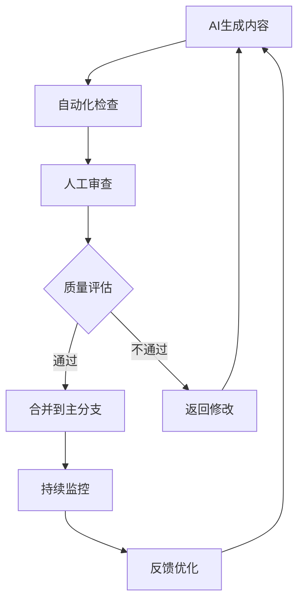
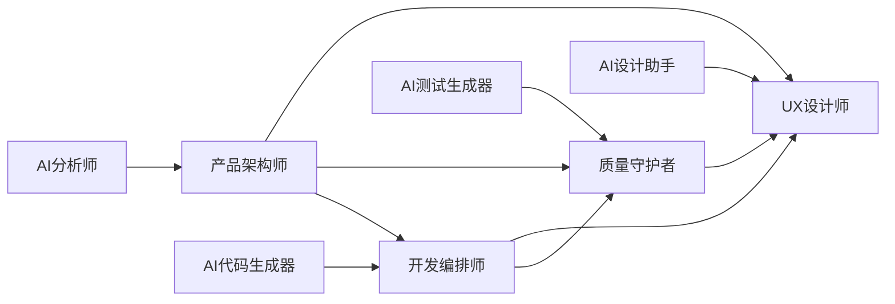
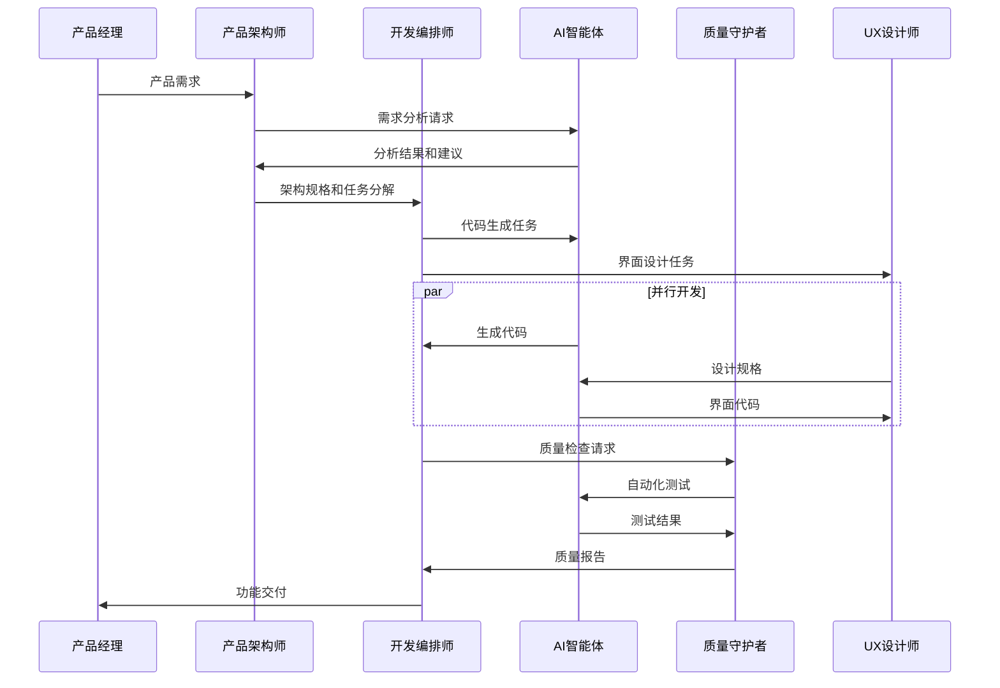

# 第八章：团队协作与AI协作治理

> **本章导读**
>
> 在AI时代，团队协作不再是简单的人与人之间的配合，而是人机协同的复杂编排。如何重新定义团队角色？如何设计高效的协作流程？如何建立AI协作的治理机制？本章将为您提供系统性的解决方案，帮助团队在AI时代实现协作效能的最大化。

---

## 8.1 AI时代的团队协作新范式

### 从传统协作到人机协同

传统的软件开发团队协作模式正在经历根本性变革：

**传统协作模式的局限**：
- **串行依赖**：前端等后端，测试等开发，效率低下
- **沟通成本高**：大量时间消耗在会议和文档同步上
- **知识孤岛**：专业知识分散，难以有效传承和复用
- **质量不稳定**：依赖个人经验，缺乏标准化流程

**AI协作新范式的优势**：
- **并行协作**：AI辅助实现真正的并行开发
- **智能协调**：AI自动处理协调和同步工作
- **知识共享**：AI作为知识载体，实现团队智慧的积累
- **质量保障**：AI提供持续的质量检查和优化建议

### 人机协同的核心原则

**1. 互补性原则（Complementarity）**

人类和AI各有所长，应该发挥各自优势：

```typescript
// 人机协作能力矩阵
interface CollaborationMatrix {
  human: {
    strengths: [
      "创造性思维",
      "战略规划", 
      "情感理解",
      "复杂决策",
      "业务洞察"
    ];
    focus: [
      "产品设计",
      "架构决策",
      "用户体验",
      "团队管理",
      "风险评估"
    ];
  };
  ai: {
    strengths: [
      "代码生成",
      "文档整理",
      "测试执行",
      "数据分析",
      "重复任务"
    ];
    focus: [
      "代码实现",
      "质量检查",
      "性能优化",
      "自动化测试",
      "监控报告"
    ];
  };
}
```

**2. 透明性原则（Transparency）**

所有AI参与的工作都应该是可追溯和可理解的：

```yaml
# AI工作记录模板
ai_work_log:
  task_id: "TASK-2024-001"
  ai_agent: "CodeGen-GPT4"
  human_reviewer: "张三"
  work_type: "代码生成"
  input_spec: "用户登录模块规格文档"
  output_files: 
    - "src/auth/login.ts"
    - "src/auth/login.test.ts"
  quality_score: 0.92
  review_status: "已通过"
  review_comments: "代码质量良好，已添加边界条件处理"
```

**3. 可控性原则（Controllability）**

建立多层次的质量检查点，确保AI输出的可控性：



---

## 8.2 团队角色重新定义

### AI时代的新角色体系

在DDAD方法论下，传统的开发角色需要重新定义：

#### 1. 产品架构师（Product Architect）

**核心职责**：
- 产品战略规划和技术架构设计
- AI工具链的选择和配置
- 跨团队协作的流程设计

**AI协作模式**：
```typescript
class ProductArchitect {
  async designArchitecture(requirements: ProductRequirements): Promise<ArchitectureSpec> {
    // 1. 使用AI分析需求
    const analysis = await this.aiAnalyst.analyzeRequirements(requirements);
    
    // 2. 生成多个架构方案
    const options = await this.aiArchitect.generateOptions(analysis);
    
    // 3. 人工评估和决策
    const selectedOption = this.evaluateAndSelect(options);
    
    // 4. 细化架构规格
    return await this.aiArchitect.refineArchitecture(selectedOption);
  }
  
  private evaluateAndSelect(options: ArchitectureOption[]): ArchitectureOption {
    // 基于业务需求、团队能力、技术约束等因素进行决策
    return this.strategicDecision(options);
  }
}
```

#### 2. 开发编排师（Development Orchestrator）

**核心职责**：
- 协调人机协作流程
- 管理AI智能体的工作分配
- 监控开发进度和质量

**工作流程**：
```typescript
class DevelopmentOrchestrator {
  async orchestrateFeatureDevelopment(feature: FeatureSpec): Promise<void> {
    // 1. 任务分解
    const tasks = await this.aiPlanner.decomposeTasks(feature);
    
    // 2. 智能分配
    const assignments = this.assignTasks(tasks);
    
    // 3. 并行执行
    await Promise.all(assignments.map(assignment => 
      this.executeAssignment(assignment)
    ));
    
    // 4. 集成验证
    await this.validateIntegration(feature);
  }
  
  private assignTasks(tasks: Task[]): Assignment[] {
    return tasks.map(task => ({
      task,
      assignee: this.selectBestAssignee(task), // 可能是人或AI
      priority: this.calculatePriority(task),
      dependencies: this.analyzeDependencies(task)
    }));
  }
}
```

#### 3. 质量守护者（Quality Guardian）

**核心职责**：
- 建立和维护质量标准
- 设计AI辅助的质量检查流程
- 持续优化质量保障机制

**质量保障体系**：
```typescript
class QualityGuardian {
  private qualityGates: QualityGate[] = [
    new CodeQualityGate(),
    new SecurityGate(),
    new PerformanceGate(),
    new BusinessLogicGate()
  ];
  
  async validateDeliverable(deliverable: Deliverable): Promise<QualityReport> {
    const results = await Promise.all(
      this.qualityGates.map(gate => gate.validate(deliverable))
    );
    
    return this.generateQualityReport(results);
  }
  
  async optimizeQualityProcess(): Promise<void> {
    // 分析历史质量数据
    const analytics = await this.aiAnalytics.analyzeQualityTrends();
    
    // 识别改进机会
    const improvements = await this.aiOptimizer.suggestImprovements(analytics);
    
    // 实施优化措施
    await this.implementImprovements(improvements);
  }
}
```

#### 4. 用户体验设计师（UX Designer）

**核心职责**：
- 用户需求分析和体验设计
- AI辅助的用户研究和测试
- 设计系统的建立和维护

**AI协作实践**：
```typescript
class UXDesigner {
  async designUserExperience(userStories: UserStory[]): Promise<UXDesign> {
    // 1. AI辅助用户研究
    const userInsights = await this.aiResearcher.analyzeUserBehavior(userStories);
    
    // 2. 生成设计方案
    const designOptions = await this.aiDesigner.generateDesignOptions(userInsights);
    
    // 3. 人工创意优化
    const optimizedDesign = this.addCreativeTouch(designOptions);
    
    // 4. AI辅助可用性测试
    const testResults = await this.aiTester.simulateUserInteractions(optimizedDesign);
    
    return this.refineDesign(optimizedDesign, testResults);
  }
}
```

### 角色协作矩阵

不同角色之间的协作关系：



---

## 8.3 协作流程设计

### 基于DDAD的协作工作流

#### 1. 需求到交付的完整流程



#### 2. 敏捷开发中的AI协作

**Sprint规划阶段**：
```typescript
class SprintPlanning {
  async planSprint(backlog: UserStory[]): Promise<SprintPlan> {
    // 1. AI辅助工作量估算
    const estimates = await this.aiEstimator.estimateEffort(backlog);
    
    // 2. 智能任务分配
    const assignments = await this.aiPlanner.optimizeAssignments(
      backlog, 
      this.teamCapacity,
      estimates
    );
    
    // 3. 风险识别
    const risks = await this.aiRiskAnalyzer.identifyRisks(assignments);
    
    return {
      stories: assignments,
      risks: risks,
      capacity: this.teamCapacity,
      aiUtilization: this.calculateAIUtilization(assignments)
    };
  }
}
```

**每日站会优化**：
```typescript
class DailyStandup {
  async generateStandupReport(): Promise<StandupReport> {
    // 自动收集进度信息
    const progress = await this.aiTracker.collectProgress();
    
    // 识别阻塞问题
    const blockers = await this.aiAnalyzer.identifyBlockers();
    
    // 生成智能建议
    const suggestions = await this.aiAdvisor.generateSuggestions(progress, blockers);
    
    return {
      progress,
      blockers,
      suggestions,
      aiContributions: this.summarizeAIWork()
    };
  }
}
```

#### 3. 代码审查流程增强

**AI辅助的多层次审查**：
```typescript
class EnhancedCodeReview {
  async reviewPullRequest(pr: PullRequest): Promise<ReviewResult> {
    // 第一层：AI自动审查
    const aiReview = await this.aiReviewer.reviewCode(pr);
    
    // 第二层：人工审查
    const humanReview = await this.assignHumanReviewer(pr, aiReview);
    
    // 第三层：架构一致性检查
    const architectureReview = await this.aiArchitectureChecker.validate(pr);
    
    return this.consolidateReviews([aiReview, humanReview, architectureReview]);
  }
  
  private async assignHumanReviewer(pr: PullRequest, aiReview: AIReviewResult): Promise<HumanReviewResult> {
    // 基于AI审查结果决定是否需要人工审查
    if (aiReview.riskLevel === 'HIGH' || aiReview.complexity > 0.8) {
      return await this.requestHumanReview(pr);
    }
    
    // 低风险代码可以直接通过
    return { approved: true, comments: [] };
  }
}
```

---

## 8.4 AI协作治理机制

### 治理框架设计

#### 1. AI协作治理原则

**透明性（Transparency）**：
```yaml
# AI工作透明度要求
transparency_requirements:
  code_generation:
    - 必须标注AI生成的代码段
    - 记录使用的AI模型和版本
    - 保存生成时的prompt和上下文
  
  decision_making:
    - AI建议必须包含推理过程
    - 人工决策必须记录考虑因素
    - 决策结果必须可追溯
  
  quality_assurance:
    - AI检查结果必须详细记录
    - 人工审查意见必须明确标注
    - 质量标准必须公开透明
```

**可控性（Controllability）**：
```typescript
class AIGovernanceController {
  private controlPoints: ControlPoint[] = [
    {
      stage: 'code_generation',
      checks: ['syntax_validation', 'security_scan', 'performance_check'],
      threshold: 0.9,
      fallback: 'human_review'
    },
    {
      stage: 'architecture_decision',
      checks: ['consistency_check', 'scalability_analysis'],
      threshold: 0.95,
      fallback: 'architect_approval'
    }
  ];
  
  async validateAIOutput(output: AIOutput): Promise<ValidationResult> {
    const controlPoint = this.findControlPoint(output.stage);
    
    for (const check of controlPoint.checks) {
      const result = await this.executeCheck(check, output);
      
      if (result.score < controlPoint.threshold) {
        return this.triggerFallback(controlPoint.fallback, output);
      }
    }
    
    return { approved: true, confidence: this.calculateConfidence(output) };
  }
}
```

**责任归属（Accountability）**：
```typescript
interface ResponsibilityMatrix {
  ai_generated_code: {
    primary_responsible: "开发编排师";
    review_responsible: "质量守护者";
    final_accountable: "产品架构师";
  };
  
  ai_architecture_suggestions: {
    primary_responsible: "产品架构师";
    review_responsible: "技术委员会";
    final_accountable: "技术负责人";
  };
  
  ai_test_cases: {
    primary_responsible: "质量守护者";
    review_responsible: "开发编排师";
    final_accountable: "质量负责人";
  };
}
```

#### 2. 质量检查点设计

**多层次质量门禁**：
```typescript
class QualityGateSystem {
  private gates: QualityGate[] = [
    new SyntaxGate(),           // 语法检查
    new SecurityGate(),         // 安全检查
    new PerformanceGate(),      // 性能检查
    new BusinessLogicGate(),    // 业务逻辑检查
    new ArchitectureGate(),     // 架构一致性检查
    new DocumentationGate()     // 文档完整性检查
  ];
  
  async validateDeliverable(deliverable: Deliverable): Promise<GateResult> {
    const results: GateResult[] = [];
    
    for (const gate of this.gates) {
      const result = await gate.validate(deliverable);
      results.push(result);
      
      // 如果关键门禁失败，立即停止
      if (gate.isCritical && !result.passed) {
        return this.createFailureResult(gate, result);
      }
    }
    
    return this.consolidateResults(results);
  }
}
```

#### 3. 风险管理体系

**AI协作风险识别**：
```typescript
class AICollaborationRiskManager {
  private riskCategories = {
    technical: [
      'ai_model_bias',
      'code_quality_degradation', 
      'security_vulnerabilities',
      'performance_regression'
    ],
    process: [
      'over_reliance_on_ai',
      'skill_degradation',
      'communication_breakdown',
      'quality_gate_bypass'
    ],
    business: [
      'intellectual_property_leak',
      'compliance_violation',
      'customer_trust_loss',
      'competitive_disadvantage'
    ]
  };
  
  async assessRisks(project: Project): Promise<RiskAssessment> {
    const risks: Risk[] = [];
    
    for (const [category, riskTypes] of Object.entries(this.riskCategories)) {
      for (const riskType of riskTypes) {
        const risk = await this.evaluateRisk(project, category, riskType);
        if (risk.probability > 0.3 || risk.impact > 0.7) {
          risks.push(risk);
        }
      }
    }
    
    return {
      risks,
      overallRiskLevel: this.calculateOverallRisk(risks),
      mitigationPlan: await this.generateMitigationPlan(risks)
    };
  }
}
```

---

## 8.5 协作效能度量

### 关键指标体系

#### 1. 协作效率指标

```typescript
interface CollaborationMetrics {
  // 开发效率
  development_velocity: {
    story_points_per_sprint: number;
    ai_contribution_ratio: number;
    human_ai_collaboration_score: number;
  };
  
  // 沟通效率
  communication_efficiency: {
    meeting_time_reduction: number;
    documentation_automation_ratio: number;
    knowledge_sharing_score: number;
  };
  
  // 质量效率
  quality_efficiency: {
    defect_detection_rate: number;
    automated_review_coverage: number;
    quality_gate_pass_rate: number;
  };
}
```

#### 2. 团队协作健康度

```typescript
class TeamCollaborationHealth {
  async assessTeamHealth(): Promise<HealthReport> {
    const metrics = await this.collectMetrics();
    
    return {
      overall_score: this.calculateOverallScore(metrics),
      dimensions: {
        trust: this.assessTrust(metrics),
        communication: this.assessCommunication(metrics),
        ai_adoption: this.assessAIAdoption(metrics),
        skill_development: this.assessSkillDevelopment(metrics)
      },
      recommendations: await this.generateRecommendations(metrics)
    };
  }
  
  private assessTrust(metrics: Metrics): TrustScore {
    return {
      human_ai_trust: metrics.ai_suggestion_acceptance_rate,
      team_trust: metrics.code_review_approval_rate,
      process_trust: metrics.quality_gate_bypass_rate
    };
  }
}
```

### 持续改进机制

#### 1. 协作模式优化

```typescript
class CollaborationOptimizer {
  async optimizeCollaboration(): Promise<OptimizationPlan> {
    // 1. 分析当前协作模式
    const currentState = await this.analyzeCurrentCollaboration();
    
    // 2. 识别瓶颈和改进机会
    const bottlenecks = await this.identifyBottlenecks(currentState);
    
    // 3. 生成优化建议
    const suggestions = await this.aiOptimizer.generateSuggestions(bottlenecks);
    
    // 4. 制定实施计划
    return this.createImplementationPlan(suggestions);
  }
  
  private async identifyBottlenecks(state: CollaborationState): Promise<Bottleneck[]> {
    return [
      await this.analyzeWaitTimes(state),
      await this.analyzeCommunicationGaps(state),
      await this.analyzeSkillGaps(state),
      await this.analyzeToolGaps(state)
    ].flat();
  }
}
```

#### 2. 学习和适应机制

```typescript
class AdaptiveLearningSystem {
  async learnFromCollaboration(): Promise<LearningInsights> {
    // 收集协作数据
    const data = await this.collectCollaborationData();
    
    // 分析成功模式
    const successPatterns = await this.aiAnalyzer.identifySuccessPatterns(data);
    
    // 识别失败原因
    const failureReasons = await this.aiAnalyzer.analyzeFailures(data);
    
    // 更新协作策略
    await this.updateCollaborationStrategies(successPatterns, failureReasons);
    
    return {
      patterns: successPatterns,
      lessons: failureReasons,
      improvements: await this.generateImprovements()
    };
  }
}
```

---

## 8.6 实施指南与最佳实践

### 分阶段实施策略

#### 第一阶段：基础设施建设（1-2个月）

**目标**：建立AI协作的基础环境

**关键任务**：
```yaml
phase_1_tasks:
  infrastructure:
    - 部署AI开发工具链
    - 建立代码仓库和CI/CD流水线
    - 配置质量检查工具
  
  process:
    - 制定AI协作规范
    - 建立质量门禁标准
    - 设计协作工作流
  
  training:
    - AI工具使用培训
    - 协作流程培训
    - 质量标准培训
```

#### 第二阶段：试点项目（2-3个月）

**目标**：在小范围内验证协作模式

**实施策略**：
```typescript
class PilotProject {
  async executePilot(): Promise<PilotResult> {
    // 1. 选择合适的试点项目
    const project = this.selectPilotProject({
      complexity: 'medium',
      risk: 'low',
      team_size: 3-5,
      duration: '2-3 months'
    });
    
    // 2. 配置AI协作环境
    await this.setupAICollaboration(project);
    
    // 3. 执行项目
    const result = await this.executeWithAI(project);
    
    // 4. 收集反馈和数据
    const feedback = await this.collectFeedback(result);
    
    return this.analyzePilotResults(result, feedback);
  }
}
```

#### 第三阶段：全面推广（3-6个月）

**目标**：在整个团队中推广AI协作模式

**推广计划**：
```typescript
class RolloutPlan {
  async executeRollout(): Promise<RolloutResult> {
    const phases = [
      { teams: ['核心开发团队'], duration: '1个月' },
      { teams: ['前端团队', '后端团队'], duration: '2个月' },
      { teams: ['测试团队', '运维团队'], duration: '2个月' },
      { teams: ['全部团队'], duration: '1个月' }
    ];
    
    for (const phase of phases) {
      await this.rolloutToTeams(phase.teams);
      await this.monitorAndAdjust(phase.duration);
    }
    
    return this.generateRolloutReport();
  }
}
```

### 成功要素

#### 1. 领导层支持

```typescript
interface LeadershipSupport {
  commitment: {
    resource_allocation: "充足的工具和培训预算";
    time_investment: "允许学习和适应期";
    change_management: "积极推动文化变革";
  };
  
  communication: {
    vision_sharing: "清晰传达AI协作愿景";
    progress_tracking: "定期跟踪和汇报进展";
    success_celebration: "庆祝协作成功案例";
  };
}
```

#### 2. 团队文化建设

```typescript
class CultureBuilder {
  async buildAICollaborationCulture(): Promise<CulturePlan> {
    return {
      values: [
        "拥抱AI，但不依赖AI",
        "人机协同，优势互补", 
        "持续学习，快速适应",
        "质量第一，效率并重"
      ],
      
      practices: [
        "定期AI协作复盘",
        "最佳实践分享会",
        "跨团队协作项目",
        "AI工具创新竞赛"
      ],
      
      recognition: [
        "AI协作创新奖",
        "质量改进贡献奖",
        "团队协作优秀奖"
      ]
    };
  }
}
```

#### 3. 持续优化机制

```typescript
class ContinuousImprovement {
  async establishImprovementLoop(): Promise<ImprovementSystem> {
    return {
      data_collection: {
        metrics: "自动收集协作指标",
        feedback: "定期收集团队反馈",
        observation: "观察协作行为模式"
      },
      
      analysis: {
        trend_analysis: "分析协作效能趋势",
        bottleneck_identification: "识别协作瓶颈",
        best_practice_extraction: "提取最佳实践"
      },
      
      action: {
        process_optimization: "优化协作流程",
        tool_enhancement: "改进AI工具配置",
        training_update: "更新培训内容"
      }
    };
  }
}
```

---

## 8.7 本章小结

### 核心要点回顾

1. **协作范式转变**：从传统的人人协作转向人机协同，实现效率和质量的双重提升

2. **角色重新定义**：在AI时代，团队角色需要重新设计，强调人机协作的专业能力

3. **流程系统化**：建立基于DDAD的协作工作流，实现高效的并行开发和质量保障

4. **治理机制完善**：通过透明性、可控性、责任归属等原则，确保AI协作的安全可控

5. **持续改进**：建立度量体系和优化机制，实现协作模式的持续演进

### DDAD价值体现

**文档驱动（Document-Driven）**：
- 清晰的角色定义和职责文档
- 标准化的协作流程规范
- 完整的治理制度文档

**AI智能体协作（AI Agent Collaboration）**：
- 人机协同的工作模式
- 智能化的任务分配和执行
- AI辅助的质量保障体系

**知识即代码（Knowledge as Code）**：
- 协作经验的代码化管理
- 最佳实践的版本化存储
- 团队智慧的持续积累

**协作即编排（Collaboration as Orchestration）**：
- 优化的人机协作编排
- 高效的团队协作流程
- 智能的资源配置机制

### 实践建议

1. **从小做起**：选择合适的试点项目，逐步验证和优化协作模式

2. **重视培训**：投入充足资源进行AI协作技能培训，提升团队适应能力

3. **建立文化**：营造开放、学习、创新的团队文化，拥抱AI协作变革

4. **持续优化**：建立完善的度量和反馈机制，持续改进协作效能

5. **风险管控**：建立完善的治理机制，确保AI协作的安全可控

---

**下一章预告**：第九章将深入探讨DDAD方法论的评估体系，帮助团队量化协作效果，持续优化实施策略。

---

## 思考题

1. **角色转换**：在您的团队中，哪些角色最适合转型为AI协作模式？需要哪些新技能？

2. **流程设计**：如何设计适合您团队的人机协作工作流？关键控制点在哪里？

3. **治理机制**：在您的组织中，如何建立AI协作的治理机制？谁来承担责任？

4. **文化建设**：如何在团队中建立拥抱AI协作的文化？可能遇到哪些阻力？

---

*💡 **实践建议**：开始记录您团队当前的协作模式，识别可以通过AI优化的环节，为实施人机协作做好准备。*