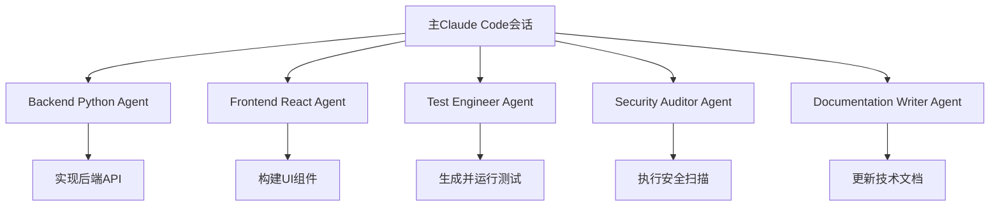

# 附录A: 10xDevelopers实践指南

> 本附录基于10xDevelopers.dev社区的前沿实践,补充DDAD方法论在快速MVP开发中的具体应用

---

## 🎯 10xDevelopers社区与DDAD的契合点

10xDevelopers.dev是一个AI驱动的开发者社区,其核心理念与DDAD方法论高度契合。两者都强调:

1. **文档/规范驱动**: 10xDevelopers强调Spec-Driven Design,与DDAD的文档驱动理念完全一致
2. **AI作为协作伙伴**: 而非简单工具,与DDAD的AI智能体伙伴理念相呼应
3. **快速迭代验证**: 跳过传统冗长设计阶段,快速构建可用MVP
4. **结构化流程**: 从规划到部署的完整结构化开发流程

---

## 🚀 Vibe Coding实践精髓

### 核心理念对比

| 维度 | 传统开发 | Vibe Coding (10xDevelopers) | DDAD方法论 |
|------|---------|----------------------------|------------|
| **设计阶段** | 数周静态设计 | 跳过传统设计,直接构建 | 文档驱动快速原型 |
| **规划方式** | 冗长的文档 | ChatGPT Voice + CodeGuide自动化PRD | 结构化文档+AI辅助生成 |
| **开发速度** | 数月 | 数周 | 数周(结合AI加速) |
| **反馈循环** | 长周期 | 每周迭代 | 持续迭代验证 |
| **工具栈** | 传统IDE | Lovable + Cursor + AI工具 | AI工具链+Claude Code |

### Vibe Coding的12条黄金法则

根据10xDevelopers社区的实践总结,以下是避免挫折的12条核心规则:

1. **从小处着手**: MVP优先,避免功能膨胀
2. **立即验证**: 不要等到完美才发布
3. **拥抱AI辅助**: 让AI承担重复性工作
4. **保持迭代节奏**: 每周一次可见进展
5. **文档先行**: 清晰的规范是AI理解的基础
6. **快速失败**: 早期发现问题比后期修复成本低
7. **用户反馈优先**: 真实用户数据胜过假设
8. **技术债务可控**: 在MVP阶段接受适度的技术债务
9. **自动化测试**: AI辅助生成测试用例
10. **持续部署**: Vercel等平台实现零配置部署
11. **安全内建**: 从第一天就考虑安全(RLS等)
12. **心理安全**: 团队成员可以自由实验和犯错

---

## 📋 10xDevelopers结构化开发流程

10xDevelopers提供了一套完整的结构化开发流程,与DDAD的文档驱动理念完美结合:

### 1. ⚡ 寻找构建目标 (Find Something to Build)

**目的**: 快速识别有价值的构建目标

**DDAD结合点**:
- 使用AI工具(ChatGPT Voice)进行快速头脑风暴
- 记录在`docs/01-requirements/ideas.md`
- 使用MoSCoW方法(Must/Should/Could/Won't)进行优先级排序

**关键产物**:
```markdown
# 项目创意文档 (ideas.md)

## 核心问题
[描述要解决的核心问题]

## 目标用户
[用户画像和痛点]

## MoSCoW优先级
- **Must have**: 核心功能1, 核心功能2
- **Should have**: 重要功能1, 重要功能2
- **Could have**: 锦上添花功能
- **Won't have**: 明确不做的功能
```

### 2. 🧠 快速规划 (Rapid Planning)

**工具链**:
- **ChatGPT Voice**: 客户需求快速头脑风暴
- **CodeGuideDev**: 自动生成PRD和技术文档
- **Claude Code**: 需求细化和技术方案评估

**DDAD实施**:
```bash
# 使用AI工具快速生成PRD
claude-code "基于以下创意生成完整PRD: [粘贴ideas.md内容]"

# 输出结构化PRD到DDAD文档体系
# → docs/01-requirements/PRD.md
# → docs/01-requirements/user-stories.md
```

**关键产物**:
- PRD.md (产品需求文档)
- user-stories.md (用户故事)
- technical-constraints.md (技术约束)

### 3. 🎯 需求细化 (Requirements)

**10xDevelopers实践**:
- 使用AI助手澄清需求模糊点
- 将需求转化为可测试的验收标准
- 识别跨功能需求(性能、安全、可扩展性)

**DDAD文档结构**:
```
docs/01-requirements/
├── PRD.md                    # 产品需求文档
├── user-stories.md           # 用户故事
├── acceptance-criteria.md    # 验收标准
└── non-functional-requirements.md  # 非功能需求
```

### 4. ⚙️ 技术栈选择 (Tech Stack)

**10xDevelopers推荐的现代AI友好技术栈**:

| 层次 | 10xDevelopers推荐 | DDAD推荐 | 理由 |
|------|------------------|----------|------|
| **UI构建** | Lovable.dev | Lovable/v0.dev/Cursor | AI原生,快速原型 |
| **开发IDE** | Cursor AI | Cursor/Claude Code | AI深度集成 |
| **后端** | Supabase | Supabase/Firebase | 开箱即用功能 |
| **部署** | Vercel | Vercel/Netlify | 零配置部署 |
| **数据库** | PostgreSQL (via Supabase) | PostgreSQL/MySQL | 关系型+JSON支持 |
| **认证** | Supabase Auth | Supabase Auth/Auth0 | OAuth+Magic Link |

**技术栈文档模板**:
```markdown
# 技术栈选择 (tech-stack.md)

## 前端技术
- **框架**: React + TypeScript
- **UI构建**: Lovable.dev (AI辅助快速构建)
- **状态管理**: React Query + Zustand
- **样式**: Tailwind CSS

## 后端技术
- **BaaS平台**: Supabase
- **数据库**: PostgreSQL (via Supabase)
- **认证**: Supabase Auth (OAuth + Magic Link)
- **文件存储**: Supabase Storage
- **Edge Functions**: Supabase Functions

## 部署与运维
- **托管平台**: Vercel
- **CDN**: Vercel Edge Network
- **监控**: Vercel Analytics
- **日志**: Supabase Logs

## 开发工具
- **主IDE**: Cursor AI
- **AI助手**: Claude Code (subagents)
- **版本控制**: Git + GitHub
- **CI/CD**: Vercel自动部署
```

### 5. 🎨 应用流程设计 (App Flow)

**10xDevelopers方法**:
- 使用AI生成站点地图(Sitemap)
- Lovable.dev快速构建交互原型
- 跳过传统的静态线框图阶段

**DDAD实施**:
```markdown
# 站点地图设计 (sitemap.md)

## 用户旅程
[Mermaid流程图描述关键用户旅程]

## 页面结构
- 首页 (/)
  - Hero区域
  - 功能展示
  - CTA按钮
- 登录页 (/login)
- 仪表板 (/dashboard)
- 用户设置 (/settings)

## UI原型链接
- Lovable项目: [链接]
- Figma设计: [可选]
```

### 6. 🔧 设计规范 (Design Spec)

**关键文档**:
```markdown
# 设计规范 (design-spec.md)

## 视觉风格
- 主色调: #hexcode
- 字体: Inter, system-ui
- 圆角: 8px
- 阴影: tailwind default

## 组件库
- 基于Shadcn/ui
- 自定义组件: [列表]

## 响应式断点
- Mobile: < 640px
- Tablet: 640px - 1024px
- Desktop: > 1024px

## 可访问性
- WCAG 2.1 AA标准
- 键盘导航支持
- 屏幕阅读器兼容
```

### 7. 🚀 实施阶段 (Implementation)

**10xDevelopers三步实施法**:

#### 步骤1: Lovable MVP (70-80%核心功能)

**使用场景**:
- 快速构建响应式UI
- 内置认证和表单
- 基础CRUD操作

**DDAD结合**:
```bash
# 在Lovable中根据design-spec.md快速构建
# 生成代码后同步到GitHub

git clone [lovable-repo]
cd project
# 导入到Cursor进行增强
```

#### 步骤2: Cursor增强开发 (20-30%高级功能)

**使用Cursor进行**:
- 复杂业务逻辑实现
- API精细化调整
- 性能优化
- 多文件重构

**Subagents使用**:
```bash
# 在项目中创建.claude/agents/目录
# 定义专业化subagents

# backend-python.json - Python后端开发
# frontend-react.json - React前端开发
# test-engineer.json - 测试工程师
# security-auditor.json - 安全审计
```

#### 步骤3: 测试与验证

**10xDevelopers测试策略**:
- 单元测试: AI辅助生成(>80%覆盖率)
- 集成测试: 关键用户旅程
- E2E测试: Playwright自动化
- 安全扫描: 自动化安全审计

### 8. 🔐 安全实施 (Security)

**10xDevelopers安全清单**:

```markdown
# 安全实施清单

## 认证与授权
- [ ] Supabase RLS (Row-Level Security)策略
- [ ] OAuth社交登录
- [ ] Magic Link邮箱登录
- [ ] 多因素认证(可选)

## API安全
- [ ] Vercel速率限制
- [ ] API密钥保护(.env文件)
- [ ] CORS配置
- [ ] 服务端输入验证

## 数据安全
- [ ] 敏感数据加密
- [ ] SQL注入防护
- [ ] XSS防护
- [ ] CSRF令牌

## 监控
- [ ] Supabase日志
- [ ] Vercel Analytics
- [ ] 错误追踪(Sentry可选)
```

### 9. 🌐 部署 (Deployment)

**零配置Vercel部署**:

```bash
# 连接GitHub仓库到Vercel
# Vercel自动检测框架并配置

# 环境变量配置(在Vercel Dashboard)
SUPABASE_URL=your_url
SUPABASE_ANON_KEY=your_key
NEXT_PUBLIC_APP_URL=https://yourdomain.com

# 自动化部署
git push origin main
# → Vercel自动构建和部署
# → 预览链接即时可用
```

**DDAD部署文档**:
```markdown
# 部署指南 (deployment.md)

## Vercel配置
- 框架: Next.js
- 构建命令: npm run build
- 输出目录: .next
- Node版本: 18.x

## 环境变量
[列出所有必需的环境变量]

## 自定义域名
1. 在Vercel添加域名
2. 配置DNS记录
3. 自动HTTPS证书

## 回滚策略
- Vercel保留所有部署历史
- 一键回滚到任意版本
```

### 10. 📝 文档与维护 (Documentation & Maintenance)

**持续维护**:
- 每周反馈收集
- 双周迭代发布
- 月度性能审查
- 季度技术债务清理

---

## 🤖 Spec-Driven Subagents实践

### 什么是Subagents?

Subagents是Claude Code的高级功能,允许创建专业化的AI代理,每个代理有:

- **特定专长领域**: 如Python后端、React前端、测试工程
- **独立上下文窗口**: 不占用主会话的token
- **定制化工具权限**: 只能使用特定的工具集
- **自定义系统提示**: 引导其行为和输出风格

### DDAD中的Subagents架构



### 创建Subagents最佳实践

#### 1. 定义Agent专长

每个agent应该有明确的职责边界:

**backend-python-agent.json**:
```json
{
  "name": "backend-python",
  "description": "Python后端开发专家,负责API实现、数据库交互和业务逻辑",
  "systemPrompt": "你是一个Python后端开发专家,专注于:\n- FastAPI/Flask API开发\n- SQLAlchemy数据库操作\n- Pydantic数据验证\n- 异步编程最佳实践\n- 遵循PEP8编码规范\n\n请基于docs/02-design/目录中的设计规范进行开发。",
  "allowedTools": ["Read", "Write", "Edit", "Bash", "Grep"],
  "temperature": 0.3
}
```

**test-engineer-agent.json**:
```json
{
  "name": "test-engineer",
  "description": "测试工程师,负责生成测试用例、运行测试并验证代码质量",
  "systemPrompt": "你是一个测试工程师,专注于:\n- pytest单元测试编写\n- 测试覆盖率分析\n- 集成测试设计\n- 边界条件和异常场景测试\n\n验证标准:\n- 单元测试覆盖率 > 80%\n- 所有测试必须通过\n- 关键路径必须有集成测试\n\n只有当所有测试通过时,才标记任务为完成。",
  "allowedTools": ["Read", "Bash", "Grep"],
  "temperature": 0.2
}
```

#### 2. Agent间的协作协议

**协作规则**:
```markdown
# Subagents协作规则 (CLAUDE.md)

## 任务分配原则
1. **backend-python**: 处理所有Python后端代码
2. **frontend-react**: 处理所有React/TypeScript前端代码
3. **test-engineer**: 所有测试相关任务
4. **security-auditor**: 安全审查和漏洞扫描

## 防止冲突
- 不同agent不能同时修改同一文件
- 使用明确的文件边界划分责任
- 主会话负责协调和冲突解决

## 验证机制
- coding agent完成后→test agent验证
- 测试失败→coding agent修复→重新测试
- 循环直到测试全部通过

## 并行化
- 独立功能模块可以并行开发
- 前后端可以基于API规范并行实现
```

#### 3. 实战示例:使用Subagents开发功能

**场景**: 实现用户认证功能

**步骤1**: 主会话任务分解
```markdown
我要实现用户认证功能,包括注册、登录、登出。

请创建以下subagents并分配任务:
1. backend-python: 实现认证API端点
2. frontend-react: 实现登录注册UI
3. test-engineer: 编写认证测试
```

**步骤2**: Backend Agent执行
```bash
# backend-python agent接收任务
任务: 实现用户认证API
参考文档: docs/02-design/api-spec.md

# 生成代码
- src/api/auth.py (API端点)
- src/models/user.py (用户模型)
- src/services/auth_service.py (认证逻辑)
```

**步骤3**: Test Agent验证
```bash
# test-engineer agent接收任务
任务: 验证认证API实现

# 生成并运行测试
- tests/test_auth_api.py
- pytest --cov=src/api/auth

# 如果失败,报告问题给backend agent
```

**步骤4**: Frontend Agent并行开发
```bash
# frontend-react agent接收任务
任务: 实现登录注册UI
API规范: docs/02-design/api-spec.md (使用Mock数据)

# 生成代码
- components/AuthForm.tsx
- pages/login.tsx
- pages/register.tsx
```

#### 4. Subagents配置Prompt

使用以下prompt让Claude Code自动创建适合你项目的subagents:

```markdown
我正在使用DDAD方法论开发一个[项目类型]项目,技术栈是[列出技术栈]。

请根据我的项目特点和以下DDAD文档结构:
- docs/01-requirements/ (需求文档)
- docs/02-design/ (设计规范)
- docs/03-implementation/ (实施计划)

创建最合适的subagents配置,要求:
1. 每个agent有明确的职责边界
2. 定义agent间的协作规则
3. 配置验证机制防止过早标记完成
4. 支持任务并行化

请实现这些subagents配置文件到.claude/agents/目录。
```

---

## 🎯 DDAD与10xDevelopers融合的最佳实践

### 1. 快速MVP工作流

**Week 1: 规划与原型**
- Day 1-2: ChatGPT Voice + CodeGuide生成PRD
- Day 3-4: 技术栈选择和架构设计
- Day 5-7: Lovable快速构建UI原型

**Week 2-3: 核心开发**
- Lovable实现70-80%核心功能
- Cursor增强20-30%复杂功能
- Subagents并行处理独立模块

**Week 4: 测试与部署**
- Test subagent验证所有功能
- Security subagent执行安全扫描
- Vercel一键部署到生产环境

### 2. 工具链最佳实践

| 开发阶段 | 10xDevelopers工具 | DDAD文档 | AI助手 |
|---------|------------------|----------|--------|
| **规划** | ChatGPT Voice, CodeGuide | PRD.md, user-stories.md | Claude Code (brainstorm) |
| **原型** | Lovable.dev | design-spec.md | Claude Code (design) |
| **开发** | Cursor AI | implementation-plan.md | Subagents (parallel) |
| **测试** | Playwright | test-plan.md | Test subagent |
| **部署** | Vercel | deployment.md | DevOps subagent |

### 3. 文档同步策略

**从10xDevelopers工作流生成DDAD文档**:

```bash
# 自动化文档生成脚本
claude-code "请根据我们的Lovable项目,生成完整的DDAD文档集:
1. 从Lovable代码反向生成design-spec.md
2. 从当前实现生成implementation-plan.md
3. 从Supabase schema生成data-models.md
4. 更新所有相关文档到docs/目录"
```

### 4. 质量门禁

**DDAD质量检查清单**:
```markdown
## 发布前检查

### 文档完整性
- [ ] PRD与实现一致
- [ ] API规范与代码匹配
- [ ] 所有关键决策有ADR记录

### 代码质量
- [ ] 单元测试覆盖率 > 80%
- [ ] 所有测试通过
- [ ] Linter无错误
- [ ] TypeScript类型检查通过

### 安全性
- [ ] RLS策略配置正确
- [ ] 敏感数据已加密
- [ ] API速率限制已启用
- [ ] 安全扫描通过

### 性能
- [ ] Lighthouse Score > 90
- [ ] 核心API响应 < 200ms
- [ ] 首屏加载 < 2s

### 部署就绪
- [ ] 环境变量已配置
- [ ] 数据库migration已执行
- [ ] 监控和日志已启用
```

---

## 📚 学习资源

### 10xDevelopers社区资源

1. **官方指南**
   - Ultimate Vibe Coding Guide: https://10xdevelopers.dev/guides/ultimate-vibe-coding-guide/
   - Structured Development Process: https://10xdevelopers.dev/structured/

2. **工具文档**
   - Lovable.dev: https://lovable.dev
   - Cursor AI: https://cursor.com
   - Claude Code Subagents: https://docs.anthropic.com/en/docs/claude-code/sub-agents

3. **社区最佳实践**
   - 12 Rules to Vibe Code: https://creatoreconomy.so/p/12-rules-to-vibe-code-without-frustration
   - The Way of Code: https://www.thewayofcode.com/

### DDAD相关资源

1. **Spec-Driven Development**
   - mosofsky/spec-then-code: https://github.com/mosofsky/spec-then-code
   - Spec-Driven Vibe Coding: https://vivekhaldar.com/articles/spec-driven-vibe-coding/

2. **Agent框架**
   - LangGraph: https://10xdevelopers.dev/agent-frameworks/langgraph/
   - CrewAI: https://10xdevelopers.dev/agent-frameworks/crewai/
   - Mastra: https://10xdevelopers.dev/agent-frameworks/mastra/

---

## 🌟 总结

10xDevelopers社区的实践为DDAD方法论提供了丰富的实战经验:

1. **快速验证优先**: 跳过传统冗长设计,直接构建可用原型
2. **工具链现代化**: Lovable + Cursor + Supabase + Vercel的组合极大提升效率
3. **Subagents并行化**: 利用Claude Code的subagents功能实现任务并行和专业化
4. **文档持续同步**: 在快速迭代中保持文档与代码的一致性

DDAD方法论为10xDevelopers实践提供了系统化的文档框架,而10xDevelopers的工具链和实践经验反过来丰富了DDAD的实施细节。两者结合,为AI时代的高效开发提供了完整的方法论和工具支持。

---

**下一步行动**:
1. 访问10xDevelopers.dev探索更多实践案例
2. 在自己的项目中尝试Lovable快速原型
3. 配置Claude Code subagents实现任务并行
4. 建立DDAD文档体系与10xDevelopers工作流的映射

**关键启示**:
> "在AI时代,速度不再以牺牲质量为代价。通过文档驱动+AI智能体+现代工具链的组合,我们可以在数周内完成过去需要数月的工作,同时保持更高的代码质量和文档完整性。"
