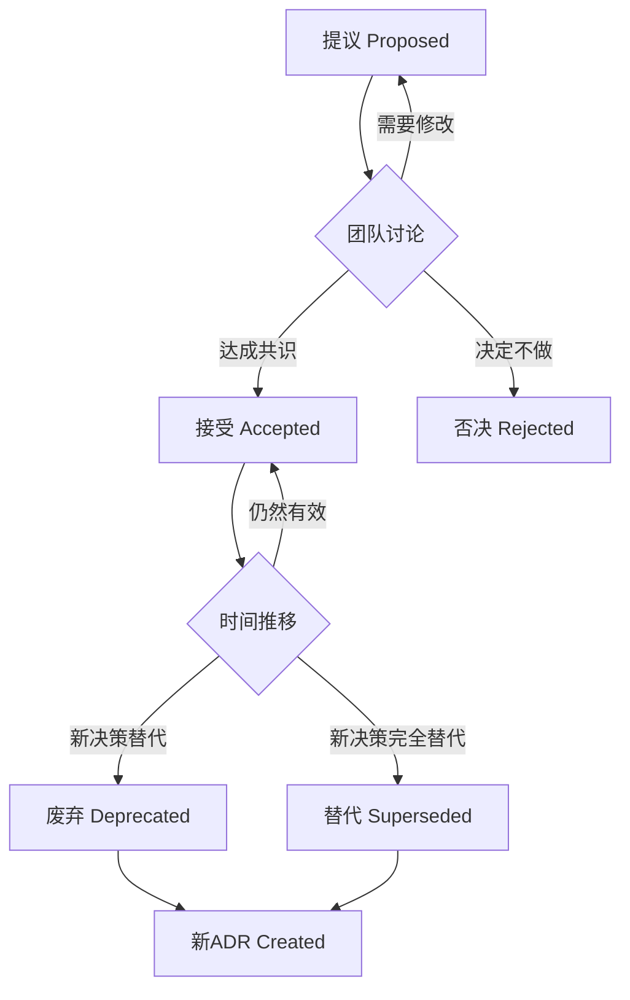
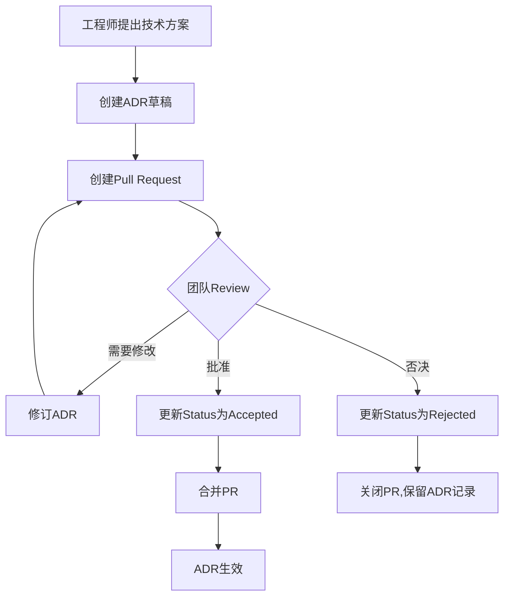

# 第十四章:技术决策记录(ADR)

> **本章导读**
>
> 深入学习技术决策记录(ADR)的概念、模板和工作流,掌握如何记录和管理关键技术决策,理解TechMeet项目中的实际决策案例,以及如何将ADR集成到团队开发流程中。

---

## 14.1 什么是ADR

### ADR的定义和价值

**Architecture Decision Record (ADR)定义**:

```markdown
# ADR = Architecture Decision Record

## 核心概念

ADR是一种**轻量级文档**,记录重要的架构和技术决策:
- **What**: 做了什么决定
- **Why**: 为什么做这个决定
- **Context**: 当时的背景和约束条件
- **Consequences**: 决策带来的影响(正面和负面)
- **Status**: 决策的当前状态(提议、接受、废弃、替代)

## 为什么需要ADR?

### 问题1: 决策不透明
❌ **症状**:
- "为什么当初选择PostgreSQL而不是MongoDB?"
- "谁决定用Vercel部署的?有什么考量?"
- 新人:项目为什么这样设计?老人:忘了,当时好像是...

✅ **ADR解决方案**:
- 每个重要决策都有文档
- 记录决策的理由和权衡
- 新人可以快速了解历史决策

### 问题2: 决策遗忘
❌ **症状**:
- 6个月后重新讨论已经否决的方案
- 重复犯相同的错误
- 浪费时间重新评估

✅ **ADR解决方案**:
- 记录被否决的方案和原因
- 避免重复讨论
- 保留历史教训

### 问题3: 决策缺乏共识
❌ **症状**:
- 团队对技术选型意见不一
- 事后有人说"我当时不同意"
- 缺乏明确的决策流程

✅ **ADR解决方案**:
- 正式的决策提议和讨论
- 明确的决策者和审查流程
- 团队共识的证据

### 问题4: 架构演化不可追溯
❌ **症状**:
- 不知道为什么有这个技术债务
- 架构变迁历史丢失
- 无法评估当初决策是否正确

✅ **ADR解决方案**:
- 完整的决策历史链
- 可追溯的架构演化
- 可以回顾和学习
```

---

### ADR vs 其他文档的区别

| 维度 | ADR | PRD | 设计文档 | README |
|------|-----|-----|---------|--------|
| **关注点** | 技术决策 | 产品需求 | 实现细节 | 使用说明 |
| **目标读者** | 技术团队 | PM+Tech | 开发者 | 用户+开发者 |
| **时效性** | 永久性 | 阶段性 | 实时更新 | 实时更新 |
| **更新频率** | 一次性(不可变) | 迭代更新 | 频繁更新 | 频繁更新 |
| **长度** | 1-2页 | 5-20页 | 10-50页 | 3-10页 |
| **结构** | 固定模板 | 灵活 | 灵活 | 惯例结构 |

**关键特征**:
- ADR是**不可变的**(immutable):一旦接受,不应修改内容
- 如果决策改变,创建新ADR替代旧ADR,而非修改原ADR
- ADR记录**决策的理由**,不是技术细节的实现

---

### 何时应该写ADR?

**应该写ADR的场景**:

```markdown
## ✅ 需要ADR的决策

### 1. 技术栈选择
- 编程语言、框架、数据库选型
- 示例: "为什么用Next.js而不是CRA?"

### 2. 架构决策
- 单体 vs 微服务
- 前后端分离 vs 全栈框架
- 示例: "为什么采用Serverless架构?"

### 3. 第三方服务集成
- 云服务提供商选择
- SaaS工具集成
- 示例: "为什么用Supabase而不是自建后端?"

### 4. 安全和合规决策
- 认证方案选择
- 数据加密策略
- 示例: "为什么使用Row Level Security?"

### 5. 性能权衡
- 缓存策略
- 数据库索引设计
- 示例: "为什么用Redis而不是内存缓存?"

### 6. 团队流程
- Git工作流选择
- CI/CD pipeline设计
- 示例: "为什么用GitHub Actions而不是Jenkins?"

## ❌ 不需要ADR的决策

### 1. 实现细节
- 某个函数怎么写(代码注释足够)
- 变量命名(代码规范足够)

### 2. 临时性决策
- 临时的workaround
- 测试环境配置

### 3. 显而易见的选择
- 用React写React项目
- 用npm管理Node.js依赖

### 4. 可逆的小决策
- 尝试某个库(不满意随时换)
- UI组件的颜色选择
```

**判断标准**:
> **如果6个月后有人问"为什么这样做?",你需要超过5分钟才能回答清楚,那就应该写ADR。**

---

### ADR的生命周期



**状态说明**:

| 状态 | 说明 | 何时使用 |
|------|------|----------|
| **Proposed** 提议 | 决策提议,待讨论 | ADR刚创建,等待团队review |
| **Accepted** 接受 | 决策已采纳,正在执行 | 团队达成共识,开始实施 |
| **Rejected** 否决 | 决策被拒绝 | 评估后认为不合适,记录原因 |
| **Deprecated** 废弃 | 决策已过时,但仍在使用 | 有更好方案,但暂未迁移 |
| **Superseded** 替代 | 决策已被新ADR取代 | 完全迁移到新方案 |

---

## 14.2 ADR模板和格式

### MADR (Markdown ADR) 标准模板

**MADR是最流行的ADR模板**,专为Markdown设计,简洁实用。

```markdown
# ADR-{number}: {Title}

**Status**: Proposed | Accepted | Rejected | Deprecated | Superseded

**Date**: YYYY-MM-DD

**Decision Makers**: @person1, @person2, @person3

**Technical Story**: [Link to issue/ticket]

---

## Context and Problem Statement

[Describe the context and problem statement, e.g., in free form using two to three sentences.
You may want to articulate the problem in form of a question.]

## Decision Drivers

- [driver 1, e.g., a force, facing concern, …]
- [driver 2, e.g., a force, facing concern, …]
- [driver 3, e.g., a force, facing concern, …]
- …

## Considered Options

- [option 1]
- [option 2]
- [option 3]
- …

## Decision Outcome

Chosen option: "[option 1]", because [justification. e.g., only option that meets k.o. criterion decision driver | which resolves force | … | comes out best (see below)].

### Positive Consequences

- [e.g., improvement of quality attribute satisfaction, follow-up decisions required, …]
- …

### Negative Consequences

- [e.g., compromising quality attribute, follow-up decisions required, …]
- …

## Pros and Cons of the Options

### [option 1]

[example | description | pointer to more information | …]

**Pros**:
- [argument a]
- [argument b]
- …

**Cons**:
- [argument a]
- [argument b]
- …

### [option 2]

[example | description | pointer to more information | …]

**Pros**:
- [argument a]
- [argument b]
- …

**Cons**:
- [argument a]
- [argument b]
- …

### [option 3]

[example | description | pointer to more information | …]

**Pros**:
- [argument a]
- [argument b]
- …

**Cons**:
- [argument a]
- [argument b]
- …

## Links

- [Link type] [Link to ADR] <!-- example: Refined by [ADR-0005](0005-example.md) -->
- [Link type] [Link to ADR] <!-- example: Supersedes [ADR-0001](0001-example.md) -->
- …
```

---

### TechMeet简化版ADR模板

基于MADR,针对TechMeet项目优化的简化版:

```markdown
# ADR-{number}: {简短标题}

| 字段 | 值 |
|------|---|
| **状态** | 🟡 Proposed / ✅ Accepted / ❌ Rejected / ⚠️ Deprecated / 🔄 Superseded |
| **日期** | YYYY-MM-DD |
| **决策者** | @person1, @person2 |
| **相关Issue** | #123 |
| **替代ADR** | - |

---

## 背景与问题 (Context)

**当前状况**:
[描述现状和遇到的问题]

**需要解决的问题**:
[用一句话描述核心问题]

---

## 决策驱动因素 (Decision Drivers)

**必须满足的条件**:
- [ ] 条件1
- [ ] 条件2

**重要考量因素**:
- ⚡ 性能要求: [描述]
- 💰 成本约束: [描述]
- ⏱️ 时间限制: [描述]
- 👥 团队能力: [描述]
- 🔧 维护性: [描述]

---

## 备选方案 (Options)

### 方案A: {方案名称} ⭐ 推荐

**描述**: [简短描述]

**优点**:
- ✅ 优点1
- ✅ 优点2

**缺点**:
- ❌ 缺点1
- ❌ 缺点2

**成本**: [实施成本估算]

---

### 方案B: {方案名称}

**描述**: [简短描述]

**优点**:
- ✅ 优点1
- ✅ 优点2

**缺点**:
- ❌ 缺点1
- ❌ 缺点2

**成本**: [实施成本估算]

---

### 方案C: {方案名称}

[如果有第三个方案...]

---

## 决策 (Decision)

**选择**: **方案A - {方案名称}**

**理由**:
1. 理由1
2. 理由2
3. 理由3

---

## 后果 (Consequences)

### ✅ 正面影响
- 影响1
- 影响2

### ⚠️ 负面影响 & 风险缓解
- **风险1**: [描述风险] → **缓解措施**: [如何应对]
- **风险2**: [描述风险] → **缓解措施**: [如何应对]

### 🔄 后续行动
- [ ] 行动1 - 负责人 @person1 - 预计时间
- [ ] 行动2 - 负责人 @person2 - 预计时间

---

## 相关文档 (Links)

- **PRD**: [link]
- **设计文档**: [link]
- **相关ADR**: [link]
- **参考资料**: [link]
```

---

### ADR编号和文件命名

**推荐命名规范**:

```bash
# 目录结构
docs/adr/
├── 0001-use-nextjs-framework.md
├── 0002-choose-postgresql-database.md
├── 0003-adopt-supabase-backend.md
├── 0004-deploy-on-vercel.md
├── 0005-use-openai-for-transcription.md
├── 0006-implement-row-level-security.md
└── README.md

# 命名规则
{四位数字}-{kebab-case-标题}.md

# 示例:
0001-use-nextjs-framework.md
0042-switch-to-redis-cache.md
0100-refactor-auth-middleware.md
```

**编号规则**:
- 从0001开始
- 顺序递增,不重复
- 删除ADR时保留编号gap,不重新编号
- 四位数字格式(支持最多9999个ADR)

**README.md索引**:

```markdown
# TechMeet Architecture Decision Records

记录TechMeet项目的重要技术决策。

## ADR索引

| 编号 | 标题 | 状态 | 日期 | 决策者 |
|------|------|------|------|--------|
| [0001](0001-use-nextjs-framework.md) | 使用Next.js框架 | ✅ Accepted | 2025-08-01 | @tech-lead |
| [0002](0002-choose-postgresql-database.md) | 选择PostgreSQL数据库 | ✅ Accepted | 2025-08-02 | @backend-lead |
| [0003](0003-adopt-supabase-backend.md) | 采用Supabase后端 | ✅ Accepted | 2025-08-05 | @tech-lead |
| [0004](0004-deploy-on-vercel.md) | 部署在Vercel平台 | ✅ Accepted | 2025-08-10 | @devops-lead |
| [0005](0005-use-openai-for-transcription.md) | 使用OpenAI转录 | ✅ Accepted | 2025-08-15 | @ai-lead |
| [0006](0006-implement-row-level-security.md) | 实施行级安全 | ✅ Accepted | 2025-09-01 | @security-lead |

## 按分类浏览

### 架构决策
- [0001](0001-use-nextjs-framework.md): 使用Next.js框架
- [0003](0003-adopt-supabase-backend.md): 采用Supabase后端

### 数据存储
- [0002](0002-choose-postgresql-database.md): 选择PostgreSQL数据库

### 部署运维
- [0004](0004-deploy-on-vercel.md): 部署在Vercel平台

### AI集成
- [0005](0005-use-openai-for-transcription.md): 使用OpenAI转录

### 安全合规
- [0006](0006-implement-row-level-security.md): 实施行级安全

## 统计

- 总计ADR: 6
- Accepted: 6
- Proposed: 0
- Rejected: 0
- Deprecated: 0
- Superseded: 0
```

---

## 14.3 TechMeet关键决策记录

### ADR-0001: 使用Next.js框架

```markdown
# ADR-0001: 使用Next.js 14 (App Router)作为前端框架

| 字段 | 值 |
|------|---|
| **状态** | ✅ Accepted |
| **日期** | 2025-08-01 |
| **决策者** | @tech-lead, @frontend-lead |
| **相关Issue** | #1 |
| **替代ADR** | - |

---

## 背景与问题 (Context)

**当前状况**:
TechMeet项目刚启动,需要选择前端技术栈。团队有React经验,希望快速开发MVP。

**需要解决的问题**:
选择一个React框架,满足SSR、SEO、性能和开发效率的要求。

---

## 决策驱动因素 (Decision Drivers)

**必须满足的条件**:
- [x] 基于React(团队熟悉)
- [x] 支持服务端渲染(SSR)
- [x] SEO友好
- [x] TypeScript原生支持
- [x] API Routes(无需单独后端)

**重要考量因素**:
- ⚡ 性能要求: 首屏加载<2秒,Lighthouse >90分
- 💰 成本约束: 免费部署方案(Vercel Hobby)
- ⏱️ 时间限制: 4周完成MVP
- 👥 团队能力: 团队有React经验,但Next.js新手
- 🔧 维护性: 活跃社区,长期支持

---

## 备选方案 (Options)

### 方案A: Next.js 14 (App Router) ⭐ 推荐

**描述**: 使用Next.js 14的App Router模式,完全拥抱Server Components

**优点**:
- ✅ 开箱即用SSR和SSG,SEO优化
- ✅ File-based routing,开发效率高
- ✅ API Routes,前后端一体化
- ✅ Image optimization,Font optimization自动化
- ✅ Vercel部署零配置,CI/CD自动化
- ✅ React Server Components性能优势
- ✅ TypeScript原生支持,类型安全
- ✅ 活跃社区,丰富生态(shadcn/ui等)

**缺点**:
- ❌ App Router较新,学习曲线
- ❌ Server Components心智模型转变
- ❌ 某些第三方库可能不兼容

**成本**:
- 学习时间: 1-2周
- 部署成本: $0 (Vercel Hobby计划)

---

### 方案B: Create React App (CRA)

**描述**: 使用官方脚手架CRA,纯客户端渲染

**优点**:
- ✅ 简单,团队完全熟悉
- ✅ 没有SSR复杂性
- ✅ 灵活,可以自由选择路由等

**缺点**:
- ❌ 纯CSR,SEO困难
- ❌ 首屏加载慢
- ❌ 需要单独配置API后端
- ❌ CRA已deprecated,React团队推荐框架
- ❌ 优化需要大量手动配置

**成本**:
- 学习时间: 0周(已熟悉)
- 部署成本: $5-10/月 (Netlify/Vercel)

---

### 方案C: Remix

**描述**: 使用Remix框架,强调Web标准和渐进增强

**优点**:
- ✅ 优秀的SSR性能
- ✅ 基于Web标准(fetch, FormData)
- ✅ 嵌套路由强大
- ✅ 错误边界处理好

**缺点**:
- ❌ 团队完全陌生,学习成本高
- ❌ 生态不如Next.js成熟
- ❌ 部署配置相对复杂
- ❌ API Routes支持不如Next.js直接

**成本**:
- 学习时间: 3-4周
- 部署成本: $5-20/月

---

## 决策 (Decision)

**选择**: **方案A - Next.js 14 (App Router)**

**理由**:
1. **SSR和SEO**: 对会议纪要工具,搜索引擎可见性重要,Next.js SSR开箱即用
2. **开发效率**: File-based routing和API Routes大幅提升开发速度,4周MVP可行
3. **性能优化**: Image/Font optimization自动化,Server Components减少客户端JS
4. **部署简便**: Vercel零配置部署,免费额度足够MVP
5. **团队学习**: 虽然App Router新,但React基础在,1-2周可掌握
6. **长期支持**: Next.js是React团队推荐的框架,Vercel公司支持,可持续性强
7. **生态丰富**: shadcn/ui、next-auth等组件库成熟,减少重复造轮子

**放弃CRA**: CRA已deprecated,无SSR,不符合SEO和性能要求
**放弃Remix**: 学习成本过高,生态不够成熟,风险大

---

## 后果 (Consequences)

### ✅ 正面影响
- SEO友好,会议纪要可被搜索引擎索引
- 首屏性能优秀,用户体验好
- API Routes简化架构,前后端一体化
- Vercel部署流畅,CI/CD自动化
- Server Components减少客户端JS体积

### ⚠️ 负面影响 & 风险缓解
- **风险1**: App Router学习曲线 → **缓解**: 前2周专门学习,创建团队知识库
- **风险2**: Server Components调试困难 → **缓解**: 善用console.log服务端日志,Vercel日志
- **风险3**: 某些库不兼容"use client" → **缓解**: 动态导入(dynamic import),或选择支持的库

### 🔄 后续行动
- [x] 创建Next.js 14项目 (App Router) - @frontend-lead - 2025-08-01
- [x] 配置TypeScript和ESLint - @frontend-lead - 2025-08-02
- [x] 团队Next.js培训(2周) - @tech-lead - 2025-08-15
- [x] 建立shadcn/ui组件库 - @ui-developer - 2025-08-10

---

## 相关文档 (Links)

- **PRD**: [TechMeet PRD v1.0](../01-research/prd.md)
- **技术选型文档**: [Tech Stack Comparison](../02-design/tech-stack.md)
- **Next.js官方文档**: https://nextjs.org/docs
- **相关ADR**:
  - [ADR-0003: 采用Supabase后端](0003-adopt-supabase-backend.md)
  - [ADR-0004: 部署在Vercel平台](0004-deploy-on-vercel.md)
```

---

### ADR-0002: 选择PostgreSQL数据库

```markdown
# ADR-0002: 选择PostgreSQL作为主数据库

| 字段 | 值 |
|------|---|
| **状态** | ✅ Accepted |
| **日期** | 2025-08-02 |
| **决策者** | @tech-lead, @backend-lead |
| **相关Issue** | #5 |
| **替代ADR** | - |

---

## 背景与问题 (Context)

**当前状况**:
TechMeet需要存储用户、会议、转录文本、提取的洞察等数据。数据结构化程度高,有关系需求。

**需要解决的问题**:
选择一个数据库,支持结构化数据、复杂查询、事务保证,同时易于部署和维护。

---

## 决策驱动因素 (Decision Drivers)

**必须满足的条件**:
- [x] ACID事务保证(金融级可靠性)
- [x] 支持复杂查询(JOIN, 聚合等)
- [x] 支持全文搜索
- [x] 易于在云端托管(Supabase支持)

**重要考量因素**:
- ⚡ 性能要求: 查询响应<100ms,支持千级并发
- 💰 成本约束: 免费或低成本托管方案
- ⏱️ 时间限制: 快速搭建,不需要复杂运维
- 👥 团队能力: 团队有SQL经验
- 🔧 维护性: 成熟数据库,社区支持强

---

## 备选方案 (Options)

### 方案A: PostgreSQL (Supabase托管) ⭐ 推荐

**描述**: 使用PostgreSQL,通过Supabase托管,集成Auth和Storage

**优点**:
- ✅ ACID完整支持,数据一致性强
- ✅ 复杂查询能力强(JOIN, CTE, Window Functions)
- ✅ 全文搜索内建(tsvector)
- ✅ JSON字段支持(灵活性)
- ✅ Supabase提供Row Level Security (RLS)
- ✅ 免费额度500MB,足够MVP
- ✅ 团队SQL经验丰富
- ✅ 成熟稳定,PostgreSQL 15+

**缺点**:
- ❌ 写入性能不如NoSQL(不重要,TechMeet读多写少)
- ❌ Schema migration需要管理(可控)

**成本**:
- Supabase免费版: 500MB存储,无限API请求
- Pro版(如需): $25/月

---

### 方案B: MongoDB (NoSQL)

**描述**: 使用MongoDB,灵活schema,面向文档

**优点**:
- ✅ Schema灵活,快速迭代
- ✅ 写入性能好
- ✅ 水平扩展容易

**缺点**:
- ❌ 无ACID事务保证(4.0后有但复杂)
- ❌ 复杂JOIN困难,需要多次查询
- ❌ 全文搜索需要额外配置或Atlas Search
- ❌ 团队MongoDB经验不足
- ❌ Supabase不支持,需要单独托管(MongoDB Atlas)
- ❌ 集成Auth和Storage需要额外工作

**成本**:
- MongoDB Atlas免费版: 512MB
- Serverless: 按量计费,可能超支

---

### 方案C: MySQL

**描述**: 使用MySQL关系数据库

**优点**:
- ✅ ACID支持
- ✅ 成熟稳定
- ✅ 团队SQL经验通用

**缺点**:
- ❌ 全文搜索不如PostgreSQL强大
- ❌ JSON支持不如PostgreSQL完善
- ❌ Supabase不支持MySQL(只支持PostgreSQL)
- ❌ 高级特性(CTE, Window Functions)支持较晚

**成本**:
- 需要单独托管(PlanetScale, AWS RDS)
- 成本高于Supabase统一方案

---

## 决策 (Decision)

**选择**: **方案A - PostgreSQL (Supabase托管)**

**理由**:
1. **ACID事务**: 会议、用户、付费数据需要强一致性,PostgreSQL提供金融级保证
2. **复杂查询**: 需要JOIN查询(会议-用户-洞察),PostgreSQL JOIN性能优秀
3. **全文搜索**: 会议纪要需要全文搜索,PostgreSQL tsvector内建支持
4. **RLS安全**: Supabase的Row Level Security简化权限管理,每个用户只能访问自己的数据
5. **Supabase集成**: 数据库+Auth+Storage一站式,减少集成复杂度
6. **成本**: 免费额度足够MVP,Pro版$25/月也远低于自建成本
7. **团队能力**: SQL是团队强项,可快速上手

**放弃MongoDB**: 无ACID保证,JOIN困难,Supabase不支持,集成成本高
**放弃MySQL**: 功能不如PostgreSQL强大,Supabase不支持

---

## 后果 (Consequences)

### ✅ 正面影响
- 数据一致性有保障,无脏数据风险
- 复杂查询(Dashboard聚合统计)简单实现
- 全文搜索开箱即用
- RLS简化权限控制,安全性高
- Supabase统一管理,运维简单

### ⚠️ 负面影响 & 风险缓解
- **风险1**: Schema migration管理 → **缓解**: 使用Supabase Migrations,版本控制
- **风险2**: 写入性能可能成为瓶颈(高并发) → **缓解**: 读写分离,缓存层(Redis)
- **风险3**: 数据增长超出免费额度 → **缓解**: 监控存储,及时升级Pro版($25/月可接受)

### 🔄 后续行动
- [x] 创建Supabase项目 - @backend-lead - 2025-08-03
- [x] 设计数据库Schema - @backend-lead - 2025-08-05
- [x] 配置Row Level Security策略 - @security-lead - 2025-08-10
- [x] 编写Migration脚本 - @backend-lead - 2025-08-15

---

## 相关文档 (Links)

- **数据库Schema设计**: [Database Schema](../03-implementation/database-schema.md)
- **Supabase官方文档**: https://supabase.com/docs
- **相关ADR**:
  - [ADR-0003: 采用Supabase后端](0003-adopt-supabase-backend.md)
  - [ADR-0006: 实施行级安全](0006-implement-row-level-security.md)
```

---

### ADR-0003: 采用Supabase作为后端

```markdown
# ADR-0003: 采用Supabase作为BaaS后端

| 字段 | 值 |
|------|---|
| **状态** | ✅ Accepted |
| **日期** | 2025-08-05 |
| **决策者** | @tech-lead, @backend-lead |
| **相关Issue** | #8 |
| **替代ADR** | - |

---

## 背景与问题 (Context)

**当前状况**:
TechMeet需要后端服务:数据库、用户认证、文件存储、实时更新。团队只有2个后端开发,希望快速上线MVP。

**需要解决的问题**:
选择一个后端方案,提供数据库、Auth、Storage、实时功能,同时减少开发和运维成本。

---

## 决策驱动因素 (Decision Drivers)

**必须满足的条件**:
- [x] PostgreSQL数据库(已决定ADR-0002)
- [x] 用户认证系统(邮箱+密码,OAuth)
- [x] 文件存储(音频文件,用户头像)
- [x] RESTful API自动生成
- [x] 实时功能(可选)

**重要考量因素**:
- ⚡ 性能要求: API响应<200ms,支持1000+ QPS
- 💰 成本约束: MVP阶段尽量使用免费方案
- ⏱️ 时间限制: 2周内搭建完整后端
- 👥 团队能力: 后端2人,不希望花时间在基础设施
- 🔧 维护性: 无需管理服务器,自动扩展

---

## 备选方案 (Options)

### 方案A: Supabase (BaaS) ⭐ 推荐

**描述**: 使用Supabase提供完整BaaS服务(Database + Auth + Storage + Realtime)

**优点**:
- ✅ PostgreSQL内建,无需单独配置
- ✅ Auth开箱即用(邮箱、OAuth、Magic Link)
- ✅ Storage集成,S3兼容API
- ✅ 自动生成RESTful API (PostgREST)
- ✅ Row Level Security (RLS)数据库级权限
- ✅ Realtime订阅(PostgreSQL Logical Replication)
- ✅ Edge Functions (Deno)执行自定义逻辑
- ✅ 免费额度慷慨: 500MB DB, 1GB Storage, 50GB Bandwidth
- ✅ 开源,可自托管(避免vendor lock-in)
- ✅ TypeScript SDK完善

**缺点**:
- ❌ 受限于PostgreSQL性能(可通过优化解决)
- ❌ 自动生成API灵活性不如手写(可用Edge Functions补充)
- ❌ Vendor lock-in风险(可通过开源自托管缓解)

**成本**:
- 免费版: 500MB DB, 1GB Storage, 2 CPU Edge Functions
- Pro版: $25/月, 8GB DB, 100GB Storage, 更多并发

---

### 方案B: 自建后端 (Node.js + Express + PostgreSQL)

**描述**: 手动搭建Node.js后端,使用Express框架,自己实现Auth、Storage等

**优点**:
- ✅ 完全控制,灵活定制
- ✅ 无vendor lock-in
- ✅ 可以优化到极致性能

**缺点**:
- ❌ 开发时间长(至少4-6周)
- ❌ 需要实现Auth(JWT, refresh token, OAuth)
- ❌ 需要配置S3或自建Storage
- ❌ 需要手写所有API端点
- ❌ 需要管理服务器(部署、监控、扩展)
- ❌ 安全风险高(Auth容易出漏洞)
- ❌ 团队时间宝贵,不应花在重复造轮子

**成本**:
- 开发成本: 2人 × 4周 = 8人周
- 服务器成本: $20-50/月 (DigitalOcean, AWS)
- 维护成本: 持续

---

### 方案C: Firebase (Google BaaS)

**描述**: 使用Google Firebase提供BaaS服务

**优点**:
- ✅ 完整BaaS功能(Auth, Firestore, Storage)
- ✅ 实时数据库强大
- ✅ 谷歌生态集成好

**缺点**:
- ❌ Firestore是NoSQL,不符合ADR-0002决定
- ❌ 查询能力弱,复杂JOIN困难
- ❌ 强vendor lock-in,难以迁移
- ❌ 价格按量计费,难以预测
- ❌ 国内访问不稳定

**成本**:
- 免费版受限
- 按量计费,可能超支

---

## 决策 (Decision)

**选择**: **方案A - Supabase (BaaS)**

**理由**:
1. **一站式方案**: Database + Auth + Storage + API全包,减少集成工作
2. **PostgreSQL原生**: 符合ADR-0002决定,无需额外配置
3. **Auth开箱即用**: 邮箱+OAuth直接支持,省2周开发时间
4. **RLS安全**: 数据库级权限,比应用层权限更安全
5. **快速上线**: 2周内完成后端搭建,满足MVP时间要求
6. **成本可控**: 免费额度足够MVP,Pro版$25/月也远低于自建
7. **TypeScript友好**: SDK类型完善,与Next.js集成顺畅
8. **开源保底**: 万一Supabase倒闭或涨价,可自托管

**放弃自建**: 时间成本太高,Auth安全风险大,不值得重复造轮子
**放弃Firebase**: NoSQL不符合需求,vendor lock-in严重

---

## 后果 (Consequences)

### ✅ 正面影响
- 2周完成后端搭建,比自建节省6周
- Auth安全性高,减少安全漏洞风险
- 自动生成API,减少手写代码
- RLS简化权限管理
- Realtime功能免费获得
- 团队专注业务逻辑,不被基础设施分心

### ⚠️ 负面影响 & 风险缓解
- **风险1**: Vendor lock-in → **缓解**: Supabase开源,可自托管,保留退出策略
- **风险2**: 自动API灵活性不足 → **缓解**: 使用Edge Functions处理复杂逻辑
- **风险3**: 性能瓶颈 → **缓解**: Pro版提供更多资源,Connection Pooling优化

### 🔄 后续行动
- [x] 创建Supabase项目 - @backend-lead - 2025-08-05
- [x] 配置Auth Providers (Email + Google) - @backend-lead - 2025-08-06
- [x] 设置Storage buckets (audio-files, avatars) - @backend-lead - 2025-08-07
- [x] 编写RLS策略 - @security-lead - 2025-08-10
- [x] 集成Supabase SDK到Next.js - @frontend-lead - 2025-08-12

---

## 相关文档 (Links)

- **Supabase集成文档**: [Supabase Integration Guide](../03-implementation/supabase-integration.md)
- **Supabase官方文档**: https://supabase.com/docs
- **相关ADR**:
  - [ADR-0002: 选择PostgreSQL数据库](0002-choose-postgresql-database.md)
  - [ADR-0006: 实施行级安全](0006-implement-row-level-security.md)
```

---

### ADR-0005: 使用OpenAI API进行转录和分析

```markdown
# ADR-0005: 使用OpenAI Whisper和GPT-4进行音频转录和洞察提取

| 字段 | 值 |
|------|---|
| **状态** | ✅ Accepted |
| **日期** | 2025-08-15 |
| **决策者** | @tech-lead, @ai-lead |
| **相关Issue** | #12 |
| **替代ADR** | - |

---

## 背景与问题 (Context)

**当前状况**:
TechMeet核心功能是将会议音频转录为文本,并提取架构决策、技术权衡、行动项等洞察。

**需要解决的问题**:
选择AI服务,实现高准确率的音频转录和智能洞察提取。

---

## 决策驱动因素 (Decision Drivers)

**必须满足的条件**:
- [x] 音频转录准确率>90%
- [x] 支持中英文混合
- [x] 能提取结构化洞察(决策、权衡、行动项)
- [x] API调用简单,文档完善
- [x] 稳定可靠的SLA

**重要考量因素**:
- ⚡ 性能要求: 转录速度<音频长度的1/5,洞察提取<30秒
- 💰 成本约束: MVP阶段<$100/月
- ⏱️ 时间限制: 1周内集成完成
- 👥 团队能力: 团队对AI模型不熟悉,希望API简单
- 🔧 维护性: 无需自己训练模型,API持续更新

---

## 备选方案 (Options)

### 方案A: OpenAI API (Whisper + GPT-4) ⭐ 推荐

**描述**: 使用OpenAI Whisper API转录,GPT-4 Turbo提取洞察

**优点**:
- ✅ Whisper准确率行业领先(95-98%)
- ✅ 支持50+语言,中英混合无问题
- ✅ GPT-4理解力强,提取洞察准确
- ✅ API简单,SDK完善(TypeScript)
- ✅ 文档清晰,社区活跃
- ✅ 持续更新(GPT-4 Turbo, GPT-4V)
- ✅ 企业级SLA,99.9%可用性

**缺点**:
- ❌ 成本按量计费,难以预测
- ❌ 中国大陆访问需要代理
- ❌ Vendor lock-in风险

**成本**:
- Whisper: $0.006/分钟 (10小时 = $3.6)
- GPT-4 Turbo: $0.01/1K tokens (平均每会议$0.5)
- 总计: 100小时会议 ≈ $86/月

---

### 方案B: 自建模型 (Whisper开源 + LLaMA 2)

**描述**: 自己部署Whisper开源模型和LLaMA 2进行转录和分析

**优点**:
- ✅ 无API调用成本(只有GPU成本)
- ✅ 数据隐私,不发送给第三方
- ✅ 可定制模型

**缺点**:
- ❌ 需要GPU服务器(至少T4 GPU)
- ❌ 部署复杂,需要ML工程能力
- ❌ 维护成本高(模型更新、监控)
- ❌ 准确率可能不如GPT-4
- ❌ 开发时间长(至少4周)

**成本**:
- GPU服务器: $150-300/月 (AWS p3.2xlarge或等效)
- 开发成本: 1人 × 4周
- 维护成本: 持续

---

### 方案C: AssemblyAI (专业转录API)

**描述**: 使用AssemblyAI转录,自己处理洞察提取

**优点**:
- ✅ 转录准确率高(94-96%)
- ✅ 专注转录,功能丰富(说话人识别等)
- ✅ 价格透明

**缺点**:
- ❌ 无法提取洞察,需要另外集成GPT-4
- ❌ 集成复杂度增加(两个API)
- ❌ 中文支持不如Whisper
- ❌ 总成本更高(转录$0.025/分钟 + GPT-4)

**成本**:
- AssemblyAI: $0.025/分钟 (10小时 = $15)
- GPT-4: $0.01/1K tokens (平均$0.5/会议)
- 总计: 100小时 ≈ $200/月

---

## 决策 (Decision)

**选择**: **方案A - OpenAI API (Whisper + GPT-4)**

**理由**:
1. **准确率最高**: Whisper和GPT-4是业界最强,保证用户体验
2. **一站式方案**: 转录+洞察提取都用OpenAI,集成简单
3. **快速上线**: 1周内集成完成,SDK文档完善
4. **成本可控**: MVP阶段100小时/月 ≈ $86,可接受
5. **持续更新**: OpenAI持续改进模型,无需自己维护
6. **团队能力**: API简单,团队快速上手,无需ML专家
7. **企业级SLA**: 99.9%可用性,稳定可靠

**放弃自建**: ML工程复杂,GPU成本高,维护负担重,不值得
**放弃AssemblyAI**: 需要集成两个API,成本更高,中文支持不如Whisper

---

## 后果 (Consequences)

### ✅ 正面影响
- 转录准确率高,用户满意度好
- 洞察提取智能,核心价值体现
- 快速上线,1周完成集成
- 无需管理GPU服务器
- 持续受益于OpenAI模型更新

### ⚠️ 负面影响 & 风险缓解
- **风险1**: 成本随用户增长快速上升 → **缓解**: 监控usage,设置预算告警,考虑缓存策略
- **风险2**: OpenAI API中断影响服务 → **缓解**: 实现retry机制,降级方案(仅保存音频)
- **风险3**: 中国大陆访问问题 → **缓解**: 使用代理或Azure OpenAI(中国区)
- **风险4**: Vendor lock-in → **缓解**: 抽象AI层,保留切换到其他模型的可能性

### 🔄 后续行动
- [x] 注册OpenAI API Key - @ai-lead - 2025-08-15
- [x] 实现Whisper转录集成 - @backend-lead - 2025-08-18
- [x] 实现GPT-4洞察提取 - @ai-lead - 2025-08-20
- [x] 设计prompt template - @ai-lead - 2025-08-22
- [x] 添加retry和错误处理 - @backend-lead - 2025-08-25
- [x] 设置成本监控和告警 - @devops-lead - 2025-08-30

---

## 相关文档 (Links)

- **AI集成文档**: [OpenAI Integration Guide](../03-implementation/openai-integration.md)
- **Prompt Engineering**: [Prompt Templates](../03-implementation/prompt-templates.md)
- **OpenAI官方文档**: https://platform.openai.com/docs
- **相关ADR**:
  - [ADR-0010: 实施成本优化策略](0010-cost-optimization.md) (未来)
```

---

## 14.4 ADR工具和工作流

### adr-tools命令行工具

**adr-tools是最流行的ADR管理工具**,由ThoughtWorks开发。

**安装**:

```bash
# macOS
brew install adr-tools

# Linux
git clone https://github.com/npryce/adr-tools
cd adr-tools
sudo ln -s $(pwd)/src/adr /usr/local/bin/adr

# 验证安装
adr help
```

**初始化ADR目录**:

```bash
# 在项目根目录
cd techmeet

# 初始化ADR目录
adr init docs/adr

# 输出:
# docs/adr/
# └── 0001-record-architecture-decisions.md
```

**创建新ADR**:

```bash
# 创建ADR (自动编号)
adr new "Use Next.js framework"

# 输出:
# docs/adr/0002-use-nextjs-framework.md

# 创建带替代关系的ADR
adr new -s 0002 "Switch to Remix framework"

# 输出:
# docs/adr/0003-switch-to-remix-framework.md
# 并自动更新0002状态为 "Superseded by 0003"
```

**查看ADR列表**:

```bash
# 列出所有ADR
adr list

# 输出:
# docs/adr/0001-record-architecture-decisions.md
# docs/adr/0002-use-nextjs-framework.md
# docs/adr/0003-switch-to-remix-framework.md
```

**生成目录**:

```bash
# 生成带链接的目录
adr generate toc

# 输出目录Markdown,可以添加到README.md
```

---

### ADR审查和批准流程

**Pull Request工作流**:



**Pull Request Template (ADR专用)**:

```markdown
# .github/PULL_REQUEST_TEMPLATE/adr.md

## ADR Review: {ADR标题}

### ADR信息
- **ADR编号**: 000X
- **文件**: docs/adr/000X-xxxx.md
- **状态**: 🟡 Proposed
- **提议者**: @username
- **相关Issue**: #xxx

---

## 决策摘要

[一句话描述这个决策]

---

## Review清单

### 内容完整性
- [ ] 背景和问题描述清晰
- [ ] 列出了至少2个备选方案
- [ ] 每个方案都有优缺点分析
- [ ] 决策理由充分,可追溯
- [ ] 列出了正面和负面后果
- [ ] 包含后续行动项和负责人

### 决策质量
- [ ] 决策符合项目目标和约束
- [ ] 权衡分析全面,没有遗漏重要因素
- [ ] 考虑了长期影响和技术债务
- [ ] 风险识别完整,缓解措施可行

### 文档质量
- [ ] 使用统一的ADR模板
- [ ] 语言专业,逻辑清晰
- [ ] 链接到相关文档(PRD, 设计文档, 其他ADR)
- [ ] 无拼写和语法错误

---

## Review意见

**@reviewer1**: [你的意见]

**@reviewer2**: [你的意见]

**@tech-lead**: [最终审批]

---

## 决策

- [ ] **Accepted** (批准通过)
- [ ] **Rejected** (否决,说明原因)
- [ ] **Needs Revision** (需要修改)
```

---

### ADR in CI/CD

**GitHub Actions集成**:

```yaml
# .github/workflows/adr-validation.yml

name: ADR Validation

on:
  pull_request:
    paths:
      - 'docs/adr/**'

jobs:
  validate-adr:
    runs-on: ubuntu-latest

    steps:
      - name: Checkout code
        uses: actions/checkout@v4

      - name: Validate ADR format
        run: |
          echo "📋 Validating ADR format..."

          # 检查ADR文件命名规范
          for file in docs/adr/*.md; do
            if [ "$file" == "docs/adr/README.md" ]; then
              continue
            fi

            filename=$(basename "$file")

            # 检查格式: 0001-kebab-case.md
            if ! [[ $filename =~ ^[0-9]{4}-[a-z0-9-]+\.md$ ]]; then
              echo "❌ Invalid ADR filename: $filename"
              echo "Expected format: 0001-kebab-case.md"
              exit 1
            fi
          done

          echo "✅ ADR naming convention validated"

      - name: Check ADR required sections
        run: |
          echo "📋 Checking ADR required sections..."

          # 获取新增或修改的ADR
          CHANGED_ADRS=$(git diff --name-only origin/main...HEAD -- docs/adr/ | grep -E '0[0-9]{3}-.*.md$' || true)

          if [ -z "$CHANGED_ADRS" ]; then
            echo "No ADR changes detected"
            exit 0
          fi

          for adr in $CHANGED_ADRS; do
            echo "Validating $adr..."

            # 检查必需的章节
            required_sections=(
              "## 背景与问题"
              "## 决策驱动因素"
              "## 备选方案"
              "## 决策"
              "## 后果"
            )

            for section in "${required_sections[@]}"; do
              if ! grep -q "$section" "$adr"; then
                echo "❌ Missing required section: $section in $adr"
                exit 1
              fi
            done

            # 检查状态标记
            if ! grep -qE "Status.*:(.*)(Proposed|Accepted|Rejected|Deprecated|Superseded)" "$adr"; then
              echo "❌ Missing or invalid Status field in $adr"
              exit 1
            fi

            echo "✅ $adr validated"
          done

          echo "✅ All ADRs validated"

      - name: Check ADR numbering
        run: |
          echo "📋 Checking ADR numbering..."

          # 提取所有ADR编号
          numbers=$(ls docs/adr/ | grep -E '^[0-9]{4}' | sed 's/-.*//' | sort -n)

          # 检查是否有重复编号
          duplicates=$(echo "$numbers" | uniq -d)
          if [ -n "$duplicates" ]; then
            echo "❌ Duplicate ADR numbers found: $duplicates"
            exit 1
          fi

          echo "✅ No duplicate ADR numbers"

      - name: Update ADR index
        if: github.event_name == 'pull_request'
        run: |
          echo "📋 Generating ADR index..."

          # 生成ADR列表
          echo "# TechMeet Architecture Decision Records" > docs/adr/README.md.new
          echo "" >> docs/adr/README.md.new
          echo "## ADR索引" >> docs/adr/README.md.new
          echo "" >> docs/adr/README.md.new
          echo "| 编号 | 标题 | 状态 | 日期 |" >> docs/adr/README.md.new
          echo "|------|------|------|------|" >> docs/adr/README.md.new

          for file in docs/adr/[0-9]*.md; do
            if [ ! -f "$file" ]; then
              continue
            fi

            number=$(basename "$file" | sed 's/-.*//')
            title=$(grep -m1 '^# ADR-' "$file" | sed 's/^# ADR-[0-9]*: //')
            status=$(grep -m1 'Status.*:' "$file" | sed 's/.*Status.*: //' | sed 's/|.*//')
            date=$(grep -m1 'Date.*:' "$file" | sed 's/.*Date.*: //' | sed 's/|.*//')

            echo "| [$number]($file) | $title | $status | $date |" >> docs/adr/README.md.new
          done

          mv docs/adr/README.md.new docs/adr/README.md

          echo "✅ ADR index updated"

      - name: Comment PR with ADR summary
        if: github.event_name == 'pull_request'
        uses: actions/github-script@v7
        with:
          script: |
            const fs = require('fs')
            const { execSync } = require('child_process')

            // 获取变更的ADR文件
            const changedFiles = execSync('git diff --name-only origin/main...HEAD -- docs/adr/')
              .toString()
              .trim()
              .split('\n')
              .filter(f => f.match(/[0-9]{4}-.*.md$/))

            if (changedFiles.length === 0) {
              console.log('No ADR changes')
              return
            }

            let comment = '## 📋 ADR Review Summary\n\n'

            for (const file of changedFiles) {
              const content = fs.readFileSync(file, 'utf8')
              const title = content.match(/# ADR-[0-9]*: (.*)/)?.[1] || 'Unknown'
              const status = content.match(/Status.*: (.*)/)?.[1]?.split('|')[0]?.trim() || 'Unknown'

              comment += `### ${file}\n`
              comment += `- **Title**: ${title}\n`
              comment += `- **Status**: ${status}\n`
              comment += `- **File**: [View](${file})\n\n`
            }

            comment += '---\n\n'
            comment += '**Review Checklist**:\n'
            comment += '- [ ] All required sections present\n'
            comment += '- [ ] At least 2 alternative options analyzed\n'
            comment += '- [ ] Decision rationale is clear and justified\n'
            comment += '- [ ] Consequences (positive and negative) are listed\n'
            comment += '- [ ] Follow-up actions are defined with owners\n'

            github.rest.issues.createComment({
              owner: context.repo.owner,
              repo: context.repo.name,
              issue_number: context.issue.number,
              body: comment
            })
```

---

## 14.5 本章小结

技术决策记录(ADR)阶段的核心要点:

1. **ADR的定义和价值**:
   - 记录重要技术决策的轻量级文档
   - 解决决策不透明、决策遗忘、缺乏共识、架构不可追溯等问题
   - 不可变特性:决策一旦接受不修改,新决策创建新ADR
   - 与PRD、设计文档、README的区别和互补

2. **ADR模板和格式**:
   - MADR (Markdown ADR)标准模板
   - TechMeet简化版模板:背景、驱动因素、备选方案、决策、后果
   - ADR编号规范:0001-kebab-case.md格式
   - README索引管理:统计和分类

3. **TechMeet关键决策记录**:
   - ADR-0001: 使用Next.js 14 (App Router)
   - ADR-0002: 选择PostgreSQL数据库
   - ADR-0003: 采用Supabase作为BaaS后端
   - ADR-0005: 使用OpenAI Whisper和GPT-4进行AI处理
   - 完整的决策过程:背景→方案对比→理由→后果→行动

4. **ADR工具和工作流**:
   - adr-tools命令行工具:init、new、list、generate toc
   - Pull Request审查流程和模板
   - GitHub Actions自动化:格式验证、章节检查、编号检查、索引生成
   - CI/CD集成确保ADR质量

**关键洞察**:
> "技术决策不应该只存在于会议记录或口头传达中,而应该被正式记录和版本控制。ADR让架构演化有迹可循,让团队决策透明可追溯,让新人快速理解历史决策。通过工具和流程的自动化,ADR维护成本可以降到最低,而价值却是长期的。"

**实践建议**:
1. **及时记录**: 决策做出后立即创建ADR,不要拖延
2. **模板统一**: 使用标准模板,降低编写和阅读成本
3. **不可变性**: 决策改变时创建新ADR,保留历史记录
4. **审查流程**: PR review确保ADR质量,达成团队共识
5. **自动化**: CI/CD验证格式,自动生成索引,减少手动维护

**下一章**: 我们将学习迭代优化策略,包括如何收集用户反馈、进行A/B测试、数据驱动决策,以及如何持续改进产品和技术架构。

---

**思考题**:
1. 你的项目有没有记录技术决策?6个月前的决策理由还能回忆起来吗?
2. 如果新人问"为什么用这个技术栈",你需要多长时间才能给出完整答案?
3. 你的团队是否曾经重复讨论已经否决过的方案?

👉 [下一章:迭代优化策略](chapter15-iteration.md)
