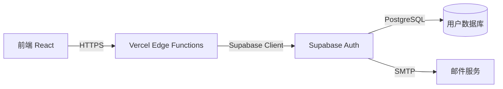
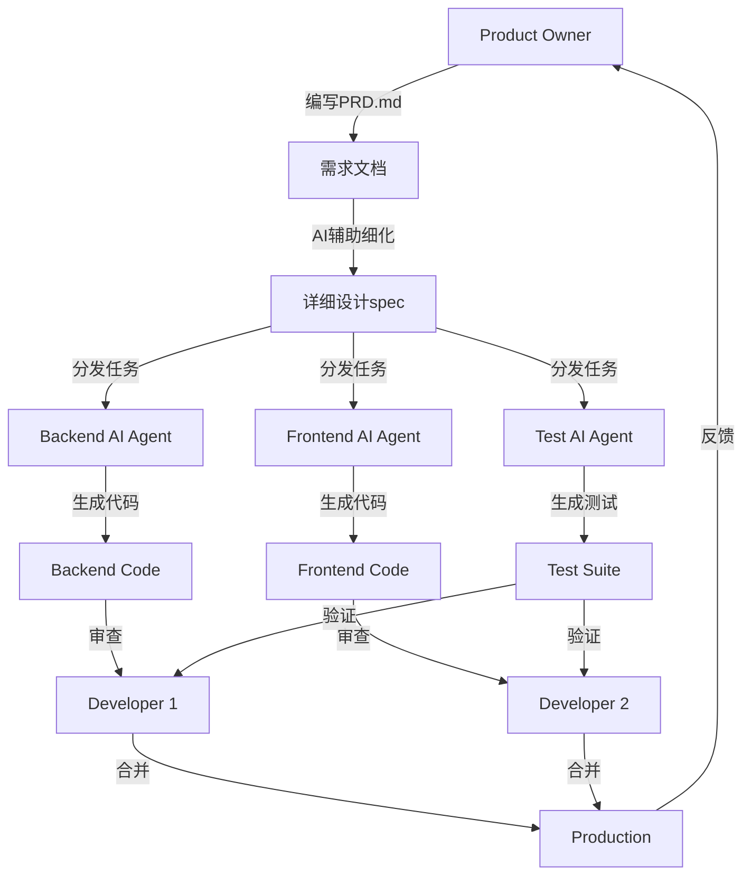

# 第二章:DDAD方法论详解

> **本章导读**
>
> 深入理解DDAD(Document-Driven Agile Development)方法论的核心原则,探索Spec-Driven设计思想如何驱动AI时代的高效开发,以及如何构建人机协作的新模式。

---

## 2.1 文档驱动开发核心原则

### 什么是DDAD?

**DDAD(Document-Driven Agile Development,文档驱动敏捷开发)**是一种现代软件开发方法论,它将**结构化文档**置于开发流程的核心位置,作为团队协作、AI理解和知识传承的基础设施。

### 核心理念转变

**传统观念**:
```
代码是真理 → 文档是负担 → 文档常常过时 → 知识在人脑中
```

**DDAD理念**:
```
文档是驱动 → 代码是产物 → 文档与代码同步 → 知识可持续传承
```

### DDAD的五大核心原则

#### 1. 文档先于代码 (Documentation First)

**原则**: 在编写代码之前,先编写清晰、可执行的规范文档

**为什么重要?**
- ✅ AI需要清晰的上下文才能生成高质量代码
- ✅ 减少理解偏差,避免返工(返工成本是初期设计的10-100倍)
- ✅ 文档成为团队的"单一事实来源"(Single Source of Truth)
- ✅ 新成员快速上手,知识传承无损

**实践方法**:
```markdown
错误做法:
1. 接到需求 → 立即开始编码
2. 边写边想,边改边调
3. 代码完成后补文档(通常不会补)

正确做法:
1. 接到需求 → 编写PRD.md(产品需求文档)
2. 设计阶段 → 编写design-spec.md(设计规范)
3. 实施前 → 编写implementation-steps.md(实施计划)
4. 开发时 → AI根据文档生成代码
5. 完成后 → 更新文档与代码保持同步
```

#### 2. 结构化组织 (Structured Organization)

**原则**: 采用标准化的文档结构和命名规范

**DDAD标准文档体系**:
```
项目根目录/
├── docs/
│   ├── 01-requirements/          # 需求文档
│   │   ├── PRD.md                # 产品需求文档
│   │   ├── user-stories.md       # 用户故事
│   │   ├── acceptance-criteria.md # 验收标准
│   │   └── feature-priorities.md # 特性优先级(MoSCoW)
│   │
│   ├── 02-design/                # 设计文档
│   │   ├── architecture.md       # 架构设计
│   │   ├── design-spec.md        # 详细设计规范
│   │   ├── api-spec.md           # API规范(OpenAPI/Swagger)
│   │   ├── data-models.md        # 数据模型
│   │   └── ui-mockups/           # UI原型和设计稿
│   │
│   ├── 03-implementation/        # 实施文档
│   │   ├── implementation-plan.md # 实施计划
│   │   ├── tech-stack.md         # 技术栈选择
│   │   ├── coding-standards.md   # 编码规范
│   │   └── deployment.md         # 部署方案
│   │
│   ├── 04-testing/               # 测试文档
│   │   ├── test-plan.md          # 测试计划
│   │   ├── test-cases.md         # 测试用例
│   │   └── qa-checklist.md       # 质量检查清单
│   │
│   └── 05-operations/            # 运维文档
│       ├── runbook.md            # 运维手册
│       ├── troubleshooting.md    # 故障排查
│       └── maintenance-log.md    # 维护日志
│
├── CLAUDE.md                     # AI协作上下文(Claude/Cursor使用)
├── Tasks.md                      # 任务清单和进度追踪
└── Plan.md                       # 项目整体规划
```

**命名规范**:
- 使用kebab-case: `feature-priorities.md`, `api-spec.md`
- 清晰描述用途: `user-stories.md` 而非 `stories.md`
- 统一文件扩展名: Markdown(`.md`)为主

#### 3. 持续同步 (Continuous Synchronization)

**原则**: 文档与代码必须保持同步,文档变化应触发代码更新,反之亦然

**同步策略**:

| 场景 | 同步方法 | 工具支持 |
|------|---------|----------|
| **需求变更** | 先更新PRD.md → AI重新生成相关代码 | Claude Code, Cursor |
| **代码重构** | 代码变更后 → AI自动更新相关文档 | AI文档生成工具 |
| **API变更** | 代码更新 → 自动生成OpenAPI文档 | Swagger, TypeDoc |
| **架构演进** | 定期审查architecture.md → 与实际代码对比 | 架构审查会议 |

**防止文档腐化**:
```bash
# 自动化检查脚本示例
# 检查文档是否与代码同步

# 1. API规范检查
npm run validate:api-spec

# 2. 文档新鲜度检查(超过30天未更新发出警告)
find docs/ -name "*.md" -mtime +30 -print

# 3. 代码与文档一致性检查
npm run check:doc-code-sync
```

#### 4. AI友好 (AI-Friendly)

**原则**: 文档应该以AI能够理解和执行的方式编写

**AI友好文档的特征**:

1. **清晰的上下文**:
```markdown
❌ 不好的例子:
"实现用户认证"

✅ 好的例子:
"实现基于JWT的用户认证系统,支持以下功能:
1. 邮箱+密码注册和登录
2. OAuth社交登录(Google, GitHub)
3. Magic Link邮箱验证登录
4. JWT Token刷新机制(access token 15分钟,refresh token 7天)
5. 基于Supabase Auth实现,遵循OWASP安全标准"
```

2. **结构化格式**:
- 使用Markdown标准格式
- 使用表格、列表、代码块等结构化元素
- 避免模糊的自然语言描述

3. **可执行的验收标准**:
```markdown
## 验收标准 (Acceptance Criteria)

- [ ] 用户可以使用邮箱+密码注册账号
- [ ] 注册时密码强度至少8位,包含数字和字母
- [ ] 用户可以使用Google账号登录(OAuth 2.0)
- [ ] 登录失败3次后账号锁定15分钟
- [ ] JWT access token 15分钟后自动刷新
- [ ] 所有API端点都受JWT保护,未授权返回401
```

4. **明确的技术约束**:
```markdown
## 技术约束 (Technical Constraints)

- 前端框架: React 18.2+ with TypeScript
- 后端服务: Supabase (PostgreSQL + Auth + Storage)
- 认证库: @supabase/auth-helpers-react
- 状态管理: React Query + Zustand
- 部署平台: Vercel (Edge Functions)
```

#### 5. 版本化管理 (Version Control)

**原则**: 文档与代码一起纳入Git版本控制,文档变更也应经过Code Review

**实践方法**:

```bash
# 文档变更也需要PR和Review
git checkout -b docs/update-api-spec
# 修改 docs/02-design/api-spec.md
git add docs/02-design/api-spec.md
git commit -m "docs: update API spec for user authentication"
git push origin docs/update-api-spec
# 创建PR,经过团队Review后合并
```

**文档审查要点**:
- ✅ 是否与代码变更一致?
- ✅ 是否影响其他模块?
- ✅ 是否需要更新相关文档?
- ✅ 是否清晰易懂,AI可理解?

---

## 2.2 Spec-Driven设计思想

### Spec-Driven的起源

**Spec-Driven Development**是DDAD方法论的核心思想来源,最早由软件工程界提出,在AI时代焕发新生。

**核心观点**:
> "The act of writing a precise specification forces you to think through the problem deeply, uncovering edge cases and design flaws before writing any code."
>
> "编写精确的规范迫使你深入思考问题,在编写任何代码之前就发现边界情况和设计缺陷。"

### Spec的三个层次

#### Level 1: 需求规范 (Requirement Spec)

**目的**: 定义"做什么"(What),而非"怎么做"(How)

**典型文档**: PRD.md, user-stories.md

**示例**:
```markdown
# 用户认证功能需求规范

## 功能概述
用户可以通过多种方式注册和登录系统,系统需要保障账号安全。

## 用户故事
**作为** 新用户
**我想要** 使用邮箱和密码注册账号
**以便于** 我可以访问系统的个性化功能

**验收标准**:
- 邮箱格式验证
- 密码强度检查(至少8位,包含大小写字母和数字)
- 注册成功后发送验证邮件
- 邮箱已存在时给出友好提示

## 非功能需求
- 注册流程耗时 < 3秒
- 密码加密存储(bcrypt, cost factor 10)
- 符合GDPR数据保护要求
```

#### Level 2: 设计规范 (Design Spec)

**目的**: 定义"怎么做"(How),包括架构、接口、数据结构

**典型文档**: design-spec.md, api-spec.md, architecture.md

**示例**:
```markdown
# 用户认证系统设计规范

## 系统架构


## API规范

### POST /api/auth/register
注册新用户

**Request Body**:
```json
{
  "email": "user@example.com",
  "password": "SecurePass123",
  "username": "john_doe"
}
```

**Response (200 OK)**:
```json
{
  "user": {
    "id": "uuid-string",
    "email": "user@example.com",
    "username": "john_doe"
  },
  "session": {
    "access_token": "jwt-token",
    "refresh_token": "jwt-refresh-token",
    "expires_in": 900
  }
}
```

**Error Responses**:
- 400: Invalid email format or weak password
- 409: Email already registered
- 500: Server error

## 数据模型

### users表
| 字段 | 类型 | 约束 | 说明 |
|------|------|------|------|
| id | uuid | PRIMARY KEY | 用户唯一标识 |
| email | varchar(255) | UNIQUE, NOT NULL | 用户邮箱 |
| password_hash | varchar(255) | NOT NULL | bcrypt密码哈希 |
| username | varchar(50) | UNIQUE | 用户名 |
| created_at | timestamp | DEFAULT now() | 创建时间 |
| email_verified | boolean | DEFAULT false | 邮箱验证状态 |

## 安全规范
- 密码使用bcrypt加密,cost factor = 10
- JWT access token有效期15分钟
- JWT refresh token有效期7天,存储在httpOnly cookie
- 实施速率限制:每IP每小时最多5次注册尝试
- 所有API通信必须使用HTTPS
```

#### Level 3: 实施规范 (Implementation Spec)

**目的**: 定义实施的具体步骤和验证标准

**典型文档**: implementation-steps.md, test-plan.md

**示例**:
```markdown
# 用户认证功能实施计划

## 实施步骤

### 步骤1: 数据库设置
**负责人**: Backend Agent / 开发者
**预计时间**: 1小时

**任务**:
- [ ] 在Supabase创建users表(按照data-models.md定义)
- [ ] 配置RLS(行级安全)策略
- [ ] 创建数据库索引(email, username)

**验证标准**:
- [ ] 表结构与设计规范一致
- [ ] RLS策略测试通过
- [ ] 可以手动插入测试数据

### 步骤2: Supabase Auth配置
**负责人**: Backend Agent / 开发者
**预计时间**: 30分钟

**任务**:
- [ ] 启用Email Provider
- [ ] 配置JWT密钥和过期时间
- [ ] 配置OAuth Providers(Google, GitHub)
- [ ] 设置SMTP邮件服务

**验证标准**:
- [ ] Email Provider启用成功
- [ ] 可以发送测试邮件
- [ ] OAuth回调URL配置正确

### 步骤3: 前端UI实现
**负责人**: Frontend Agent / 开发者
**预计时间**: 3小时

**任务**:
- [ ] 创建注册表单组件(components/AuthForm.tsx)
- [ ] 实现表单验证逻辑
- [ ] 集成Supabase Auth客户端
- [ ] 实现错误处理和用户反馈

**验证标准**:
- [ ] 表单验证规则符合设计规范
- [ ] 所有错误场景有友好提示
- [ ] UI符合设计系统规范(Shadcn/ui)

### 步骤4: 测试验证
**负责人**: Test Agent / QA
**预计时间**: 2小时

**任务**:
- [ ] 编写单元测试(>80%覆盖率)
- [ ] 编写集成测试(完整注册流程)
- [ ] 执行安全测试(SQL注入,XSS等)
- [ ] 性能测试(注册流程<3秒)

**验证标准**:
- [ ] 所有测试通过
- [ ] 测试覆盖率>80%
- [ ] 性能指标达标

## 完成定义 (Definition of Done)
- [ ] 所有实施步骤的验证标准都通过
- [ ] 代码审查完成,无重大问题
- [ ] 文档更新,与代码保持同步
- [ ] 部署到staging环境并测试通过
```

### Spec-Driven的价值

**对开发者**:
- 🧠 **深度思考**: 编写规范迫使你思考边界情况和设计缺陷
- 🎯 **目标明确**: 清晰知道要实现什么,避免方向偏离
- 🔄 **减少返工**: 早期发现问题,修复成本低

**对AI**:
- 📖 **理解上下文**: 清晰的规范让AI准确理解需求
- 🎨 **生成质量**: 详细的规范能生成更高质量的代码
- ✅ **验证标准**: AI可以根据验收标准自我验证

**对团队**:
- 🤝 **协作高效**: 规范成为团队沟通的"语言"
- 📚 **知识传承**: 新成员通过文档快速上手
- 🔍 **可追溯性**: 决策过程和原因都有文档记录

---

## 2.3 人机协作的新模式

### 从"AI作为工具"到"AI作为伙伴"

**传统模式**: AI = 代码补全工具
```
开发者 → 写代码 → Copilot补全 → 开发者修改 → 继续写代码
```

**DDAD模式**: AI = 开发伙伴
```
开发者(设计者)
      ↓ 编写规范文档
   DDAD文档体系(协作协议)
      ↓ AI理解上下文
   AI智能体(执行者)
      ↓ 生成代码/测试/文档
开发者(审查者)
      ↓ 审查和优化
   最终产品(高质量)
```

### 人机分工的黄金比例

基于10xDevelopers社区和DDAD实践的数据:

| 角色 | 传统开发占比 | DDAD+AI占比 | 主要活动 |
|------|-------------|------------|----------|
| **设计者** (人) | 5% | 40% | 需求分析、架构设计、规范编写、决策制定 |
| **执行者** (AI) | 0% | 35% | 代码生成、测试编写、文档生成、重复性工作 |
| **审查者** (人) | 15% | 20% | 代码审查、质量保障、安全审计、性能优化 |
| **编码者** (人) | 60% | 5% | 手写代码(仅复杂逻辑和关键路径) |
| **调试者** (人+AI) | 20% | 10% | Bug修复、问题诊断(AI辅助分析) |

**关键洞察**:
- 人的时间从"编码"转向"设计和审查"
- AI承担大部分"执行"工作
- 整体效率提升3-5倍

### DDAD中的AI角色

#### 1. 需求分析AI (Requirement Analyst AI)

**职责**: 辅助将模糊需求转化为结构化PRD

**示例对话**:
```
开发者: "我想做一个用户管理系统"

AI (Requirement Analyst):
"让我们一起细化这个需求。请回答以下问题:

1. 用户类型:
   - 只有一种用户类型,还是有多种角色(管理员/普通用户)?
   - 是否需要权限管理?

2. 核心功能:
   - 用户注册方式?(邮箱/手机/社交登录)
   - 用户资料包含哪些信息?
   - 是否需要用户审核机制?

3. 规模和性能:
   - 预期用户量?(100/10K/100K)
   - 并发登录需求?

4. 安全要求:
   - 是否需要多因素认证?
   - 密码策略要求?
   - 是否需要符合特定合规要求(GDPR/HIPAA)?

基于您的回答,我将生成一份完整的PRD文档。"
```

**输出**: `docs/01-requirements/PRD.md`

#### 2. 架构设计AI (Architecture AI)

**职责**: 根据需求生成技术架构和设计规范

**工作流程**:
```
输入: PRD.md + 技术约束
处理: 分析需求 → 选择技术栈 → 设计架构 → 定义接口
输出: architecture.md + design-spec.md + api-spec.md
```

**示例输出**:
```markdown
# 系统架构设计

## 技术栈选择
基于以下考虑:
- 用户量预估10K → 选择Serverless架构(成本优化)
- 需要实时通知 → 选择Supabase(内置实时订阅)
- 快速MVP验证 → 选择Lovable+Cursor工作流

**前端**: React + TypeScript + Tailwind CSS
**后端**: Supabase (PostgreSQL + Auth + Storage)
**部署**: Vercel (Edge Functions + CDN)
**监控**: Vercel Analytics + Supabase Logs

## 架构图
[Mermaid图表...]

## API设计原则
- RESTful风格
- JWT认证
- 速率限制: 每用户每小时1000请求
- 版本化: /api/v1/...
```

#### 3. 代码生成AI (Code Generation AI)

**职责**: 根据设计规范生成生产级代码

**特性**:
- ✅ 遵循项目编码规范
- ✅ 生成配套测试用例
- ✅ 添加详细注释
- ✅ 错误处理和边界检查

**示例** (基于design-spec.md生成React组件):
```typescript
// components/AuthForm.tsx
// 根据 docs/02-design/design-spec.md 生成

import { useState } from 'react';
import { useAuth } from '@/hooks/useAuth';
import { Button } from '@/components/ui/button';
import { Input } from '@/components/ui/input';
import { validateEmail, validatePassword } from '@/lib/validation';

interface AuthFormProps {
  mode: 'login' | 'register';
  onSuccess?: () => void;
}

/**
 * 用户认证表单组件
 * 支持登录和注册模式
 *
 * @param mode - 'login' 或 'register'
 * @param onSuccess - 认证成功后的回调函数
 */
export function AuthForm({ mode, onSuccess }: AuthFormProps) {
  const [email, setEmail] = useState('');
  const [password, setPassword] = useState('');
  const [errors, setErrors] = useState<Record<string, string>>({});
  const [isLoading, setIsLoading] = useState(false);

  const { signUp, signIn } = useAuth();

  const validateForm = (): boolean => {
    const newErrors: Record<string, string> = {};

    // 邮箱验证
    if (!validateEmail(email)) {
      newErrors.email = '请输入有效的邮箱地址';
    }

    // 密码验证(按照design-spec.md要求)
    const passwordValidation = validatePassword(password);
    if (!passwordValidation.isValid) {
      newErrors.password = passwordValidation.error;
    }

    setErrors(newErrors);
    return Object.keys(newErrors).length === 0;
  };

  const handleSubmit = async (e: React.FormEvent) => {
    e.preventDefault();

    if (!validateForm()) return;

    setIsLoading(true);
    try {
      if (mode === 'register') {
        await signUp(email, password);
      } else {
        await signIn(email, password);
      }
      onSuccess?.();
    } catch (error) {
      // 错误处理(按照design-spec.md定义的错误码)
      if (error.code === 'auth/email-already-exists') {
        setErrors({ email: '该邮箱已被注册' });
      } else if (error.code === 'auth/invalid-credentials') {
        setErrors({ password: '邮箱或密码错误' });
      } else {
        setErrors({ submit: '操作失败,请稍后重试' });
      }
    } finally {
      setIsLoading(false);
    }
  };

  return (
    <form onSubmit={handleSubmit} className="space-y-4">
      <Input
        type="email"
        placeholder="邮箱地址"
        value={email}
        onChange={(e) => setEmail(e.target.value)}
        error={errors.email}
        disabled={isLoading}
      />
      <Input
        type="password"
        placeholder="密码"
        value={password}
        onChange={(e) => setPassword(e.target.value)}
        error={errors.password}
        disabled={isLoading}
      />
      {errors.submit && (
        <p className="text-sm text-red-500">{errors.submit}</p>
      )}
      <Button type="submit" isLoading={isLoading} className="w-full">
        {mode === 'register' ? '注册' : '登录'}
      </Button>
    </form>
  );
}
```

**配套测试** (AI自动生成):
```typescript
// components/AuthForm.test.tsx
import { render, screen, fireEvent, waitFor } from '@testing-library/react';
import { AuthForm } from './AuthForm';
import { useAuth } from '@/hooks/useAuth';

jest.mock('@/hooks/useAuth');

describe('AuthForm', () => {
  const mockSignUp = jest.fn();
  const mockSignIn = jest.fn();

  beforeEach(() => {
    (useAuth as jest.Mock).mockReturnValue({
      signUp: mockSignUp,
      signIn: mockSignIn,
    });
  });

  describe('Validation', () => {
    it('应该验证邮箱格式', async () => {
      render(<AuthForm mode="register" />);

      const emailInput = screen.getByPlaceholderText('邮箱地址');
      fireEvent.change(emailInput, { target: { value: 'invalid-email' } });

      const submitButton = screen.getByRole('button');
      fireEvent.click(submitButton);

      await waitFor(() => {
        expect(screen.getByText('请输入有效的邮箱地址')).toBeInTheDocument();
      });
      expect(mockSignUp).not.toHaveBeenCalled();
    });

    it('应该验证密码强度', async () => {
      render(<AuthForm mode="register" />);

      const passwordInput = screen.getByPlaceholderText('密码');
      fireEvent.change(passwordInput, { target: { value: '123' } });

      const submitButton = screen.getByRole('button');
      fireEvent.click(submitButton);

      await waitFor(() => {
        expect(screen.getByText(/密码至少8位/)).toBeInTheDocument();
      });
    });
  });

  describe('Registration', () => {
    it('应该成功注册用户', async () => {
      const onSuccess = jest.fn();
      mockSignUp.mockResolvedValue({ user: { id: '123' } });

      render(<AuthForm mode="register" onSuccess={onSuccess} />);

      fireEvent.change(screen.getByPlaceholderText('邮箱地址'), {
        target: { value: 'user@example.com' }
      });
      fireEvent.change(screen.getByPlaceholderText('密码'), {
        target: { value: 'SecurePass123' }
      });

      fireEvent.click(screen.getByRole('button'));

      await waitFor(() => {
        expect(mockSignUp).toHaveBeenCalledWith('user@example.com', 'SecurePass123');
        expect(onSuccess).toHaveBeenCalled();
      });
    });
  });

  // ... 更多测试用例
});
```

#### 4. 测试工程师AI (Test Engineer AI)

**职责**: 生成全面的测试用例,执行测试并报告问题

**工作内容**:
- ✅ 单元测试(>80%覆盖率)
- ✅ 集成测试(关键用户旅程)
- ✅ E2E测试(Playwright自动化)
- ✅ 性能测试(响应时间、并发)
- ✅ 安全测试(XSS, SQL注入, CSRF)

**验证循环**:
```
Code Generation AI → 生成代码
        ↓
Test Engineer AI → 生成并执行测试
        ↓
    测试失败?
   ↙        ↘
 是          否
 ↓          ↓
Code AI     Code Review
修复代码     (人工审查)
 ↓
重新测试
```

#### 5. 文档维护AI (Documentation AI)

**职责**: 保持文档与代码同步,生成API文档和用户指南

**自动化任务**:
- 从代码注释生成API文档(TypeDoc, JSDoc)
- 从测试用例生成使用示例
- 监控文档过期(30天未更新警告)
- 根据代码变更更新相关文档

### 协作协议:CLAUDE.md

**10xDevelopers社区的最佳实践**: 在项目根目录创建`CLAUDE.md`文件,作为AI的"项目记忆"。

**CLAUDE.md的作用**:
- 📝 **项目上下文**: AI理解项目背景、目标、约束
- 🎯 **工作规范**: AI应该遵循的规则和流程
- 🧠 **持续记忆**: 跨会话保持项目知识
- 🤝 **协作协议**: 人机之间的"合同"

**CLAUDE.md模板**:
```markdown
# Project Context for AI

## 项目概述
**项目名称**: 用户管理系统
**目标**: 构建一个安全、可扩展的用户认证和授权系统
**技术栈**: React + TypeScript + Supabase + Vercel
**预期用户量**: 10,000 users
**MVP时间线**: 4周

## 核心文档
请始终参考以下文档:
- 需求: `docs/01-requirements/PRD.md`
- 设计: `docs/02-design/design-spec.md`
- API规范: `docs/02-design/api-spec.md`
- 实施计划: `docs/03-implementation/implementation-plan.md`

## AI工作规范

### 代码生成规范
1. **语言和框架**:
   - TypeScript strict mode
   - React 18+ with hooks
   - 使用Shadcn/ui组件库
   - Tailwind CSS for styling

2. **编码标准**:
   - 遵循ESLint配置(.eslintrc.json)
   - 所有函数必须有JSDoc注释
   - 错误处理: try-catch + 友好错误信息
   - 组件文件命名: PascalCase (e.g., AuthForm.tsx)

3. **测试要求**:
   - 每个组件必须有配套测试文件
   - 单元测试覆盖率 > 80%
   - 关键路径必须有E2E测试

### 验收标准
在标记任务为"完成"之前,必须满足:
- [ ] 代码符合编码标准
- [ ] 所有测试通过
- [ ] 测试覆盖率达标
- [ ] 相关文档已更新
- [ ] 通过代码审查

### 禁止事项
- ❌ 不要使用`any`类型(TypeScript)
- ❌ 不要直接操作DOM(使用React方式)
- ❌ 不要硬编码敏感信息(使用环境变量)
- ❌ 不要跳过错误处理
- ❌ 不要生成TODO注释(必须完成实现)

## 项目决策记录

### ADR-001: 选择Supabase而非自建后端
**日期**: 2025-10-11
**决策**: 使用Supabase作为后端服务
**理由**:
- MVP需要快速验证,Supabase开箱即用
- 内置认证、数据库、存储、实时订阅
- 成本低(前10K用户免费)
- PostgreSQL提供足够的扩展性
**影响**: 前端直接调用Supabase客户端,无需自建API服务器

### ADR-002: 采用RLS(行级安全)
**日期**: 2025-10-11
**决策**: 使用Supabase RLS管理数据访问权限
**理由**:
- 数据库级别的安全保障
- 减少前端暴露的API表面
- 符合安全最佳实践
**影响**: 需要在Supabase Dashboard配置RLS策略

## 当前任务
[由AI或开发者更新]

**正在进行**:
- 实现用户注册和登录UI组件
- 配置Supabase Auth

**待办事项**:
- OAuth社交登录集成
- 用户资料管理页面
- 权限管理系统

## 常见问题

**Q: 如何处理认证状态?**
A: 使用`@supabase/auth-helpers-react`的`useUser()`钩子,参考`docs/02-design/design-spec.md`第3.2节

**Q: API调用失败如何处理?**
A: 使用React Query的错误处理机制,显示用户友好的错误信息,参考`design-spec.md`第4.1节

**Q: 组件样式规范?**
A: 基于Shadcn/ui组件库,使用Tailwind实用类,参考`design-spec.md`第2节"视觉风格指南"
```

---

## 2.4 DDAD与传统敏捷的融合

### 传统敏捷的挑战

**Scrum/Kanban的核心价值**:
- 🏃 快速迭代,持续交付
- 🤝 团队协作,自组织
- 🔄 适应变化,拥抱反馈

**AI时代面临的问题**:
1. **文档轻视**: "工作的软件胜过详尽的文档"在AI时代不再完全适用
2. **知识散落**: 知识在人脑和口头沟通中,AI无法利用
3. **上下文断裂**: AI每次对话都是新开始,缺乏项目记忆
4. **质量不稳定**: AI生成代码质量依赖prompt质量,缺乏标准

### DDAD如何增强敏捷

**1. 文档驱动的Sprint Planning**

**传统敏捷**:
```
Product Owner讲解需求 → 团队估算工作量 → 分配任务
(知识口头传递,容易遗漏细节)
```

**DDAD增强**:
```
PO编写PRD.md → AI辅助细化用户故事 → 自动生成验收标准
→ AI估算工作量 → 生成implementation-plan.md
(知识结构化,AI可参与,效率提升50%)
```

**2. 文档驱动的Daily Standup**

**传统敏捷**:
```
"昨天做了什么,今天做什么,有什么阻碍"
(口头报告,难以追溯)
```

**DDAD增强**:
```
更新Tasks.md状态 → AI自动生成进展报告 → 识别阻碍并建议方案
(自动化报告,AI辅助解决阻碍)
```

**3. 文档驱动的Code Review**

**传统敏捷**:
```
人工审查PR → 提出意见 → 修改 → 再审查
(耗时,依赖审查者经验)
```

**DDAD增强**:
```
PR提交 → AI自动检查是否符合design-spec.md → 标记不一致
→ 人工审查关键决策 → AI辅助修复
(AI预审,人专注高价值审查,效率提升40%)
```

**4. 文档驱动的Sprint Review**

**传统敏捷**:
```
演示功能 → 口头反馈 → 会后整理笔记(常常遗忘)
```

**DDAD增强**:
```
演示功能 → AI记录反馈 → 自动更新PRD.md → 生成下个Sprint的优先级建议
(反馈自动文档化,AI辅助规划)
```

### DDAD敏捷工作流

**Sprint周期(2周为例)**:

```
Week 1 (规划与设计阶段)
├─ Day 1: Sprint Planning
│  ├─ PO编写/更新PRD.md
│  ├─ AI辅助生成user-stories.md
│  └─ 团队确认feature-priorities.md(MoSCoW)
│
├─ Day 2-3: 设计阶段
│  ├─ AI辅助生成design-spec.md初稿
│  ├─ 团队Review和细化设计
│  ├─ 定义api-spec.md(OpenAPI格式)
│  └─ 创建implementation-plan.md
│
├─ Day 4-5: 准备阶段
│  ├─ 配置Subagents(如果使用)
│  ├─ 更新CLAUDE.md项目上下文
│  └─ 准备开发环境

Week 2 (开发与交付阶段)
├─ Day 6-8: 开发阶段
│  ├─ AI根据spec生成代码
│  ├─ Test AI生成并执行测试
│  ├─ 开发者审查和优化
│  └─ 每日更新Tasks.md状态
│
├─ Day 9: 集成与测试
│  ├─ E2E测试
│  ├─ 性能测试
│  └─ 安全扫描
│
└─ Day 10: Review与回顾
   ├─ Sprint Review(演示功能)
   ├─ Sprint Retrospective(流程改进)
   ├─ 更新文档与代码同步
   └─ 规划下个Sprint
```

### DDAD与Scrum仪式的映射

| Scrum仪式 | DDAD增强实践 | AI参与方式 | 效率提升 |
|----------|-------------|-----------|---------|
| **Sprint Planning** | 编写PRD.md + AI生成user-stories | AI辅助需求细化和工作量估算 | 50% |
| **Daily Standup** | 更新Tasks.md + AI生成进展报告 | AI识别阻碍并建议解决方案 | 30% |
| **Sprint Review** | 演示 + AI记录反馈并更新PRD | AI自动生成反馈摘要和行动项 | 40% |
| **Sprint Retrospective** | 团队讨论 + AI分析效能数据 | AI识别流程瓶颈和改进建议 | 35% |
| **Backlog Refinement** | 更新feature-priorities.md + AI估算 | AI基于历史数据估算复杂度 | 45% |

### 混合团队的敏捷实践

**团队组成**: 2名开发者 + 1名PO + AI智能体

**角色分工**:

| 角色 | 传统职责 | DDAD模式职责 | 时间分配 |
|------|---------|-------------|---------|
| **Product Owner** | 需求管理、优先级排序 | 编写PRD.md、审查AI生成的用户故事 | 60%需求,40%协调 |
| **开发者(设计者)** | 编写代码 | 编写spec、审查AI代码、架构决策 | 40%设计,30%审查,30%编码 |
| **开发者(全栈)** | 前后端开发 | spec编写、AI协调、关键功能实现 | 35%设计,35%审查,30%编码 |
| **AI Agent(后端)** | - | 根据spec生成Python/Node.js代码 | 自动化 |
| **AI Agent(前端)** | - | 根据spec生成React组件 | 自动化 |
| **AI Agent(测试)** | - | 生成并执行测试用例 | 自动化 |

**协作模式**:



---

## 2.5 DDAD成熟度模型

为了帮助团队评估和提升DDAD实践水平,我们定义了五级成熟度模型:

### Level 0: 混沌期 (Chaotic)

**特征**:
- ❌ 没有文档或文档严重过时
- ❌ 需求口头传递,理解不一致
- ❌ AI只用于简单代码补全
- ❌ 频繁返工,项目延期

**效能指标**:
- 需求变更率: >50%
- 文档完整性: <20%
- 交付周期: 计划的2-3倍

**改进建议**: 从编写基本的PRD.md和README.md开始

---

### Level 1: 基础期 (Basic)

**特征**:
- ✅ 有基本的PRD和README
- ✅ 使用AI Copilot进行代码补全
- ⚠️ 文档与代码常常不同步
- ⚠️ AI只用于编码阶段

**效能指标**:
- 需求变更率: 30-50%
- 文档完整性: 20-40%
- 交付周期: 计划的1.5-2倍

**改进建议**: 建立文档目录结构,引入CLAUDE.md

---

### Level 2: 规范期 (Standardized)

**特征**:
- ✅ 完整的DDAD文档体系
- ✅ 文档先于代码的流程
- ✅ AI参与需求分析和设计
- ⚠️ 文档同步依赖人工
- ⚠️ AI使用不系统

**效能指标**:
- 需求变更率: 20-30%
- 文档完整性: 40-60%
- 交付周期: 计划的1.2-1.5倍
- AI生成代码占比: 30-50%

**改进建议**: 引入文档同步自动化,配置Subagents

---

### Level 3: 优化期 (Optimized)

**特征**:
- ✅ 文档与代码持续同步
- ✅ AI深度参与全流程
- ✅ 使用Subagents并行开发
- ✅ 自动化测试覆盖率>80%
- ⚠️ 跨团队知识共享有限

**效能指标**:
- 需求变更率: 10-20%
- 文档完整性: 60-80%
- 交付周期: 计划的0.8-1.2倍
- AI生成代码占比: 50-70%
- 测试覆盖率: >80%

**改进建议**: 建立知识库,实施跨项目spec复用

---

### Level 4: 卓越期 (Excellent)

**特征**:
- ✅ 文档成为"单一事实来源"
- ✅ AI智能体自主协作
- ✅ 完善的知识库和spec复用
- ✅ 持续优化和学习文化
- ✅ 跨团队协作流畅

**效能指标**:
- 需求变更率: <10%
- 文档完整性: >80%
- 交付周期: 计划的0.5-0.8倍
- AI生成代码占比: >70%
- 测试覆盖率: >90%
- 新成员上手时间: <3天

**特点**: 持续改进,成为行业标杆

---

## 2.6 本章小结

DDAD方法论的核心要点:

1. **五大核心原则**:
   - 文档先于代码 - 规范驱动开发
   - 结构化组织 - 标准化文档体系
   - 持续同步 - 文档与代码一致性
   - AI友好 - 清晰可执行的规范
   - 版本化管理 - Git管理文档变更

2. **Spec-Driven思想**:
   - 需求规范(What) → 设计规范(How) → 实施规范(Steps)
   - 规范迫使深度思考,早期发现问题
   - AI需要清晰规范才能生成高质量代码

3. **人机协作新模式**:
   - 人:设计者(40%) + 审查者(20%)
   - AI:执行者(35%) + 辅助调试(10%)
   - 效率提升3-5倍

4. **与敏捷融合**:
   - 增强而非替代敏捷仪式
   - 文档驱动的Sprint Planning/Review
   - AI参与Daily Standup和Code Review
   - 混合团队(人+AI)高效协作

5. **成熟度模型**:
   - Level 0-1: 基础文档和AI补全
   - Level 2-3: 规范化流程和AI深度参与
   - Level 4: 卓越实践和持续优化

**关键洞察**:
> "在AI时代,文档不再是负担,而是驱动力。清晰的文档是人机协作的'语言',是知识持久化的'容器',是效率提升的'杠杆'。"

**下一章**: 我们将深入探讨技术栈与工具生态,了解如何选择和使用现代AI友好的开发工具链。

---

**思考题**:
1. 您的团队目前处于DDAD成熟度模型的哪个阶段?
2. 在您的项目中,哪些文档最容易与代码不同步?如何改进?
3. 如果引入Spec-Driven工作流,您认为最大的挑战是什么?

👉 [下一章:技术栈与工具生态](chapter3-tech-stack.md)
