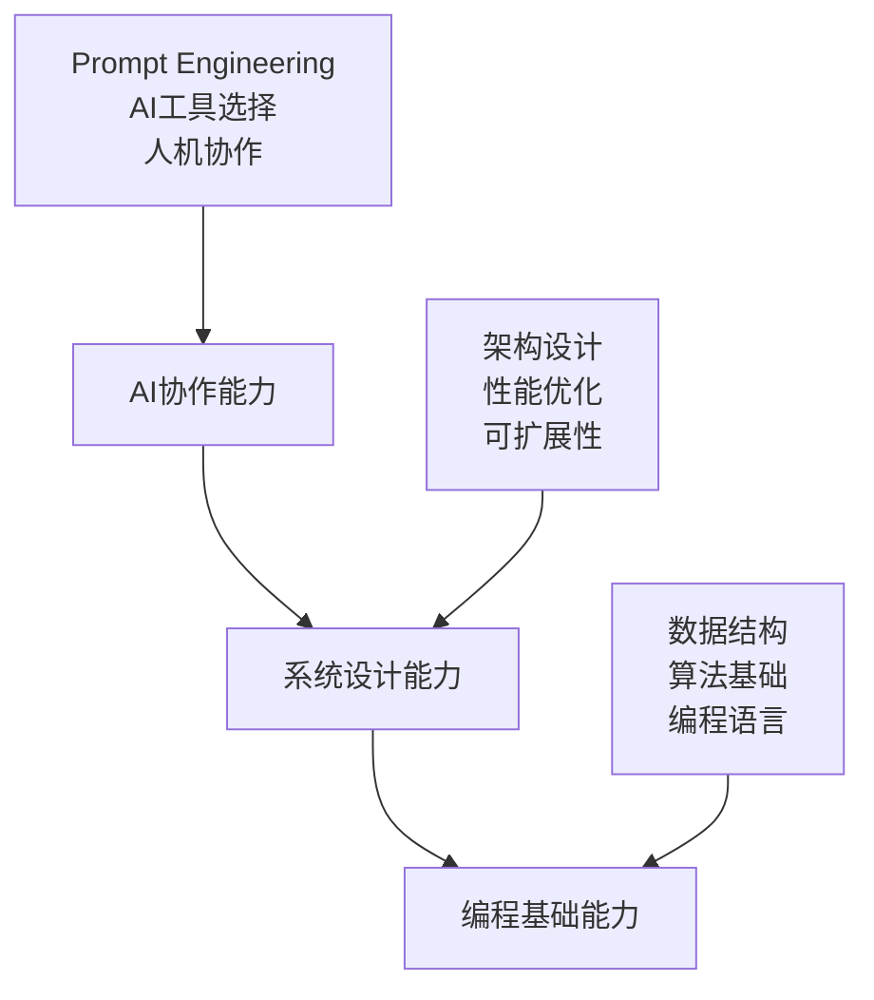
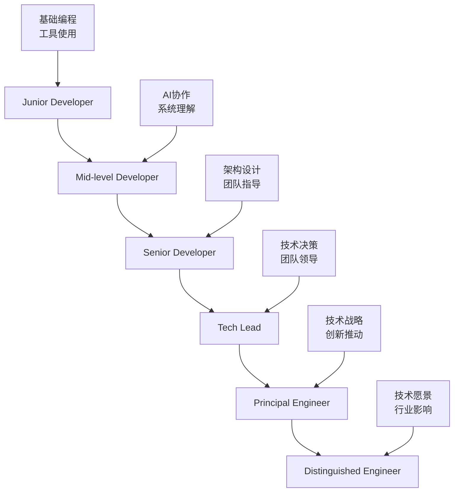

# 附录A：10x Developers实践指南

> **"10x Developer不是神话，而是方法论的胜利"**
>
> 在AI时代，传统的"10倍程序员"概念正在被重新定义。真正的10x Developer不再是那些能够以超人般速度编写代码的个体，而是那些能够巧妙运用AI工具、优化开发流程、并带动整个团队效率提升的"效率放大器"。本附录将深入探讨如何通过DDAD方法论和AI协作，成为新时代的10x Developer。

---

## 10x Developer的新定义

### 传统10x Developer vs AI时代10x Developer

**传统模式的局限性**：
```yaml
traditional_10x_developer:
  characteristics:
    - 编码速度极快
    - 记忆力超强，熟悉各种API
    - 能够长时间高强度工作
    - 独立解决复杂技术问题
  
  problems:
    - 不可复制性：依赖个人天赋
    - 不可持续性：容易burnout
    - 团队依赖性：成为单点故障
    - 知识孤岛：难以传承经验
```

**AI时代的新范式**：
```yaml
ai_era_10x_developer:
  characteristics:
    - AI协作专家：善于与AI工具协作
    - 系统思维：从全局优化开发流程
    - 知识放大器：将个人经验转化为团队资产
    - 持续学习者：快速适应新技术和工具
  
  advantages:
    - 可复制性：方法论可以传授
    - 可持续性：依靠tools而非体力
    - 团队赋能：提升整体效率
    - 知识共享：建立团队知识库
```

### 核心能力模型

**技术能力金字塔**：


**能力评估矩阵**：
```python
class DeveloperCapabilityAssessment:
    """10x Developer能力评估"""
    
    def __init__(self):
        self.capability_matrix = {
            'ai_collaboration': {
                'prompt_engineering': {'weight': 0.3, 'max_score': 10},
                'tool_selection': {'weight': 0.2, 'max_score': 10},
                'ai_output_validation': {'weight': 0.3, 'max_score': 10},
                'human_ai_workflow': {'weight': 0.2, 'max_score': 10}
            },
            'system_thinking': {
                'architecture_design': {'weight': 0.4, 'max_score': 10},
                'performance_optimization': {'weight': 0.3, 'max_score': 10},
                'scalability_planning': {'weight': 0.3, 'max_score': 10}
            },
            'knowledge_multiplication': {
                'documentation_creation': {'weight': 0.3, 'max_score': 10},
                'knowledge_sharing': {'weight': 0.3, 'max_score': 10},
                'mentoring_ability': {'weight': 0.4, 'max_score': 10}
            },
            'continuous_learning': {
                'technology_adoption': {'weight': 0.4, 'max_score': 10},
                'learning_speed': {'weight': 0.3, 'max_score': 10},
                'adaptation_ability': {'weight': 0.3, 'max_score': 10}
            }
        }
    
    def assess_developer(self, scores: dict) -> dict:
        """评估开发者能力"""
        
        category_scores = {}
        overall_score = 0
        
        for category, capabilities in self.capability_matrix.items():
            category_score = 0
            for capability, config in capabilities.items():
                score = scores.get(capability, 0)
                weighted_score = min(score, config['max_score']) * config['weight']
                category_score += weighted_score
            
            category_scores[category] = category_score
            overall_score += category_score
        
        # 计算10x潜力指数
        potential_index = self.calculate_10x_potential(category_scores)
        
        return {
            'category_scores': category_scores,
            'overall_score': overall_score,
            'potential_index': potential_index,
            'development_recommendations': self.generate_recommendations(category_scores)
        }
```

---

## 高效工作流程设计

### 日常工作流程优化

**晨间启动流程**：
```bash
#!/bin/bash
# 10x Developer 晨间启动脚本

echo "🚀 10x Developer 工作日启动..."

# 1. AI工具状态检查
echo "检查AI工具状态..."
claude --version && echo "✅ Claude CLI 正常"
cursor --version && echo "✅ Cursor 正常"
copilot status && echo "✅ GitHub Copilot 正常"

# 2. 项目状态同步
echo "同步项目状态..."
git fetch --all
git status

# 3. 今日任务规划
echo "生成今日任务规划..."
claude "基于我的项目进度和昨日完成情况，生成今日的工作优先级列表"

# 4. 开发环境准备
echo "准备开发环境..."
docker-compose up -d
npm run dev &

echo "🎯 准备就绪，开始高效的一天！"
```

**任务执行模板**：
```python
class HighEfficiencyTaskExecution:
    """高效任务执行模板"""
    
    def __init__(self):
        self.ai_assistant = AIAssistant()
        self.task_tracker = TaskTracker()
        self.quality_checker = QualityChecker()
    
    def execute_development_task(self, task: dict) -> dict:
        """执行开发任务的标准流程"""
        
        # Phase 1: 任务分析与规划
        analysis = self.analyze_task_with_ai(task)
        plan = self.create_execution_plan(analysis)
        
        # Phase 2: AI辅助实现
        implementation = self.implement_with_ai_assistance(plan)
        
        # Phase 3: 质量验证
        quality_report = self.validate_with_ai(implementation)
        
        # Phase 4: 文档更新
        documentation = self.update_documentation(implementation)
        
        # Phase 5: 知识总结
        knowledge_summary = self.extract_learnings(task, implementation)
        
        return {
            'implementation': implementation,
            'quality_report': quality_report,
            'documentation': documentation,
            'knowledge_summary': knowledge_summary,
            'execution_metrics': self.calculate_metrics(task, implementation)
        }
    
    def analyze_task_with_ai(self, task: dict) -> dict:
        """使用AI分析任务"""
        
        prompt = f"""
        分析以下开发任务，提供详细的实现建议：
        
        任务描述：{task['description']}
        验收标准：{task['acceptance_criteria']}
        技术约束：{task['constraints']}
        
        请提供：
        1. 技术方案建议
        2. 潜在风险点
        3. 实现步骤
        4. 测试策略
        5. 时间估算
        """
        
        return self.ai_assistant.analyze(prompt)
```

### 时间管理策略

**番茄工作法 + AI增强**：
```python
class AIEnhancedPomodoro:
    """AI增强的番茄工作法"""
    
    def __init__(self):
        self.session_duration = 25 * 60  # 25分钟
        self.break_duration = 5 * 60     # 5分钟
        self.ai_assistant = AIAssistant()
        self.productivity_tracker = ProductivityTracker()
    
    def start_pomodoro_session(self, task_description: str):
        """开始番茄工作会话"""
        
        # AI生成专注提示
        focus_prompt = self.ai_assistant.generate_focus_prompt(task_description)
        print(f"🍅 专注提示：{focus_prompt}")
        
        # 开始计时
        start_time = time.time()
        
        # 中途检查点（12.5分钟）
        threading.Timer(self.session_duration / 2, self.mid_session_check).start()
        
        # 会话结束
        threading.Timer(self.session_duration, self.end_session).start()
        
        return {
            'session_id': uuid.uuid4(),
            'start_time': start_time,
            'task': task_description,
            'focus_prompt': focus_prompt
        }
    
    def mid_session_check(self):
        """中途检查"""
        progress_check = input("进度如何？(1-5): ")
        if int(progress_check) < 3:
            ai_suggestion = self.ai_assistant.suggest_focus_improvement()
            print(f"💡 AI建议：{ai_suggestion}")
    
    def end_session(self):
        """结束会话"""
        completion_rate = input("任务完成度？(0-100%): ")
        self.productivity_tracker.record_session({
            'completion_rate': int(completion_rate),
            'timestamp': time.time()
        })
        
        # AI生成休息建议
        break_suggestion = self.ai_assistant.suggest_break_activity()
        print(f"🧘 休息建议：{break_suggestion}")
```

**深度工作时间块**：
```yaml
# 深度工作时间规划
deep_work_schedule:
  morning_block:
    time: "09:00-11:30"
    focus: "复杂问题解决"
    ai_assistance: "architecture_design"
    interruption_policy: "emergency_only"
  
  afternoon_block:
    time: "14:00-16:00"  
    focus: "代码实现"
    ai_assistance: "code_generation"
    interruption_policy: "scheduled_breaks"
  
  evening_block:
    time: "19:00-21:00"
    focus: "学习新技术"
    ai_assistance: "knowledge_synthesis"
    interruption_policy: "flexible"
```

---

## 技能提升路径

### AI协作技能进阶

**Prompt Engineering精进**：
```python
class PromptEngineeringMastery:
    """Prompt工程精通课程"""
    
    def __init__(self):
        self.skill_levels = {
            'beginner': {
                'skills': ['基础prompt编写', '简单任务分解'],
                'practice_projects': ['生成简单函数', '创建基础文档']
            },
            'intermediate': {
                'skills': ['上下文管理', '多轮对话设计', '输出格式控制'],
                'practice_projects': ['复杂API设计', '架构文档生成']
            },
            'advanced': {
                'skills': ['Few-shot learning', 'Chain-of-thought', '元提示设计'],
                'practice_projects': ['智能代码审查', '自动化重构']
            },
            'expert': {
                'skills': ['提示工程模式', '自适应提示', 'AI协作框架设计'],
                'practice_projects': ['AI驱动的开发工具', '智能项目管理系统']
            }
        }
    
    def assess_current_level(self, developer_id: str) -> str:
        """评估当前技能水平"""
        # 实施技能评估测试
        test_results = self.conduct_skill_assessment(developer_id)
        return self.determine_skill_level(test_results)
    
    def generate_learning_path(self, current_level: str, target_level: str) -> dict:
        """生成学习路径"""
        
        path = {
            'current_level': current_level,
            'target_level': target_level,
            'learning_modules': [],
            'practice_exercises': [],
            'milestone_projects': []
        }
        
        # 根据技能差距生成学习内容
        levels = list(self.skill_levels.keys())
        start_idx = levels.index(current_level)
        end_idx = levels.index(target_level)
        
        for i in range(start_idx + 1, end_idx + 1):
            level = levels[i]
            path['learning_modules'].extend(self.skill_levels[level]['skills'])
            path['practice_exercises'].extend(self.skill_levels[level]['practice_projects'])
        
        return path
```

**AI工具链精通**：
```yaml
# AI工具链学习路径
ai_toolchain_mastery:
  foundation_tools:
    - name: "Claude/ChatGPT"
      skills: ["对话式编程", "代码解释", "问题诊断"]
      practice: "日常编码助手使用"
    
    - name: "GitHub Copilot"
      skills: ["代码补全", "函数生成", "测试编写"]
      practice: "IDE集成开发"
  
  advanced_tools:
    - name: "Cursor"
      skills: ["AI原生开发", "多文件编辑", "智能重构"]
      practice: "完整项目开发"
    
    - name: "Claude Code"
      skills: ["大型代码库分析", "架构重构", "代码审查"]
      practice: "遗留系统现代化"
  
  specialized_tools:
    - name: "AI测试工具"
      skills: ["自动化测试生成", "测试用例优化"]
      practice: "测试驱动开发"
    
    - name: "AI部署工具"  
      skills: ["基础设施即代码", "自动化部署"]
      practice: "DevOps流程优化"
```

### 系统思维培养

**架构思维训练**：
```python
class ArchitecturalThinkingTraining:
    """架构思维训练系统"""
    
    def __init__(self):
        self.training_scenarios = {
            'scalability_challenge': {
                'description': '设计一个支持百万用户的社交平台',
                'constraints': ['成本控制', '性能要求', '可维护性'],
                'learning_objectives': ['水平扩展', '数据分区', '缓存策略']
            },
            'legacy_modernization': {
                'description': '现代化一个10年老系统',
                'constraints': ['业务连续性', '数据迁移', '团队技能'],
                'learning_objectives': ['渐进式重构', 'API设计', '风险管理']
            },
            'microservices_design': {
                'description': '将单体应用拆分为微服务',
                'constraints': ['服务边界', '数据一致性', '运维复杂度'],
                'learning_objectives': ['领域建模', '服务通信', '分布式系统']
            }
        }
    
    def conduct_training_session(self, scenario_name: str, developer_id: str) -> dict:
        """进行架构思维训练"""
        
        scenario = self.training_scenarios[scenario_name]
        
        # AI辅助分析
        ai_analysis = self.get_ai_architectural_analysis(scenario)
        
        # 开发者设计方案
        developer_solution = self.collect_developer_solution(developer_id, scenario)
        
        # 方案评估和反馈
        evaluation = self.evaluate_solution(developer_solution, ai_analysis)
        
        return {
            'scenario': scenario_name,
            'developer_solution': developer_solution,
            'ai_analysis': ai_analysis,
            'evaluation': evaluation,
            'improvement_suggestions': self.generate_improvement_suggestions(evaluation)
        }
```

**性能优化专精**：
```yaml
# 性能优化技能树
performance_optimization_skills:
  frontend_optimization:
    - bundle_splitting: "代码分割和懒加载"
    - caching_strategies: "浏览器缓存优化"
    - critical_rendering_path: "关键渲染路径优化"
    - web_vitals: "核心Web指标改进"
  
  backend_optimization:
    - database_optimization: "数据库查询优化"
    - caching_layers: "多级缓存策略"
    - async_processing: "异步处理和队列"
    - connection_pooling: "连接池管理"
  
  infrastructure_optimization:
    - cdn_configuration: "CDN配置优化"
    - load_balancing: "负载均衡策略"
    - auto_scaling: "自动扩缩容"
    - monitoring_alerting: "监控和告警"
```

---

## 团队影响力建设

### 知识传播策略

**技术分享体系**：
```python
class KnowledgeSharingSystem:
    """知识分享系统"""
    
    def __init__(self):
        self.sharing_formats = {
            'lightning_talk': {
                'duration': 5,
                'focus': 'quick_tips',
                'frequency': 'weekly'
            },
            'tech_deep_dive': {
                'duration': 30,
                'focus': 'detailed_analysis',
                'frequency': 'bi_weekly'
            },
            'hands_on_workshop': {
                'duration': 120,
                'focus': 'practical_skills',
                'frequency': 'monthly'
            }
        }
    
    def plan_knowledge_sharing_session(self, topic: str, audience_level: str) -> dict:
        """规划知识分享会话"""
        
        # AI辅助内容规划
        content_plan = self.ai_assistant.plan_presentation({
            'topic': topic,
            'audience_level': audience_level,
            'learning_objectives': self.extract_learning_objectives(topic)
        })
        
        # 选择合适的分享格式
        recommended_format = self.recommend_sharing_format(content_plan)
        
        # 生成分享大纲
        outline = self.generate_presentation_outline(content_plan, recommended_format)
        
        return {
            'topic': topic,
            'format': recommended_format,
            'outline': outline,
            'materials': self.suggest_supporting_materials(content_plan),
            'interactive_elements': self.design_interactive_elements(audience_level)
        }
```

**导师制度建立**：
```yaml
# 导师制度框架
mentorship_framework:
  mentor_responsibilities:
    - skill_assessment: "评估被导师技能水平"
    - learning_path_design: "设计个性化学习路径"  
    - regular_feedback: "提供定期反馈和指导"
    - career_guidance: "职业发展建议"
  
  mentee_commitments:
    - active_learning: "主动学习和实践"
    - regular_communication: "定期沟通进展"
    - knowledge_sharing: "分享学习心得"
    - peer_support: "支持其他学习者"
  
  success_metrics:
    - skill_improvement_rate: "技能提升速度"
    - project_contribution: "项目贡献度"
    - knowledge_sharing_frequency: "知识分享频率"
    - team_collaboration_score: "团队协作评分"
```

### 流程改进推动

**持续改进文化**：
```python
class ContinuousImprovementCulture:
    """持续改进文化推动器"""
    
    def __init__(self):
        self.improvement_cycles = {
            'daily': 'retrospective_micro_improvements',
            'weekly': 'process_optimization_review',
            'monthly': 'tool_and_practice_evaluation',
            'quarterly': 'strategic_direction_adjustment'
        }
    
    def facilitate_improvement_session(self, cycle_type: str, team_data: dict) -> dict:
        """促进改进会话"""
        
        # 数据驱动的问题识别
        pain_points = self.identify_pain_points(team_data)
        
        # AI辅助解决方案生成
        solution_options = self.generate_solution_options(pain_points)
        
        # 团队协作决策
        selected_solutions = self.facilitate_team_decision(solution_options)
        
        # 实施计划制定
        implementation_plan = self.create_implementation_plan(selected_solutions)
        
        return {
            'identified_issues': pain_points,
            'solution_options': solution_options,
            'selected_solutions': selected_solutions,
            'implementation_plan': implementation_plan,
            'success_metrics': self.define_success_metrics(selected_solutions)
        }
```

**创新实验推广**：
```yaml
# 创新实验框架
innovation_experiment_framework:
  experiment_types:
    - new_tool_evaluation: "新工具评估试验"
    - workflow_optimization: "工作流程优化实验"
    - ai_integration: "AI集成应用试验"
    - collaboration_improvement: "协作方式改进实验"
  
  experiment_lifecycle:
    - hypothesis_formation: "假设形成"
    - experiment_design: "实验设计"
    - pilot_implementation: "试点实施"
    - result_evaluation: "结果评估"
    - scaling_decision: "扩展决策"
  
  success_criteria:
    - efficiency_improvement: "效率提升指标"
    - quality_enhancement: "质量改进指标"  
    - satisfaction_increase: "满意度提升指标"
    - adoption_rate: "采用率指标"
```

---

## 成长轨迹规划

### 职业发展路径

**技术专家路径**：


**技能发展里程碑**：
```python
class SkillDevelopmentMilestones:
    """技能发展里程碑系统"""
    
    def __init__(self):
        self.milestones = {
            'ai_collaboration_expert': {
                'criteria': [
                    'prompt_engineering_proficiency > 8/10',
                    'ai_tool_mastery_count >= 5', 
                    'ai_assisted_project_success_rate > 90%'
                ],
                'validation_method': 'peer_review_and_project_assessment',
                'recognition': 'AI Collaboration Expert Certification'
            },
            'system_architect': {
                'criteria': [
                    'successful_architecture_designs >= 3',
                    'system_scalability_improvements > 10x',
                    'cross_team_architecture_influence'
                ],
                'validation_method': 'architecture_review_board',
                'recognition': 'System Architecture Expert'
            },
            'team_multiplier': {
                'criteria': [
                    'team_productivity_improvement > 50%',
                    'knowledge_sharing_sessions_conducted >= 12',
                    'mentees_successfully_developed >= 3'
                ],
                'validation_method': 'team_feedback_and_metrics',
                'recognition': 'Team Impact Leader'
            }
        }
    
    def assess_milestone_progress(self, developer_id: str, milestone_name: str) -> dict:
        """评估里程碑进展"""
        
        milestone = self.milestones[milestone_name]
        current_status = self.collect_developer_metrics(developer_id)
        
        progress = {}
        for criterion in milestone['criteria']:
            progress[criterion] = self.evaluate_criterion(current_status, criterion)
        
        overall_progress = sum(progress.values()) / len(progress)
        
        return {
            'milestone': milestone_name,
            'overall_progress': overall_progress,
            'criterion_progress': progress,
            'next_steps': self.suggest_next_steps(progress),
            'estimated_completion_time': self.estimate_completion_time(progress)
        }
```

### 长期影响力构建

**开源贡献策略**：
```yaml
# 开源贡献发展路径
open_source_contribution_path:
  phase1_contributor:
    duration: "3-6个月"
    activities:
      - identify_projects_of_interest
      - make_documentation_improvements
      - fix_small_bugs_and_issues
      - participate_in_community_discussions
  
  phase2_regular_contributor:
    duration: "6-12个月"  
    activities:
      - implement_new_features
      - review_pull_requests
      - help_onboard_new_contributors
      - contribute_to_project_planning
  
  phase3_maintainer:
    duration: "12个月以上"
    activities:
      - lead_feature_development
      - make_architectural_decisions
      - mentor_new_contributors
      - represent_project_in_conferences
```

**技术影响力扩展**：
```python
class TechnicalInfluenceExpansion:
    """技术影响力扩展系统"""
    
    def __init__(self):
        self.influence_channels = {
            'content_creation': {
                'blog_writing': 'technical_blog_posts',
                'video_content': 'tutorial_and_explanation_videos',
                'podcast_participation': 'industry_podcast_appearances'
            },
            'community_engagement': {
                'conference_speaking': 'tech_conference_presentations',
                'workshop_facilitation': 'hands_on_technical_workshops',
                'community_leadership': 'tech_community_organizing'
            },
            'innovation_leadership': {
                'research_publication': 'technical_research_papers',
                'tool_development': 'open_source_tool_creation',
                'standard_contribution': 'industry_standard_development'
            }
        }
    
    def develop_influence_strategy(self, developer_profile: dict, goals: dict) -> dict:
        """制定影响力发展策略"""
        
        # 分析当前影响力基线
        current_influence = self.assess_current_influence(developer_profile)
        
        # 识别最适合的影响力渠道
        recommended_channels = self.recommend_influence_channels(
            developer_profile, goals
        )
        
        # 制定行动计划
        action_plan = self.create_influence_action_plan(
            recommended_channels, goals
        )
        
        return {
            'current_influence_assessment': current_influence,
            'recommended_channels': recommended_channels,
            'action_plan': action_plan,
            'success_metrics': self.define_influence_metrics(goals),
            'timeline': self.create_development_timeline(action_plan)
        }
```

通过系统性地应用这些策略和方法，任何有志于成为10x Developer的开发者都可以在AI时代找到自己的发展路径。关键是要记住，真正的10x不在于个人的超凡能力，而在于如何通过AI协作、系统思维和团队赋能来放大自己和团队的整体效能。