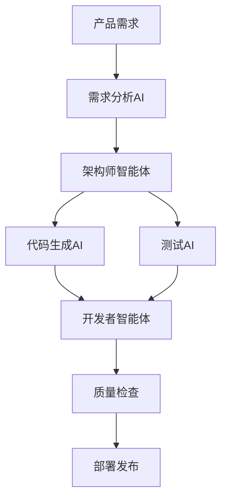

# 第二章：核心概念解析

> **本章导读**
>
> 本章深入解析DDAD方法论的核心概念体系，系统阐述Vibe Coding新范式的理论基础与实践要点。我们将详细探讨心理安全协作环境的构建方法、AI增强开发实践的具体应用、人机共生协作模式的设计原则。同时，本章将介绍基于风险等级的AI参与度评估框架，帮助团队科学制定AI协作策略。最后，我们将展示团队效能模型的构建维度和DDAD方法论的整体架构设计，为后续章节的实践操作提供理论支撑。

---

## Vibe Coding新范式

Vibe Coding代表了一种全新的软件开发理念，它不是简单的"凭感觉编程"，而是在DDAD文档驱动基础上形成的高效、愉悦、创新的开发状态。这种范式的核心在于通过结构化的方法论和AI工具的深度集成，创造出一种既保持技术严谨性又充满创造活力的开发环境。

### 心理安全协作环境

**心理安全协作环境**：Vibe Coding强调打造心理安全的协作环境，鼓励团队成员自由表达创意想法，减少对错误的恐惧，从而激发创新潜能。

在传统开发模式中，开发者往往因为担心犯错、被批评或显得无知而不敢提出大胆的想法或承认不懂的问题。而在Vibe Coding环境中，我们致力于打造一个鼓励实验、包容失败、促进学习的氛围。

**核心特征：**
- **错误友好文化**：将代码错误和设计失误视为学习机会，而非个人能力问题
- **开放式沟通**：鼓励团队成员自由表达创意想法，无论这些想法看起来多么"不切实际"
- **知识共享机制**：建立"无愚蠢问题"的原则，促进团队知识传播
- **实验导向思维**：鼓励快速原型和概念验证

### AI增强开发实践

**AI增强开发实践**：该方法深度融合AI工具辅助开发，通过智能提示、代码补全等功能提升编码效率，同时保持开发者对核心逻辑的把控。

AI增强开发不是简单地使用AI工具，而是将AI深度集成到开发流程的每个环节，形成人机协同的工作模式。

**深度融合的关键领域：**
- **需求理解与分析**：AI帮助分析用户反馈，提取核心需求，自动生成用户故事
- **架构设计与技术选型**：AI基于项目约束推荐技术栈，生成多个架构方案供比较
- **代码生成与优化**：从文档规格生成高质量代码，进行性能优化建议
- **测试与质量保证**：自动生成测试用例，进行代码审查和质量检测

### 人机共生协作主体

**人机共生协作主体**：开发过程中形成"人类主导-AI辅助"的共生协作模式，AI承担重复性工作，开发者聚焦架构设计与问题解决。

这种协作模式的核心在于明确人机分工：
- **人类负责**：创造性思考、战略决策、架构设计、质量把控
- **AI负责**：代码生成、文档编写、测试用例创建、重复性任务执行
- **共同负责**：代码审查、问题诊断、性能优化、知识积累

### 范式转变特征

**范式转变特征**：相较传统编码范式，Vibe Coding更注重即时灵感转化与动态迭代，弱化严格流程约束，强调灵活高效的团队互动。

**主要转变包括：**
- **从瀑布到流式**：从阶段性交付转向持续迭代
- **从个人到团队**：从个人英雄主义转向团队协作
- **从代码到文档**：从代码中心转向文档驱动
- **从工具到伙伴**：从使用AI工具转向与AI协作

---

## 根据风险等级评估AI参与度

在DDAD实践中，不是所有任务都适合让AI深度参与。我们需要建立一套科学的风险评估框架，根据不同的风险等级制定相应的AI参与策略。

### 业务影响维度

**业务影响维度**：业务影响维度评估需明确风险对核心业务流程、客户体验及营收目标的潜在冲击程度。

**评估标准：**
- **高影响**：涉及支付、用户数据、核心业务逻辑的模块
- **中影响**：影响用户体验但不涉及核心业务的功能
- **低影响**：内部工具、辅助功能、非关键路径的模块

### 技术复杂度分析

**技术复杂度分析**：技术复杂度分析聚焦系统架构改造难度、技术栈兼容性及开发资源投入需求。

**复杂度分级：**
- **高复杂度**：涉及分布式系统、高并发、复杂算法的模块
- **中复杂度**：标准的CRUD操作、常见的业务逻辑处理
- **低复杂度**：配置文件、静态页面、简单的数据转换

### 合规要求评估

**合规要求评估**：合规要求评估重点核查风险事项是否符合行业监管规则、数据安全标准及内部制度规范。

**合规等级：**
- **严格合规**：金融、医疗等强监管行业的核心功能
- **一般合规**：涉及用户隐私、数据处理的功能
- **宽松合规**：内部工具、开发环境的功能

### 参与策略制定

**参与策略制定**：参与策略制定环节需协同业务、技术、风控团队，明确各方责任分工与协同机制。

**AI参与度矩阵：**

| 风险等级 | 业务影响 | 技术复杂度 | 合规要求 | AI参与策略 | 人工审查要求 |
|---------|---------|-----------|----------|-----------|-------------|
| **低风险** | 低 | 低 | 宽松 | 全权委托 | 基础审查 |
| **中低风险** | 低-中 | 低-中 | 一般 | 规范约束 | 逻辑审查 |
| **中高风险** | 中-高 | 中-高 | 一般-严格 | 逐步确认 | 详细审查 |
| **高风险** | 高 | 高 | 严格 | 禁止参与 | 人工开发 |

---

## 团队效能模型

DDAD方法论提出了一个多维度的团队效能评估模型，通过量化指标和定性评估相结合的方式，全面衡量团队的协作效率和产出质量。

### 心理安全建设

**心理安全建设**：心理安全建设是团队高效协作的基础，鼓励成员自由表达观点，减少顾虑，形成开放包容的氛围。

**评估指标：**
- **沟通开放度**：团队成员提出问题和建议的频率
- **错误容忍度**：对失败和错误的处理态度
- **学习意愿**：主动学习新技术和分享知识的积极性
- **创新勇气**：提出和尝试新想法的勇气

**测量方法：**
```markdown
## 心理安全评估问卷（月度）
1. 我可以自由地在团队中提出问题和担忧 (1-5分)
2. 当我犯错时，我不会受到惩罚或责备 (1-5分)
3. 我愿意承认自己的错误和不足 (1-5分)
4. 团队鼓励我尝试新的方法和想法 (1-5分)
5. 我感到自己的意见被团队重视 (1-5分)
```

### 工具链集成度

**工具链集成度**：工具链集成度直接影响开发流畅性，统一工具标准可降低沟通成本，提升任务衔接效率。

**评估维度：**
- **工具统一性**：团队使用工具的标准化程度
- **数据互通性**：不同工具间数据流转的顺畅程度
- **自动化程度**：重复性任务的自动化覆盖率
- **学习成本**：新成员掌握工具链的时间

### 流程优化要素

**流程优化要素**：流程优化要素包括需求管理、代码审查等环节的标准化设计，减少冗余步骤，加速迭代周期。

**关键流程指标：**
- **需求到开发的转化率**：需求文档转化为可开发任务的效率
- **代码审查周期**：从提交PR到合并的平均时间
- **部署频率**：单位时间内的部署次数
- **故障恢复时间**：从发现问题到修复上线的时间

### 效能计算公式

**效能计算公式**：通过量化指标（如交付速率、缺陷率）综合评估团队产出质量与协作水平。

**核心公式：**
```
团队效能指数 = (交付价值 × 质量系数 × 协作系数) / 投入成本

其中：
- 交付价值 = 功能点数 × 业务价值权重
- 质量系数 = (1 - 缺陷率) × 用户满意度
- 协作系数 = 心理安全指数 × 工具集成度 × 流程效率
- 投入成本 = 人力成本 + 工具成本 + 时间成本
```

---

## 方法论架构

DDAD方法论的架构设计遵循模块化、可扩展的原则，通过多个核心组件的协同工作，实现文档驱动的敏捷开发。

### 智能体化协作

**智能体化协作**：方法论架构以智能体化协作为基础，通过模拟智能体行为实现团队高效协同，打破传统分工壁垒。

在DDAD架构中，每个参与者（包括人类和AI）都被视为具有特定能力和职责的智能体：

**人类智能体角色：**
- **产品经理智能体**：负责需求分析、业务决策
- **架构师智能体**：负责技术架构、系统设计
- **开发者智能体**：负责代码实现、质量把控
- **测试工程师智能体**：负责测试设计、质量验证

**AI智能体角色：**
- **需求分析AI**：辅助需求文档生成和分析
- **代码生成AI**：根据规格生成代码实现
- **测试AI**：自动生成测试用例和执行测试
- **文档AI**：维护和更新项目文档

### 规范即记忆

**规范即记忆**：强调将开发规范内化为系统记忆，减少重复沟通成本，确保团队动作一致性。

这个概念的核心在于将团队的隐性知识显性化，并通过结构化的文档体系进行管理：

**知识层次结构：**
```
项目记忆体系
├── 业务知识
│   ├── 领域模型
│   ├── 业务规则
│   └── 用户画像
├── 技术知识
│   ├── 架构决策
│   ├── 编码规范
│   └── 最佳实践
├── 流程知识
│   ├── 开发流程
│   ├── 发布流程
│   └── 应急流程
└── 历史经验
    ├── 成功案例
    ├── 失败教训
    └── 优化建议
```

### 工程化整合

**工程化整合**：聚焦代码、文档与流程的标准化管理，通过工具链串联各环节，提升整体交付质量。

**整合的关键要素：**
- **版本控制一体化**：代码和文档使用统一的版本控制系统
- **CI/CD集成**：文档变更触发相应的构建和测试流程
- **质量门禁**：建立文档质量检查和代码质量检查的统一标准
- **监控运维**：统一的监控和日志系统，支持问题快速定位

### 多智能体编排

**多智能体编排**：支持多个智能体角色动态配合，根据任务需求灵活分配职责，实现复杂项目的精准落地。

**编排机制：**
- **任务分解**：将复杂任务分解为可并行执行的子任务
- **角色分配**：根据任务特点和智能体能力进行最优匹配
- **协调机制**：建立智能体间的通信和协调机制
- **质量保证**：多层次的质量检查和反馈机制

**编排示例：**


这种多智能体编排模式能够显著提升开发效率，同时保证质量和可控性。通过合理的任务分配和协调机制，团队能够充分发挥每个智能体的优势，实现1+1>2的协同效果。