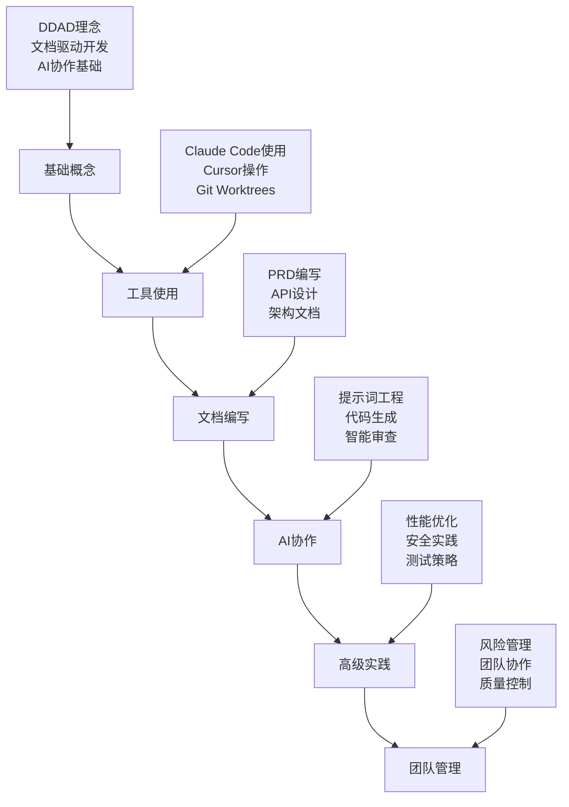
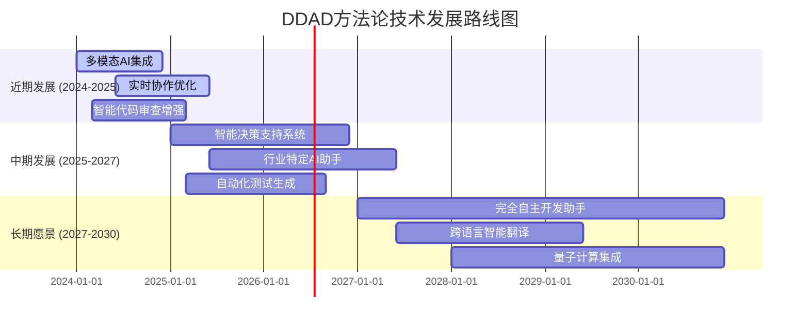

# 第六章：最佳实践与展望

> **本章导读**
>
> 本章深入探讨DDAD方法论在实际应用中的最佳实践策略，系统阐述风险分级管理、开发者体验优化和AI协作治理的具体方法。我们将详细分析如何根据不同场景的风险等级制定相应的管理策略，如何通过工具易用性和学习曲线优化提升开发者体验，以及如何建立完善的AI协作治理机制。同时，本章将展望DDAD方法论的未来发展趋势，包括多模态AI协作、实时协作增强和智能决策支持等前沿技术的应用前景。

---

## 风险分级策略

在DDAD方法论的实施过程中，不同类型的开发任务面临着不同程度的技术和业务风险。建立科学的风险分级体系，能够帮助团队合理配置资源，制定针对性的管理策略，确保项目的成功交付。

### 风险分级框架

我们将开发任务按照技术复杂度、业务影响和不确定性三个维度进行风险评估，形成低、中、高三个风险等级。

#### 低风险场景

**特征识别**：
- **常规功能迭代**：基于现有架构的功能扩展，技术路径清晰
- **成熟方案复用**：使用已验证的技术栈和设计模式
- **明确的需求边界**：业务逻辑简单，验收标准清晰
- **充足的技术储备**：团队对相关技术有丰富经验

**典型场景示例**：
- 在现有用户管理系统中添加新的用户属性字段
- 基于现有API模式新增数据查询接口
- 使用成熟UI组件库开发标准表单页面
- 对现有功能进行性能优化（非架构级改动）

**管理策略**：
```yaml
低风险场景管理策略:
  开发方式:
    - AI辅助度: 80-90%
    - 人工审查: 基础代码审查即可
    - 测试策略: 自动化测试为主
  
  资源配置:
    - 人员安排: 初中级开发者可独立完成
    - 时间预估: 标准工作量估算
    - 缓冲时间: 10-20%
  
  质量控制:
    - 代码审查: 同级审查
    - 测试覆盖: 单元测试 + 基础集成测试
    - 部署策略: 标准CI/CD流程
  
  风险监控:
    - 检查频率: 每周检查
    - 关键指标: 进度完成率、缺陷率
    - 预警机制: 进度延迟超过20%时预警
```

#### 中风险场景

**特征识别**：
- **部分技术探索**：需要学习新框架或工具，但不涉及核心架构
- **跨团队协作任务**：需要多个团队配合，接口依赖较多
- **业务逻辑中等复杂**：涉及多个业务实体的交互
- **性能要求较高**：对响应时间或并发量有明确要求

**典型场景示例**：
- 集成第三方支付系统到现有电商平台
- 开发跨部门的数据同步服务
- 实现复杂的权限控制系统
- 基于新的前端框架重构旧页面

**管理策略**：
```yaml
中风险场景管理策略:
  开发方式:
    - AI辅助度: 60-70%
    - 人工审查: 高级开发者参与审查
    - 测试策略: 完整的测试金字塔
  
  资源配置:
    - 人员安排: 高级开发者主导 + 初中级协助
    - 时间预估: 增加30-50%缓冲
    - 技能准备: 提前安排技术调研和培训
  
  质量控制:
    - 接口规范: 必须明确定义接口契约
    - 验收标准: 详细的功能和性能验收标准
    - 代码审查: 架构师级别审查
  
  协作机制:
    - 沟通频率: 每2-3天同步一次
    - 文档要求: 详细的设计文档和API文档  
    - 风险评估: 每周进行风险评估和调整
```

#### 高风险场景

**特征识别**：
- **核心架构重构**：涉及系统基础架构的重大变更
- **前沿技术预研**：使用未经验证的新技术或框架
- **复杂业务创新**：全新的业务模式或算法实现
- **高并发高可用要求**：对系统稳定性和性能有极高要求

**典型场景示例**：
- 从单体架构向微服务架构的迁移
- 实现基于AI的实时推荐系统
- 开发分布式事务处理引擎
- 构建支持千万级用户的实时通信系统

**管理策略**：
```yaml
高风险场景管理策略:
  前期准备:
    - 技术调研: 深入的技术可行性分析
    - 原型验证: 必须先构建技术原型
    - 专家咨询: 引入外部专家或顾问
  
  开发方式:
    - AI辅助度: 40-50% (AI主要用于辅助分析和代码生成)
    - 人工主导: 资深架构师全程参与
    - 迭代策略: 小步快跑，频繁验证
  
  风险控制:
    - 回滚方案: 必须制定详细的回滚计划
    - 灰度发布: 分阶段逐步发布
    - 监控告警: 全方位的监控和告警机制
  
  资源投入:
    - 团队配置: 最优秀的技术团队
    - 时间缓冲: 100%以上的时间缓冲
    - 预算准备: 充足的技术和人力预算
```

### 风险评估工具

为了帮助团队快速准确地评估项目风险，我们提供了一套标准化的评估工具：

**风险评估矩阵**：
```python
class RiskAssessment:
    """项目风险评估工具"""
    
    def __init__(self):
        self.risk_factors = {
            'technical_complexity': {
                'low': 1,      # 使用熟悉技术栈
                'medium': 2,   # 部分新技术
                'high': 3      # 大量新技术或前沿技术
            },
            'business_impact': {
                'low': 1,      # 非核心功能
                'medium': 2,   # 重要功能
                'high': 3      # 核心业务功能
            },
            'team_experience': {
                'high': 1,     # 团队经验丰富
                'medium': 2,   # 团队经验一般
                'low': 3       # 团队缺乏相关经验
            },
            'time_pressure': {
                'low': 1,      # 时间充裕
                'medium': 2,   # 时间适中
                'high': 3      # 时间紧张
            },
            'dependency_complexity': {
                'low': 1,      # 依赖简单
                'medium': 2,   # 依赖中等
                'high': 3      # 依赖复杂
            }
        }
    
    def calculate_risk_score(self, factors: dict) -> tuple:
        """计算风险分数"""
        total_score = sum(
            self.risk_factors[factor][level] 
            for factor, level in factors.items()
        )
        
        if total_score <= 7:
            return 'LOW', total_score
        elif total_score <= 11:
            return 'MEDIUM', total_score  
        else:
            return 'HIGH', total_score
    
    def get_recommendations(self, risk_level: str) -> dict:
        """获取风险管理建议"""
        recommendations = {
            'LOW': {
                'ai_assistance': '80-90%',
                'review_level': 'peer_review',
                'testing': 'automated_testing',
                'timeline_buffer': '10-20%'
            },
            'MEDIUM': {
                'ai_assistance': '60-70%',
                'review_level': 'senior_review',
                'testing': 'comprehensive_testing',
                'timeline_buffer': '30-50%'
            },
            'HIGH': {
                'ai_assistance': '40-50%',
                'review_level': 'architect_review',
                'testing': 'extensive_testing',
                'timeline_buffer': '100%+'
            }
        }
        return recommendations[risk_level]

# 使用示例
assessor = RiskAssessment()
project_factors = {
    'technical_complexity': 'medium',
    'business_impact': 'high',
    'team_experience': 'medium',
    'time_pressure': 'high',
    'dependency_complexity': 'medium'
}

risk_level, score = assessor.calculate_risk_score(project_factors)
recommendations = assessor.get_recommendations(risk_level)

print(f"风险等级: {risk_level} (分数: {score})")
print(f"管理建议: {recommendations}")
```

---

## 开发者体验优化

优秀的开发者体验是DDAD方法论成功实施的关键因素。我们需要从工具易用性、学习曲线、协作流畅度等多个维度来优化开发者的日常工作体验。

### 工具易用性设计

**直观简洁的界面设计**：

现代开发工具应该遵循"零学习成本"的设计理念，让开发者能够直观地理解和使用工具功能。

**设计原则**：
- **一致性原则**：相似功能使用相似的交互模式
- **可发现性原则**：重要功能应该容易被发现
- **反馈原则**：操作后应该有明确的反馈
- **容错原则**：支持撤销和错误恢复

**实践示例**：
```yaml
# VS Code 插件界面设计规范
interface_design:
  command_palette:
    - "DDAD: Generate PRD" 
    - "DDAD: Create User Stories"
    - "DDAD: Generate API Spec"
    - "DDAD: Review Code with AI"
  
  sidebar_panel:
    sections:
      - name: "Project Structure"
        items: ["Requirements", "Design", "Implementation"]
      - name: "AI Assistants" 
        items: ["Code Generator", "Reviewer", "Tester"]
      - name: "Documentation"
        items: ["Sync Status", "Generate Docs", "Validate Consistency"]
  
  status_bar:
    indicators:
      - "DDAD: ✅ Docs Synced"
      - "AI: 🤖 Ready"
      - "Tests: ✅ 95% Coverage"
```

**减少复杂操作步骤**：

将复杂的多步骤操作封装为简单的一键操作，减少开发者的认知负担。

```javascript
// 一键项目初始化示例
class DDAdProjectInitializer {
    async initializeProject(projectName, projectType) {
        const steps = [
            () => this.createProjectStructure(projectName),
            () => this.generateInitialDocs(projectType),
            () => this.setupAIConfiguration(),
            () => this.initializeVCS(),
            () => this.setupCICD()
        ];
        
        const progress = new ProgressIndicator(steps.length);
        
        for (const [index, step] of steps.entries()) {
            try {
                await step();
                progress.update(index + 1, `Step ${index + 1} completed`);
            } catch (error) {
                progress.error(`Step ${index + 1} failed: ${error.message}`);
                throw error;
            }
        }
        
        progress.complete("Project initialized successfully!");
    }
}
```

### 学习曲线优化

**分阶段学习模块**：

将DDAD方法论的学习过程分解为多个递进的模块，让开发者能够循序渐进地掌握核心技能。

**学习路径设计**：


**交互式学习体验**：
```python
class InteractiveTutorial:
    """交互式DDAD学习系统"""
    
    def __init__(self):
        self.modules = {
            'basics': BasicConceptsModule(),
            'tools': ToolUsageModule(), 
            'documentation': DocumentationModule(),
            'ai_collaboration': AICollaborationModule(),
            'advanced': AdvancedPracticesModule()
        }
        self.progress = UserProgress()
    
    def start_learning_path(self, user_id: str, skill_level: str):
        """根据技能水平启动个性化学习路径"""
        path = self.generate_learning_path(skill_level)
        
        for module_name in path:
            module = self.modules[module_name]
            
            # 理论学习
            module.present_concepts()
            
            # 实践练习
            exercises = module.get_exercises()
            for exercise in exercises:
                result = exercise.execute_with_guidance()
                self.progress.record_exercise(user_id, exercise.id, result)
            
            # 知识检验
            quiz_score = module.take_quiz()
            if quiz_score >= 0.8:
                self.progress.complete_module(user_id, module_name)
            else:
                # 提供额外的学习资源
                module.provide_additional_resources()
```

**清晰的指引和帮助**：

提供上下文相关的帮助信息，让开发者在遇到问题时能够快速找到解决方案。

```yaml
# 智能帮助系统配置
help_system:
  context_aware_tips:
    - trigger: "user_opens_prd_template"
      message: "💡 提示：使用 'DDAD: Generate PRD' 命令可以让AI帮你生成PRD模板"
      
    - trigger: "user_writes_api_spec"
      message: "📚 参考：查看我们的API设计最佳实践指南"
      
    - trigger: "code_review_started"
      message: "🤖 建议：使用AI代码审查功能可以自动发现潜在问题"
  
  progressive_disclosure:
    beginner:
      - "基础概念和术语解释"
      - "逐步操作指导"
      - "常见错误和解决方案"
    
    intermediate:
      - "最佳实践建议" 
      - "高级功能介绍"
      - "性能优化技巧"
    
    advanced:
      - "架构设计模式"
      - "团队协作策略"
      - "自定义扩展方法"
```

### 协作流畅度提升

**实时同步机制**：

确保团队成员之间的文档、代码和决策能够实时同步，避免信息不一致导致的协作障碍。

```typescript
class CollaborationSync {
    private websocket: WebSocket;
    private documentStore: DocumentStore;
    private conflictResolver: ConflictResolver;
    
    async initializeRealTimeSync(projectId: string) {
        this.websocket = new WebSocket(`ws://sync-server/${projectId}`);
        
        this.websocket.onmessage = (event) => {
            const update = JSON.parse(event.data);
            this.handleUpdate(update);
        };
    }
    
    async handleUpdate(update: DocumentUpdate) {
        const localVersion = await this.documentStore.getVersion(update.documentId);
        
        if (update.version > localVersion) {
            // 检查冲突
            const conflicts = await this.conflictResolver.detectConflicts(
                update, 
                localVersion
            );
            
            if (conflicts.length > 0) {
                // 智能冲突解决
                const resolution = await this.conflictResolver.resolveWithAI(conflicts);
                await this.applyResolution(resolution);
            } else {
                // 直接应用更新
                await this.documentStore.applyUpdate(update);
            }
            
            // 通知用户
            this.notifyUser(`Document ${update.documentId} updated`);
        }
    }
}
```

**版本管理优化**：

提供直观的版本管理界面，让开发者能够轻松地跟踪文档和代码的变更历史。

```yaml
# 版本管理界面设计
version_management:
  timeline_view:
    - timestamp: "2024-01-15 10:30"
      author: "张三"
      action: "更新PRD文档"
      changes: ["添加用户权限需求", "修改性能指标"]
      
    - timestamp: "2024-01-15 11:45" 
      author: "李四"
      action: "生成API规格"
      changes: ["基于PRD生成REST API", "添加认证接口"]
  
  diff_visualization:
    - type: "addition"
      content: "+ 支持OAuth 2.0认证"
      line: 45
      
    - type: "modification"
      content: "~ 响应时间要求从3s改为2s"
      line: 67
      
    - type: "deletion"
      content: "- 移除旧的登录方式"
      line: 89
  
  branch_management:
    - name: "feature/user-auth"
      status: "in_progress"
      docs_sync: "✅ synced"
      
    - name: "feature/payment"
      status: "review"
      docs_sync: "⚠️ needs_update"
```

### 支持策略实施

**全面的技术支持**：

建立多层次的技术支持体系，确保开发者在使用DDAD方法论时能够获得及时有效的帮助。

```yaml
support_strategy:
  self_service:
    - comprehensive_documentation
    - video_tutorials
    - interactive_examples
    - faq_database
    
  community_support:
    - discussion_forums
    - slack_channels
    - peer_mentoring
    - knowledge_sharing_sessions
    
  professional_support:
    - expert_consultation
    - custom_training
    - implementation_guidance
    - troubleshooting_assistance
    
  ai_assisted_support:
    - intelligent_help_bot
    - context_aware_suggestions
    - automated_problem_diagnosis
    - solution_recommendations
```

**定期更新服务**：

建立持续改进机制，根据用户反馈和技术发展不断优化工具和方法论。

```python
class ContinuousImprovement:
    """持续改进服务"""
    
    def __init__(self):
        self.feedback_collector = FeedbackCollector()
        self.analytics_engine = AnalyticsEngine()
        self.update_scheduler = UpdateScheduler()
    
    async def collect_user_feedback(self):
        """收集用户反馈"""
        feedback_data = await self.feedback_collector.gather_feedback([
            'tool_usability',
            'learning_experience', 
            'collaboration_efficiency',
            'ai_assistance_quality'
        ])
        
        return self.analyze_feedback(feedback_data)
    
    async def analyze_usage_patterns(self):
        """分析使用模式"""
        usage_data = await self.analytics_engine.analyze([
            'feature_adoption_rates',
            'common_pain_points',
            'workflow_bottlenecks',
            'success_metrics'
        ])
        
        return self.identify_improvement_opportunities(usage_data)
    
    async def plan_updates(self, feedback_analysis, usage_analysis):
        """规划更新计划"""
        priorities = self.prioritize_improvements(
            feedback_analysis, 
            usage_analysis
        )
        
        update_plan = self.create_update_roadmap(priorities)
        
        # 安排定期更新
        self.update_scheduler.schedule_updates(update_plan)
        
        return update_plan
```

---

## AI协作治理

随着AI在软件开发中的深度应用，建立完善的AI协作治理机制变得至关重要。我们需要确保AI的使用既能提升效率，又能保证质量和安全。

### 治理原则

**透明性原则**：

AI的决策过程应该是可解释和可追溯的，开发者应该能够理解AI为什么做出某个建议或生成某段代码。

```python
class AIDecisionTracker:
    """AI决策跟踪器"""
    
    def __init__(self):
        self.decision_log = []
        self.explanation_engine = ExplanationEngine()
    
    def record_decision(self, context: dict, decision: dict, reasoning: str):
        """记录AI决策"""
        decision_record = {
            'timestamp': datetime.now(),
            'context': context,
            'decision': decision,
            'reasoning': reasoning,
            'confidence_score': decision.get('confidence', 0),
            'human_review_required': decision.get('confidence', 0) < 0.8
        }
        
        self.decision_log.append(decision_record)
        
        # 如果置信度较低，要求人工审查
        if decision_record['human_review_required']:
            self.request_human_review(decision_record)
    
    def explain_decision(self, decision_id: str) -> str:
        """解释AI决策"""
        decision = self.find_decision(decision_id)
        
        explanation = self.explanation_engine.generate_explanation(
            decision['context'],
            decision['decision'], 
            decision['reasoning']
        )
        
        return explanation
    
    def audit_decisions(self, time_range: tuple) -> dict:
        """审计AI决策"""
        decisions_in_range = [
            d for d in self.decision_log 
            if time_range[0] <= d['timestamp'] <= time_range[1]
        ]
        
        return {
            'total_decisions': len(decisions_in_range),
            'high_confidence': len([d for d in decisions_in_range if d['confidence_score'] > 0.8]),
            'human_reviewed': len([d for d in decisions_in_range if d['human_review_required']]),
            'accuracy_rate': self.calculate_accuracy(decisions_in_range)
        }
```

**可控性原则**：

开发者应该能够控制AI的行为，包括设置AI的参与程度、审查AI的输出、以及在必要时覆盖AI的决策。

```yaml
# AI控制配置示例
ai_control_settings:
  participation_level:
    code_generation: "high"      # AI可以生成完整代码
    code_review: "medium"        # AI提供建议，人工决策
    architecture_design: "low"   # AI仅提供参考，人工主导
    
  output_review:
    automatic_review: true       # 自动审查AI输出
    human_approval_required:     # 需要人工批准的场景
      - "security_related_code"
      - "database_migrations" 
      - "external_api_integrations"
    
  override_permissions:
    developers: ["code_suggestions", "test_generation"]
    senior_developers: ["architecture_suggestions", "refactoring_plans"]
    architects: ["all_ai_decisions"]
```

**责任归属原则**：

明确AI和人类在协作过程中的责任边界，确保最终的代码质量和系统安全由人类负责。

```python
class ResponsibilityMatrix:
    """责任矩阵管理"""
    
    def __init__(self):
        self.responsibility_rules = {
            'code_generation': 'ai_suggests_human_approves',
            'code_review': 'ai_assists_human_decides', 
            'security_validation': 'human_responsible',
            'performance_optimization': 'ai_suggests_human_validates',
            'architecture_decisions': 'human_responsible',
            'deployment_approval': 'human_responsible'
        }
    
    def get_responsibility(self, task_type: str) -> dict:
        """获取任务责任分配"""
        rule = self.responsibility_rules.get(task_type, 'human_responsible')
        
        responsibility_map = {
            'ai_suggests_human_approves': {
                'ai_role': 'generate_suggestions',
                'human_role': 'review_and_approve',
                'final_responsibility': 'human'
            },
            'ai_assists_human_decides': {
                'ai_role': 'provide_analysis',
                'human_role': 'make_decisions', 
                'final_responsibility': 'human'
            },
            'human_responsible': {
                'ai_role': 'optional_assistance',
                'human_role': 'full_responsibility',
                'final_responsibility': 'human'
            }
        }
        
        return responsibility_map[rule]
```

### 质量检查点

**分层验证机制**：

建立多层次的质量检查机制，确保AI生成的内容符合项目标准和业务要求。

```python
class QualityGate:
    """质量门禁系统"""
    
    def __init__(self):
        self.validators = {
            'syntax': SyntaxValidator(),
            'logic': LogicValidator(),
            'security': SecurityValidator(),
            'performance': PerformanceValidator(),
            'standards': CodingStandardsValidator()
        }
        self.quality_metrics = QualityMetrics()
    
    async def validate_ai_output(self, output_type: str, content: str) -> dict:
        """验证AI输出质量"""
        validation_results = {}
        
        # 根据输出类型选择相应的验证器
        applicable_validators = self.get_applicable_validators(output_type)
        
        for validator_name in applicable_validators:
            validator = self.validators[validator_name]
            
            try:
                result = await validator.validate(content)
                validation_results[validator_name] = result
            except Exception as e:
                validation_results[validator_name] = {
                    'passed': False,
                    'error': str(e)
                }
        
        # 计算总体质量分数
        overall_score = self.calculate_quality_score(validation_results)
        
        return {
            'overall_score': overall_score,
            'validation_results': validation_results,
            'passed': overall_score >= 0.8,
            'recommendations': self.generate_recommendations(validation_results)
        }
    
    def get_applicable_validators(self, output_type: str) -> list:
        """获取适用的验证器"""
        validator_mapping = {
            'code': ['syntax', 'logic', 'security', 'performance', 'standards'],
            'documentation': ['logic', 'standards'],
            'api_spec': ['logic', 'security', 'standards'],
            'test_case': ['logic', 'standards']
        }
        
        return validator_mapping.get(output_type, ['logic', 'standards'])
```

**代码逻辑验证**：

确保AI生成的代码逻辑正确，符合业务需求和技术规范。

```python
class LogicValidator:
    """逻辑验证器"""
    
    def __init__(self):
        self.ast_analyzer = ASTAnalyzer()
        self.business_rules = BusinessRulesEngine()
        self.test_generator = TestGenerator()
    
    async def validate(self, code: str) -> dict:
        """验证代码逻辑"""
        results = {
            'syntax_correct': False,
            'logic_sound': False,
            'business_compliant': False,
            'test_coverage': 0,
            'issues': []
        }
        
        try:
            # 语法分析
            ast_tree = self.ast_analyzer.parse(code)
            results['syntax_correct'] = True
            
            # 逻辑分析
            logic_issues = self.analyze_logic(ast_tree)
            results['logic_sound'] = len(logic_issues) == 0
            results['issues'].extend(logic_issues)
            
            # 业务规则检查
            business_issues = await self.business_rules.validate(code)
            results['business_compliant'] = len(business_issues) == 0
            results['issues'].extend(business_issues)
            
            # 生成测试用例并检查覆盖率
            test_cases = await self.test_generator.generate_tests(code)
            results['test_coverage'] = self.calculate_coverage(code, test_cases)
            
        except Exception as e:
            results['issues'].append(f"Validation error: {str(e)}")
        
        return results
    
    def analyze_logic(self, ast_tree) -> list:
        """分析代码逻辑"""
        issues = []
        
        # 检查常见逻辑问题
        issues.extend(self.check_null_pointer_risks(ast_tree))
        issues.extend(self.check_infinite_loops(ast_tree))
        issues.extend(self.check_resource_leaks(ast_tree))
        issues.extend(self.check_error_handling(ast_tree))
        
        return issues
```

**功能匹配度评估**：

验证AI生成的代码是否真正实现了需求文档中描述的功能。

```python
class RequirementTraceability:
    """需求可追溯性检查"""
    
    def __init__(self):
        self.nlp_processor = NLPProcessor()
        self.code_analyzer = CodeAnalyzer()
        self.similarity_calculator = SimilarityCalculator()
    
    async def check_requirement_coverage(self, requirements: str, code: str) -> dict:
        """检查需求覆盖度"""
        
        # 提取需求中的功能点
        requirement_features = await self.extract_features(requirements)
        
        # 分析代码实现的功能
        implemented_features = await self.analyze_implementation(code)
        
        # 计算匹配度
        coverage_matrix = self.calculate_coverage_matrix(
            requirement_features, 
            implemented_features
        )
        
        return {
            'overall_coverage': self.calculate_overall_coverage(coverage_matrix),
            'covered_requirements': self.get_covered_requirements(coverage_matrix),
            'missing_requirements': self.get_missing_requirements(coverage_matrix),
            'extra_implementations': self.get_extra_implementations(coverage_matrix),
            'recommendations': self.generate_coverage_recommendations(coverage_matrix)
        }
    
    async def extract_features(self, requirements: str) -> list:
        """从需求文档中提取功能点"""
        sentences = self.nlp_processor.split_sentences(requirements)
        features = []
        
        for sentence in sentences:
            # 识别功能性描述
            if self.is_functional_requirement(sentence):
                feature = {
                    'description': sentence,
                    'keywords': self.extract_keywords(sentence),
                    'verb_phrases': self.extract_verb_phrases(sentence),
                    'entities': self.extract_entities(sentence)
                }
                features.append(feature)
        
        return features
```

### 风险评估

**数据偏差识别**：

识别和缓解AI模型中可能存在的数据偏差，确保生成的代码和建议的公平性和准确性。

```python
class BiasDetector:
    """偏差检测器"""
    
    def __init__(self):
        self.bias_patterns = BiasPatternLibrary()
        self.fairness_metrics = FairnessMetrics()
        self.statistical_analyzer = StatisticalAnalyzer()
    
    async def detect_bias(self, ai_outputs: list, context: dict) -> dict:
        """检测AI输出中的偏差"""
        
        bias_analysis = {
            'demographic_bias': await self.check_demographic_bias(ai_outputs),
            'technical_bias': await self.check_technical_bias(ai_outputs),
            'cultural_bias': await self.check_cultural_bias(ai_outputs),
            'confirmation_bias': await self.check_confirmation_bias(ai_outputs, context)
        }
        
        overall_risk = self.calculate_bias_risk(bias_analysis)
        
        return {
            'bias_analysis': bias_analysis,
            'overall_risk_level': overall_risk,
            'mitigation_strategies': self.suggest_mitigation_strategies(bias_analysis),
            'monitoring_recommendations': self.get_monitoring_recommendations(overall_risk)
        }
    
    async def check_technical_bias(self, outputs: list) -> dict:
        """检查技术偏差"""
        
        # 分析技术栈偏好
        tech_preferences = self.analyze_tech_preferences(outputs)
        
        # 检查解决方案多样性
        solution_diversity = self.measure_solution_diversity(outputs)
        
        # 分析复杂度偏向
        complexity_bias = self.analyze_complexity_bias(outputs)
        
        return {
            'tech_stack_bias': tech_preferences,
            'solution_diversity_score': solution_diversity,
            'complexity_bias': complexity_bias,
            'risk_level': self.calculate_technical_bias_risk(
                tech_preferences, solution_diversity, complexity_bias
            )
        }
```

**模型误判处理**：

建立机制来识别和处理AI模型的误判情况，确保系统的可靠性。

```python
class MisclassificationHandler:
    """误判处理器"""
    
    def __init__(self):
        self.confidence_threshold = 0.8
        self.human_feedback_collector = HumanFeedbackCollector()
        self.model_retrainer = ModelRetrainer()
        self.fallback_strategies = FallbackStrategies()
    
    async def handle_low_confidence_prediction(self, prediction: dict) -> dict:
        """处理低置信度预测"""
        
        if prediction['confidence'] < self.confidence_threshold:
            # 请求人工审查
            human_review = await self.request_human_review(prediction)
            
            if human_review['approved']:
                # 更新训练数据
                await self.update_training_data(prediction, human_review)
                return prediction
            else:
                # 使用备选策略
                fallback_result = await self.fallback_strategies.execute(
                    prediction['input']
                )
                return fallback_result
        
        return prediction
    
    async def detect_systematic_errors(self, predictions: list) -> dict:
        """检测系统性错误"""
        
        error_patterns = []
        
        # 分析错误类型分布
        error_distribution = self.analyze_error_distribution(predictions)
        
        # 识别重复错误模式
        recurring_patterns = self.find_recurring_patterns(predictions)
        
        # 检查特定输入类型的错误率
        input_type_errors = self.analyze_input_type_errors(predictions)
        
        if self.is_systematic_error_detected(error_distribution, recurring_patterns):
            # 触发模型重训练
            await self.trigger_model_retraining(error_patterns)
            
            # 临时启用更严格的人工审查
            self.enable_strict_human_review()
        
        return {
            'systematic_errors_detected': len(error_patterns) > 0,
            'error_patterns': error_patterns,
            'recommended_actions': self.get_recommended_actions(error_patterns)
        }
```

### 改进流程

**持续学习机制**：

建立AI系统的持续学习和改进机制，基于实际使用反馈不断优化AI的表现。

```python
class ContinuousLearning:
    """持续学习系统"""
    
    def __init__(self):
        self.feedback_aggregator = FeedbackAggregator()
        self.performance_monitor = PerformanceMonitor()
        self.model_updater = ModelUpdater()
        self.experiment_manager = ExperimentManager()
    
    async def collect_feedback(self, interaction_id: str, feedback: dict):
        """收集用户反馈"""
        
        feedback_record = {
            'interaction_id': interaction_id,
            'timestamp': datetime.now(),
            'feedback': feedback,
            'context': await self.get_interaction_context(interaction_id)
        }
        
        await self.feedback_aggregator.store_feedback(feedback_record)
        
        # 检查是否需要立即调整
        if feedback['rating'] < 2:  # 负面反馈
            await self.handle_negative_feedback(feedback_record)
    
    async def analyze_performance_trends(self) -> dict:
        """分析性能趋势"""
        
        current_metrics = await self.performance_monitor.get_current_metrics()
        historical_metrics = await self.performance_monitor.get_historical_metrics()
        
        trends = self.calculate_trends(current_metrics, historical_metrics)
        
        return {
            'performance_trends': trends,
            'improvement_opportunities': self.identify_improvement_opportunities(trends),
            'recommended_experiments': self.suggest_experiments(trends)
        }
    
    async def run_improvement_experiments(self, experiments: list):
        """运行改进实验"""
        
        for experiment in experiments:
            # 设置A/B测试
            test_config = await self.experiment_manager.setup_ab_test(experiment)
            
            # 运行实验
            results = await self.experiment_manager.run_experiment(test_config)
            
            # 评估结果
            if results['improvement_significant']:
                # 应用改进
                await self.model_updater.apply_improvement(experiment)
                
                # 记录成功的改进
                await self.log_successful_improvement(experiment, results)
```

**迭代反馈优化**：

基于用户反馈和系统表现数据，持续优化AI协作的各个环节。

```yaml
# 反馈优化流程配置
feedback_optimization:
  collection_strategy:
    implicit_feedback:
      - code_acceptance_rate
      - modification_patterns
      - usage_frequency
    
    explicit_feedback:
      - user_ratings
      - bug_reports
      - feature_requests
    
    behavioral_feedback:
      - workflow_patterns
      - tool_switching_frequency
      - task_completion_time
  
  analysis_pipeline:
    - aggregate_feedback_data
    - identify_pain_points
    - correlate_with_performance_metrics
    - generate_improvement_hypotheses
    - design_experiments
    - validate_improvements
  
  optimization_targets:
    accuracy: "increase_code_generation_accuracy"
    efficiency: "reduce_iteration_cycles" 
    satisfaction: "improve_user_experience_scores"
    adoption: "increase_feature_usage_rates"
```

---

## 未来发展前景

DDAD方法论和AI协作开发正站在技术革命的前沿，未来几年将迎来更多突破性的发展。让我们展望这些激动人心的技术趋势和应用前景。

### 多模态AI协作

**技术趋势**：

未来的AI工具将支持文本、图像、语音、视频等多种输入模式，为开发者提供更自然、更高效的交互体验。

```python
class MultimodalAIAssistant:
    """多模态AI助手"""
    
    def __init__(self):
        self.text_processor = TextProcessor()
        self.image_analyzer = ImageAnalyzer()
        self.voice_recognizer = VoiceRecognizer()
        self.gesture_detector = GestureDetector()
        self.context_integrator = ContextIntegrator()
    
    async def process_multimodal_input(self, input_data: dict) -> dict:
        """处理多模态输入"""
        
        processed_inputs = {}
        
        # 处理文本输入
        if 'text' in input_data:
            processed_inputs['text'] = await self.text_processor.analyze(
                input_data['text']
            )
        
        # 处理图像输入（如UI设计稿、架构图）
        if 'image' in input_data:
            processed_inputs['image'] = await self.image_analyzer.extract_info(
                input_data['image']
            )
        
        # 处理语音输入
        if 'audio' in input_data:
            processed_inputs['audio'] = await self.voice_recognizer.transcribe_and_analyze(
                input_data['audio']
            )
        
        # 处理手势输入（如在空中绘制架构图）
        if 'gesture' in input_data:
            processed_inputs['gesture'] = await self.gesture_detector.interpret(
                input_data['gesture']
            )
        
        # 整合多模态信息
        integrated_context = await self.context_integrator.merge_contexts(
            processed_inputs
        )
        
        return integrated_context

    async def generate_multimodal_response(self, context: dict) -> dict:
        """生成多模态响应"""
        
        response = {
            'text': await self.generate_text_response(context),
            'code': await self.generate_code_response(context),
            'diagrams': await self.generate_visual_diagrams(context),
            'audio_explanation': await self.generate_audio_explanation(context)
        }
        
        return response
```

**应用场景**：

1. **语音驱动编程**：开发者可以通过语音描述需求，AI自动生成代码和文档
2. **视觉设计转代码**：上传UI设计稿，AI自动生成对应的前端代码
3. **手势交互设计**：通过手势在空中绘制系统架构，AI理解并生成架构文档
4. **视频会议协作**：AI实时分析会议内容，自动生成会议纪要和行动项

### 实时协作增强

**技术特点**：

未来的开发环境将支持真正的实时协作，多个开发者可以同时在同一个项目中工作，AI实时提供智能建议和冲突解决方案。

```typescript
class RealTimeCollaboration {
    private collaborationEngine: CollaborationEngine;
    private aiMediator: AIMediator;
    private conflictResolver: ConflictResolver;
    
    constructor() {
        this.collaborationEngine = new CollaborationEngine();
        this.aiMediator = new AIMediator();
        this.conflictResolver = new ConflictResolver();
    }
    
    async initializeCollaborativeSession(projectId: string, participants: User[]) {
        const session = await this.collaborationEngine.createSession({
            projectId,
            participants,
            features: [
                'real_time_editing',
                'ai_suggestions',
                'conflict_resolution',
                'context_sharing'
            ]
        });
        
        // 为每个参与者分配AI助手
        for (const participant of participants) {
            const personalAI = await this.aiMediator.createPersonalAssistant({
                userId: participant.id,
                preferences: participant.preferences,
                skillLevel: participant.skillLevel
            });
            
            session.assignAI(participant.id, personalAI);
        }
        
        return session;
    }
    
    async handleRealTimeEditing(edit: EditEvent) {
        // 广播编辑事件
        await this.collaborationEngine.broadcastEdit(edit);
        
        // AI实时分析编辑内容
        const aiAnalysis = await this.aiMediator.analyzeEdit(edit);
        
        // 检查潜在冲突
        const conflicts = await this.conflictResolver.detectConflicts(edit);
        
        if (conflicts.length > 0) {
            // AI辅助解决冲突
            const resolution = await this.conflictResolver.resolveWithAI(conflicts);
            await this.collaborationEngine.applyResolution(resolution);
        }
        
        // 提供实时AI建议
        if (aiAnalysis.suggestions.length > 0) {
            await this.collaborationEngine.broadcastSuggestions(
                edit.userId,
                aiAnalysis.suggestions
            );
        }
    }
}
```

**创新功能**：

1. **智能任务分配**：AI根据团队成员的技能和工作负载自动分配任务
2. **实时代码审查**：AI在代码编写过程中实时提供审查意见
3. **协作冲突预测**：AI预测可能的协作冲突并提前给出建议
4. **知识实时共享**：AI自动识别知识点并在团队间实时共享

### 智能决策支持

**决策智能化**：

AI将能够基于项目数据、历史经验和最佳实践，为开发团队提供智能的决策支持。

```python
class IntelligentDecisionSupport:
    """智能决策支持系统"""
    
    def __init__(self):
        self.data_analyzer = ProjectDataAnalyzer()
        self.pattern_recognizer = PatternRecognizer()
        self.decision_engine = DecisionEngine()
        self.risk_assessor = RiskAssessor()
    
    async def analyze_project_context(self, project_id: str) -> dict:
        """分析项目上下文"""
        
        project_data = await self.data_analyzer.collect_project_data(project_id)
        
        analysis = {
            'team_performance': await self.analyze_team_performance(project_data),
            'technical_debt': await self.assess_technical_debt(project_data),
            'velocity_trends': await self.calculate_velocity_trends(project_data),
            'quality_metrics': await self.evaluate_quality_metrics(project_data),
            'risk_factors': await self.identify_risk_factors(project_data)
        }
        
        return analysis
    
    async def recommend_decisions(self, context: dict, decision_type: str) -> dict:
        """推荐决策"""
        
        # 识别相似历史项目
        similar_projects = await self.pattern_recognizer.find_similar_projects(context)
        
        # 分析历史决策效果
        decision_outcomes = await self.analyze_historical_outcomes(
            similar_projects, decision_type
        )
        
        # 生成决策建议
        recommendations = await self.decision_engine.generate_recommendations(
            context, decision_outcomes
        )
        
        # 评估决策风险
        risk_assessment = await self.risk_assessor.assess_decision_risks(
            recommendations
        )
        
        return {
            'recommendations': recommendations,
            'risk_assessment': risk_assessment,
            'confidence_score': self.calculate_confidence_score(recommendations),
            'supporting_evidence': decision_outcomes
        }
    
    async def monitor_decision_outcomes(self, decision_id: str):
        """监控决策结果"""
        
        decision_record = await self.get_decision_record(decision_id)
        current_metrics = await self.collect_current_metrics(decision_record)
        
        # 比较预期与实际结果
        outcome_analysis = self.compare_expected_vs_actual(
            decision_record['expected_outcomes'],
            current_metrics
        )
        
        # 更新决策模型
        await self.update_decision_model(decision_record, outcome_analysis)
        
        return outcome_analysis
```

**应用领域**：

1. **技术栈选择**：基于项目特点和团队能力推荐最适合的技术栈
2. **架构决策**：分析业务需求和技术约束，推荐最优架构方案
3. **资源分配**：智能分配开发资源，优化项目进度和质量
4. **风险管理**：预测项目风险并提供缓解策略

### 行业应用前景

**垂直领域深度融合**：

DDAD方法论将在各个垂直行业中得到深度应用，推动行业特定的开发标准化和智能化升级。

**金融科技领域**：
```yaml
fintech_applications:
  regulatory_compliance:
    - automated_compliance_checking
    - regulatory_change_impact_analysis
    - compliance_documentation_generation
  
  risk_management:
    - intelligent_risk_assessment
    - real_time_fraud_detection
    - automated_risk_reporting
  
  algorithmic_trading:
    - strategy_backtesting_automation
    - market_data_analysis
    - execution_optimization
  
  customer_experience:
    - personalized_financial_advice
    - automated_customer_support
    - intelligent_product_recommendations
```

**医疗健康领域**：
```yaml
healthcare_applications:
  clinical_decision_support:
    - diagnosis_assistance
    - treatment_recommendation
    - drug_interaction_checking
  
  medical_research:
    - literature_review_automation
    - clinical_trial_design
    - data_analysis_acceleration
  
  patient_care:
    - personalized_treatment_plans
    - remote_monitoring_systems
    - predictive_health_analytics
  
  regulatory_compliance:
    - hipaa_compliance_automation
    - clinical_documentation
    - audit_trail_management
```

**制造业领域**：
```yaml
manufacturing_applications:
  smart_factory:
    - predictive_maintenance
    - quality_control_automation
    - supply_chain_optimization
  
  product_development:
    - design_optimization
    - simulation_automation
    - testing_acceleration
  
  operations_management:
    - production_scheduling
    - resource_allocation
    - performance_monitoring
  
  safety_compliance:
    - safety_protocol_automation
    - incident_analysis
    - compliance_reporting
```

**教育科技领域**：
```yaml
edtech_applications:
  personalized_learning:
    - adaptive_learning_paths
    - intelligent_tutoring_systems
    - learning_outcome_prediction
  
  content_creation:
    - automated_curriculum_design
    - interactive_content_generation
    - assessment_automation
  
  administrative_efficiency:
    - student_performance_analytics
    - resource_allocation
    - compliance_management
  
  accessibility:
    - inclusive_design_automation
    - multi_language_support
    - assistive_technology_integration
```

### 技术发展路线图



**关键技术突破点**：

1. **2024-2025年**：多模态AI协作成为主流，实时协作体验显著提升
2. **2025-2027年**：智能决策支持系统成熟，行业特定解决方案普及
3. **2027-2030年**：接近完全自主的开发助手，人机协作达到新高度

通过这些技术发展和应用拓展，DDAD方法论将不断演进，为软件开发行业带来更深刻的变革，最终实现真正智能化、高效化的开发生态。