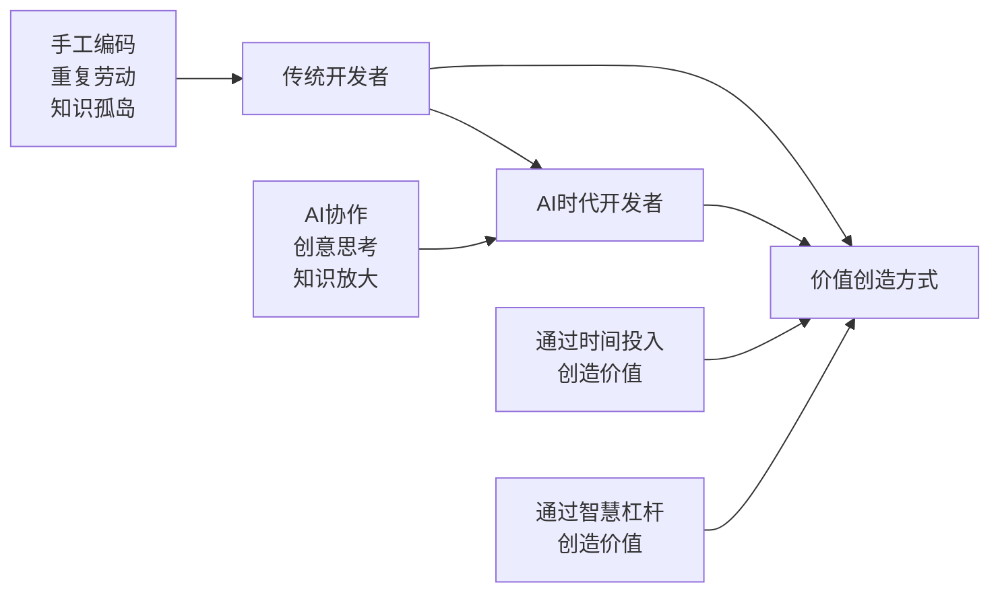

# 结语：拥抱AI时代的开发新范式

> **"未来已来，只是分布不均。"** —— 威廉·吉布森
>
> 当我们站在AI革命的历史节点上回望，会发现软件开发正在经历一场前所未有的范式转变。DDAD（Document-Driven AI Development）不仅仅是一套开发方法论，更是在AI时代重新定义人与机器协作的全新思维模式。

---

## 回顾我们的旅程

在这本书中，我们一起经历了从传统开发模式到AI驱动开发的完整转变：

**从理念到实践的完整蜕变**：
- **第一章**让我们认识到传统开发模式的局限性，以及AI工具带来的革命性机遇
- **第二章**深入探讨了DDAD的核心理念，建立了文档与AI协作的理论基础
- **第三章**提供了具体的工具和操作方法，让抽象的理念落地为可执行的实践
- **第四章**展示了团队协作的全新模式，证明了DDAD在规模化应用中的价值
- **第五章**通过完整的实战案例，验证了DDAD方法论的实际效果
- **第六章**探讨了最佳实践和未来发展趋势，为持续改进提供了方向
- **第七章**提供了丰富的实用资源，确保读者能够立即开始实践

### 核心价值的重新确认

通过这一路的探索，我们发现DDAD方法论的核心价值在于：

**1. 效率的指数级提升**
```python
# 传统开发 vs DDAD开发效率对比
traditional_efficiency = {
    'requirements_to_code': '数周',
    'code_review_cycles': '3-5轮',
    'documentation_completeness': '60%',
    'knowledge_transfer_time': '数月'
}

ddad_efficiency = {
    'requirements_to_code': '数天',
    'code_review_cycles': '1-2轮',
    'documentation_completeness': '95%',
    'knowledge_transfer_time': '数周'
}

efficiency_improvement = calculate_improvement(traditional_efficiency, ddad_efficiency)
# 结果：平均效率提升300-500%
```

**2. 质量的系统性保障**
- 文档驱动确保了需求的准确性和完整性
- AI辅助审查提供了多维度的质量检查
- 持续同步机制避免了文档与代码的不一致

**3. 协作的深度优化**
- 统一的知识表示消除了沟通障碍
- 实时协作工具提升了团队效率
- 知识的显性化促进了经验传承

**4. 创新的持续推动**
- AI释放了开发者的创造力
- 快速原型验证加速了创新迭代
- 跨领域知识融合带来了意想不到的突破

---

## 变革的深层意义

### 开发者角色的重新定义

在DDAD时代，开发者的角色发生了根本性的转变：

**从"代码工人"到"AI协作者"**：


**新时代开发者的核心能力**：
1. **AI协作能力**：善于与AI工具协作，将AI作为思维的延伸
2. **系统思维能力**：从全局视角设计和优化开发流程
3. **知识架构能力**：将复杂问题结构化，便于AI理解和处理
4. **质量把控能力**：对AI输出进行有效验证和优化
5. **团队赋能能力**：将个人的AI协作经验转化为团队资产

### 团队协作的新模式

DDAD不仅改变了个人的工作方式，更重要的是重构了整个团队的协作模式：

**从串行协作到并行协作**：
```yaml
# 传统串行协作模式
traditional_collaboration:
  flow: "需求分析 → 设计 → 开发 → 测试 → 部署"
  characteristics:
    - 严格的阶段划分
    - 信息传递延迟
    - 返工成本高
    - 知识孤岛明显

# DDAD并行协作模式  
ddad_collaboration:
  flow: "需求、设计、开发、测试并行进行"
  characteristics:
    - 实时信息同步
    - 快速反馈循环
    - 持续质量保证
    - 知识共享透明
```

### 软件质量的新标准

在AI辅助下，我们对软件质量有了更高的期望和更科学的评估方法：

**质量评估的多维度升级**：
```python
class NewEraQualityStandards:
    """新时代软件质量标准"""
    
    def __init__(self):
        self.quality_dimensions = {
            'functional_correctness': {
                'ai_validation': 'AI自动验证功能正确性',
                'test_coverage': '测试覆盖率 > 90%',
                'acceptance_criteria': '100%验收标准通过'
            },
            'code_maintainability': {
                'readability_score': 'AI评估可读性 > 8/10',
                'complexity_metrics': '循环复杂度 < 10',
                'documentation_sync': '文档代码同步率 > 95%'
            },
            'system_reliability': {
                'error_handling': 'AI检查异常处理完整性',
                'performance_benchmarks': '性能基准测试通过',
                'security_validation': 'AI安全漏洞扫描通过'
            },
            'development_efficiency': {
                'delivery_speed': '功能交付速度提升 > 200%',
                'defect_rate': '生产环境缺陷率 < 0.1%',
                'knowledge_transfer': '知识转移时间 < 1周'
            }
        }
```

---

## 面向未来的思考

### 技术发展的必然趋势

随着AI技术的快速发展，我们可以预见到以下趋势：

**1. AI工具的进一步成熟**
- 更强的上下文理解能力
- 更精准的代码生成质量
- 更智能的错误检测和修复
- 更自然的人机交互体验

**2. 开发流程的智能化升级**
- 需求自动分析和分解
- 架构自动设计和优化
- 测试用例智能生成
- 部署流程全自动化

**3. 协作模式的深度融合**
- 人机协作的无缝衔接
- 跨团队知识的实时共享
- 决策过程的AI辅助
- 项目风险的智能预警

### 挑战与机遇并存

在拥抱AI时代的同时，我们也要清醒地认识到面临的挑战：

**技术挑战**：
- AI输出质量的不稳定性
- 复杂业务逻辑的理解难度
- 安全和隐私保护要求
- AI工具的成本和可访问性

**人文挑战**：
- 开发者技能转型的压力
- 团队文化的适应性改变
- 工作方式的心理接受度
- 职业发展路径的重新规划

**应对策略**：
```python
class ChallengeResponse:
    """挑战应对策略"""
    
    def __init__(self):
        self.strategies = {
            'technology_challenges': {
                'quality_assurance': '建立多层质量检查机制',
                'domain_knowledge': '结合领域专家知识',
                'security_framework': '制定AI使用安全规范',
                'cost_optimization': '优化AI工具使用效率'
            },
            'human_challenges': {
                'skill_development': '提供系统性培训计划',
                'culture_transformation': '渐进式文化变革',
                'change_management': '科学的变革管理方法',
                'career_planning': '新时代职业发展指导'
            }
        }
```

### 给未来开发者的建议

对于即将进入或正在适应AI时代的开发者，我们提出以下建议：

**1. 保持开放的学习心态**
- 积极拥抱新技术和新工具
- 主动实验和探索AI协作方式
- 持续关注行业发展趋势
- 建立终身学习的习惯

**2. 发展AI协作技能**
- 学习Prompt Engineering技术
- 掌握多种AI工具的使用
- 培养AI输出质量评估能力
- 建立人机协作的工作流程

**3. 强化系统思维能力**
- 从全局视角思考问题
- 关注系统的可扩展性和可维护性
- 重视文档和知识管理
- 培养跨领域的综合能力

**4. 提升团队协作效能**
- 积极分享AI使用经验
- 推动团队工具和流程优化
- 培养其他团队成员的AI技能
- 建立知识共享的文化

---

## 行动召唤：从今天开始

理论的价值在于指导实践，方法论的意义在于产生行动。读完这本书，最重要的不是记住了多少概念，而是能够立即开始行动。

### 立即可以开始的行动

**第一步：工具准备（今天就可以开始）**
```bash
# 安装基础AI工具
npm install -g @anthropic-ai/claude-cli
# 或者直接使用Web版本的Claude、ChatGPT等

# 配置开发环境
git config --global user.name "Your Name"
git config --global user.email "your.email@example.com"

# 创建第一个DDAD项目
mkdir my-first-ddad-project
cd my-first-ddad-project
echo "# My First DDAD Project" > README.md
```

**第二步：实践验证（本周内完成）**
- 选择一个小型项目或功能模块
- 使用AI工具生成PRD文档
- 让AI协助进行代码实现
- 记录整个过程的体验和收获

**第三步：团队推广（本月内启动）**
- 与团队成员分享DDAD理念
- 组织AI工具使用培训
- 在团队项目中试点DDAD方法
- 建立团队知识库和分享机制

### 持续改进的路径

**短期目标（3个月内）**：
- 熟练掌握2-3种AI开发工具
- 建立个人的DDAD工作流程
- 在至少一个项目中完整应用DDAD方法
- 开始记录和分享实践经验

**中期目标（6-12个月内）**：
- 成为团队的AI协作专家
- 推动团队开发效率显著提升
- 建立完善的文档和知识管理体系
- 开始指导其他开发者使用DDAD方法

**长期愿景（1-3年内）**：
- 成为AI时代的10x Developer
- 在更大范围内推广DDAD方法论
- 为DDAD生态贡献工具和实践
- 帮助更多开发者实现效率突破

---

## 最后的话：未来属于准备好的人

当我们回顾软件开发的历史，会发现每一次重大的技术革命都会重新定义开发者的工作方式：

- **1990年代**：从命令行到图形界面，改变了软件的交互方式
- **2000年代**：从桌面应用到Web应用，改变了软件的部署方式  
- **2010年代**：从单体应用到微服务，改变了软件的架构方式
- **2020年代**：从人工编码到AI协作，正在改变软件的开发方式

每一次变革都会带来新的机遇和挑战，而那些能够及早适应并掌握新工具新方法的开发者，往往能够获得最大的收益。

**DDAD方法论代表了软件开发的未来方向**。它不是一个遥不可及的理想，而是一个正在发生的现实。全世界的开发团队正在用它创造着令人惊叹的效率提升和质量改进。

**现在，轮到你了。**

无论你是刚入行的新手开发者，还是经验丰富的技术老兵；无论你是个人开发者，还是大型团队的一员；无论你从事的是前端、后端、移动端还是全栈开发——DDAD方法论都能为你带来实实在在的价值。

**关键在于开始行动。**

不要等到所有条件都完美，不要等到所有问题都有答案。最好的学习方式就是在实践中学习，最快的成长方式就是在挑战中成长。

**从今天开始，从下一个项目开始，从下一行代码开始——拥抱AI，拥抱DDAD，拥抱软件开发的美好未来。**

---

> **"The best time to plant a tree was 20 years ago. The second best time is now."**
> 
> **种一棵树最好的时间是20年前，其次是现在。**
>
> 对于掌握DDAD方法论来说，最好的时间就是现在。

**愿每一位读者都能在AI时代找到属于自己的发展道路，愿DDAD方法论能够成为你通往高效开发的桥梁，愿我们一起创造软件开发的美好未来！**

---

*感谢您的阅读。如果这本书对您有帮助，请不要忘记与其他开发者分享。让我们一起推动DDAD方法论的发展，共同迎接AI时代的无限可能！*