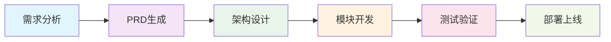

---

## 作者简介

**Leoo Bai**
- 📧 邮箱：[imleoo@gmail.com](mailto:imleoo@gmail.com)
- 🌐 网站：[https://leoobai.cn](https://leoobai.cn)
- 💻 GitHub：[imleoo](https://github.com/imleoo)

专注于 AI 驱动的软件开发方法论研究，致力于探索文档驱动敏捷开发（DDAD）在现代团队中的应用与实践。

---

## 📊 DDAD 方法论概览

### 🎯 核心理念
- **文档驱动**: 以结构化文档作为开发的单一可信源
- **AI智能体协作**: AI作为开发伙伴，而非简单工具
- **Vibe Coding理念**: 心理安全与创意协作的开发环境
- **量化评估**: 通过可度量指标评估团队效能

### 📈 关键指标
| 指标 | 目标值 | 说明 |
|------|--------|------|
| **Lead Time** | 2-4小时 | 从需求到部署的平均时间 |
| **AI 采纳率** | >80% | 团队成员使用AI工具的比例 |
| **缺陷密度** | <0.5/KLOC | 每千行代码的缺陷数量 |
| **文档覆盖率** | >90% | 代码与文档的比例 |

### 🔄 DDAD 工作流

### 🛠️ AI 工具生态
- **Claude Code/Claude CLI**: 代码生成、文档分析的核心工具
- **Codebuddy**: 产品矩阵（插件、CLI、IDE）
- **Cursor**: AI原生IDE，专注于编码和重构
- **GitHub Copilot**: 代码补全助手

---

## 🚀 快速开始

### 对于团队领导者
1. **评估团队现状**: 使用我们的[团队评估问卷](调研问卷/)
2. **选择入门指南**: 从[DDAD 团队实践指南](/ddad-in-teams/)开始
3. **制定实施计划**: 参考各章节的实践建议

### 对于开发者
1. **掌握基础工具**: 学习[Claude CLI 使用](develop-a-agent.md)
2. **理解方法论**: 阅读[10x DDAD 实践指南](/10x-ddad-guide/)
3. **实践项目**: 跟随案例研究进行实战

### 对于项目经理
1. **了解流程**: 学习[团队协作流程](/ddad-in-teams/chapter4.md)
2. **使用模板**: 应用[工具模板](工具模板/)提高效率
3. **建立标准**: 参考[最佳实践](/newbook/)建立团队标准

---

## 📚 学习路径

  <h4 style="color: #06B6D4; margin-top: 0;">🎯 初学者路径</h4>
  <ol style="padding-left: 1.2rem; color: var(--vp-c-text-1);">
    <li>阅读[引言](/ddad-in-teams/chapter1.md)</li>
    <li>理解[核心概念](/ddad-in-teams/chapter2.md)</li>
    <li>学习[基础工具](/ddad-in-teams/chapter3.md)</li>
    <li>实践简单项目</li>
  </ol>

  <h4 style="color: #10B981; margin-top: 0;">⚡ 进阶提升路径</h4>
  <ol style="padding-left: 1.2rem; color: var(--vp-c-text-1);">
    <li>掌握[团队协作](/ddad-in-teams/chapter4.md)</li>
    <li>学习[10x 开发者指南](/10x-ddad-guide/)</li>
    <li>实践[复杂项目](案例研究/)</li>
    <li>建立最佳实践</li>
  </ol>

  <h4 style="color: #3B82F6; margin-top: 0;">🚀 专家级路径</h4>
  <ol style="padding-left: 1.2rem; color: var(--vp-c-text-1);">
    <li>深入[最佳实践](/newbook/)</li>
    <li>掌握[测试与部署](/newbook/part4/)</li>
    <li>建立[团队治理](/newbook/part5/chapter13-governance-and-best-practices.md)</li>
    <li>贡献方法论发展</li>
  </ol>

---

## 🤝 参与贡献

DDAD 图书馆是一个持续演进的项目，我们欢迎社区参与：

- **反馈建议**: 通过 GitHub Issues 提出改进建议
- **内容贡献**: 提交新的案例研究或实践模板
- **工具推荐**: 分享你使用的AI开发工具
- **经验分享**: 贡献团队实践经验和教训

  <h3 style="margin-top: 0;">🎯 开始你的 DDAD 之旅</h3>
  
加入文档驱动敏捷开发的革命，提升团队效能，释放开发创造力

  

    <a href="/ddad-in-teams/" style="padding: 0.75rem 1.5rem; background: white; color: var(--vp-c-brand); text-decoration: none; border-radius: 6px; font-weight: 600;">开始学习</a>
    <a href="https://github.com/leoobai/jiwu-project" style="padding: 0.75rem 1.5rem; background: rgba(255,255,255,0.2); color: white; text-decoration: none; border-radius: 6px; font-weight: 600; border: 1px solid rgba(255,255,255,0.3);">GitHub 仓库</a>
  

